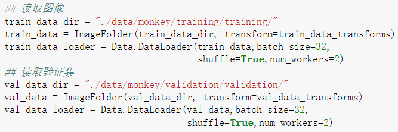
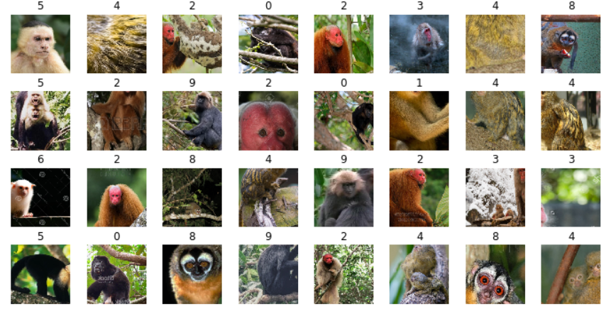

# `datasets 模块`

## __一、datasets.ImageFolder：__ 

*   `ImageFolder` 假设所有的文件按文件夹保存，每个文件夹下存储同一个类别的图片，文件夹名为类名：

    

    `root` 下有 `cat` 和 `dog` ，文件夹，这两个文件下放对应分类图片，在   `ImageFolder` 指定目录时，目录的路径是 `dog` 和 `cat` 这种分类目录的 `父目录`。 

    如果目录不是如此指定，那么在 `datasets` 读取数据的时候 `shuffle = True` 效果会不一样。 [具体查看](###1、datasets.ImageFolder：)

*   `函数：`

        ImageFolder(root, transform=None, target_transform=None, loader=default_loader)

*   `参数：`

        root：              在root指定的路径下寻找图片
        transform：         对PIL Image进行的转换操作，transform的输入是使用loader读取图片的返回对象
        target_transform：  对label的转换
        loader：            给定路径后如何读取图片，默认读取为RGB格式的PIL Image对象

*   `案例：`

        ## 对训练集的预处理
        train_data_transforms = transforms.Compose([
            transforms.RandomResizedCrop(256),# 随机长宽比裁剪为224*224
            transforms.RandomHorizontalFlip(),# 依概率p=0.5水平翻转
            transforms.ToTensor(), # 转化为张量并归一化至[0-1]
            ## 图像标准化处理 
            transforms.Normalize([0.485, 0.456, 0.406], [0.229, 0.224, 0.225])
        ])

        ## 
        train_data = ImageFolder(train_data_dir, transform=train_data_transforms)

## __一、datasets.：__ 

## 问题：

#### `1、datasets.ImageFolder：`

* `training/training` 目录下放着分类图片，在你指定第一个 `train` 为目录进行 `imagefolder` 操作，那下面 `dataloder` 的 `shuffle` 效果就会发生变化：

    

    

    

    

