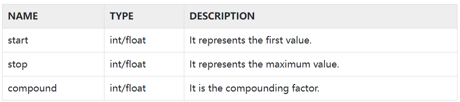

#  `spacy`

## `util 模型`

* `compounding`
  
* `minibatch`

###  `compounding`

* `导入：`
        
        from spacy.util import compounding

    
 

    `说明`：`该效用函数将产生无限系列的复合值。无论何时调用生成器，都会将之前的值乘以该复合速率来生成一个值。`

    `就是生成一个生成器`，其中：  `新值 = start + start * compound` 当生成的值超过 stop 指定的数后，将不在变大，但是仍会持续生成。  

* `案例：`

        sizes = spacy.util.compounding(5., 50., 5.5)
        for i,a in enumerate(sizes):
            print(a)
            if i ==3:
                break
      
        输出：
        5.0
        27.5
        50.0
        50.0

### `minibatch`

    from spacy.util import minibatch

## `参考： `

* https://www.cnblogs.com/panchuangai/p/13695902.html