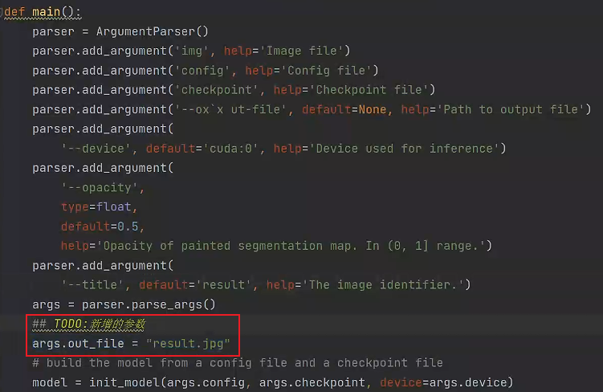

# `MMSemgentation`

## `一、MMSemgentation 安装：`

* `1、`准备好 `MMCV` 环境

* `2、`下载 `MMSegmentation` 项目：https://github.com/open-mmlab/mmsegmentation
  
* `3、`在虚拟环境中安装 `mmseg` 包：

        如果 conda install mmseg 或者 pip install mmseg 失败
        可以使用：
        pip install -i https://pypi.tuna.tsinghua.edu.cn/simple mmsegmentation

### `1.2、成功安装测试：`

* 用 pycharm 打开 `MMSegmentation` 项目，运行 `tool/train.py` 文件，如果出现如下提示，则安装成功：

    

## `二、图像标注工具 Labelme 安装和使用：`

* 进入 conda 虚拟环境：

        activate openmmlab（虚拟环境名称）

* labelme 安装：

        pip install pyqt5  # pyqt5 can be installed via pip on python3
        pip install labelme

* labelme 启动命令：

        labelme

    

* 用 labelme 对数据打标注，生成相应的json文件。

    

## `三、MMSegementation 的使用：`

* `官方文档：`https://mmsegmentation.readthedocs.io/zh_CN/latest/user_guides/index.html

* 1、打开 `labelme` 的项目，将用 `labelme` 打好标注的数据拖到 `examples/semanic_segmentation` 中，使用项目中的 `labelme2voc` ，准备对打好标注的文件进行转换，图中的 `train_images` 就是我已经标注好的图像数据： 

    

   运行 `labelme2voc` 进行转换时，需要传入三个参数：分别为：输入路径、输出路径 和 标签文件：
   
        car_label.txt 文件中定义的是分类的标签，其中前两项固定为： __ignore__ 和 _background_ ，然后再后续添加标注的标签。

        如：对于汽车检测，最终只有一个标签 CAR ，那么对应的 car_label.txt 定义为：

        __ignore__
        _background_
        CAR

        执行 labelme2voc 的参数：
        car_data car_data_voc --labels car_labels.txt

    执行完成之后，生成的文件如：`training_images_voc` 所示：

    

* 2、然后需要再 `voc` 文件夹下创建出三个文件，分别对应训练数据、验证数据和测试数据的名字，不要后缀，再然后把转成 `voc` 后的数据保存到 `segmentation` 项目中，作为学习数据，其中 `data` 目录是我自己额外创建的：

    

* 3、生成完整的模型配置文件：

        运行 train.py 文件并且将要生成的模型配置文件作为参数，如： F:\Python_C_Project\Python_Project\mmlab\mmsegmentationv1.0.0-main\mmsegmentation-main\configs\deeplabv3plus\deeplabv3plus_r50-d8_4xb4-40k_pascal-context-480x480.py

        报错信息不用理会，运行完之后此时就会根据 deeplabv3plus_r50-d8_4xb4-40k_pascal-context-480x480.py 生成对应的完整配置文件，这样就不需要根据原始的配置文件找对应的配置再修改了，那样很麻烦。

        生成的配置文件再 work_dir 目录下，目录的名称和指定生成的配置文件的名称一致，如：

        work_dirs\deeplabv3plus_r50-d8_4xb4-40k_pascal-context-480x480\

    

* 4、生成的目录里面有一个 `py` 文件，里面包含了相应的配置信息，需要将其复制到对应的 `config` 目录下，并且对其进行重命名，以免和原先的配置文件冲突：

    

* 5、修改 `config model` 的配置文件：

  需要修改的参数比较多，其中对于分类数，比较容易出错，举个例子：虽然这里我们只检测 `CAR` ，但是因为在 `label.txt` 中还额外定义了一个 `background` ，所以分类数为2：

        norm_cfg = dict(type='SyncBN', requires_grad=True)
        data_preprocessor = dict(
        type='SegDataPreProcessor',
        mean=[123.675, 116.28, 103.53],
        std=[58.395, 57.12, 57.375],
        bgr_to_rgb=True,
        pad_val=0,
        seg_pad_val=255,
        size=(480, 480))
        model = dict(
        type='EncoderDecoder',
        data_preprocessor=dict(
                type='SegDataPreProcessor',
                mean=[123.675, 116.28, 103.53],
                std=[58.395, 57.12, 57.375],
                bgr_to_rgb=True,
                pad_val=0,
                seg_pad_val=255,
                size=(480, 480)),
        pretrained='open-mmlab://resnet50_v1c',
        backbone=dict(
                type='ResNetV1c',
                depth=50,
                num_stages=4,
                out_indices=(0, 1, 2, 3),
                dilations=(1, 1, 2, 4),
                strides=(1, 2, 1, 1),
                norm_cfg=dict(type='SyncBN', requires_grad=True),
                norm_eval=False,
                style='pytorch',
                contract_dilation=True),
        decode_head=dict(
                type='DepthwiseSeparableASPPHead',
                in_channels=2048,
                in_index=3,
                channels=512,
                dilations=(1, 12, 24, 36),
                c1_in_channels=256,
                c1_channels=48,
                dropout_ratio=0.1,
                num_classes=2,
                norm_cfg=dict(type='SyncBN', requires_grad=True),
                align_corners=False,
                loss_decode=dict(
                type='CrossEntropyLoss', use_sigmoid=False, loss_weight=1.0)),
        ## 辅助头信息
        auxiliary_head=dict(
                type='FCNHead',
                in_channels=1024,
                in_index=2,
                channels=256,
                num_convs=1,
                concat_input=False,
                dropout_ratio=0.1,
                num_classes=2,
                norm_cfg=dict(type='SyncBN', requires_grad=True),
                align_corners=False,
                loss_decode=dict(
                type='CrossEntropyLoss', use_sigmoid=False, loss_weight=0.4)),
        train_cfg=dict(),
        test_cfg=dict(mode='slide', crop_size=(480, 480), stride=(320, 320)))
        # dataset_type = 'PascalContextDataset'
        dataset_type = 'PascalVOCDataset'

        data_root = 'F:\\Python_C_Project\\Python_Project\\mmlab\\mmsegmentationv1.0.0-main\\mmsegmentation-main\\data\\training_images_voc\\'
        img_scale = (520, 520)
        crop_size = (480, 480)
        train_pipeline = [
        dict(type='LoadImageFromFile'),
        dict(type='LoadAnnotations'),
        dict(
                type='RandomResize',
                scale=(520, 520),
                ratio_range=(0.5, 2.0),
                keep_ratio=True),
        dict(type='RandomCrop', crop_size=(480, 480), cat_max_ratio=0.75),
        dict(type='RandomFlip', prob=0.5),
        dict(type='PhotoMetricDistortion'),
        dict(type='PackSegInputs')
        ]
        test_pipeline = [
        dict(type='LoadImageFromFile'),
        dict(type='Resize', scale=(520, 520), keep_ratio=True),
        dict(type='LoadAnnotations'),
        dict(type='PackSegInputs')
        ]
        train_dataloader = dict(
        batch_size=4,
        num_workers=4,
        persistent_workers=True,
        sampler=dict(type='InfiniteSampler', shuffle=True),
        dataset=dict(
                # type='PascalContextDataset',
                type='PascalVOCDataset',

                data_root='F:\\Python_C_Project\\Python_Project\\mmlab\\mmsegmentationv1.0.0-main\\mmsegmentation-main\\data\\training_images_voc\\',
                data_prefix=dict(
                img_path='JPEGImages', seg_map_path='SegmentationClassPNG'),
                ann_file='train.txt',
                pipeline=[
                dict(type='LoadImageFromFile'),
                dict(type='LoadAnnotations'),
                dict(
                        type='RandomResize',
                        scale=(520, 520),
                        ratio_range=(0.5, 2.0),
                        keep_ratio=True),
                dict(type='RandomCrop', crop_size=(480, 480), cat_max_ratio=0.75),
                dict(type='RandomFlip', prob=0.5),
                dict(type='PhotoMetricDistortion'),
                dict(type='PackSegInputs')
                ]))
        val_dataloader = dict(
        batch_size=1,
        num_workers=4,
        persistent_workers=True,
        sampler=dict(type='DefaultSampler', shuffle=False),
        dataset=dict(
                # type='PascalContextDataset',
                type='PascalVOCDataset',

                data_root='F:\\Python_C_Project\\Python_Project\\mmlab\\mmsegmentationv1.0.0-main\\mmsegmentation-main\\data\\training_images_voc\\',
                data_prefix=dict(
                img_path='JPEGImages', seg_map_path='SegmentationClassPNG'),
                ann_file='val.txt',
                pipeline=[
                dict(type='LoadImageFromFile'),
                dict(type='Resize', scale=(520, 520), keep_ratio=True),
                dict(type='LoadAnnotations'),
                dict(type='PackSegInputs')
                ]))
        test_dataloader = dict(
        batch_size=1,
        num_workers=4,
        persistent_workers=True,
        sampler=dict(type='DefaultSampler', shuffle=False),
        dataset=dict(
                # type='PascalContextDataset',
                type='PascalVOCDataset',

                data_root='F:\\Python_C_Project\\Python_Project\\mmlab\\mmsegmentationv1.0.0-main\\mmsegmentation-main\\data\\training_images_voc\\',
                data_prefix=dict(
                img_path='JPEGImages', seg_map_path='SegmentationClassPNG'),
                ann_file='test.txt',
                pipeline=[
                dict(type='LoadImageFromFile'),
                dict(type='Resize', scale=(520, 520), keep_ratio=True),
                dict(type='LoadAnnotations'),
                dict(type='PackSegInputs')
                ]))
        val_evaluator = dict(type='IoUMetric', iou_metrics=['mIoU'])
        test_evaluator = dict(type='IoUMetric', iou_metrics=['mIoU'])
        default_scope = 'mmseg'
        env_cfg = dict(
        cudnn_benchmark=True,
        mp_cfg=dict(mp_start_method='fork', opencv_num_threads=0),
        dist_cfg=dict(backend='nccl'))
        vis_backends = [dict(type='LocalVisBackend')]
        visualizer = dict(
        type='SegLocalVisualizer',
        vis_backends=[dict(type='LocalVisBackend')],
        name='visualizer')
        log_processor = dict(by_epoch=False)
        log_level = 'INFO'
        load_from = 'F:\\Python_C_Project\\Python_Project\\mmlab\\mmsegmentationv1.0.0-main\\mmsegmentation-main\\tools\\work_dirs\\deeplabv3_r50-d8_512x512_20k_voc12aug_20200617_010906-596905ef.pth'
        resume = False
        tta_model = dict(type='SegTTAModel')
        optimizer = dict(type='SGD', lr=0.004, momentum=0.9, weight_decay=0.0001)
        optim_wrapper = dict(
        type='OptimWrapper',
        optimizer=dict(type='SGD', lr=0.004, momentum=0.9, weight_decay=0.0001),
        clip_grad=None)
        param_scheduler = [
        dict(
                type='PolyLR',
                eta_min=0.0001,
                power=0.9,
                begin=0,
                end=40000,
                by_epoch=False)
        ]
        train_cfg = dict(type='IterBasedTrainLoop', max_iters=40000, val_interval=4000)
        val_cfg = dict(type='ValLoop')
        test_cfg = dict(type='TestLoop')
        default_hooks = dict(
        timer=dict(type='IterTimerHook'),
        logger=dict(type='LoggerHook', interval=50, log_metric_by_epoch=False),
        param_scheduler=dict(type='ParamSchedulerHook'),
        checkpoint=dict(type='CheckpointHook', by_epoch=False, interval=4000),
        sampler_seed=dict(type='DistSamplerSeedHook'),
        visualization=dict(type='SegVisualizationHook'))
        launcher = 'none'
        work_dir = './work_dirs\\deeplabv3plus_r50-d8_4xb4-40k_pascal-context-480x480'

* 6、修改 `mmseg/datasets/voc.py` 文件,分别对应类别和调色板：

    

* 7、修改  `mmseg/utils/class_name.py` 的 `voc` 的返回值

* 8、然后使用 `train.py` 指定相应的配置文件进行运行，就可以开始训练。

## `模型测试：`

* 在项目中有一个 image_demo.py 文件可以用于做图片检测，需要接收4个参数，分别是 img、config、checkpoint、outfile。

* 需要注意的是，你可能会遇到 outfile 参数不可识别的错误，此时可以直接在main函数中指定 args.out_file = "result.jpg" ，指定之后，就不需要再运行demo文件的时候传入文件输出结果保存的路径。

    

* 配置参数，运行 image_demo.py 文件：
* 
    

