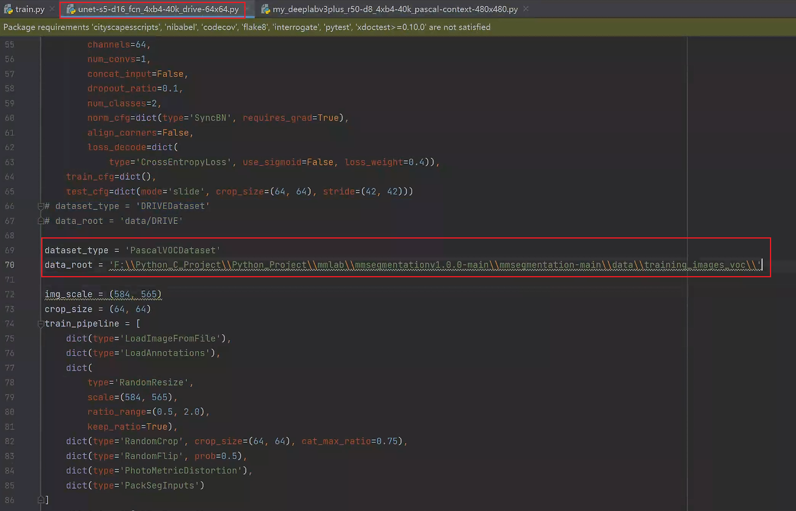
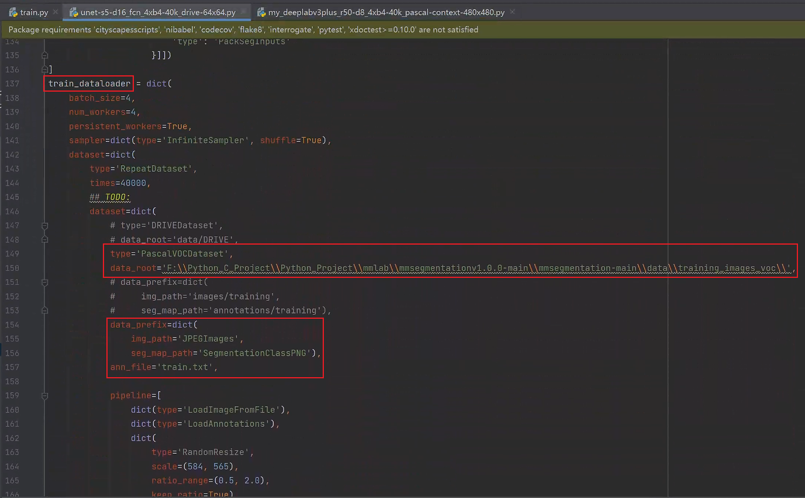
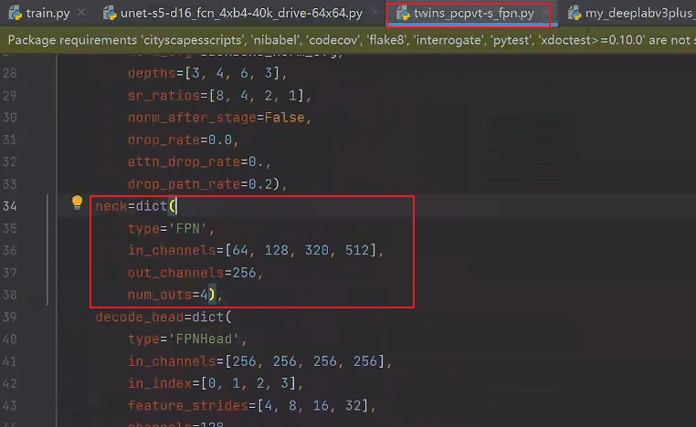
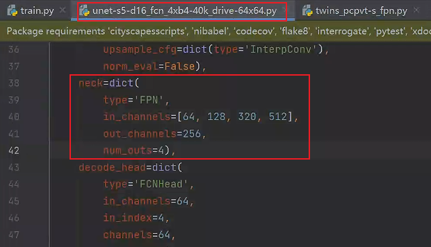
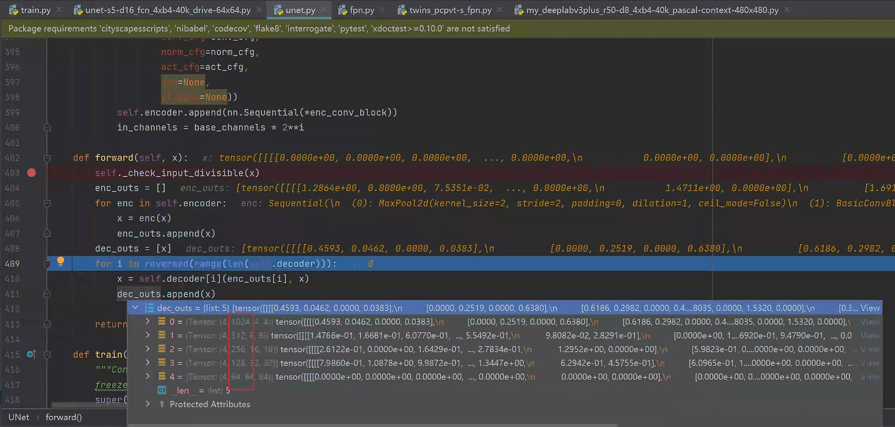
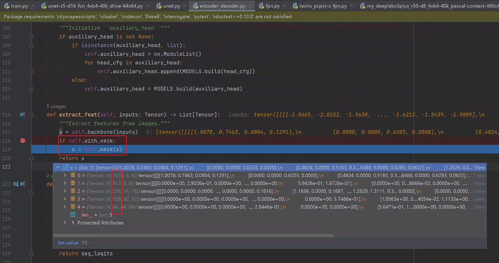
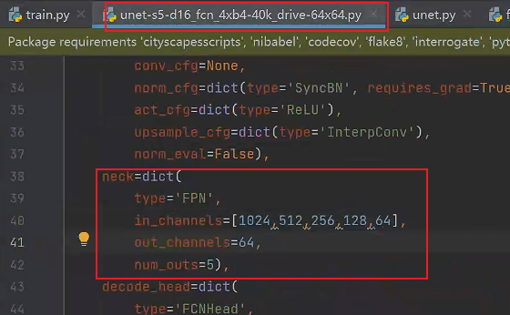
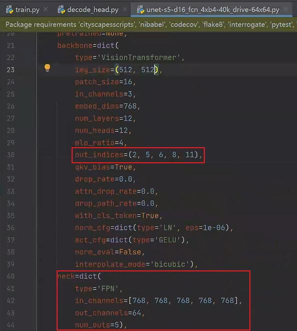

# `NET Configuration Process`

## `一、配置的初步修改：`

* `1、根据标准格式的配置文件，生成完整配置文件：`
    
        train.py 中跟上参数，参数为配置文件的名称，如：F:\Python_C_Project\Python_Project\mmlab\mmsegmentationv1.0.0-main\mmsegmentation-main\tools\work_dirs\unet-s5-d16_fcn_4xb4-40k_drive-64x64\unet-s5-d16_fcn_4xb4-40k_drive-64x64.py

        运行之后会在 tools/work_dirs下生成 unet-s5-d16_fcn_4xb4-40k_drive-64x64 文件夹，里面的.py文件就是对应的配置文件。

* `2、配置文件介绍：`

    配置文件中的参数功能大致和之前的配置相同，接下来我们会通过 debug 的方式来修改配置文件，以及添加想要的内容：

  *  比如添加 neck 网络

  * 修改模型的结构，比如从 encoderdecoder 结构换成 vit 的。

* `3、修改配置文件的参数`：最基本的参数修改，比如你当前要分类的数量修改(num_classes=2)，模型进行训练时的数据集存放路径的修改:

    

    `train_dataloader` 的修改：

    

    `val_dataloader` 和 `test_dataloader` 的修改同理。

    `修改完上述参数，模型已经可以正常运行了。`

## `二、neck 层的配置：`

`neck` 层用于将 `backbone` 中提取的特征进行融合，从而获得更加高级别的特征表示。但是在生成的配置文件中我们没有 `neck` 层，如果要进行添加，那么我们需要进行以下几步流程：

* 1、`neck` 的类型有很多，我们可以参考 `configs/_base_/models` 下的文件， `configs/_base_/models` 中包含了一些基础的模型配置文件。这些文件通常作为其他具体模型的基础，并且可以在特定任务的配置文件中进行继承和修改。

    其中的 `twins_pcpvt-s_fpn.py` 文件中定义了名为 `FPN` 的 `neck`，我们可以根据它进行修改：

    

    将 neck 填写到配置文件中：

    

    需要注意的是 `UNET` 的网络结构，他的 `decoder` 层一共有五层，`neck` 在 `decoder_head` 执行之前，所以这里的 `in_channel` 也需要指定 5 个，具体的表示形式可以通过 debug 的形式来查看，因为 unet 是 backbones 中定义的，所以可以在 models 中找到 backbones 里面的 unet，然后在主干网络中的 forward 中打上断点，然后debug：

    

    
    在做完 forword 中的内容后要做 neck，这里可以看到进入到neck中的数据的shape
    
    

    此时里面的 `1024 512 256 128 64` 分别就是对应了 `in_channel` 的元素，并且长度为 `5`，最终的输出 `channel` 为 `64` ，所以配置文件中的 `neck` 需要修改为：

    

    需要注意的是 `decoder_head` 中的 `in_channel` 和 `auxiliary_head` 中的 `in_chennel` 要和 `neck` 的 `out_channel` 保持一致。

## `三、backborns 的 type 类型的配置`

比如想要修改 backborns 的类型修改为 VisionTransformer ，那么同理根据已有的基础配置文件进行复制修改 `upernet_vit-b16_ln_mln.py`：

* 1、修改配置文件：

    

    为了契合原先的 `unet` 的架构，所以这里我们将 `out_indices` 的输出个数设置为 5 个，和下面的 `neck` 的 `in_channel` 个数保持一致。

此时模型可以正常运行