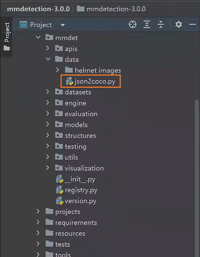
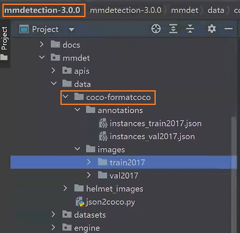
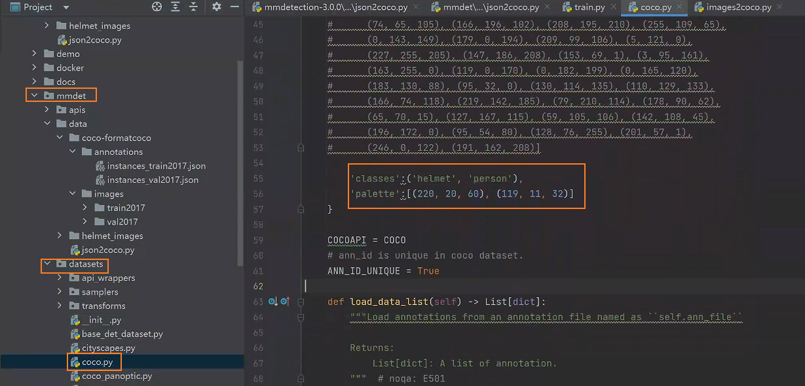
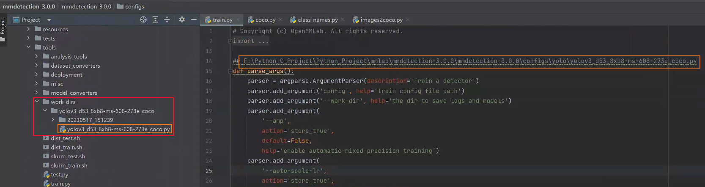
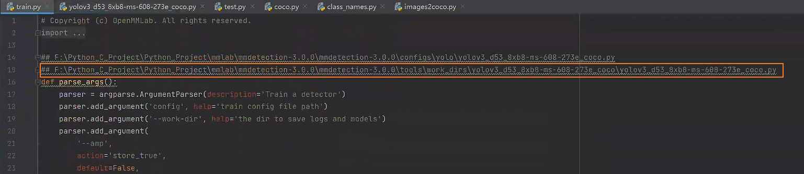
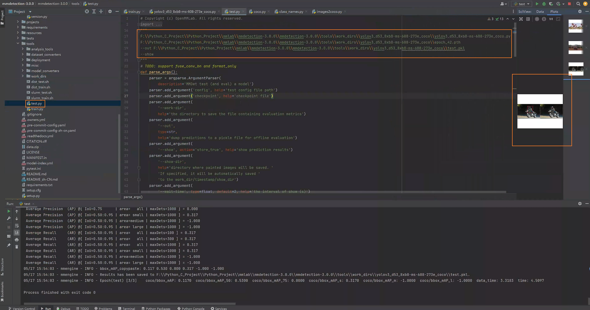

# `Target Detect process:`

## `mmdetect 安装`

* 1、github 上下载相应的包：https://github.com/open-mmlab/mmdetection/tree/v3.0.0

* 2、安装 mmdet 模块，如果你创建了 conda 的虚拟环境，那么就使用 pip install mmdet 或者 conda install mmdet 或者 min install mmdet 下载。

## `图像标签生成`

* 1、收集你要检测的图像，然后使用标签工具打标签，比如使用labelme打标签

    
* 2、使用labelme打开对于的文件夹，然后在其中右击图像选中矩形标记框来进行标记(如果你是在虚拟环境中安装的labelme，那么在虚拟环境中启动。)。

    在打好标签之后保存对于的 json 文件，需要注意的是外面尽量保证不修改 json 文件的名称，让 json 文件的名字和 image 文件的名字保持一致，打好标签之后把数据保存在 mmdetection 中。

    

    
    然后用 json2coco.py 文件对数据进行转换（该文件不在项目中，需要额外添加）

    

    运行该文件在当前文件夹中会生成 `coco-formatcoco` 的文件，里面有两个子文件，一个用于存放训练数据和验证数据的 json 一个用于存放训练数据和验证数据的 images。

    

## `配置文件修改和数据转换：`

* `一、配置文件的修改：`

  * 1、修改 mmdet 下的 datasets 中的 coco.py 文件，将 cocodataset 类中的classes 和 palette 这两个关键字做一个修改，换成任务的真实类别标签：

      

  * 2、修改 mmdet 下的 elalution 中的 functional 中的 class_names.py 文件，将 coco_classes 类中的 return 信息做一个修改，换成任务的真实类别标签：

      

  * 3、生成配置文件，生成的方式和之前一样，通过 train.py 指定 configs 中的某一个模型的配置，就可以生成完整的配置文件，完整的配置文件存放的位置就是在 tools 中的 work_dirs 中。

      

  * 4、生成完整的配置文件之后就需要对完整的配置文件做一些修改：这里我们需要修改的地方就是数据集存放的地址：
  
        load_from 、data_root、ann_file、data_prefix 这些参数都需要修改：

        train_cfg = dict(type='EpochBasedTrainLoop', max_epochs=273, val_interval=7)
        val_cfg = dict(type='ValLoop')
        test_cfg = dict(type='TestLoop')
        param_scheduler = [
            dict(type='LinearLR', start_factor=0.1, by_epoch=False, begin=0, end=2000),
            dict(type='MultiStepLR', by_epoch=True, milestones=[218, 246], gamma=0.1)
        ]
        optim_wrapper = dict(
            type='OptimWrapper',
            optimizer=dict(type='SGD', lr=0.001, momentum=0.9, weight_decay=0.0005),
            clip_grad=dict(max_norm=35, norm_type=2))
        auto_scale_lr = dict(enable=False, base_batch_size=64)
        default_scope = 'mmdet'
        default_hooks = dict(
            timer=dict(type='IterTimerHook'),
            logger=dict(type='LoggerHook', interval=50),
            param_scheduler=dict(type='ParamSchedulerHook'),
            checkpoint=dict(type='CheckpointHook', interval=7),
            sampler_seed=dict(type='DistSamplerSeedHook'),
            visualization=dict(
                type='DetVisualizationHook', draw=True, show=True, wait_time=2))
        env_cfg = dict(
            cudnn_benchmark=False,
            mp_cfg=dict(mp_start_method='fork', opencv_num_threads=0),
            dist_cfg=dict(backend='nccl'))
        vis_backends = [dict(type='LocalVisBackend')]
        visualizer = dict(
            type='DetLocalVisualizer',
            vis_backends=[dict(type='LocalVisBackend')],
            name='visualizer')
        log_processor = dict(type='LogProcessor', window_size=50, by_epoch=True)
        log_level = 'INFO'
        load_from = 'F:\\\\Python_C_Project\\\\Python_Project\\\\mmlab\\\\mmdetection-3.0.0\\\\mmdetection-3.0.0\\\\tools\\\\work_dirs\\\\yolov3_d53_8xb8-ms-608-273e_coco\\\\epoch_42.pth'
        resume = False
        data_preprocessor = dict(
            type='DetDataPreprocessor',
            mean=[0, 0, 0],
            std=[255.0, 255.0, 255.0],
            bgr_to_rgb=True,
            pad_size_divisor=32)
        model = dict(
            type='YOLOV3',
            data_preprocessor=dict(
                type='DetDataPreprocessor',
                mean=[0, 0, 0],
                std=[255.0, 255.0, 255.0],
                bgr_to_rgb=True,
                pad_size_divisor=32),
            backbone=dict(
                type='Darknet',
                depth=53,
                out_indices=(3, 4, 5),
                init_cfg=dict(type='Pretrained', checkpoint='open-mmlab://darknet53')),
            neck=dict(
                type='YOLOV3Neck',
                num_scales=3,
                in_channels=[1024, 512, 256],
                out_channels=[512, 256, 128]),
            bbox_head=dict(
                type='YOLOV3Head',
                num_classes=80,
                in_channels=[512, 256, 128],
                out_channels=[1024, 512, 256],
                anchor_generator=dict(
                    type='YOLOAnchorGenerator',
                    base_sizes=[[(116, 90), (156, 198), (373, 326)],
                                [(30, 61), (62, 45), (59, 119)],
                                [(10, 13), (16, 30), (33, 23)]],
                    strides=[32, 16, 8]),
                bbox_coder=dict(type='YOLOBBoxCoder'),
                featmap_strides=[32, 16, 8],
                loss_cls=dict(
                    type='CrossEntropyLoss',
                    use_sigmoid=True,
                    loss_weight=1.0,
                    reduction='sum'),
                loss_conf=dict(
                    type='CrossEntropyLoss',
                    use_sigmoid=True,
                    loss_weight=1.0,
                    reduction='sum'),
                loss_xy=dict(
                    type='CrossEntropyLoss',
                    use_sigmoid=True,
                    loss_weight=2.0,
                    reduction='sum'),
                loss_wh=dict(type='MSELoss', loss_weight=2.0, reduction='sum')),
            train_cfg=dict(
                assigner=dict(
                    type='GridAssigner',
                    pos_iou_thr=0.5,
                    neg_iou_thr=0.5,
                    min_pos_iou=0)),
            test_cfg=dict(
                nms_pre=1000,
                min_bbox_size=0,
                score_thr=0.05,
                conf_thr=0.005,
                nms=dict(type='nms', iou_threshold=0.45),
                max_per_img=100))
        dataset_type = 'CocoDataset'
        data_root = 'F:\\Python_C_Project\\Python_Project\\mmlab\\mmdetection-3.0.0\\mmdetection-3.0.0\\mmdet\\data\\coco-formatcoco\\'
        backend_args = None
        train_pipeline = [
            dict(type='LoadImageFromFile', backend_args=None),
            dict(type='LoadAnnotations', with_bbox=True),
            dict(type='Expand', mean=[0, 0, 0], to_rgb=True, ratio_range=(1, 2)),
            dict(
                type='MinIoURandomCrop',
                min_ious=(0.4, 0.5, 0.6, 0.7, 0.8, 0.9),
                min_crop_size=0.3),
            dict(type='RandomResize', scale=[(320, 320), (608, 608)], keep_ratio=True),
            dict(type='RandomFlip', prob=0.5),
            dict(type='PhotoMetricDistortion'),
            dict(type='PackDetInputs')
        ]
        test_pipeline = [
            dict(type='LoadImageFromFile', backend_args=None),
            dict(type='Resize', scale=(608, 608), keep_ratio=True),
            dict(type='LoadAnnotations', with_bbox=True),
            dict(
                type='PackDetInputs',
                meta_keys=('img_id', 'img_path', 'ori_shape', 'img_shape',
                        'scale_factor'))
        ]
        train_dataloader = dict(
            batch_size=4,
            num_workers=2,
            persistent_workers=True,
            sampler=dict(type='DefaultSampler', shuffle=True),
            batch_sampler=dict(type='AspectRatioBatchSampler'),
            dataset=dict(
                type='CocoDataset',
                data_root=
                'F:\\Python_C_Project\\Python_Project\\mmlab\\mmdetection-3.0.0\\mmdetection-3.0.0\\mmdet\\data\\coco-formatcoco\\',
                ann_file='annotations\\instances_train2017.json',
                data_prefix=dict(img='images\\train2017\\'),
                filter_cfg=dict(filter_empty_gt=True, min_size=32),
                pipeline=[
                    dict(type='LoadImageFromFile', backend_args=None),
                    dict(type='LoadAnnotations', with_bbox=True),
                    dict(
                        type='Expand', mean=[0, 0, 0], to_rgb=True,
                        ratio_range=(1, 2)),
                    dict(
                        type='MinIoURandomCrop',
                        min_ious=(0.4, 0.5, 0.6, 0.7, 0.8, 0.9),
                        min_crop_size=0.3),
                    dict(
                        type='RandomResize',
                        scale=[(320, 320), (608, 608)],
                        keep_ratio=True),
                    dict(type='RandomFlip', prob=0.5),
                    dict(type='PhotoMetricDistortion'),
                    dict(type='PackDetInputs')
                ],
                backend_args=None))
        val_dataloader = dict(
            batch_size=1,
            num_workers=2,
            persistent_workers=True,
            drop_last=False,
            sampler=dict(type='DefaultSampler', shuffle=False),
            dataset=dict(
                type='CocoDataset',
                data_root=
                'F:\\Python_C_Project\\Python_Project\\mmlab\\mmdetection-3.0.0\\mmdetection-3.0.0\\mmdet\\data\\coco-formatcoco\\',
                ann_file='annotations\\instances_val2017.json',
                data_prefix=dict(img='images\\val2017\\'),
                test_mode=True,
                pipeline=[
                    dict(type='LoadImageFromFile', backend_args=None),
                    dict(type='Resize', scale=(608, 608), keep_ratio=True),
                    dict(type='LoadAnnotations', with_bbox=True),
                    dict(
                        type='PackDetInputs',
                        meta_keys=('img_id', 'img_path', 'ori_shape', 'img_shape',
                                'scale_factor'))
                ],
                backend_args=None))
        test_dataloader = dict(
            batch_size=1,
            num_workers=2,
            persistent_workers=True,
            drop_last=False,
            sampler=dict(type='DefaultSampler', shuffle=False),
            dataset=dict(
                type='CocoDataset',
                data_root=
                'F:\\Python_C_Project\\Python_Project\\mmlab\\mmdetection-3.0.0\\mmdetection-3.0.0\\mmdet\\data\\coco-formatcoco\\',
                ann_file='annotations\\instances_val2017.json',
                data_prefix=dict(img='images\\val2017\\'),
                test_mode=True,
                pipeline=[
                    dict(type='LoadImageFromFile', backend_args=None),
                    dict(type='Resize', scale=(608, 608), keep_ratio=True),
                    dict(type='LoadAnnotations', with_bbox=True),
                    dict(
                        type='PackDetInputs',
                        meta_keys=('img_id', 'img_path', 'ori_shape', 'img_shape',
                                'scale_factor'))
                ],
                backend_args=None))
        val_evaluator = dict(
            type='CocoMetric',
            ann_file=
            'F:\\Python_C_Project\\Python_Project\\mmlab\\mmdetection-3.0.0\\mmdetection-3.0.0\\mmdet\\data\\coco-formatcoco\\annotations\\instances_val2017.json',
            metric='bbox',
            backend_args=None)
        test_evaluator = dict(
            type='CocoMetric',
            ann_file=
            'F:\\Python_C_Project\\Python_Project\\mmlab\\mmdetection-3.0.0\\mmdetection-3.0.0\\mmdet\\data\\coco-formatcoco\\annotations\\instances_val2017.json',
            metric='bbox',
            backend_args=None)
        launcher = 'none'
        work_dir = './work_dirs\\yolov3_d53_8xb8-ms-608-273e_coco'

  * 5、开始模型的训练：<指定修改过的配置文件，然后开始训练即可>

      

    

* `二、模型的测试：`

    指定配置文件、模型、输出结果文件 --show 查看结果

    

