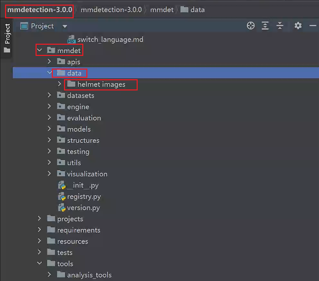

# `Target Detect process:`

## `mmdetect 安装`

* 1、github 上下载相应的包：https://github.com/open-mmlab/mmdetection/tree/v3.0.0

* 2、安装 mmdet 模块，如果你创建了 conda 的虚拟环境，那么就使用 pip install mmdet 或者 conda install mmdet 或者 min install mmdet 下载。

## `图像标签生成`

* 1、收集你要检测的图像，然后使用标签工具打标签，比如使用labelme打标签

    
* 2、使用labelme打开对于的文件夹，然后在其中右击图像选中矩形标记框来进行标记(如果你是在虚拟环境中安装的labelme，那么在虚拟环境中启动。)。

    在打好标签之后保存对于的 json 文件，需要注意的是外面尽量保证不修改 json 文件的名称，让 json 文件的名字和 image 文件的名字保持一致，打好标签之后把数据保存在 mmdetection 中。

    

    

## `配置文件修改和数据转换：`

* `1、配置文件的修改：`

* `2、数据的转换：`

    mmdet/core/evaluation/classnames.py ## 将 coco_class 的被人修改成自己的类别
    
    mmdet/datasets/coco.py 中将 cocodatasets 中的内容进行修改

