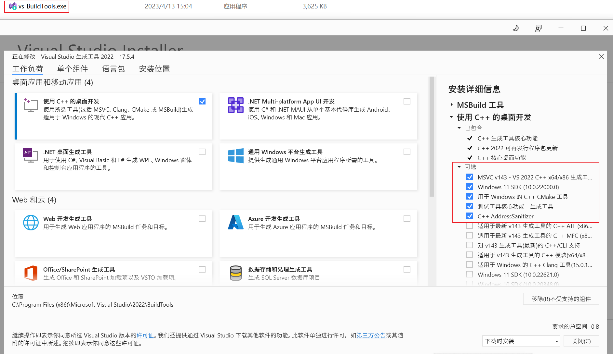
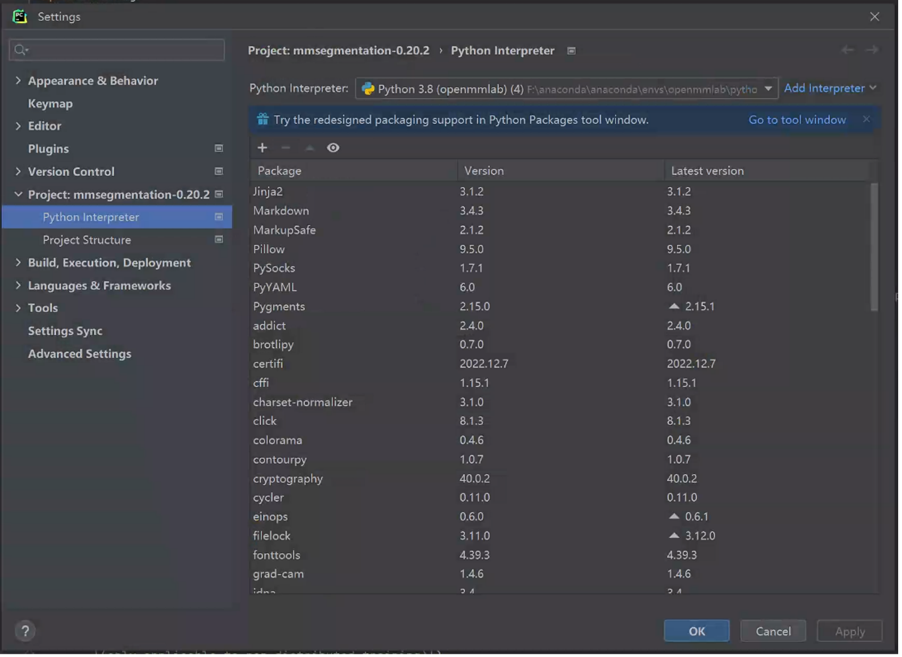
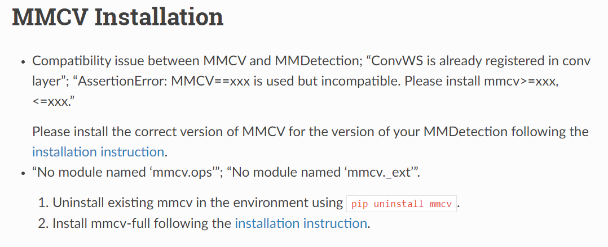

# `MMCV install`

## `一、安装conda：`
    ...
## `二、conda 虚拟环境设置：`

    conda create --name openmmlab python=3.8 -y
    conda activate openmmlab

## `三、MMCV 安装：`

* `MMCV` 的安装可以分为两种版本，一种是带 GPU 的电脑的安装，一个是不带 GPU 的电脑安装，分别对应以下两种安装方式 `GPU mmcv install` 和 `CPU mmcv install`：

### `3.1、GPU mmcv install`

* `3.1.1、安装Pytorch`

        pip3 install torch torchvision torchaudio --index-url https://download.pytorch.org/whl/cu117

* `3.1.2.1、新版本 mmcv 安装：`

        pip install -U openmim
        mim install mmcv

* `3.1.2.2、旧版本安装 mmcv 可以参考：（可以不用看它）`https://cloud.tencent.com/developer/article/2068649
        
        1、根据cuda的驱动版本选择相应的目录下载：https://download.openmmlab.com/mmcv/dist/cu111/torch1.8.0/index.html <-- cuda 的版本可以通过
        
        2、如下载其中的：mmcv_full-1.5.0-cp38-cp38-win_amd64.whl <-- 版本为1.5的mvcc，以及支持 python 3.8 的版本

        3、下载完成之后 pip install mmcv_full-1.5.0-cp38-cp38-win_amd64.whl 即可

* `3.1.3、安装 Microsoft C++ Build Tools ` 

    

* `3.1.4、打开 pycharm，在 Setting 中的 python interpretr 中找到 conda 虚拟环境中的 python 解释器：`

    

### `3.2、CPU mmcv install`

* `3.2.1、安装Pytorch`

        pip3 install torch torchvision torchaudio

* `3.2.2、安装 mmcv ：`
        
        pip install mvcc-full

* `3.2.3、安装 Microsoft C++ Build Tools`

        安装方式和 3.1 的安装方式一样

## `报错信息：`

* 如果在运行 train.py 的时候出现报错，可以参考：https://mmdetection.readthedocs.io/en/v2.13.0/faq.html

    

    如果出现 AssertionError: MMCV==xxx is used but incompatible. Please install mmcv>=xxx, <=xxx.” 意味着需要安装新的版本的 mvcc

## `MMClassification`

* [MMClassification](https://mmpretrain.readthedocs.io/en/latest/user_guides/config.html) 是 OpenMMLab 图像分类工具箱

