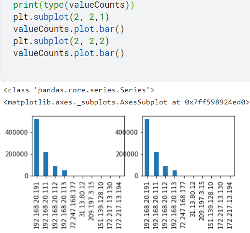
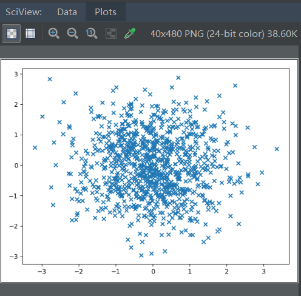
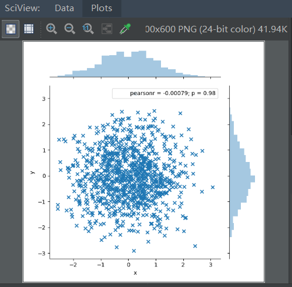
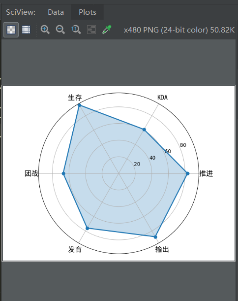
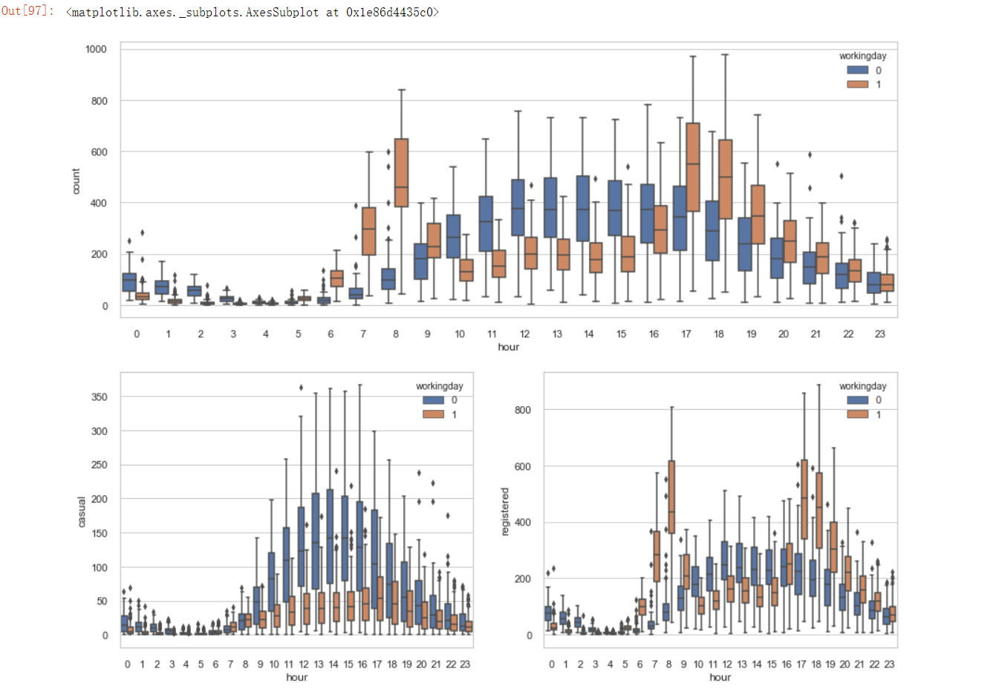
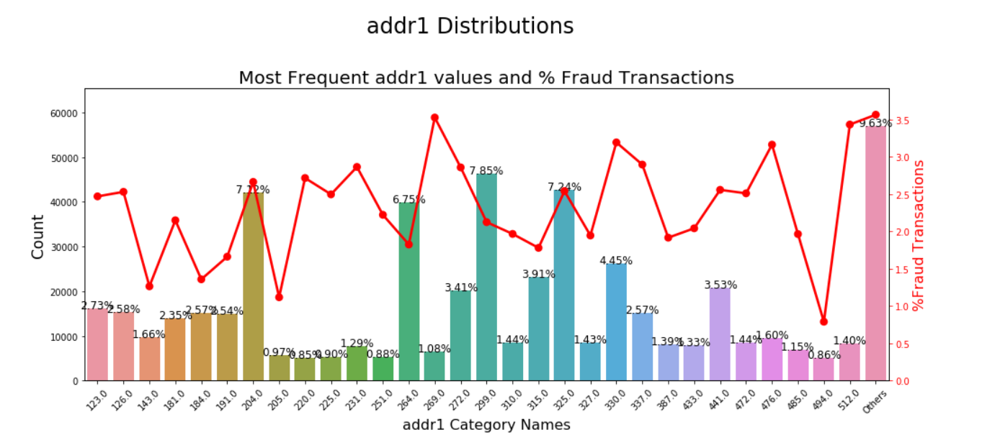
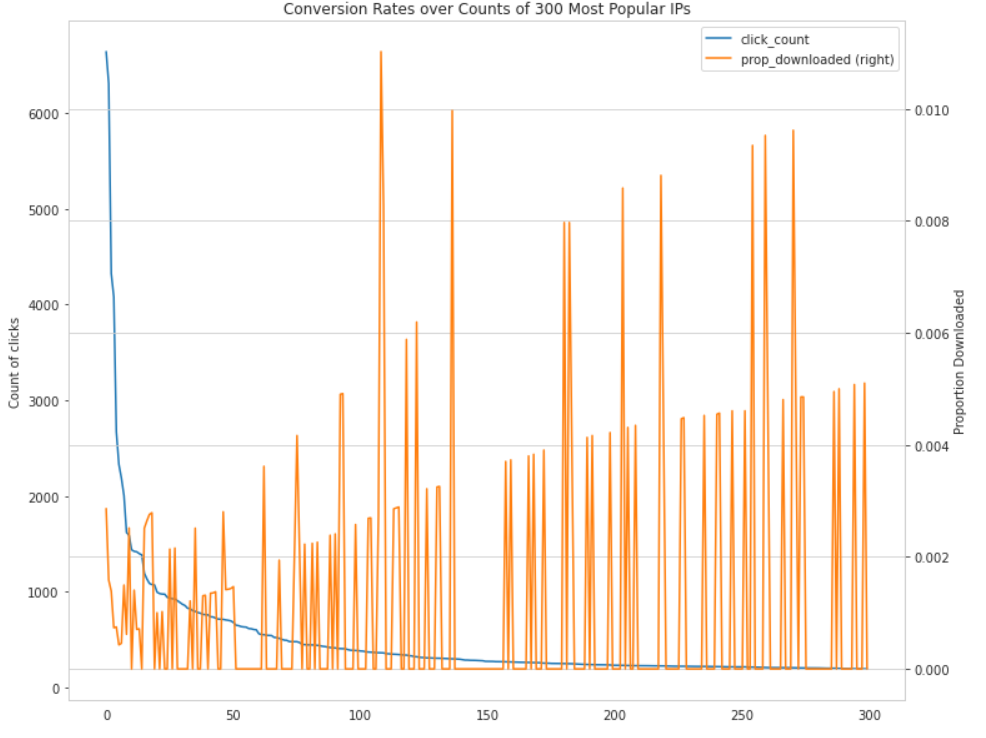
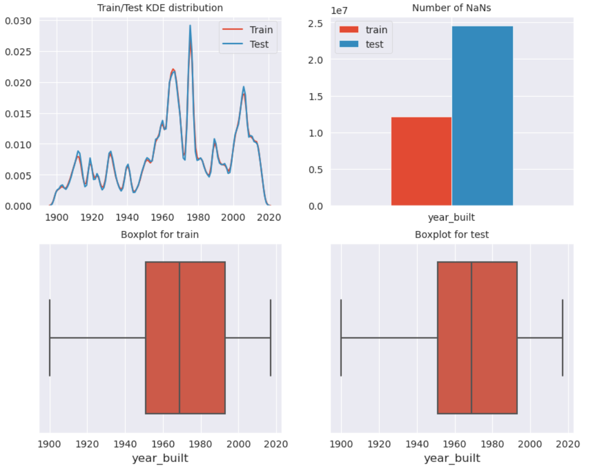
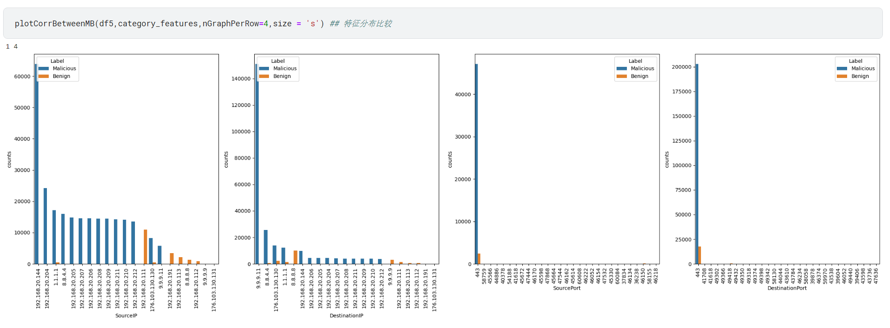
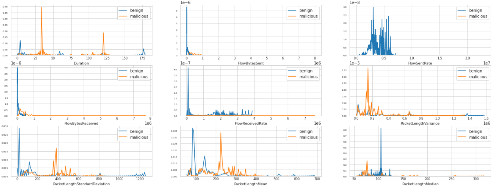

# 可视化工具Seaborn和Matplotlib

 ## plt画图支持中文显示 
    plt.rcParams['font.sans-serif']=['SimHei']

 ## plt画图支持负号正常显示 
    plt.rcParams['axes.unicode_minus']=False

 ## sns参数设置和重置

    参数设置：sns.set(参数)
    参数重置：sns.set()
    
 *  sns 设置中文字体

          sns.set(font='SimHei')

 *  sns 设置画布风格

        sns.set_style('darkgrid') # 背景
        sns.set_palette('Reds')   # 线条

  `sns.set(context ='notebook'，style ='darkgrid'，palette ='deep'，font ='sans-serif'，font_scale = 1，color_codes = True，rc = None )`
        
        context：string或dict  控制绘图的比例有四个预置的环境，按大小从小到大排列分别为：paper, notebook, talk, poster。其中，notebook是默认的。
        相当于 sns.set_context()  就是控制图的比例，paper比例最小，poster比例最大
        
        绘制上下文参数，请参阅 plotting_context() 

        style：string或dict   

        轴样式参数，请参阅 axes_style()           这会影响轴的颜色   背景颜色会发生变化  如 white(背景为白) darkgrid(灰色网格)

        palette：字符串或序列

        调色板，请参阅 color_palette() 返回定义调色板的颜色列表。可用的seaborn调色板名称：深沉，柔和，  明亮，  柔和，  黑暗，   色盲
                                                                                    deep, muted, bright, pastel, dark, colorblind

        set_palette() 设置线条(如：柱形图的柱子)的颜色

        字体：字符串

        字体系列，请参阅matplotlib字体管理器。

        font_scale：float，optional

        单独的缩放因子可以独立缩放字体元素的大小。

        color_codes：bool

        如果True并且palette是seaborn调色板，则将速记颜色代码（例如“b”，“g”，“r”等）重新映射到此调色板中的颜色。

        rc：dict或None

        rc参数映射字典覆盖上面的。

## 设置seaborn画布大小

  可以在最前面定义好画布大小

  例子：

    # 要设置sns的画布大小，要在最前面定义好plt.figure(figsize)
    plt.figure(figsize=(15,12))
    sns.barplot(x='MLA Test Accuracy Mean',y='MLA Name',data=MLA_compare,color='m')

    plt.title('Machine Learning Algorithm Accuracy Score \n')
    plt.xlabel('Accuracy Score (%)')
    plt.ylabel('Algorithm')

## plt 设置画布的风格
   
  导入 style 模块
 
    from matplotlib import style 

  获取所有的自带样式
    
    print(plt.style.available) # 打印样式列表
    
    ['bmh', 'classic', 'dark_background', 'fast', 
    'fivethirtyeight', 'ggplot', 'grayscale', 'seaborn-bright', 
    'seaborn-colorblind', 'seaborn-dark-palette', 'seaborn-dark', 'seaborn-darkgrid',
     'seaborn-deep', 'seaborn-muted', 'seaborn-notebook', 'seaborn-paper', 
    'seaborn-pastel', 'seaborn-poster', 'seaborn-talk', 'seaborn-ticks',
     'seaborn-white', 'seaborn-whitegrid', 'seaborn', 'Solarize_Light2', 
    'tableau-colorblind10', '_classic_test']
   
  设置画布风格如：
    
    style.use('bmh')
    
  `- 《[查看不同样式的展示图](https://matplotlib.org/3.1.0/gallery/style_sheets/style_sheets_reference.html)》`
  
    
    
    
 ## plt.subplot方法：
   `subplot(nrows, ncols, index, **kwargs)`
   
   一个3位整数或三个独立的整数，用于描述子图的位置。其中第一个数字是行数(nrows)，第二个是列数(ncols)，第三个是子图的索引(index)。
   代码示例：
    
    import matplotlib.pyplot as plt
    plt.figure(1) # 创建第一个画板（figure）
    plt.subplot(211) # 第一个画板的第一个子图，由2行一列组成，第一个子图
    plt.plot([1, 2, 3])
    plt.subplot(212) # 第二个画板的第二个子图
    plt.plot([4, 5, 6])
    plt.figure(2) #创建第二个画板
    plt.plot([4, 5, 6]) # 默认子图命令是subplot(111)
    plt.figure(1) # 调取画板1; subplot(212)仍然被调用中
    plt.subplot(211) #调用subplot(211)
    plt.title('Easy as 1, 2, 3') # 做出211的标题
    plt.show()
    
    # subplot 解释：
    plt.subplot(221) # 表示分成两行两列，占用第一个，即第一行第一列的子图
    plt.subplot(222) # 表示分成两行两列，占用第二个，即第一行第二列的子图
    plt.subplot(212) # 表示分成两行一列，占用第二个，即第二行第一列的子图
    
plt.figure(1) 画板一中的图，画板一和画板二的图是分开的，是画板一一张图，画板二一张图。

    

plt.figure(2) 画板二中的图

    
 `注意：plt.subplot(211)=plt.subplot(2,1,1)`   
    
 ## plt.subplots 创建一个图形和一组子图。
 
ax和fig的关系：

    fig, ax = plt.subplots()

 *  plt.subplots() 返回一个 Figure实例fig 和一个 AxesSubplot实例ax 。这个很好理解，fig代表整个图像，ax代表坐标轴和画的图。

* [ax 的相关方法 <-- 点击跳转](https://matplotlib.org/api/axes_api.html#matplotlib.axes.Axes)

 `例子1：`
 
* f, (ax1, ax2) = plt.subplots(2, 1, sharex=True, figsize=(15, 8))
    
* ax1和ax2分别表示为一个子图。
    
 `例子2：`   
    
* fig, ax = plt.subplots(2,3) # 创建2行三列个子图(6个子图)
    
* `此时如果想要定义子图中的内容，可以通过索引定位子图 如：ax[0][0]表示第0行第0个子图`
    
`例子3:`

      sharex 控制x(sharex)或y(sharey)轴之间的属性共享：
          1.True或者'all'：x或y轴属性将在所有子图(subplots)中共享.
          2.False或'none'：每个子图的x或y轴都是独立的部分
          3.'row'：每个子图在一个x或y轴共享行(row)
          4.'col':每个子图在一个x或y轴共享列(column)

    f, (ax1, ax2) = plt.subplots(2, 1, sharex=True, figsize=(15, 8))
    
`例子4:`

    f, (ax1, ax2) = plt.subplots(1, 2, figsize=(20, 6))

    # ax1 图绘制
    ax1.plot([i for i in range(620)],error)
    ax1.set_ylim(0,0.1) # 限制y轴的最大值和最小值。

    y_ticks = np.arange(0,0.1,0.02)
    ax1.set_yticks(y_ticks) # 设置y轴做标准刻度，可以用于设置间隔

    ax1.set_title('validation error')
    ax1.set_xlabel('Number of trees')

    # ax2 图绘制
    # ax2.scatter(x = [ i for i in range(len(x_train))],y=y_train)

    # 展示图
    plt.show()

`例4 效果图：`

    
 ## plt.plot方法：
 `matplotlib.pyplot.plot（* args，scalex = True，scaley = True，data = None，** kwargs ）` 
 
 `使用Line2D属性作为关键字参数来更好地控制外观。行属性和fmt可以混合使用。以下两个调用产生相同的结果：`
         
         # go--表示綠色线条，圆圈标记，线条样式为虚线
     >>> plot(x, y, 'go--', linewidth=2, markersize=12)
     >>> plot(x, y, color='green', marker='o', linestyle='dashed',
    ...      linewidth=2, markersize=12)
 

### 方法一：

`直接使用plt.plot方法后面跟数据`
 
    根据数据画图data['Weighted_Price']是df格式，-为线条样式为实线

    plt.plot(data['Weighted_Price'],'-',label='按天')

    label -> 图例标签, Dataframe格式以列名为label
    color -> 颜色, 有color指定的时候，以color颜色为准
    alpha -> 透明度， 0-1
    title -> 标题名

#### plt.suptitle

多幅图中指定大标题

    plt.suptitle('ProductCD Distributions', fontsize=22) 

#### 子图间距

自动调整子图之间的间距，对齐

  plt.tight_layout()

#### `plt.subplots_adjust`

调整子图布局，调用格式如下：

    subplots_adjust(left=None, bottom=None, right=None, top=None, wspace=None, hspace=None)

有六个可选参数来控制子图布局。值均为0~1之间。其中left、bottom、right、top围成的区域就是子图的区域。wspace、hspace分别表示子图之间左右、上下的间距。实际的默认值由matplotlibrc文件控制的。

    import matplotlib.pyplot as plt
    
    x=[1,2,3]
    y=[4,5,6]
    fig, axs = plt.subplots(2, 2)
    axs[0, 0].plot(x,y)
    axs[0, 1].plot(x,y)
    axs[1, 0].plot(x,y)
    axs[1, 1].plot(x,y)
    
    plt.subplots_adjust(left=0.1, bottom=0.5, right=0.8, wspace=0.01)
    
    plt.show()

让子图之间有充分的间隔

### 方法二：

`基于前面的数据进行plot 不是直接使用plt.plot(会报错)`
    
    # 前面如果定义了子图和子图的大小，这里的figsize=[15,7]会失效，这里我们使用o标记，我们画出来的图也会像一个小圆点一样
    data['Weighted_Price'].plot(kind = "line",style='--ro',label='按天',figsize=[15,7])

    ts = pd.Series(np.random.randn(1000), index = pd.date_range("1/1/2000", periods = 1000))
    ts = ts.cumsum()
    ts.plot(kind = "line",
            label = "heheheh", # Series需要Label
            style = "go--",
            color = "red",
            alpha = 0.4,
            secondary_y='prop_downloaded'，# 用于制作双坐标,也就是右侧的y轴
            use_index = True,
            rot = 45,
            grid = True,
            ylim = [-50, 50],
            yticks = list(range(-50, 50, 10)),
            figsize = (8,4),
            title = "test",
            legend = True)
    # plt.grid(True, linestyle = "--",color = "gray", linewidth = "0.5",axis = 'x')  # 网格
    plt.legend()
    plt.show()
    # Series.plot()：series的index为横坐标，value为纵坐标
    # kind → line,bar,barh...（折线图，柱状图，柱状图-横...）
    # label → 图例标签，Dataframe格式以列名为label
    # style → 风格字符串，这里包括了marker（o），linestyle（--），color（g） 就是官方文档中的fmt[marker][line][color] 顺序没有严格要求
    # color → 颜色，有color指定时候，以color颜色为准
    # alpha → 透明度，0-1
    # use_index → 将索引用为刻度标签，默认为True
    # rot → 旋转刻度标签，0-360  或者使用  plt.xticks(rotation =0)
    # grid → 显示网格，一般直接用plt.grid
    # xlim,ylim → x,y轴界限
    # xticks,yticks → x,y轴刻度值
    # figsize → 图像大小
    # title → 标题名
    # legend → 是否显示图例，一般直接用plt.legend() 不带参数调用 legend 会自动获取图例句柄及相关标签，这里加上legend表示显示label
    # 也可以 → plt.plot()

## `注意`

需要注意的是 plt 绘图和 df.bar 绘图是两种绘图方式，也急速 plt.figure 创建出来的画框或者是 plt.subplot 创建出来的子框，都不可以给 df.bar 使用，但是如果你的数据是 series 数据，那么两者是可以通用的：

### `两图简单可视化：`

* `加一个透明度即可：`

### `fmt:格式化字符串 `

格式字符串由颜色，标记和线条的部分组成： 就是上面说的style
   `颜色`
   
     字符	颜色
    'b'	蓝色
    'g'	绿色
    'r'	红色
    'c'	青色
    'm'	品红
    'y'	黄色
    'k'	黑色
    'w'	白色
    
   `线条样式`

    字符	描述
    '-'	实线风格
    '--'	虚线样式
    '-.'	点划线样式
    ':'	虚线样式
    
   `标记` 

    字符	描述
    '.'	点标记
    ','	像素标记
    'o'	圆圈标记
    'v'	triangle_down标记
    '^'	triangle_up标记
    '<'	triangle_left标记
    '>'	triangle_right标记
    '1'	tri_down标记
    '2'	tri_up标记
    '3'	tri_left标记
    '4'	tri_right标记
    's'	方形标记
    'p'	五边形标记
    '*'	明星标记
    'h'	hexagon1标记
    'H'	hexagon2标记
    '+'	加上标记
    'x'	x标记
    'D'	钻石标记
    'd'	thin_diamond标记
    '|'	vline标记
    '_'	hline标记

## ax

### ax.legend

* `legend.loc`

      使用 .loc 来控图例的位置

      loc : str or pair of floats, default: rcParams["legend.loc"] = 'best' ('best' for axes, 'upper right' for figures)

      # 使用 str 来指定图例位置
      The strings 'upper left', 'upper right', 'lower left', 'lower right' place the legend at the corresponding corner of the axes/figure.

      # 使用 code 来指定图例位置
      Location String	Location Code

      'best'	0
      'upper right'	1
      'upper left'	2
      'lower left'	3
      'lower right'	4
      'right'	5
      'center left'	6
      'center right'	7
      'lower center'	8
      'upper center'	9
      'center'	10

    
## plt 设置图像的相关方法
   
*   `plt.xlim plt.ylim`
    
    * 获取或设置当前轴的x限制。如

            plt.ylim(0,100)
 

*   `plt.xlabel()`

    * 设置x轴上的标题 如 
      
            plt.xlabel('国家名称',fontsize=16)

*   `plt.title()`

    * 设置标题 
    
            plt.title('各国商品贸易（占GDP的百分比%）',fontsize=26)

*   `plt.xticks()`

    * 设置x轴上的刻度。如

            # 用于变换坐标名称
            x_tick = np.linspace(0,100,6)
            new_x_tick =[str(i)+'%' for i in x_tick]

            plt.yticks(x_tick,new_x_tick,fontsize=14)

## 4类主要的可视化视图
    
    比较：比较数据间各类别的关系，或者是它们随着时间的变化趋势，比如折线图；
    
    联系：查看两个或两个以上变量之间的关系，比如散点图；
    
    构成：每个部分占整体的百分比，或者是随着时间的百分比变化，比如饼图；
    
    分布：关注单个变量，或者多个变量的分布情况，比如直方图。

单变量可视化视图：
  
    一次值关注一个变量。如我们一次只关注身高变量，来看身高的取值分布，而暂时忽略其他变量。
  
多变量可视化视图：
    
    可以让一张图同时查看两个以上的变量，比如“身高”和“年龄”，你可以理解是同一个人的两个参数，这样在同一张图中可以看到每个人的“身高”和“年龄”的取值，从而分析出这两个变量之前是否存在某种联系。
    
    
离散变量和连续变量：

    离散变量是指其数值只能用自然数或整数单位计算的则为离散变量. 例如,企业个数,职工人数,设备台数等,只能按计量单位数计数,这种变量的数值一般用计数方法取得. 反之,在一定区间内可以任意取值的变量叫连续变量,其数值是连续不断的,相邻两个数值可作无限分割,即可取无限个数值.
  
    针对离散变量我们可以使用常见的条形图和饼图完成数据的可视化工作，那么，针对数值型变量，我们也有很多可视化的方法，例如箱线图、直方图、折线图、面积图、散点图等等。
    
    
    
## 散点图：

引入工具包，Matplotlib的pyplot包
  
     import matplotlib.pyplot as plt
     
 在工具包引用后，画散点图，需要使用 plt.scatter(x, y, marker=None) 函数。x、y 是坐标，marker 代表了标记的符号。比如“x”、“>”或者“o”。选择不同的 marker，呈现出来的符号样式也会不同(就是以指定的符号当成点画图)，你可以自己试一下。

 或使用工具包seaborn
  
    import seaborn as sns
    
在引用 seaborn 工具包之后，就可以使用 seaborn 工具包的函数了。如果想要做散点图，可以直接使用 sns.jointplot(x, y, data=None, kind=‘scatter’) 函数。其中 x、y 是 data 中的下标。data 就是我们要传入的数据，一般是 DataFrame 类型。kind 这类我们取 scatter，代表散点的意思。当然 kind 还可以取其他值，这个我在后面的视图中会讲到，不同的 kind 代表不同的视图绘制方式。

`例子：`
    
    import numpy as np
    import pandas as pd
    import matplotlib.pyplot as plt
    import seaborn as sns
    # 数据准备
    N = 1000
    x = np.random.randn(N)
    y = np.random.randn(N)
    # 用 Matplotlib 画散点图
    plt.scatter(x,y,marker="x")
    plt.show()
    #用seaborn画图
    df=pd.DataFrame({'x':x,'y':y})
    sns.joinplot(x='x',y='y',data=df,kind='scatter',marker='x')
    #sns还是要借助pyplot来打印图的 其自身无show方法
    plt.show    
    
`运行结果：`
  
`Matplotlib:` 
  
  <!--  -->
  

  
`seaborn:`    
  
<!--  -->

  
  
  
## 折线图：
  
  折线图可以用来表示数据随着时间变化的趋势。
  
  在 Matplotlib 中，我们可以直接使用 plt.plot() 函数，当然需要提前把数据按照 x 轴的大小进行排序，要不画出来的折线图就无法按照 x 轴递增的顺序展示。
  
  在 Seaborn 中，我们使用 sns.lineplot (x, y, data=None) 函数。其中 x、y 是 data 中的下标。data 就是我们要传入的数据，一般是 DataFrame 类型。
  
`例子：`
  
    import pandas as pd
    import matplotlib.pyplot as plt
    import seaborn as sns
    # 数据准备
    x = [2010, 2011, 2012, 2013, 2014, 2015, 2016, 2017, 2018, 2019]
    y = [5, 3, 6, 20, 17, 16, 19, 30, 32, 35]
    # 使用 Matplotlib 画折线图
    plt.plot(x, y)
    plt.show()
    # 使用 Seaborn 画折线图
    df = pd.DataFrame({'x': x, 'y': y})
    sns.lineplot(x="年", y="月", data=df)
    plt.show()

`运行结果：`
  
M:  
  
  <!--  -->

  
S:
  
  
  
  S:如果要修改X和Y轴的参数需要这样写代码
    df中的参数名字和lineplot中的参数的一一对应的，同时lineplot中的year就是x轴的名字，money就是y轴的名字
    
    df = pd.DataFrame({'year': x, 'money': y})
    sns.lineplot(x="year", y="money", data=df)
    plt.show()
         
         
  <!--  -->
  

  
  
## `直方图 和 KDE`：

直方图是比较常见的视图，它是把横坐标等分成了一定数量的小区间，这个小区间也叫作“箱子”，然后在每个“箱子”内用矩形条（bars）展示该箱子的箱子数（也就是 y 值），这样就完成了对数据集的直方图分布的可视化。

在 Matplotlib 中，我们使用 plt.hist(x, bins=10) 函数，其中参数 x 是一维数组，bins 代表直方图中的箱子数量，默认是 10。

在 Seaborn 中，我们使用 sns.distplot(x, bins=10, kde=True) 函数。其中参数 x 是一维数组，bins 代表直方图中的箱子数量，kde 代表显示核密度估计，默认是 True，我们也可以把 kde 设置为 False，不进行显示。核密度估计是通过核函数帮我们来估计概率密度的方法。

`当KDE失败提示为`：`RuntimeError: Selected KDE bandwidth is 0. Cannot estiamte density` 原因是：Seaborn库(它依赖的scipy或statmodels库来计算kde)没有办法计算出“bandwidth”，kdeplot函数中的bw参数，是一个缩放参数，当然也可以自定义。

`解决方法：`

    try:
      sns.distplot(df)
    except RuntimeError as re:
        if str(re).startswith("Selected KDE bandwidth is 0. Cannot estimate density."):
            sns.distplot(df, kde_kws={'bw': 0.1})
        else:
            raise re
  
  ​

`例子：`
    
    import numpy as np
    import pandas as pd
    import matplotlib.pyplot as plt
    import seaborn as sns
    # 数据准备
    a = np.random.randn(100)
    s = pd.Series(a) 
    # 用 Matplotlib 画直方图
    plt.hist(s)
    plt.show()
    # 用 Seaborn 画直方图
    sns.distplot(s, kde=False)
    plt.show()
    sns.distplot(s, kde=True)
    plt.show()

`运行结果：`
  
M:
  
  <!--  -->

  

  
S:  
  
  <!--  -->
  

  
  <!--  -->
  

  
  
  ## 条形图
    
条形图可以帮我们查看类别的特征。在条形图中，长条形的长度表示类别的频数，宽度表示类别。
  
在 Matplotlib 中，我们使用 plt.bar(x, height) 函数，其中参数 x 代表 x 轴的位置序列，height 是 y 轴的数值序列，也就是柱子的高度。
  
在 Seaborn 中，我们使用 sns.barplot(x=None, y=None, data=None) 函数。其中参数 data 为 DataFrame 类型，x、y 是 data 中的变量。

`最简单的方式：` train_data[['Sex','Survived']].groupby(['Sex']).mean().plot.bar()
  
`例子：`
    
    import matplotlib.pyplot as plt
    import seaborn as sns
    # 数据准备
    x = ['Cat1', 'Cat2', 'Cat3', 'Cat4', 'Cat5']
    y = [5, 4, 8, 12, 7]
    # 用 Matplotlib 画条形图
    plt.bar(x, y)
    plt.show()
    # 用 Seaborn 画条形图
    sns.barplot(x, y)
    plt.show()

  
`运行结果：`
  
M:  
   
 <!--  -->
  

S:
   
<!--  -->

* `补充：`

  * 如果想要绘制横向的条形图 使用 plt.barh() 函数

  * 可以通过对生成的 bar = plt.bar() 对象进行 set_height 或者 set_width 对数据进行重新设置。

`例子2：`

  通过 groupby 分析分组数据，通过.value_counts()统计数量 .sort_index() 让 index 的值从小到大排序。最后通过.bar 绘图

    group = train.groupby(['matchType','matchId','groupId'])['Id'].count().to_frame('players').reset_index()
    group.loc[group['players'] >4,'players'] = '5+'
    group['players'] = group['players'].astype(str)

    fig,ax=plt.subplots(1,3,figsize=(16,4))
    
    # ax.ravel() 为每个子图设置变量
    for mt,ax in zip(['solo','duo','squad'],ax.ravel()):
        ax.set_xlabel(mt)
        group[group['matchType']==mt]['players'].value_counts().sort_index().plot.bar(ax=ax)

`运行结果：`

<!--  -->

## 箱型图：

  它可以帮我们分析出数据的差异性、离散程度和异常值等。 
    
  箱线图，又称盒式图，由五个数值点组成：最大值 (max)、最小值 (min)、中位数 (median) 和上下四分位数 (Q3, Q1)。
    
  在 Matplotlib 中，我们使用 plt.boxplot(x, labels=None) 函数，其中参数 x 代表要绘制箱线图的数据，labels 是缺省值，可以为箱线图添加标签。
  
  在 Seaborn 中，我们使用 sns.boxplot(x=None, y=None, data=None) 函数。其中参数 data 为 DataFrame 类型，x、y 是 data 中的变量。
  
  
`例子：`
  
    # 数据准备
    # 生成 0-1 之间的 10*4 维度数据
    data=np.random.normal(size=(10,4)) 
    lables = ['A','B','C','D']
    # 用 Matplotlib 画箱线图
    plt.boxplot(data,labels=lables)
    plt.show()
    # 用 Seaborn 画箱线图
    df = pd.DataFrame(data, columns=lables)
    sns.boxplot(data=df)
    plt.show()

`运行结果：`
  
M:   
  
  <!--  -->

S:    
  
   <!--  -->
  

##  饼图

  饼图是常用的统计学模块，可以显示每个部分大小与总和之间的比例。在 Python 数据可视化中，它用的不算多。我们主要采用 Matplotlib 的 pie 函数实现它。
  
  在 Matplotlib 中，我们使用 plt.pie(x, labels=None) 函数，其中参数 x 代表要绘制饼图的数据，labels 是缺省值，可以为饼图添加标签。
  
  这里我设置了 lables 数组，分别代表高中、本科、硕士、博士和其他几种学历的分类标签。nums 代表这些学历对应的人数。
  
  
`例子：`
      
      import matplotlib.pyplot as plt
      # 数据准备
      nums = [25, 37, 33, 37, 6]
      labels = ['High-school','Bachelor','Master','Ph.d', 'Others']
      # 用 Matplotlib 画饼图
      plt.pie(x = nums, labels=labels)
      plt.show()

`运行结果：`
  
S:    
   
 
    

    
 ## 热力图：
  
 *   `注意：` 如果某个特征中存在缺失值，那么这个特征的相关性系数不会被体现出来(保证数据无缺失值)
  
     热力图是一种非常直观的多元变量分析方法。通过热力图我们可以发现特征之间的相关性。

     热力图，英文叫 heat map，是一种矩阵表示方法，其中矩阵中的元素值用颜色来代表，不同的颜色代表不同大小的值。通过颜色就能直观地知道某个位置上数值的大小。另外你也可以将这个位置上的颜色，与数据集中的其他位置颜色进行比较。

     我们一般使用 Seaborn 中的 sns.heatmap(data) 函数，其中 data 代表需要绘制的热力图数据。

     这里我们使用 Seaborn 中自带的数据集 flights，该数据集记录了 1949 年到 1960 年期间，每个月的航班乘客的数量。

  `热力图参数说明：`

    ax = sns.heatmap(data,vmin=0, vmax=1, cmap = 'GnBu', center=0.5, 
                 robust=False,annot=True,cbar=True)

    data : 要显示的数据

    vmin, vmax : 显示的数据值的最大和最小的范围，热力图最右侧的渐变条的最小值和最大值

    cmap : matplotlib颜色表名称或对象，或颜色列表，可选从数据值到色彩空间的映射。如果没有提供，默认设置
    
    square 布尔值: 如果为True，则将Axes方面设置为“相等”，以使每个单元格为方形。
    
    annot_kws，当annot为True时，可设置各个参数，包括大小，颜色，加粗，斜体字等
         例子：
              colormap = plt.cm.RdBu
              sns.heatmap(train.astype(float).corr(),linewidths=0.1,vmax=1.0, square=True, cmap=colormap, linecolor='white', annot=True,annot_kws={'size':9,'weight':'bold', 'color':'blue'})

    center : 指定色彩的中心值

    robust : 如果“Ture”和“ vmin或” vmax不存在，则使用强分位数计算颜色映射范围，而不是极值。

    annot : 如果为True，则将数据值写入每个单元格中

    annot_kws={'size': 10} 用于控制数值的大小

    cbar=True 是否绘制颜色条，就是最右侧的渐变条是否显示，默认为True(显示)

    yticklabels=columns.values, xticklabels=columns.values 用于设置y轴和x轴的坐标轴显示内容

    fmt : 表格里显示数据的类型
      fmt ='.0%'#显示百分比
      fmt ='f' 显示完整数字 = fmt ='g'
      fmt ='.3'显示小数的位数 = fmt ='.3f' = fmt ='.3g' 
      注意：比如我使用 fmt ='.1' 如果我们的相关系数为0.02 在第二位才开始有值，他会保留0.02，而使用 fmt ='.1'会强制保留1位小数，就是0.0

#### 热图函数，直接传数据即可

    def correlation_heatmap(df):
        _ , ax = plt.subplots(figsize =(14, 12))
        colormap = sns.diverging_palette(220, 10, as_cmap = True)
        
        _ = sns.heatmap(
            df.corr(), 
            cmap = colormap,
            square=True, 
            cbar_kws={'shrink':.9 }, 
            ax=ax,
            annot=True, 
            linewidths=0.1,vmax=1.0, linecolor='white',
            annot_kws={'fontsize':12 }
        )
        
        plt.title('Pearson Correlation of Features', y=1.05, size=15)

`例子1`
 
    import matplotlib.pyplot as plt
    import seaborn as sns
    # 数据准备
    flights = sns.load_dataset("flights")
    data=flights.pivot('year','month','passengers')
    # 用 Seaborn 画热力图
    sns.heatmap(data)
    plt.show()

`运行结果`
    
    通过 seaborn 的 heatmap 函数，我们可以观察到不同年份，不同月份的乘客数量变化情况，其中颜色越浅的代表乘客数量越多，如下图所示：
  
S:    
  
<!--  -->
 

`例子2`

    corrmat = train_data.drop('Id',axis=1).corr()
    fig,ax=plt.subplots(figsize=(20,16))
    sns.heatmap(corrmat,annot=True,fmt ='.1')
    plt.show()
 

`运行结果`

S:    

<!--  -->
 

 ## 蜘蛛图：
  
  蜘蛛图是一种显示一对多关系的方法。在蜘蛛图中，一个变量相对于另一个变量的显著性是清晰可见的。
  
  假设我们想要给王者荣耀的玩家做一个战力图，指标一共包括推进、KDA、生存、团战、发育和输出。那该如何做呢？
  
  这里我们需要使用 Matplotlib 来进行画图，首先设置两个数组：labels 和 stats。他们分别保存了这些属性的名称和属性值。
  
  因为蜘蛛图是一个圆形，你需要计算每个坐标的角度，然后对这些数值进行设置。当画完最后一个点后，需要与第一个点进行连线。
  
  因为需要计算角度，所以我们要准备 angles 数组；又因为需要设定统计结果的数值，所以我们要设定 stats 数组。并且需要在原有 angles 和 stats 数组上增加一位，也就是添加数组的第一个元素。
  
  
`例子：`
    
    import numpy as np
    import matplotlib.pyplot as plt
    import seaborn as sns
    from matplotlib.font_manager import FontProperties  
    # 数据准备
    labels=np.array([u" 推进 ","KDA",u" 生存 ",u" 团战 ",u" 发育 ",u" 输出 "])
    stats=[83, 61, 95, 67, 76, 88]
    # 画图数据准备，角度、状态值
    # endpoint是一个bool类型的值，如果为"Ture",“stop"是最后一个值，如果为"False”,生成的数组不会包含"stop"值,白话就是True时右闭，False右开。
    angles=np.linspace(0, 2*np.pi, len(labels), endpoint=False)
    # numpy.concatenate((a1, a2, ...), axis=0, out=None) 目的就是将两个数组拼接在一起
    stats=np.concatenate((stats,[stats[0]]))
    angles=np.concatenate((angles,[angles[0]]))
    # 用 Matplotlib 画蜘蛛图
    fig = plt.figure()
    ax = fig.add_subplot(111, polar=True)   
    ax.plot(angles, stats, 'o-', linewidth=2)
    ax.fill(angles, stats, alpha=0.25)
    # 设置中文字体
    font = FontProperties(fname=r"C:\Windows\Fonts\simhei.ttf", size=14)  
    ax.set_thetagrids(angles * 180/np.pi, labels, FontProperties=font)
    plt.show()
    
    
代码中 flt.figure 是创建一个空白的 figure 对象，这样做的目的相当于画画前先准备一个空白的画板。然后 add_subplot(111) 可以把画板划分成 1 行 1 列。再用 ax.plot 和 ax.fill 进行连线以及给图形上色。最后我们在相应的位置上显示出属性名。这里需要用到中文，Matplotlib 对中文的显示不是很友好，因此我设置了中文的字体 font，这个需要在调用前进行定义。最后我们可以得到下面的蜘蛛图，看起来是不是很酷？

`运行结果：`
     
M：     
  

      

  
  
## 二元变量分布

如果我们想要看两个变量之间的关系，就需要用到二元变量分布。当然二元变量分布有多种呈现方式，开头给你介绍的散点图就是一种二元变量分布。

在 Seaborn 里，使用二元变量分布是非常方便的，直接使用 sns.jointplot(x, y, data=None, kind) 函数即可。其中用 kind 表示不同的视图类型：“kind=‘scatter’”代表散点图，“kind=‘kde’”代表核密度图，“kind=‘hex’ ”代表 Hexbin 图，它代表的是直方图的二维模拟。

这里我们使用 Seaborn 中自带的数据集 tips，这个数据集记录了不同顾客在餐厅的消费账单及小费情况。代码中 total_bill 保存了客户的账单金额，tip 是该客户给出的小费金额。我们可以用 Seaborn 中的 jointplot 来探索这两个变量之间的关系。

`例子：`
  
    import matplotlib.pyplot as plt
    import seaborn as sns
    # 数据准备
    tips = sns.load_dataset("tips")
    print(tips.head(10))
    # 用 Seaborn 画二元变量分布图（散点图，核密度图，Hexbin 图）
    sns.jointplot(x="total_bill", y="tip", data=tips, kind='scatter')
    sns.jointplot(x="total_bill", y="tip", data=tips, kind='kde')
    sns.jointplot(x="total_bill", y="tip", data=tips, kind='hex')
    plt.show()

`运行结果：`

代码中我用 kind 分别显示了他们的散点图、核密度图和 Hexbin 图，如下图所示。
  
`散点图：`  
  
  <!--  -->

  

  核图：  
  
  <!--  -->

 
 `Hexbin图：`    
 
 <!--  -->
  

 ## 成对关系：
 
如果想要探索数据集中的多个成对双变量的分布，可以直接采用 sns.pairplot() 函数。它会同时展示出 DataFrame 中每对变量的关系，另外在对角线上，你能看到每个变量自身作为单变量的分布情况。它可以说是探索性分析中的常用函数，可以很快帮我们理解变量对之间的关系。
 
 pairplot 函数的使用，就像在 DataFrame 中使用 describe() 函数一样方便，是数据探索中的常用函数。
 
 这里我们使用 Seaborn 中自带的 iris 数据集，这个数据集也叫鸢尾花数据集。鸢尾花可以分成 Setosa、Versicolour 和 Virginica 三个品种，在这个数据集中，针对每一个品种，都有 50 个数据，每个数据中包括了 4 个属性，分别是花萼长度、花萼宽度、花瓣长度和花瓣宽度。通过这些数据，需要你来预测鸢尾花卉属于三个品种中的哪一种。
 
 `例子：`
    
    import matplotlib.pyplot as plt
    import seaborn as sns
    # 数据准备
    iris = sns.load_dataset('iris')
    # 用 Seaborn 画成对关系
    sns.pairplot(iris)
    plt.show()
  
  
这里我们用 Seaborn 中的 pairplot 函数来对数据集中的多个双变量的关系进行探索，如下图所示。从图上你能看出，一共有 sepal_length、sepal_width、petal_length 和 petal_width4 个变量，它们分别是花萼长度、花萼宽度、花瓣长度和花瓣宽度。
  
  
`下面这张图相当于这 4 个变量两两之间的关系。比如矩阵中的第一张图代表的就是花萼长度自身的分布图，它右侧的这张图代表的是花萼长度与花萼宽度这两个变量之间的关系。`    

<!--  -->
 

 
 解释图：(条形图是自身，其他的分别是和其他参数组合起来的比较图)
    
<!--  -->
  

 

 ## FacetGrid
    
  `当您想要在数据集的子集内可视化变量的分布或多个变量之间的关系时，FacetGrid类很有用。 FacetGrid可以绘制最多三个维度：row，col和hue。前两者与所得轴数有明显的对应关系;将hue变量视为沿着深度轴的第三维，其中不同的级别用不同的颜色绘制。`
    
第一个参数可以是plt.hist, plt.scatter, sns.regplot, sns.barplot, sns.distplot, sns.pointplot等。
    
`数据集传进来sns.FacetGrid(data,col=””)col表示我们按照什么进行分图`
    
通过map, g.map(plt.hist,””)—plt.hist表示画条形图
    
alpha=.7透明程度
    
`bins表示条形图中的条数，坑：(比如我的年龄是0-80，我们bins指明40时，我们两条年龄的柱状图会进行合并显示，bins指定80则每条柱状图表示一个年龄)`

`两个特征进行可视化展示：`

    # 此时纵坐标表示满足条件的数据的数量
    g = sns.FacetGrid(train_data, col='Survived',height=5)
    g.map(plt.hist,'Age',bins=80，alpha=.7)
    plt.show()

<!--  -->

`三个特征进行可视化展示：`

    # 此时纵坐标表示满足条件的数据的数量 
    # aspect 每个刻面的宽高比，使每个刻面的宽度以英寸为单位 ，是宽和高的比
    # size 定义图的大小，但是定义了 size 之后 height 会失效
    grid = sns.FacetGrid(train_data, row='Pclass', col='Sex', size=2.2,aspect=1.6)
    grid.map(plt.hist, 'Age', alpha=.5, bins=20)

<!--  -->

`四个特征进行可视化展示：`

    # row行特征(特征是二分类，所以行方向有两个子图) col表示列特征(列方向是三分类，所以有三个子图) hue是第三个变量的级别，该参数绘制不同颜色的不同数据子集
    # size 定义图的大小
    # margin_titles = True时 会将行变量的标题被绘制到最后一列的右侧。此选项是实验性的，可能无法在所有情况下使用。
    # palette 用于hue变量的不同级别的颜色。应该是可以解释的东西color_palette()，或者是将色调级别映射到matplotlib颜色的字典。

    g = sns.FacetGrid(train,size=5, col="Sex", row="Embarked", margin_titles=True, hue = "Survived",palette = pal)

    # edgecolor 边的颜色
    # .add_legend(); 是否显示图例，在这里就是Survived的图例(因为只有他没有明确显示含义)
    g = g.map(plt.hist, "Age", edgecolor = 'white').add_legend();
    g.fig.suptitle("Survived by Sex and Age", size = 25)
    plt.subplots_adjust(top=0.90)

<!--  -->

 ## matplotlib.pyplot.figure
    
    num ： 整数或字符串，可选，默认值：无
    如果未提供，将创建新图形，图形编号将递增。图形对象将此数字保存在number 属性中。如果提供了num，并且已存在具有此id的数字，请将其设置为活动状态，
    并返回对它的引用。如果此图不存在，请创建它并返回它。如果num是一个字符串，则窗口标题将设置为此图 num。
    
    figsize :( float，float），可选，默认值：无
    宽度，高度（英寸）。如果未提供，则默认为 rcParams["figure.figsize"]= [6.4, 4.8]

    dpi ： 整数，可选，默认值：无
    这个数字的分辨率。如果未提供，则默认为 rcParams["figure.dpi"]= 100。

    facecolor：
    背景颜色。如果未提供，则默认为 rcParams["figure.facecolor"]= 'w'。

    edgecolor：
    边框颜色。如果未提供，则默认为 rcParams["figure.edgecolor"]= 'w'。

    frameon ： bool，optional，默认值：True
    如果为False，则禁止绘制图框。

    FigureClass ：的 子类Figure
    （可选）使用自定义Figure实例。

    clear ： bool，可选，默认值：False
    如果为True并且该图已经存在，那么它将被清除。

`例子：`

    # 热力图可视化特征之间的关系 corr函数建立content[features_mean]特征中的关系值
    corr=content[features_mean].corr()
    # 图像的宽度和高度指定为14
    plt.figure(figsize=(14,14))
    # print(corr)
    # 建立热力图 指定数据为corr  annot : 如果为True，则将数据值写入每个单元格中
    sns.heatmap(corr,annot=True)
    plt.show()

    

### 循环绘制图像

    f, axes = plt.subplots(3, 5, figsize=(24, 12))
    plt.suptitle('Violinplot of revenue vs genres')
    for i, e in enumerate([col for col in train.columns if 'genre_' in col]):
        # % 取余，如果 i 比 5 小，那么余数就是他自己
        sns.violinplot(x=e, y='revenue', data=train, ax=axes[i // 5][i % 5]);

#### 如下图：

<!-- 

 -->

### sns.jointplot 绘图

#### 使用方法：

    # ratio 比率：数字，可选 关节轴高度与边缘轴高度的比率。
    sns.jointplot(x='x_轴特征',y='y_轴特征',data=输入数据,height=10,ratio=3,color='r')

#### 如下图

<!-- 

 -->

### GridSpec 定位网格进行绘图

from  matplotlib.gridspec import GridSpec

    fig = plt.figure(figsize=(15,12))
    gls = GridSpec(4,4,fig,wspace=0.5,hspace=0.5)
    plt.subplot(gls[:2,:])
    sns.boxplot(x='hour',y='count',hue='workingday',data=bike_train)
    plt.subplot(gls[2:,:2])
    sns.boxplot(x='hour',y='casual',hue='workingday',data=bike_train)
    plt.subplot(gls[2:,2:])
    sns.boxplot(x='hour',y='registered',hue='workingday',data=bike_train)

### [seaborn.countplot ⬅ ](https://seaborn.pydata.org/generated/seaborn.countplot.html?highlight=countplot)

    seaborn.countplot(x=None, y=None, hue=None, data=None, order=None, hue_order=None, \
                        orient=None, color=None, palette=None, saturation=0.75, dodge=True, ax=None, **kwargs)

`参数：`

* order：类别层级绘制的顺序，否则层级会从数据对象中推测。

* ax.twinx()  ：添加辅助坐标轴x

* ax.patches() :循环每个条形图中的每一条柱

`案例：countplot + pointplot`

绘制 addr1 特征下不同数值出现的 次数 和 不同数值下 欺诈的比例

    # 数据
    tmp = pd.crosstab(df[col], df['isFraud'], normalize='index') * 100
    tmp = tmp.reset_index()
    tmp.rename(columns={0:'NoFraud', 1:'Fraud'}, inplace=True)

    数据类似如下情况：
    
    # isFraud	  card6	          NoFraud	      Fraud
    # 0	      charge card	      100.000000	  0.000000
    # 1	      credit	          93.321520	    6.678480
    # 2	      debit	            97.573749	    2.426251
    # 3	      debit or credit	  100.000000	  0.000000

    # 绘图    
    plt.figure(figsize=(16,14))    
    plt.suptitle(f'{col} Distributions ', fontsize=24)                         # 大标题
    
    plt.subplot(211)
    # order 类别层级绘制的顺序，否则层级会从数据对象中推测。
    g = sns.countplot( x=col,  data=df, order=list(tmp[col].values))            # 计算某df值出现的次数
    gt = g.twinx()      # 给gt添加辅助坐标轴x
    gt = sns.pointplot(x=col, y='Fraud', data=tmp, order=list(tmp[col].values), # 计算欺骗率
                       color='r', legend=False)

    gt.set_ylim(0,tmp['Fraud'].max()*1.1)                         # 设置 y轴刻度范围
    gt.set_ylabel("%Fraud Transactions", fontsize=16,color='r')   # y 轴label
    gt.tick_params("y", colors='r')                               # 'y' 为 y轴：设置y轴的颜色为 r
    g.set_title(f"Most Frequent {col} values and % Fraud Transactions", fontsize=20)
    g.set_xlabel(f"{col} Category Names", fontsize=16)
    g.set_ylabel("Count", fontsize=17)
    g.set_xticklabels(g.get_xticklabels(),rotation=45)
    sizes = []

    # 用于添加某个特征下某个数值出现的百分比，并且指定一个合适的位置
    for p in g.patches:
        height = p.get_height()                 # 获取柱子的高度
        sizes.append(height)

        # 编写文本和设置文本生成的位置
        g.text(p.get_x()+p.get_width()/2.,      # 将文字放在条形的中间位置
                height + 3,                     # 高度为原来的基础上 + 3 个刻度
                '{:1.2f}%'.format(height/total*100),
                ha="center",fontsize=12) 
        
    g.set_ylim(0,max(sizes)*1.15)

效果图：

 ## 可视化导图总结：
    
<!--  -->
  

 
 # 常用的绘图模板

## `一、分类数据：`

探索 `目标值` 与 `不同特征` 之间的关系：

`案例：`

    proportion  = train[['ip','is_attributed']].groupby('ip',as_index=False).mean().sort_values(by='is_attributed',ascending=False) 
    counts = train[['ip','is_attributed']].groupby('ip',as_index=False).count().sort_values(by='is_attributed',ascending=False)

    # merge 是按照点击率排序的
    merge = counts.merge(proportion,on='ip',how='left')
    merge.columns = ['ip', 'click_count', 'prop_downloaded']

    # secondary_y 用于绘制双y轴
    ax = merge.iloc[:300,1:].plot(kind = "line",secondary_y='prop_downloaded',figsize = (12,10),\
                                  label = ["click_count",'prop_downloaded'],fontsize=10)
    plt.title('Conversion Rates over Counts of 300 Most Popular IPs')
    ax.set(ylabel='Count of clicks')
    plt.ylabel('Proportion Downloaded')
    plt.show()

    print('Counversion Rates over Counts of Most Popular IPs')
    print(merge[:20])

`输出：`

### `查看目标值为 0 和 1 的数据，对数化之后，各自的分布情况：`

    fig, ax = plt.subplots(1, 2, figsize=(18,4))

    time_val = train_transaction.loc[train_transaction['isFraud'] == 1]['TransactionAmt'].values

    sns.distplot(np.log(time_val), ax=ax[0], color='r')
    ax[0].set_title('Distribution of LOG TransactionAmt, isFraud=1', fontsize=14)
    ax[1].set_xlim([min(np.log(time_val)), max(np.log(time_val))])

    time_val = train_transaction.loc[train_transaction['isFraud'] == 0]['TransactionAmt'].values

    sns.distplot(np.log(time_val), ax=ax[1], color='b')
    ax[1].set_title('Distribution of LOG TransactionAmt, isFraud=0', fontsize=14)
    ax[1].set_xlim([min(np.log(time_val)), max(np.log(time_val))])

    plt.show()

### 绘制 `分类特征` 与 `连续traget` 的关系图：

查看 `训练数据` 和 `测试数据` 中，`site_id`中不同值的 `count (计数)`  和  `meter_reading (目标值)` 在不同 `site_id` 中的占比情况：

`案例：`

    train_data = train['site_id'].value_counts(dropna=False, normalize=True).sort_index().values
    ind = np.arange(len(train_data))
    width = 0.35

    fig, axes = plt.subplots(1,1,figsize=(14, 6), dpi=100)
    tr = axes.bar(ind, train_data, width, color='royalblue')

    test_data = test['site_id'].value_counts(dropna=False, normalize=True).sort_index().values
    tt = axes.bar(ind+width, test_data, width, color='seagreen')

    axes.set_ylabel('Normalized number of observations');
    axes.set_xlabel('site_id');
    axes.set_xticks(ind + width / 2)
    axes.set_xticklabels(train['site_id'].value_counts().sort_index().index, rotation=0)
    axes2 = axes.twinx()
    mr = axes2.plot(ind, train[['site_id', 'meter_reading']].groupby('site_id')['meter_reading'].mean().sort_index().values, 'D-', color='tab:orange', label='Mean meter reading');
    axes2.grid(False);
    axes2.tick_params(axis='y', labelcolor='tab:orange');
    axes2.set_ylabel('Mean meter reading by site_id', color='tab:orange');
    axes.legend([tr, tt], ['Train', 'Test'], facecolor='white');
    axes2.legend(loc=2, facecolor='white');

`封装成函数：`

    def Classification_features_and_continuous_targets_func(col,target='meter_reading',rotation=0,loc=2):
        '''
        
        rotation:用于控制x轴标签的方向
        loc:用于控制 legend 的位置

        '''
        # 训练数据
        train_data = train_df[col].value_counts(dropna=False, normalize=True).sort_index().values
        ind = np.arange(len(train_data))
        width = 0.35

        fig, axes = plt.subplots(1,1,figsize=(14, 6), dpi=100)
        tr = axes.bar(ind, train_data, width, color='royalblue')
        
        # 测试数据
        test_data = test_df[col].value_counts(dropna=False, normalize=True).sort_index().values
        tt = axes.bar(ind+width, test_data, width, color='seagreen')

        axes.set_ylabel('Normalized number of observations');
        axes.set_xlabel(col);
        axes.set_xticks(ind + width / 2)
        axes.set_xticklabels(train_df[col].value_counts().sort_index().index, rotation=rotation)
        axes2 = axes.twinx()
        mr = axes2.plot(ind, train_df[[col, target]].groupby(col)[target].mean().sort_index().values, 'D-', color='tab:orange', label='Mean {}'.format(target));
        axes2.grid(False);
        axes2.tick_params(axis='y', labelcolor='tab:orange');
        axes2.set_ylabel('Mean {} by {}'.format(target,col), color='tab:orange');
        axes.legend([tr, tt], ['Train', 'Test'], facecolor='white');
        axes2.legend(loc=loc, facecolor='white');

`调用:`

    Classification_features_and_continuous_targets_func('primary_use',rotation=90,loc=5)
      

`展示：`

  

### `箱型图：`

案例：分类特征 `meter` 和连续目标值 `meter_reading` 之间的关系，箱型图：

    plt.figure(figsize=(13,6)) #figure size

    #It's another way to plot our data. using a variable that contains the plot parameters
    g1 = sns.boxplot(x='meter', y='meter_reading', 
                      data=train_df[(train_df['meter'].isin((train_df['meter'].value_counts()[:10].index.values))) &
                                      train_df['meter_reading'] > 0]
                      ,showfliers=False)
    g1.set_title('Meter by meter_reading', fontsize=20) # title and fontsize
    g1.set_xticklabels(g1.get_xticklabels(),rotation=45) # It's the way to rotate the xticks when we use variable to our graphs
    g1.set_xlabel('Meter', fontsize=18) # Xlabel
    g1.set_ylabel('Trans meter_reading(log) Dist', fontsize=18) #Ylabel

    plt.show()

`展示：`

  

## `二、连续性数据`

### `查看 xx 数据的分布情况：`

        fig, ax = plt.subplots(1, 2, figsize=(18,4))

        time_val = train_transaction['TransactionAmt'].values

        sns.distplot(time_val, ax=ax[0], color='r')
        ax[0].set_title('Distribution of TransactionAmt', fontsize=14)
        ax[1].set_xlim([min(time_val), max(time_val)])

        sns.distplot(np.log(time_val), ax=ax[1], color='b')
        ax[1].set_title('Distribution of LOG TransactionAmt', fontsize=14)
        ax[1].set_xlim([min(np.log(time_val)), max(np.log(time_val))])

        plt.show()

### `查看数据 对数化 之后是否符合正态分布：`

    plt.hist(np.log1p(train.loc[train['totals.transactionRevenue'].isna() == False, 'totals.transactionRevenue']));
    plt.title('Distribution of revenue');
    

### `xx 特征 随 xx 特征变化的关系变化图：`

    fig, axes = plt.subplots(1,1,figsize=(14, 6))
    train.groupby('year_built')['meter_reading'].mean().plot().set_ylabel('Mean meter reading');
    axes.set_title('Mean meter reading by year_built of the building', fontsize=16);

### `训练数据 和 测试数据 的 特征分布图、箱型图 和 缺失值柱形图 的统计`

    fig, axes = plt.subplots(2, 2, figsize=(10, 8))
    sns.kdeplot(train_df['year_built'], ax=axes[0][0], label='Train');
    sns.kdeplot(test_df['year_built'], ax=axes[0][0], label='Test');
    sns.boxplot(x=train_df['year_built'], ax=axes[1][0]);
    sns.boxplot(x=test_df['year_built'], ax=axes[1][1]);
    pd.DataFrame({'train': [train_df['year_built'].isnull().sum()], 'test': [test_df['year_built'].isnull().sum()]},index=['year_built']).plot(kind='bar', rot=0, ax=axes[0][1]);
    axes[0][0].legend();
    axes[0][0].set_title('Train/Test KDE distribution',fontsize=10);
    axes[0][1].set_title('Number of NaNs',fontsize=10);
    axes[1][0].set_title('Boxplot for train',fontsize=10);
    axes[1][1].set_title('Boxplot for test',fontsize=10);
    gc.collect();

 

### `查看 某某id 下 某某特征 随时间如： hour/day 变化的曲线`

`resample` 是针对时间特征的数据进行 `resample` 的，需要注意。

案例中 `timestamp` 是 `datetime` 类型

    fig, axes = plt.subplots(8,2,figsize=(14, 30), dpi=100)
    for i in range(train['site_id'].nunique()):
        train[train['site_id'] == i][['timestamp', 'sea_level_pressure']].set_index('timestamp').resample('H').mean()['sea_level_pressure'].plot(ax=axes[i%8][i//8], alpha=0.8, label='By hour', color='tab:blue').set_ylabel('Mean sea_level_pressure', fontsize=13);
        test[test['site_id'] == i][['timestamp', 'sea_level_pressure']].set_index('timestamp').resample('H').mean()['sea_level_pressure'].plot(ax=axes[i%8][i//8], alpha=0.8, color='tab:blue', label='').set_xlabel('')
        train[train['site_id'] == i][['timestamp', 'sea_level_pressure']].set_index('timestamp').resample('D').mean()['sea_level_pressure'].plot(ax=axes[i%8][i//8], alpha=1, label='By day', color='tab:orange')
        test[test['site_id'] == i][['timestamp', 'sea_level_pressure']].set_index('timestamp').resample('D').mean()['sea_level_pressure'].plot(ax=axes[i%8][i//8], alpha=1, color='tab:orange', label='').set_xlabel('')
        axes[i%8][i//8].legend();
        axes[i%8][i//8].set_title('site_id {}'.format(i), fontsize=13);
        axes[i%8][i//8].axvspan(test['timestamp'].min(), test['timestamp'].max(), facecolor='green', alpha=0.2);
        plt.subplots_adjust(hspace=0.45)

#### `单个特征分布图，离散-bar，连续-hist`

    # nGraphShown 用于控制绘制子图数量，nGraphPerRow用于指定每行显示几个子图
    def plotPerColumnDistribution(df, nGraphShown , nGraphPerRow):
        nunique = df.nunique()
    #     df = df[[col for col in df if nunique[col] > 1 and nunique[col] < 80]] # 筛选出每一列中unique 大于1小于50的特征，赋值给df
        df = df[[col for col in df if nunique[col] > 1 ]] # 筛选出每一列中unique 大于1小于50的特征，赋值给df

        nRow, nCol = df.shape
        columnNames = list(df) ## 获取 df 的特征名
        print(columnNames)
        nGraphRow = (nCol + nGraphPerRow - 1) / nGraphPerRow
        plt.figure(num = None, figsize = (6 * nGraphPerRow, 5 * nGraphRow), dpi = 80, facecolor = 'w', edgecolor = 'k')
        for i in range(min(nCol, nGraphShown)):
            plt.subplot(nGraphRow, nGraphPerRow, i + 1)
            columnDf = df.iloc[:, i]
            ## 如果不是数字类型的特征，这里需要先使用value_counts来进行计数，然后绘图
            if (not np.issubdtype(type(columnDf.iloc[0]), np.number)):
                valueCounts = columnDf.value_counts()[:30] ## 当unique数据过多，那么绘制出来的x轴列会很多，这里进行限制，取排在前面的30个
                valueCounts.plot.bar()
            else:
                columnDf.hist()

                
            plt.ylabel('counts')
            plt.xticks(rotation = 90)
            plt.title(f'{columnNames[i]} (column {i})')
        plt.tight_layout(pad = 1.0, w_pad = 1.0, h_pad = 1.0)
        plt.show()

#### `不同标签值的离散特征分布对比图 (bar)`
    
    def plotCorrBetweenMB(df,columns, nGraphPerRow=3,counts=30,size='L'):
        ncols = min(nGraphPerRow,len(columns))                 ## 设置为每行nGraphPerRow个图
        nrows = int(float(len(columns))//(nGraphPerRow+0.1)+1) ## 这里除以nGraphPerRow+0.1，而不是nGraphPerRow的原因是，避免能被nGraphPerRow整除的数，比如9/3+1=4 的情况只用3行解决却plot了4行。
        nGraphRow = (ncols + nrows) /2                         ## nGraphRow 设置一个比例动态调整 figsize 大小
        print(nrows,ncols)
        if size == 'L':
            base_size = 8
        else:
            base_size = 6
        ## figsize(宽，高)
        fig, axes = plt.subplots(nrows,ncols,figsize=(base_size*ncols, (base_size-3)*nGraphRow), dpi=100)
        for i, column in enumerate(columns):
            dd = pd.DataFrame(df.groupby([column,'Label'])[column].count()).rename(columns={column:'counts'}).reset_index() # 用 groupby 提取
            
            if len(dd.values) >=counts:
                dd = dd.sort_values(by=['counts'],ascending=False)[:30]
            else:
                dd = dd.sort_values(by=['counts'],ascending=False)
            if nrows > 1:
                ax = sns.barplot(x=dd[column], y=dd.counts,hue='Label', data =dd,ax=axes[i//ncols][i%ncols])
            elif ncols > 1:
                ax = sns.barplot(x=dd[column], y=dd.counts,hue='Label', data =dd,ax=axes[i])
            else:
                ax = sns.barplot(x=dd[column], y=dd.counts,hue='Label', data =dd)

            ax.set_xticklabels(dd[column].drop_duplicates(),rotation = 90) # grouby 排序后转df后，dd[column]会出现重复数据，这里需要进行去重，防止图中x轴出现重复值
        
        plt.tight_layout()
        plt.show()

#### `两个数据之间相同特征分布对比图 - 连续数据KDE图`

    # Density plots of features function
    # 一般用来观察数据的分布形态，横坐标代表观测数据的数值密度,纵坐标代表了观测的数据
    def plot_feature_distribution(df1, df2, label1, label2, features):
        i = 0
        sns.set_style('whitegrid')
        plt.figure()
        fig, ax = plt.subplots(10,10,figsize=(22,28))
        
        failed_features = []
        
        for feature in features:
            try:
                i += 1
                plt.subplot(10,3,i)
                sns.distplot(df1[feature],label=label1,hist=False, kde_kws={'bw': 0.1})
                sns.distplot(df2[feature],label=label2,hist=False, kde_kws={'bw': 0.1})
                plt.xlabel(feature, fontsize=9)
                locs, labels = plt.xticks()
                plt.tick_params(axis='x', which='major', labelsize=8, pad=-1)
                plt.tick_params(axis='y', which='major', labelsize=6)
            except:
                print(feature + 'KDE failed')
                failed_features.append(feature)
                continue

        plt.legend()
        plt.show();
        return failed_features

  

  
## `绘图参考：`

* [EDA for ASHRAE](https://www.kaggle.com/nroman/eda-for-ashrae)
  
  
  
  
  
  
  
  
  
  
  
  
  
  
  
  
  
  
  
  
    
  
  
  
  
  
    

