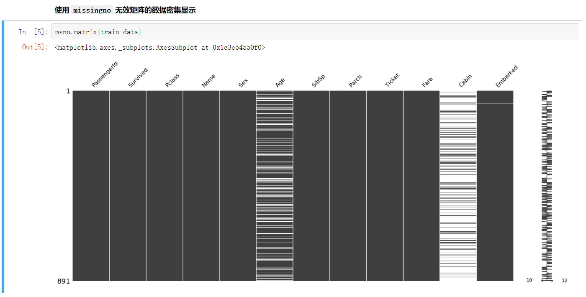
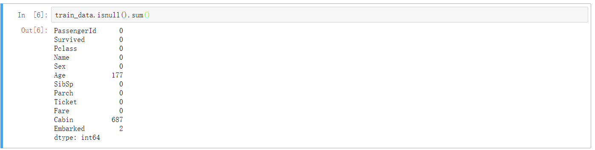
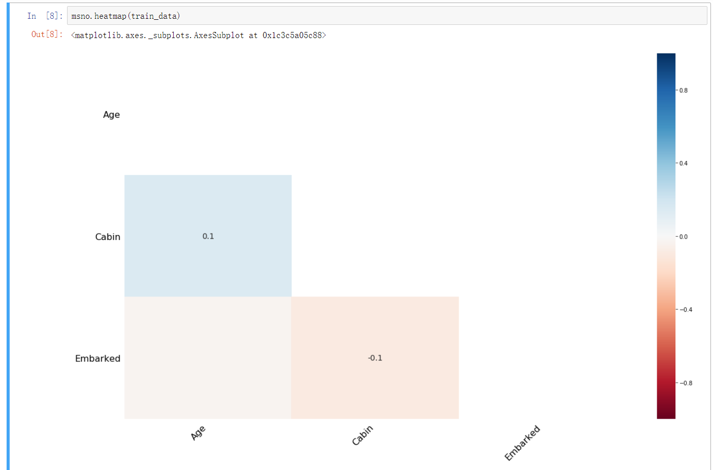

# missingno 

缺失值可视化处理库 `missingno` 

    import missingno as msno
    
## 一、无效矩阵的数据密集显示

可以看出 `Age`、`Cabin`和`Embarked` 存在和缺失值，并且 `Cabin` 缺失值很严重。

## 二、msno.bar 列无效的简单可视化

## 三、热力图相关性分析

用于分析一个变量的存在或不存在如何强烈影响的另一个的存在

从图中我们可以看出 `Cabin` 和 `Age` 的相关为 `0.1` ，意味着 `Cabin` 缺少会有 `10%` 的概率会造成 `Age` 的缺少。 

