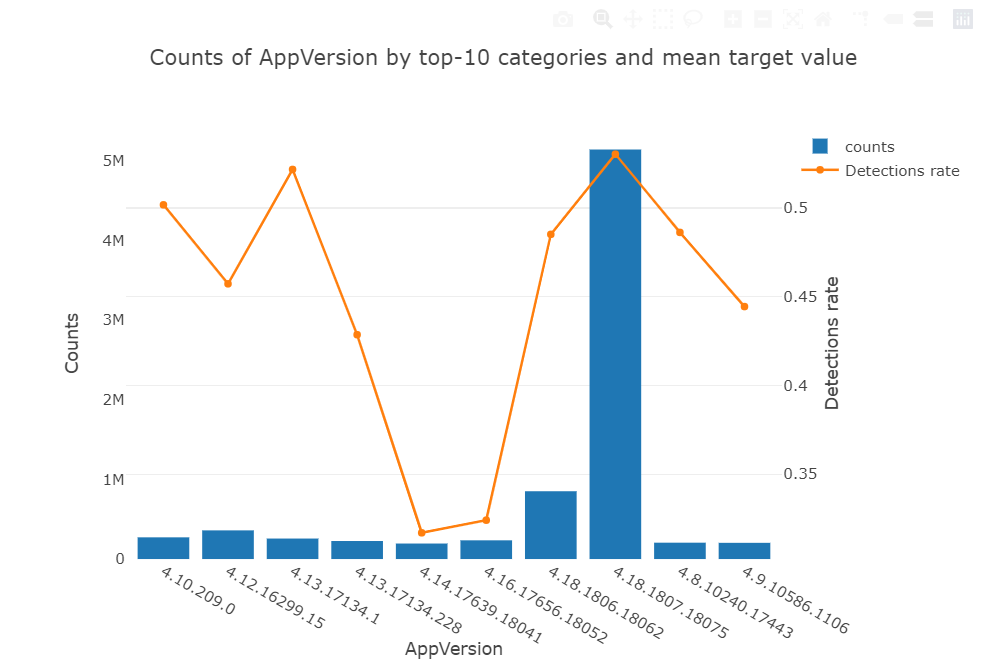
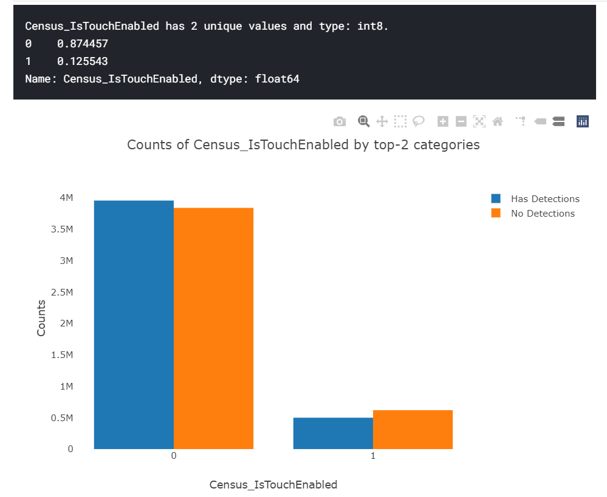
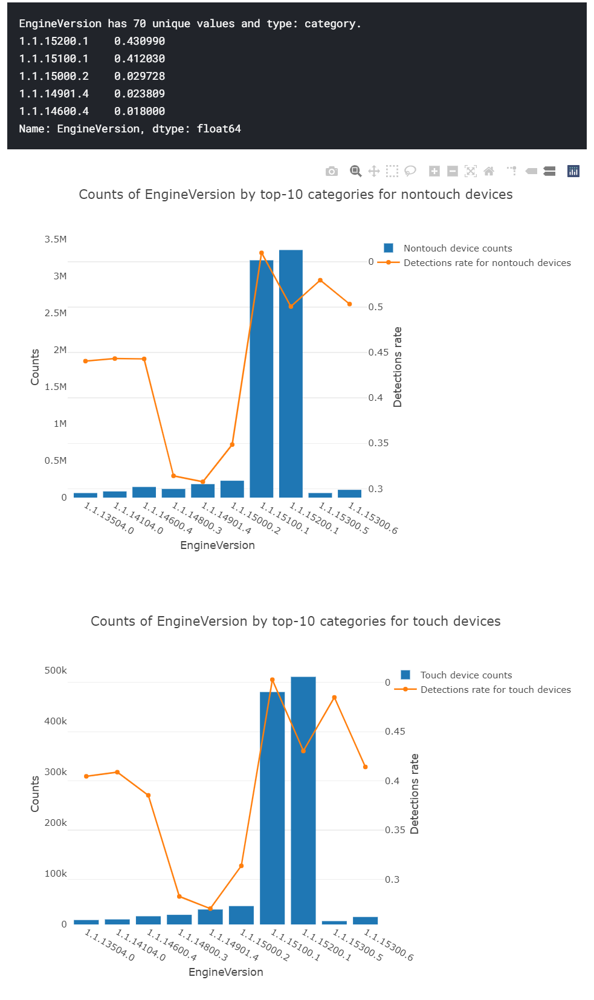
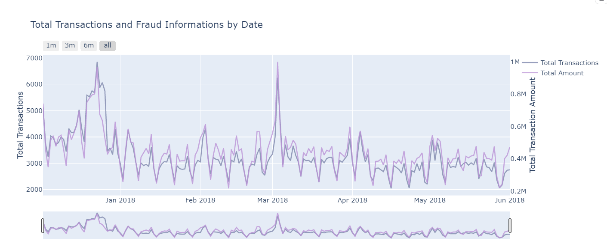

# Plotly绘图工具

plotly本身是基于javascript开发的，但是提供了大量与其他主流数据分析语言的API，比如Python， R， Matlab

## [kaggle 中无法正常显示 plotly 绘制的图像](https://www.kaggle.com/product-feedback/26898)

当你在Kaggle中建立了一个Notebook探索数据时候，经常需要用到一些可视化工具，例如Matplotlib, seaborn, plotly, pyecharts, altair等等。其中plotly可以绘制出美观的，交互性强的可视化图表，非常好用。

但是，如果你在 `notebook` 中使用了 `plotly` 相关的功能，会发现无法正常加载图形，只有一片空白（同样会发生在Pyecharts上）

`值得注意的是：`在 `Kaggle` 中，如果你是 `fork` 别人的 `notebook` ，有可能这个 `notebook` 的 `python` 版本是低版本的，可能使用不了 `plotly.express` ，此时你应该重新创建一个。

### 解决方案：

    from plotly.offline import download_plotlyjs, init_notebook_mode, plot, iplot
    init_notebook_mode(connected=True)    #THIS LINE IS MOST IMPORTANT AS THIS WILL DISPLAY PLOT ON 
    #NOTEBOOK WHILE KERNEL IS RUNNING

### 常用的包导入

    import plotly.offline as py     # 绘图的函数

    import plotly.graph_objs as go              # 可用于绘制不同图型，如 go.bar()
    import plotly.express as px                 # 可用于绘制不同图型，如 px.bar()
    import plotly.figure_factory as ff          # 用于构建特定复杂图表的辅助方法
    from plotly.subplots import make_subplots   # 创建子图

graph_objs 和 express 之间的关系相当于，matplotlib 和 seaborn，express的封装更高级些

## 二、图表类型

    Angularaxis：极坐标图表

    Area：区域图表

    Bar：条形图

    Box：盒形图，又称箱线图、盒子图、箱图

    Candlestick与OHLC：金融行业常用的K线图和OHLC曲线图

    ColorBar：彩条图

    Contour：轮廓图，又称等高线图

    Choropleth：等值线图

    Line：线形图

    Heatmap：热点图

    Histogram：直方图

    Histogram 2d：2D平面直方图

    Histogram 2d Contour：二维轮廓直方图

    Pie：饼图，又称扇形图

    Scatter：坐标分布图，包括散点图和线形图

## 三、线形图和散点图

### (一)、说明

1、__线形图__ 又称为 __曲线图__ ，是最常用的图形类型。与传统的绘图软件不同，Plotly没有独立的线形图函数，而是把线形图与散点图全部用Scatter函数实现；

2、__填充线形图__ 是线形图的一种衍生，除了显示本身的线条值，每个数据点还显示该节点的最大值和最小值，并对中间的范围进行颜色填充。绘制过程分两步：一部分是对三条可见线条进行绘制；另一部分是对三条填充线条进行绘制；

3、__面积图__ 也是线形图的一种衍生，使用Scatter函数进行绘制，不同之处在于面积图对于 fill 属性的设置，相当于在线形图的基础上对曲线与坐标轴之间的区域进行填充；

4、与 __基本面积图__ 的填充每条曲线不同，内部填充面积图，仅填充两条曲线交叉所形成的面积部分，同样通过设置 fill 属性来完成，只需在基本面积图的基础上，设置第一条曲线无填充效果，即 fill=None，再设置第二条曲线的填充效果为 fill= ‘tonexty’；

5、__堆积面积图__ 与 __层叠柱状图__ 类似，都展示了数据累加的效果，不同之处在于对数据的设置：堆积面积图需要的是累加数据，而层叠柱状图只需要每部分的真实数据即可。因此，在绘制层叠柱状图时需要设置stack模式，而绘制堆积面积图则不需要设置。本质上，堆积面积图的堆积效果是在同一个图形中绘制多个面积图来实现；

6、Plotly没有独立的 __气泡图__ 函数，实现方法与散点图的实现方法类似，修改散点图中的点的大小，就变成了气泡图；

__特别说明：__ Plotly绘图函数，无论是哪种类型的图表，绝大部分参数的用法和含义基本一致，本文着重介绍一下线性图和散点图的常用参数，其它图表主要补充独有的参数或常用参数，相同的参数不再重复介绍；

### (二)、data参数

*   connectgaps：布尔变量，用于连接缺失数据；

*   dx、dy：x、y坐标轴的步进值，默认值是1；

*   error_x、error_y：x、y出错信息；

*   fillcolor：填充指定区域的颜色；

*   fill：设置要填充纯色的区域，默认为none(不填充)，其它设置项如下：

        tozerox 和 tozeroy 分别表示填充曲线到x=0和y=0的区域；

        tonextx 和 tonexty 分别表示填充曲线到x和y方向上的前一条曲线之间的区域，如果前面没有曲线，则效果同tozerox 和 tozeroy；

        toself 表示将曲线的各端点连接成闭合的形状；

        tonext 表示将2条曲线各端点均连接成闭合的形状，前提是一条曲线包围另一条曲线；

*   hoverinfo：当用户与图表交互时，鼠标指针显示的参数，包括：x、y

*   z (坐标轴数据)、text(文字信息)、name(图形名称)等参数的组合，可以使用 +、all、none 和 skip作为组合连接符，默认是all(全部消失)；

*   hoveron：当用户与图表交互时，鼠标指针显示的模式，共有3种模式：points(点图)、fill(填充图)、points+fill(点图+填充图)；

*   ids：在动画图表中，数据点和图形key键的列表参数；

*   legendgroup：图例参数，默认是空字符串；

*   line：线条参数，包括线条宽度、颜色、格式等，有如下设置项：

        color：元组，元素为字符串颜色序列，设置对应图表节点的颜色；

        width：数值，设置线条宽度；

        dash：线条格式，包括：dash(虚短线)、dot(虚点)、dashdot(短线和点)；

        shape：进行数据点的插值设置，即根据已有的零散数据点，找到一条满足一定条件的曲线，使之经过全部的数据点。共有6种插值方式：’linear’、’spline’、’hv’、’vh’、’hvh’和’vhv。

*   marker：数据节点参数，包括大小、颜色、格式等，有如下设置项：

        size：列表，元素为相应节点的尺寸大小；

        sizeref：缩放的比例，如设置为2，则缩小为原来的1/2；

        sizemode：缩放的标准，默认以diameter(直径)缩放，也可选择以area(面积)缩放；

*   mode：图形格式，包括lines(线形图)、markers(散点图)、text(文本)。使用 + 或 none 等符号进行模式组合；

*   name：名称参数；

*   opacity：透明度参数，取值范围0～1，表示相应节点的透明度；

*   rsrc、xsrc、ysrc、tsrc、idssrc、textsrc、textpositionsrc：字符串源数组列表，作为Plotly网格标识符，用于设置特殊图表所需的r参数、x参数、y参数、t参数、ids参数、text(文本)参数、textposition(文本位置)参数等；

*   r、t：仅用于极坐标图，r用于设置径向坐标(半径)；t用于设置角坐标；

*   showlegend：布尔变量，默认True，设置显示图例名称。仅一条数据时，需要显式地声明才会显示图例；

*   showscale：布尔变量，设置是否显示颜色跟踪条，默认为False；

*   stream：数据流，用于实时显示数据图表；

*   textfont：文本字体参数，包括字体名称、颜色、大小等；

*   textposition：“文本”元素的位置参数，包括：top left(左上、top center(中上)、top right(右上)、middle left(左中)、middle center(中心)、middle right(右中)、bottom left(左下)、bottom center(中下)、bottom right(右下)模式，默认是middle center(中心)模式；

*   text：文本数据，元素为相应节点的悬浮文字内容；

*   type：数据显示模式，包括：constant(常数)、percent(百分比)、sqrt(平方根)、array(数组)模式；

*   x0、y0：坐标轴起点坐标；

*   xcalendar、ycalendar：坐标时间参数的格式，默认是公历；

*   x，y：设置x、y轴的坐标数据；

### (三)、layout参数

*   title：设置图表的标题，包括字体、颜色、位置等；

        text：字符串，标题内容；

        font：设置标题字体。包含：字体、颜色、大小等；

        x、y：取值0～1之间，设置在标准化坐标中位置，0.5为居中；

        xanchor：设置标题相对于x位置的水平对齐方式，有如下取值："auto" | "left" | "center" | "right" ；

        yanchor：设置标题相对于y位置的垂直对齐方式，有如下取值："auto" | "top" | "middle" | "bottom" ；

        pad：设置标题的填充。

*   legend：设置图例的字体、颜色、位置等，包括如下设置项：

        x、y：数值，表示图例在坐标内的位置；

        bordercolor：设置图例外边框颜色；

        borderwidth：设置图例外边框的线条宽度；

*   width：设置图表画布的宽度；

*   height：设置图表画布的高度；

*   paper_bgcolor：设置绘制图形的纸张颜色。默认值：”#fff” ；

*   plot_bgcolor：设置x轴和y轴之间的绘图区域的颜色。默认值：”#fff” ；

*   margin 设置 图表的页面边距。
    
        1) 主要的4个参数：l、r、t、b，分别对应：左右上下，除了上(t)默认值为100，其它默认值均为80；
        
        2) pad：设置绘图区域和轴线之间的填充量，默认值为0；3) autoexpand：布尔型，表示是否默认自动

*   xaxis、yaxis：设置x、y 坐标轴参数，包括如下设置项：

        title：设置坐标轴的标题，包括标题内容、字体、颜色、大小等；

        tickformat：设置刻度线标签格式，如：‘,’ 可以显示千分位标示；
                    ‘YYYY-MM-DD’可以将日期格式化为类似 2019-01-01；

        ticksuffix：设置刻度标签后缀字符串；

        tickprefix：设置刻度标签前缀字符串；

        showline：布尔值，确定是否显示坐标轴直线；

        zeroline : 布尔值，确定是否在该轴的0值处绘制垂直的直线；

        linecolor：坐标轴线的颜色；

        linewidth：坐标轴线的宽度；

        range：列表，设置坐标轴的取值范围；

        overlaying：设置相同的坐标轴id(双坐标)；

        rangemode：根据输入数据的极值计算范围。
                   默认为”normal”，取值为“tozero”`，则范围扩展为0，无论输入数据是否为“非负”，
                   无论输入数据如何，范围都是非负的。
                   目前笔者用到过的场景：双Y坐标轴时，实现Y轴的0刻度线对齐；

        side：设置坐标轴在绘图区域的位置，共4个取值：top、bottom(默认)、left、right；

        autotick：布尔变量，是否删除部分日期，False为保持原状；

        ticks：是否绘制刻度线，包括：outside(外部)、inside(内部)，默认为空(‘ ‘)，不显示刻度线；

        ticklen：设置刻度线长度，默认为5；

        tickwidth：设置刻度线宽度，默认为1；

        tickcolor：设置刻度线颜色，默认值：”#444″ ；

        tickfont：设置刻度线标签字体，包括字体、颜色、大小；

        nticks：设置坐标轴的最大刻度个数；

        showticklabels：布尔变量，默认为True，确定是否绘制刻度标签；

        showgrid：布尔值，确定是否绘制网格线。如果为“True”，则在每个刻度线处绘制网格线；

        gridcolor：设置网格线的颜色；

        gridwidth：设置网格线的宽度；

        rangeslider：设置滑动条，有如下设置项：

                1）bgcolor：设置滑动条的背景颜色，默认值："#fff" ；
                
                2）bordercolor：设置滑动条的边框颜色，默认值："#444" ；
                
                3）borderwidth：设置滑动条的边框宽度，默认无；
                
                4）autorange：布尔值，设置是否根据输入数据计算滑动条的范围。如果提供range，则autorange设置为“False”；
                
                5）range：列表，设置滑动条的范围。如果未设置，则默认为完整的x轴范围。
                如果轴type是“log”，则必须设置范围；
                如果轴type是“date”，则它应该是日期字符串或日期数据
                如果轴“type”是“ category”，它应该是数字或比例，其中每个类别按其出现的顺序从零开始分配序列号；
                Plotly对时间序列的支持比较友好，既支持字符串格式，又支持日期/时间格式；

                6）thickness：设置滑动条的高度，作为总绘图区域高度的一部分，默认值：0.15 ；
                
                7）visible：布尔值，默认为True，设置滑动条是否可见；
                
                8）y：设置滑动条的轴范围是否与主图中的值相同；

        rangeslider：设置范围选择按钮，有如下设置项：

                1）visible：设置范围选择按钮是否可见。特别说明：范围选择按钮仅适用于数据为date或设置“type”为“date”的x轴；

                2）buttons：设置按钮，有如下设置项：

                        a、 visible：布尔值，设置此按钮是否可见，默认为True；

                        b、 step：设置按钮的时间单位，默认为"month" ，
                        包括如下取值："month" | "year" | "day" | "hour" | "minute" | "second" | "all" ；

                        c、 count：数值，默认为1，用于设置按钮时间单位的数量，与step一起使用，指定该按钮的时间筛选范围；

                        d、 stepmode：设置时间范围的更新模式，默认为"backward"，按则开始位置为“计数”乘以“步”，
                        若设置为"todate" ，则开始位置返回当年的开始日期；

                        e、 label：设置按钮上显示的文本内容；

                3）x、y：取值0～1之间，设置在标准化坐标中位置，0.5为居中；

                4）xanchor：设置标题相对于x位置的水平对齐方式，有如下取值："auto" | "left" | "center" | "right" ；

                5）yanchor：设置标题相对于y位置的垂直对齐方式，有如下取值："auto" | "top" | "middle" | "bottom" ；

                6）font：设置标题字体。包含：字体、颜色、大小等；

                7）bgcolor：设置范围选择按钮的背景颜色，默认值："#eee" ；

                8）bordercolor：设置范围选择按钮的边框颜色，默认值："#444" ；

                9）borderwidth：设置范围选择按钮的边框宽度，默认无；

## 三、柱状图和水平条形图

### (一)、说明

Plotly绘制基本柱状图的重要函数是graph_objs中的Bar函数，通过传递数据，可以设置柱状图的样式；

除基本柱状图外，还有柱状簇，在基本柱状图的基础上加入多组数据即可实现柱状簇；

层叠柱状图的绘制与柱状簇图的绘制大同小异，相当于对同一簇的柱状图进行叠加，实现的方式是对Layout中的barmode属性，设置barmode=’stack’，其余参数与柱状簇图相同；

瀑布式柱状图是层叠柱状图的一种衍生，通过选择性地显示层叠部分来实现柱状图的悬浮效果；

绘制水平条形图与绘制柱状图唯一的区别：在 Bar 函数中设置orientation=’h’，其余参数与柱状图相同，也可以通过设置barmode = ‘stack’绘制层叠水平条形图与瀑布式水平条形图；

### (二)、data参数

*   base：柱状图的起始参数；

*   insidetextfont：内置文本的字体格式参数；

*   outsidetextfont：外置文本的字体参数；

*   offset：坐标位移参数；

*   orientation：图形显示方向参数，包括：v (垂直模式)和 h(水平模式)；

*   visible：布尔变量，切换图形显示开关；

*   width：列表，设置柱状图的条形宽度；

### (三)、layout参数

*   armode : 设置相同坐标的条形图位置。包括 : stack(叠加)、group(并列)、overlay(覆盖)、relative(相对)；

*   bargroupgap : 设置相同位置条形图之间的间隙，范围：0-1；

*   bargap : 设置相邻位置条形图之间的间隙，范围：0-1；

*   orientation：图形显示方向参数，包括：v (垂直模式)和 h(水平模式)；

*   traceorder：设置图例显示顺序， 包括："reversed"，"grouped"，"reversed+grouped"，"normal"

*   xaxis、yaxis：设置x、y 坐标轴参数，特别说明如下设置项：

        domain：2个0～1之间的元素组成的列表，设置图表占画布的坐标轴范围；

        dtick：设置坐标轴刻度的间隔区间；

*   annotations：设置数据注释，主要包括如下设置项：

        xref、yref：设置文本样式；

        x、y：设置文本位置；

        text：设置文本内容；

        font：设置文本的格式，包括字体、大小、颜色等；

        showarrow：布尔值，是否添加从标签到数据点的箭头；

### (四)、fig.tool.make_subplots参数

*   rows：设置图表的子图表行数；
*   cols：设置图表的子图表列数；
*   print_grid：是否打印子图表的坐标；
*   shared_xaxes：布尔值，子图表是否共享同一个横坐标轴；
*   shared_yaxes：布尔值，子图表是否共享同一个纵坐标轴。

## 四、直方图

### (一)、说明

绘制直方图使用graph_objs包中的Histogram()函数。将数据赋值给x变量，即x = data，即可绘制基础直方图；若将数据赋值给y变量，则绘制水平直方图；

在 Layout中，设置 barmode = ‘overlay’时，为重叠直方图(左右方向交叠)；设置 barmode = ‘stack’时，为层叠直方图(上下方向交叠)；

累积直方图是直方图的累积形式，即第n+1个区间的展示数目是第n-1个区间的展示数目与第 n 个区间中实际样本数目之和。通过设置cumulative=dict(enabled=True)来实现；

使用plotly.figure_factory 包中的 distplot()函数，可以进行直方图和核函数估计的融合可视化，只需要将数据传递给distplot函数，即可完成相应的绘图。常用于服从柯西分布、泊松分布、Gamma分布或指数分布的数据可视化；

### (二)、data参数

*   histnorm：设置纵坐标显示格式。有如下设置项：

        为空(“”)时表示：纵坐标显示落入区间的样本数目，所有矩形的高相加为总样本数量；

        为percent 时表示：纵坐标显示落入区间的样本占总体样本的百分比，所有矩形的高相加为100%；

        为probability时表示：纵坐标显示落入区间的样本频率；

        为 density 时表示：每个小矩形的面积为落入区间的样本数量，所有面积值相加为样本总数；

        为 probability density时表示：每个小矩形的面积为落入区间的样本占总体的比例，所有面积值相加为1；

*   histfunc：指定分组函数，可选参数有：count、sum、avg、min、max，依次安照落入区间的样本，进行计数、求和、求均值、求最小值和最大值；

*   orientation：设置图形的方向，有v和h两个可选参数，v表示垂直显示，h表示水平显示；

*   cumulative：累积直方图参数，有如下设置项：

        enabled：布尔型，设置为True会显示累积直方图，设置为False则不对频率或频数进行累积；

        direction用于设置累积方向，确定频率是从1～0(降序)，还是从0～1(升序)；
        
        currentbin有三个选项，即include、exclude、half，为了防止偏差，一般选择half；

*   autobinx：布尔型，是否自动划分区间；

*   nbinsx：整型，最大显示区间数目；

*   xbins：设置划分区间。start设置起始坐标，end设置终止坐标，size设置区间长度。

*   barmode：设置图表的堆叠方式。为overlay时表示重叠直方图；为stack表示层叠直方图；

##五、饼图

### (一)、说明

使用graph_objs中的 Pie() 函数绘制饼图。其中，最常用的两个属性：values 设置可视化的数据、labels 设置不同数据对应的标签；

绘制环形饼图，只需在 Pie() 函数中，通过属性 hole 设置控制环形中心的空白大小即可实现；

### (二)、data参数

*   values：每个扇区的数值大小；

*   labels：列表，饼图中每一个扇区的文本标签；

*   hole：设置环形饼图空白内径的半径，取值0～1。默认值为0，参数是与外径的比值；

*   hoverinfo：当用户与图表交互时，鼠标指针显示的参数，包括如下任何组合："label"、"text"、"value"、"percent"，"name"、"all"、"none"或"skip"，组合时用"+"拼接，默认为"all" 。若设置了“none”或“skip”，则鼠标悬停时不会显示任何信息。但是，如果是设置了“none”，则仍会触发单击和悬停事件；

*   pull：列表，元素为0～1之间的数值，默认为0，用于设置各个扇区突出显示的本例

*   sort：布尔变量，是否进行扇区排序；

*   rotation：扇区旋转角度，范围是0～360，默认值为0，即12点位置；

*   direction：设置饼图方向。clockwise表示：顺时针、counterclockwise(默认)表示：逆时针；

*   domain：设置饼图的位置，适用于多个并列饼图时；

*   name：多个并列子饼图时，设置子饼图的名称；

*   type：声明图表类型，设置为pie；

*   pullsrc：各个扇区比例数组列表；

*   dlabel：设置饼图图标的步进值，默认值为1；

*   label0：设置一组扇区图标的起点数字，默认值为0

## 六、表格

### (一)、说明

Plotly支持绘制表格图表，而且绘图效果非常美观；

在Plotly中，有2种方式可以绘制表格：Table()函数 和 create_table()函数；

### (二)、Table()函数

*   header：表格的表头，包括如下设置项：

        values：列表，表头的文本内容；

        format：设置单元格值格式规则，类似坐标轴的格式化参数tickformat；

        prefix：单元格值的前缀；

        suffix：单元格值的后缀；

        height：单元格的高度，默认值为28；

        align：字符串、字符串组成的列表，设置框内“文本”的水平对齐方式，
               包括："left" | "center" | "right" ，默认为center；

        line：设置边框的宽度和颜色，包括2个子参数：width和color；

        fill：设置单元格填充颜色，默认为white，它接受特定颜色或颜色数组或2D颜色数组。
              常用的颜色：darkslategray、lightskyblue、lightcyan、paleturquoise、
              lavender、royalblue、paleturquoise、white、grey、lightgrey；

        font：设置表头的文字格式，包括字体、大小、颜色；
    
*   cells：表格内容的单元格值，设置项与 header的参数基本一致；

### (三)、create_table()函数

*   table_text：表格数据，通常是一个DataFrame格式数据；

*   index：布尔型，默认False，设置是否显示索引列；

*   index_title：字符串，默认为空，当index=True时，设置索引列的列名；

*   colorscale：列表，设置背景填充颜色，默认为[[0, '#66b2ff'], [.5, '#d9d9d9'], [1, '#ffffff']]。第一个元素为0的子列表，用于设置第一行(表头)和有索引时的第一列的背景填充颜色；第一个元素为0.5的子列表，用于设置表格内容中奇数行的背景填充颜色；第一个元素为1的子列表，用于设置表格内容中偶数行的背景填充颜色；
    
*   font_colors：单个或多个元素组成的列表，设置字体颜色，默认为['#000000']。三个元素时，分别设置表头、奇数行、偶数行的字体颜色；也可以为每行设置不同的字体颜色；

## 七、多子图

### (一)、说明

绘制多子图时，有2种方法，推荐使用subplots.make_subplots()方法，通过遍历数据的列名，实现将指定的列数据设置为指定位置的子图表；

特别地，当绘制多个子饼图时，不支持上述方法，可以在go.Pie()中设置参数domain，为不同的饼图指定相应的位置。当然，其它类型的图表在绘制多子图时也可以使用该方法；

### (二)、subplots.make_subplots()

*   rows：设置图表的子图表行数；

*   cols：设置图表的子图表列数；

*   print_grid：是否打印子图表的坐标；

*   subplot_titles：设置各个子图表的标题；

*   shared_xaxes：子图表是否共享同一个横坐标轴

        True或'columns'：表示在同一列中的子图之间共享轴；

        'rows'：表示在同一行的子图中共享轴；

        'all'：表示在网格中的所有子图上共享轴；

*   shared_yaxes：子图表是否共享同一个纵坐标轴

        'columns'：表示在同一列的子图中共享轴；

        True或'rows'：表示在同一行的子图中共享轴；
        
        'all'：表示在网格中的所有子图上共享轴；

*   specs：分配子图的区间，比较常用的参数；

*   column_width或column_widths：0～1之间数字组成的列表，设置各个子图的宽度；

*   row_height或row_heights：0～1之间数字组成的列表，设置各个子图的高度；

## 八、Plotly对象概览

### (一)、2D平面绘图对象

*   Angularaxis：极坐标图表

*   Area：区域图

*   Bar：条形图

*   Box：盒形图，又称箱线图、盒子图、箱图

*   Candlestick与OHLC：金融股票行业常用的K线图与OHLC曲线图

*   ColorBar：彩条图

*   Contour：轮廓图(等高线图)

*   Choropleth：等值线图

*   Line：曲线图

*   Heatmap：热点图

*   Histogram：直方图

*   Histogram 2d：2D平面直方图

*   Histogram 2d Contour：二维轮廓直方图

*   Pie：饼图

*   Scatter：坐标分布图(包括线形图、散点图)

### (二)、3D平面绘图对象

*   Scatter3D：3D立体散点图(包括线形图)

*   Surface：表面图

*   Mesh3D：3D立体网格图

*   Pointcloud：点云图

### (三)、Maps地图

*   ScatterGeo：基于GEO地图模式的散点图(包括线形图)

*   Choropleth：立体等值线图

*   Scattermapbox：基于地图的散点图

### (四)、WebGL格式图形

*   ScatterGL、WebGL格式散点图(包括线形图)

### (五)、图表辅助工具

*   Axis：坐标工具，包括2D/3D平面坐标、立体坐标、极坐标(AngularAxis)

*   Annotation：图表注释工具

*   Error：误差调整工具，包括x、y、z三种坐标的误差修正

*   Figure：图形整合工具

*   Font：字体工具

*   Legend：图例工具

*   Layout：图表布局函数

*   Margin：图表边缘间距工具

*   Marker：标记工具

*   RadialAxis：纵横比调整工具

*   Array：数据坐标列表

*   Data：图表数据整合工具

*   Stream：实时图表数据流工具

*   Scene：场景工具

*   Scatterternary：散点三元图

*   XBins、YBins：x轴、y轴辅助参数

### (六)、Layout布局函数

Layout画面布局函数主要用于设置图形外观，比如标题、横纵坐标轴、图例、图形外边距等属性，这些属性包括字体、颜色、尺寸等

Layout画面布局函数功能强大，看起来很复杂，其实只要掌握了相关的参数，设置很简单，都是字典模式。可以使用help命令，查看Layout函数的参数与属性

*   angularaxis：角轴

*   annotations：注释

*   autosize：自动调整大小

*   bargap：条形图柱间距

*   bargroupgap：条形图柱组间距

*   barmode：条形图模式

*   barnorm：条形图参数

*   boxgap：盒子图间距

*   boxgroupgap：盒子组间距

*   boxmode：箱型图模式；

*   calendar：日历

*   direction：方向

*   dragmode：图形拖动模式

*   font：字体

*   geo：地理参数

*   height：高度

*   hiddenlabels：隐藏图标

*   hiddenlabelssrc：隐藏图标参数数组列表

*   hidesources：隐藏数据源

*   hovermode：鼠标指针悬停模式

*   images：图像

*   legend：图标

*   mapbox：地图模式

*   margin：图表边缘间距

*   orientation：方向

*   paper_bgcolor：地图背景颜色

*   plot_bgcolor：图形背景颜色

*   radialaxis：纵横比

*   scene：场景

*   separators：分离参数

*   shapes：形状

*   showlegend：图例显示

*   sliders：滑块

*   smith：smith参数

*   ternary：三元参数

*   title：标题

*   titlefont：标题字体

*   updatemenus：菜单更新

*   width：宽度

*   xaxis、yaxis：分别表示x轴、y轴

### (七)、Annotation注释函数

该函数用于为图形整体和数据节点添加注解文本；

*   align：对齐方式

*   arrowcolor：箭头颜色

*   arrowhead：箭头模式，共有9种模式

*   arrowsize：箭头大小

*   arrowwidth：箭头宽度

*   ax：x轴坐标参数

*   axref：x轴坐标辅助参数

*   ay：y轴坐标参数

*   ayref：y轴坐标辅助参数

*   bgcolor：背景颜色

*   bordercolor：边框颜色

*   borderpad：边框排列方式

*   borderwidth：边框宽度

*   font：字体

*   opacity：透明度

*   ref：辅助参数

*   showarrow：显示箭头开关

*   text：文本

*   textangle：文本角度

*   visible：注解显示开关

*   x、y：x、y坐标轴

*   xanchor、yanchor：x轴坐标锚点、y轴坐标锚点

*   xref、yref：x轴坐标参考参数、y轴坐标参考参数。如果参考参数等于“paper”(画纸模式)，则注释文字的x、y坐标分别以画纸左下角(0, 0)为原点、以右上角(1, 1)为坐标最大值，x、y采用小数形式；如果参考参数等于“x”、“y”，则表示使用x、y数据数组的坐标参数作为注释字符串的坐标

### (八)、Axis坐标轴参数
Plotly绘图模块库中，设置坐标的参数有：xaxis(x轴参数)、yaxis(y轴参数)、zaxis(z轴参数)

*   anchor：锚点

*   autorange：自动范围

*   autotick：自动刻度

*   backgroundcolor：背景颜色

*   calendar：日历模式

*   categoryarray：分类数据参数

*   categoryarraysrc：分类数据参数源

*   categoryorder：分类数据模式

*   color：颜色

*   domain：子图表的范围

*   dtick：分类数据坐标刻度步进值

*   exponentformat：指数格式

*   fixedrange：固定范围

*   gridcolor：网格线颜色

*   gridwidth：网格线宽度

*   hoverformat：鼠标指针悬停格式

*   linecolor：线条颜色

*   linewidth：线宽

*   mirror：镜像模式，包括true、ticks、false、all、allticks等属性

*   nticks：刻度之间的间隔数

*   overlaying，图层重叠

*   position：位置

*   range：坐标轴取值范围

*   rangemode：范围模式

*   rangeselector：范围选择

*   rangeslider：范围滑块

*   separatethousands：千分位分隔

*   showaxeslabels：显示x轴图标开关

*   showbackground：显示背景开关

*   showexponent：显示指数开关

*   showgrid：显示网格开关

*   showline：显示线条开关

*   showspikes：显示异常开关

*   showticklabels：显示刻度数据数组列表

*   showtickprefix：显示刻度前缀数据数组列表

*   showticksuffix，显示刻度后缀数据数组列表

*   side：边缘参数

*   spikecolor：峰值数据颜色

*   spikesides：峰值数据滑块

*   spikethickness：峰值数据厚度

*   tick0：刻度数据锚点

*   tickangle：刻度数据角度

*   tickcolor：刻度数据颜色

*   tickfont：刻度数据字体

*   tickformat：刻度数据格式化

*   ticklen：刻度数据长度

*   tickmode：刻度数据模式

*   tickprefix：刻度数据前缀

*   ticks：刻度数据显示模式，包括 outside(刻度外)、inside(刻度内)、” “(无刻度)

*   ticksuffix：刻度数据后缀

*   ticktext：刻度数据文本

*   ticktextsrc：刻度数据文本数组列表

*   tickvals：刻度数据参数值数组列表

*   tickvalssrc：刻度数据参数值数据源数组列表

*   tickwidth：刻度数据宽度

*   title：标题

*   titlefont：标题字体

*   type：类型

*   zeroline：零线参数

*   zerolinecolor：零线颜色

*   zerolinewidth：零线宽度

### 参考来源

-《[可视化神器Plotly(5)](https://www.jianshu.com/p/4f4daf47cc85)》

# 常用的绘图模板

## 参考链接：

* https://www.kaggle.com/kabure/exploring-the-consumer-patterns-ml-pipeline

* https://www.kaggle.com/kabure/predicting-credit-risk-model-pipeline

## `一、分类数据`

### `unique 数据绘图`

根据目标值来查看不同特征下的 unique 数据：

        plt.figure(figsize=(38, 8))
        v_features = list(train_transaction.columns[320:390])
        uniques = [len(train_transaction[col].unique()) for col in v_features]
        sns.set(font_scale=1.2)
        ax = sns.barplot(v_features, uniques, log=True)
        ax.set(xlabel='Feature', ylabel='log(unique count)', title='Number of unique values per feature')
        for p, uniq in zip(ax.patches, uniques):
        height = p.get_height()
        ax.text(p.get_x()+p.get_width()/2.,
                height + 10,
                uniq,
                ha="center") 

### `二分类绘图模板：`

train 为 pd 读取后的数据

`1、`绘制 `某特征值(col)` 下 `目标值` 的计数(count) 情况

`2、`绘制 `某特征值(col)` 的计数(count) 和 `目标值为 1 的计数(count) 占比`

`3、`自定义分类，`先按照指定特征进行划分数据`，对划分后的数据绘制 `某特征(col)` 的计数(count) 和 `目标值为1的计数(count)占比`

    # function to plot data
    # https://www.kaggle.com/artgor/is-this-malware-eda-fe-and-lgb-updated

    # 绘图模板：其中 HasDetections 为是否遭受攻击的二分类值，Census_IsTouchEnabled 为是设备否支持触屏功能

    def plot_categorical_feature(col, only_bars=False, top_n=10, by_touch=False):
        '''
        
        only_bars: 如果为 True 则只绘制 柱状图，默认绘制 柱状图 + 折线图。
                指定为 True 时用于绘制 目标值(HasDetections) 下 某特征(col) 的计数(count)情况。
                默认时，用于绘制 某特征(col) 的计数(count) 和 特征下(col) 某个值中，目标值为1的占比(HasDetections) 适合用于二分类(因为按照均值计算)。
                        
        top_n：默认获取某特征的前 10 个出现次数最多的值。
        
        by_touch：自定义是否为触屏软件，该例子引入了一个新的特征进行分类，对分后的数据进行绘图探索。
                当为 True 时，会先按照 是否为触屏软件(Census_IsTouchEnabled) 进行划分数据，然后根据划分后的数据 绘制 某特征(col) 和 目标值(HasDetections) 的关系图 
                
        '''
        top_n = top_n if train[col].nunique() > top_n else train[col].nunique()
        print(f"{col} has {train[col].nunique()} unique values and type: {train[col].dtype}.")
        print(train[col].value_counts(normalize=True, dropna=False).head())
        
        if not by_touch:
                # 默认执行
                if not only_bars:
                # 因为是 HasDetections 是二分类，那么按照 col 划分数据之后，进行agg操作，可以得到特征下不同值的 count 和 mean (也就是 1 占其中的比例 (0 的数量 + 1的数量/2)) 
                df = train.groupby([col]).agg({'HasDetections': ['count', 'mean']})
                df = df.sort_values(('HasDetections', 'count'), ascending=False).head(top_n).sort_index()
                data = [go.Bar(x=df.index, y=df['HasDetections']['count'].values, name='counts'),
                        go.Scatter(x=df.index, y=df['HasDetections']['mean'], name='Detections rate', yaxis='y2')]

                layout = go.Layout(dict(title = f"Counts of {col} by top-{top_n} categories and mean target value",
                                        xaxis = dict(title = f'{col}',
                                                showgrid=False,
                                                zeroline=False,
                                                showline=False,),
                                        yaxis = dict(title = 'Counts',
                                                showgrid=False,
                                                zeroline=False,
                                                showline=False,),
                                        yaxis2=dict(title='Detections rate', overlaying='y', side='right')),
                                legend=dict(orientation="v"))
                # 如果 only_bars 为 True
                else:
                top_cat = list(train[col].value_counts(dropna=False).index[:top_n])
                df0 = train.loc[(train[col].isin(top_cat)) & (train['HasDetections'] == 1), col].value_counts().head(10).sort_index()
                df1 = train.loc[(train[col].isin(top_cat)) & (train['HasDetections'] == 0), col].value_counts().head(10).sort_index()
                data = [go.Bar(x=df0.index, y=df0.values, name='Has Detections'),
                        go.Bar(x=df1.index, y=df1.values, name='No Detections')]

                layout = go.Layout(dict(title = f"Counts of {col} by top-{top_n} categories",
                                        xaxis = dict(title = f'{col}',
                                                showgrid=False,
                                                zeroline=False,
                                                showline=False,),
                                        yaxis = dict(title = 'Counts',
                                                showgrid=False,
                                                zeroline=False,
                                                showline=False,),
                                        ),
                                legend=dict(orientation="v"), barmode='group')
                
                py.iplot(dict(data=data, layout=layout))
                
        # 如果 by_touch 为 True
        else:
                top_n = 10
                top_cat = list(train[col].value_counts(dropna=False).index[:top_n])
                df = train.loc[train[col].isin(top_cat)]

                df1 = train.loc[train['Census_IsTouchEnabled'] == 1] # 支持触屏
                df0 = train.loc[train['Census_IsTouchEnabled'] == 0] # 不支持触屏

                df0_ = df0.groupby([col]).agg({'HasDetections': ['count', 'mean']})
                df0_ = df0_.sort_values(('HasDetections', 'count'), ascending=False).head(top_n).sort_index()
                df1_ = df1.groupby([col]).agg({'HasDetections': ['count', 'mean']})
                df1_ = df1_.sort_values(('HasDetections', 'count'), ascending=False).head(top_n).sort_index()
                data1 = [go.Bar(x=df0_.index, y=df0_['HasDetections']['count'].values, name='Nontouch device counts'),
                        go.Scatter(x=df0_.index, y=df0_['HasDetections']['mean'], name='Detections rate for nontouch devices', yaxis='y2')]
                data2 = [go.Bar(x=df1_.index, y=df1_['HasDetections']['count'].values, name='Touch device counts'),
                        go.Scatter(x=df1_.index, y=df1_['HasDetections']['mean'], name='Detections rate for touch devices', yaxis='y2')]

                layout = go.Layout(dict(title = f"Counts of {col} by top-{top_n} categories for nontouch devices",
                                xaxis = dict(title = f'{col}',
                                                showgrid=False,
                                                zeroline=False,
                                                showline=False,
                                                type='category'),
                                yaxis = dict(title = 'Counts',
                                                showgrid=False,
                                                zeroline=False,
                                                showline=False,),
                                        yaxis2=dict(title='Detections rate', overlaying='y', side='right'),
                                ),
                        legend=dict(orientation="v"), barmode='group')

                py.iplot(dict(data=data1, layout=layout))
                layout['title'] = f"Counts of {col} by top-{top_n} categories for touch devices"
                py.iplot(dict(data=data2, layout=layout))

`效果展示：`

`情况 1：` 
        
    plot_categorical_feature('AppVersion')

`情况 2：` 
        
    plot_categorical_feature('Census_IsTouchEnabled', only_bars=True)

`情况 3：` 
        
    plot_categorical_feature('EngineVersion', by_touch=True)

## `二、连续性数据`

查看数据的分布情况：

        fig, ax = plt.subplots(1, 2, figsize=(18,4))

        time_val = train_transaction['TransactionAmt'].values

        sns.distplot(time_val, ax=ax[0], color='r')
        ax[0].set_title('Distribution of TransactionAmt', fontsize=14)
        ax[1].set_xlim([min(time_val), max(time_val)])

        sns.distplot(np.log(time_val), ax=ax[1], color='b')
        ax[1].set_title('Distribution of LOG TransactionAmt', fontsize=14)
        ax[1].set_xlim([min(np.log(time_val)), max(np.log(time_val))])

        plt.show()

查看目标值为 0 和 1 的数据，对数化之后，各自的分布情况：

        fig, ax = plt.subplots(1, 2, figsize=(18,4))

        time_val = train_transaction.loc[train_transaction['isFraud'] == 1]['TransactionAmt'].values

        sns.distplot(np.log(time_val), ax=ax[0], color='r')
        ax[0].set_title('Distribution of LOG TransactionAmt, isFraud=1', fontsize=14)
        ax[1].set_xlim([min(np.log(time_val)), max(np.log(time_val))])

        time_val = train_transaction.loc[train_transaction['isFraud'] == 0]['TransactionAmt'].values

        sns.distplot(np.log(time_val), ax=ax[1], color='b')
        ax[1].set_title('Distribution of LOG TransactionAmt, isFraud=0', fontsize=14)
        ax[1].set_xlim([min(np.log(time_val)), max(np.log(time_val))])

plt.show()

## `EXTEND、时间数据`

绘制某一特征随着时间的变化曲线：

`案例：` 绘制每日 (一个月 1~31天)下，不同 TransactionAmt 的计数变化，和 TransactionAmt 总金额的变化

        # Calling the function to transform the date column in datetime pandas object

        # 设置一些静态颜色选项
        color_op = ['#5527A0', '#BB93D7', '#834CF7', '#6C941E', '#93EAEA', '#7425FF', '#F2098A', '#7E87AC', 
                '#EBE36F', '#7FD394', '#49C35D', '#3058EE', '#44FDCF', '#A38F85', '#C4CEE0', '#B63A05', 
                '#4856BF', '#F0DB1B', '#9FDBD9', '#B123AC']

        # 将列重命名为适当的名称,统计 TransactionAmt(以美元为单位的交易支付金额) 特征下面不同数值的个数
        dates_temp = df_trans.groupby(df_trans.Date.dt.date)['TransactionAmt'].count().reset_index()
        

        # 使用第一个必要的 trace 参数，opacity 表示透明度
        trace = go.Scatter(x=dates_temp['Date'], y=dates_temp.TransactionAmt,
                        opacity = 0.8, line = dict(color = color_op[7]), name= 'Total Transactions')

        # 下面我们将得到销售总额 (具体案例具体分析)
        dates_temp_sum = df_trans.groupby(df_trans.Date.dt.date)['TransactionAmt'].sum().reset_index()

        # 使用新的 dates_temp_sum ，我们将创建第二个 trace 
        trace1 = go.Scatter(x=dates_temp_sum.Date, line = dict(color = color_op[1]), name="Total Amount",
                                y=dates_temp_sum['TransactionAmt'], opacity = 0.8, yaxis='y2')

        # 创建布局将允许我们给出标题和给我们一些有趣的选项来处理图的输出
        layout = dict(
                title= "Total Transactions and Fraud Informations by Date",
                xaxis=dict(
                        rangeselector=dict(
                        buttons=list([
                                dict(count=1, label='1m', step='month', stepmode='backward'),
                                dict(count=3, label='3m', step='month', stepmode='backward'),
                                dict(count=6, label='6m', step='month', stepmode='backward'),
                                dict(step='all')
                        ])
                        ),
                        rangeslider=dict(visible = True), # 控制最下面的图
                        type='date' ),
                yaxis=dict(title='Total Transactions'), # 左侧的y轴
                yaxis2=dict(overlaying='y',             # 右侧的y轴 side ='right'
                                anchor='x', side='right',
                                zeroline=False, showgrid=False,
                                title='Total Transaction Amount')
                )

        # 创建既有 trace 又有 layout 的图形
        fig = dict(data= [trace, trace1,], layout=layout)

        #绘制图形
        iplot(fig) #it's an equivalent to plt.show()

`效果展示：`

## 饼状图

绘制不同特征下，

    def PieChart(df_colum, title, limit=15):
        """
        此功能有助于按类别调查访问比例和交易收入总额
        """
        
        # 默认获取传入的 df_colum 列中，计数排名最靠前的15个不同值
        count_trace = df_train[df_colum].value_counts()[:limit].to_frame().reset_index()
        # 按照 传入的 df_colum 查看 df_colum 特征中不同值下，收入的多少，nlargest 获取前10个排名
        rev_trace = df_train.groupby(df_colum)["totals.transactionRevenue"].sum().nlargest(10).to_frame().reset_index()

        # df_colum 中，不同值的出现 count 计数占 所有计数数据中的比例
        trace1 = go.Pie(labels=count_trace['index'], values=count_trace[df_colum], name= "% Acesses", hole= .5, 
                        hoverinfo="label+percent+name", showlegend=True,domain= {'x': [0, .48]}, 
                        marker=dict(colors=color))

        # df_colum 中，不同值占收入的比例
        trace2 = go.Pie(labels=rev_trace[df_colum], 
                        values=rev_trace['totals.transactionRevenue'], name="% Revenue", hole= .5, 
                        hoverinfo="label+percent+name", showlegend=False, domain= {'x': [.52, 1]})

        layout = dict(title= title, height=450, font=dict(size=15),
                        # Add annotations in the center of the donut pies.
                        annotations = [
                        dict(
                                x=.25, y=.5,
                                text='Visits', 
                                showarrow=False,
                                font=dict(size=20)
                        ),
                        dict(
                                x=.80, y=.5,
                                text='Revenue', 
                                showarrow=False,
                                font=dict(size=20)
                        )
                ])

        fig = dict(data=[trace1, trace2], layout=layout)
        iplot(fig)

调用：
    
    PieChart("device.deviceCategory", "Device Category")

展示：

