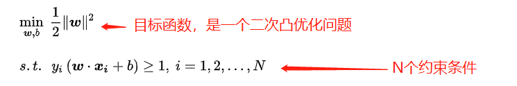
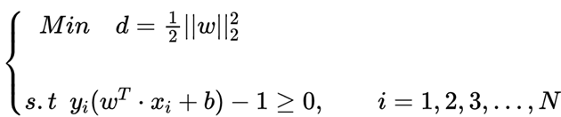
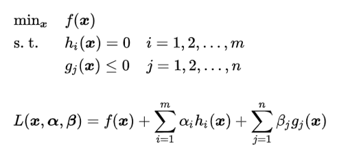
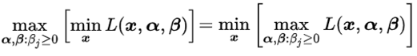

# SVM支持向量机 

`SVM 是一种二分类模型，他的基本模型是定义在特征空间上的最大间隔的线性分类器`

## `支持向量机：`
    
在一个很高维的场景中，我们很难将其可视化，在一个二维的图像上我们可以通过两个直角坐标系就可以分割出不同类别，在三维上我们可以通过平面切分不同的类别，在更高维的情况下我们很难再去切分，尤其是当这个特征本身(线性代数中的基)，如果找不到基是很难去切分这个特征的，SVM可以帮助我们去做一些基的变换，让你很好的找到一个特征空间，特征空间中的值就比较好去做切分

在一个input space(如一个平面图中)中我们很难去发现数据的规律，他可能是一个很复杂的函数，还可能存在过拟合的风险才能将两类数据分隔开，这个时候我们做一个特征变换，将其放在某一个特征空间Feature space之后，我们可以发现两个数据分割很开(我们可以通过一个很简单的平面将两类数据分割)，这样函数的复杂度也大大下降，这只是一个二分类的问题，当我们数据类型很多时SVM的效果也会更加大。

## `SVM工作原理`

在一个二维平面中，如果我们想要将蓝球和红球进行分割，我们可以使用下图中的直线B和直线A，很明显图中的直线 B 更靠近蓝色球，但是在真实环境下，球再多一些的话，蓝色球可能就被划分到了直线 B 的右侧，被认为是红色球。同样直线 A 更靠近红色球，在真实环境下，如果红色球再多一些，也可能会被误认为是蓝色球。所以相比于直线 A 和直线 B，直线 C 的划分更优，因为它的鲁棒性更强。

那怎样才能寻找到直线 C 这个更优的答案呢？这里，我们引入一个 SVM 特有的概念： __分类间隔__

实际上，我们的分类环境不是在二维平面中的，而是在多维空间中，这样直线 C 就变成了决策面 C。

在保证决策面不变，且分类不产生错误的情况下，我们可以移动决策面 C，直到产生两个极限的位置：如图中的决策面 A 和决策面 B。极限的位置是指，如果越过了这个位置，就会产生分类错误。这样的话，两个极限位置 A 和 B 之间的分界线 C 就是最优决策面。极限位置到最优决策面 C 之间的距离，就是“分类间隔”，英文叫做 margin。

如果我们转动这个最优决策面，你会发现可能存在多个最优决策面，它们都能把数据集正确分开，这些最优决策面的分类间隔可能是不同的，而那个拥有“最大间隔”（max margin）的决策面就是 SVM 要找的最优解。

__点到超平面的距离公式__:
    
在上面这个例子中，如果我们把红蓝两种颜色的球放到一个三维空间里，你发现决策面就变成了一个平面。这里我们可以用线性函数来表示，如果在一维空间里就表示一个点，在二维空间里表示一条直线，在三维空间中代表一个平面，当然空间维数还可以更多，这样我们给这个线性函数起个名称叫做“超平面”。超平面的数学表达可以写成：

`函数间隔：`

在这个公式里，w、x 是 n 维空间里的向量，其中 x 是函数变量；w 是法向量。法向量这里指的是垂直于平面的直线所表示的向量，它决定了超平面的方向。

__SVM 就是帮我们找到一个超平面__ ，这个超平面能将不同的样本划分开，同时使得样本集中的点到这个分类超平面的最小距离（即分类间隔）最大化。

在这个过程中， __支持向量__ 就是离 __分类超平面__ 最近的样本点，实际上如果确定了支持向量也就确定了这个超平面。所以支持向量决定了分类间隔到底是多少，而在最大间隔以外的样本点，其实对分类都没有意义。

所以说， SVM 就是求解最大分类间隔的过程，我们还需要对分类间隔的大小进行定义。

首先，我们定义某类样本集到超平面的距离是这个样本集合内的样本到超平面的最短距离。我们用 di 代表点 xi 到超平面 wxi+b=0 的欧氏距离。因此我们要求 di 的最小值，用它来代表这个样本到超平面的最短距离。di 可以用公式计算得出：

[几何间隔：⬅](https://www.cnblogs.com/yanghh/p/13617129.html)

其中||w||为超平面的范数（假如向量x1为[1,2] 他对应到二维坐标系中为x=1 y=2 他的向量长度就是||x|| 就是(1^2+2^2)然后开庚号，这个值就是向量x1的范数），di 的公式可以用解析几何知识进行推导，这里不做解释。

## `拉格朗日函数：`

拉格朗日函数用于将 `约束问题` 转成 `无约束问题` 的方法，其中说的 `无约束` 是指不在含有`函数约束`。

## `最大间隔的优化模型`

__我们的目标就是找出所有分类间隔中最大的那个值对应的超平面。__ 在数学上，这是一个凸优化问题（凸优化就是关于求凸集中的凸函数最小化的问题，这里不具体展开）。通过凸优化问题，最后可以求出最优的 w 和 b，也就是我们想要找的最优超平面。中间求解的过程会用到拉格朗日乘子，和 KKT（Karush-Kuhn-Tucker）条件。数学公式比较多，这里不进行展开。

## `使用 Hard - margin SVM 举例`

SVM 其实就是找一个间隔最大的线性分类器

1、`硬间隔 SVM 目标函数 和 约束（primary problem）`

<!-- 

 -->

2、通过 `拉格朗日函数` 转成 `对偶问题 (dual problem)`

*   `拉格朗日函数的转换方式，满足下列两个约束就相加，如果符号相反就减去`：

    

*   `将原约束问题转为不带函数约束的拉格朗日函数`：

    1、因为 `原函数` 中的 `约束` `大于等于 0`，而 `拉格朗日约束` 中的 `不等式约束` 是`小于等于0` ，所以下面要改成 `减去`。

    2、因为 `原函数` 的约束是 `不等式约束` ，所以在转成 `拉格朗日函数` 时需要进行 `极大化` ，所以是 `max L(w,b,α)`

    

*   又因为我们是要 `最小化目标函数`，那么在 `原函数` 转为 `极大化拉格朗日函数` 的情况下 `原约束问题` 其实可以表达成：

    

*   `对偶问题`：因为 `二次凸优化` 满足 `强对偶关系`，所以 `原约束问题` 和 `对偶问题` 其实是等价的:

    

3、`对偶问题` 求解，因为要最小化 w，而且又是凸优化问题，那么只需要对 min(w,b)L(w,b,α) 求偏导等于 0，得到 w* 和 一个约束：

4、然后将得到的 `w*` 和 `约束` 代入到 `拉格朗日目标函数` 得到 `min(w,b)L(w,b,α)`:

5、紧接着求 `max(α) min(w,b)L(w,b,α)` 因为 `min(w,b)L(w,b,α)` 已经求出来了，现在只要求 `max(α)`，因为这个是极大值问题，此时这个约束函数的二阶导小于0，所以它是凹函数，然后取负号变为最小化约束函数，此时约束函数变为凸函数。

6、变为`凸函数`之后就可以通过 `SMO 序列最小化算法` 求解最优参数 `α*` 了，如果不是 `凸函数` 无法使用 `SMO` 算法求解，这里假设我们已经得到最优参数 `α*` ， `SMO` 算法比较难这里先不说。

7、通过 `KKT` 条件中的`对偶互补条件` 下列 `公式中的(3)` ，得到参数 `b*` 的表达式。

* `KKT 条件补充：`

    

    * 原本我们在求解不等式约束的时候只有一个约束条件，就是约束函数 $g(x) \le 0$ ,但是在引入 KKT 条件之后约束又多了两条，多出的这两条约束有什么作用？

  `作用如下：`
    
    * `1、KKT条件` 是对 `最优解的约束` ，而 `原始问题` 中的 `约束条件` 是对 `可行解` 的约束。    

    * `2、KKT条件` 的推导对于拉格朗日对偶问题的推导很重要。

8、求b会稍微麻烦一点，当 $α_j$ 不等于0，如果要满足 KKT 条件，那么只有 $1-y_j(w^*x+b) = 0$ ,而满足这个条件的点都为支持向量，所以假设我们有 S 个支持向量$(x_s,y_s)$，则对应我们求出 S 个 $b^*$ ,理论上这些 $b^*$ 都可以作为最终的结果， 但是我们一般采用一种更健壮的办法，即求出所有支持向量所对应的 $b_s^*$，然后将其平均值作为最后的结果。

9、得到 `α*、w*、b*` 后就可以得到 `sign(w*TX + b*)` SVM 硬间隔分类模型。

## `软间隔的支持向量：`

* 对于软间隔：位于间隔边界，或者位于间隔边界和分离超平面之间，或者位于分离超平面误分类一侧的向量都是支持向量。

    

        首先要明确软间隔最大化的优化目标函数中,KKT的三个条件:
        条件一： (αi*) * (yi(w.T*xi+b)+ξi-1) = 0
        条件二： (μi*) * ξi = 0
        条件三： C - αi - μi = 0

        由此可知：
        　　当 αi* = 0时，KKT条件一显然成立，根据条件三得 μi* = C ,而为了使KKT条件二要成立，则松弛变量ξi=0，三个条件都成立，说明样本点正确分类，正确分类就说明 yi(w.T*xi+b)+0-1>=0 , 也就是说样本点要么在间隔边界上，要么在远离间隔边界的地方;

        　　当 0 < αi* < C 时，由条件三可知 0 < μi* < C ，而条件二要成立，则 ξi = 0，此时为了满足条件一，可知yi(w.T*xi+b)+ξi-1 = 0必须成立，前面说了ξi = 0，则 yi(w.T*xi+b) - 1 = 0 必须成立，说明样本点必在间隔边界上;

        　　当 αi* = C 时，由条件三知，μi* = 0，进而得出条件二恒成立，ξi的取值不固定，但是它的基本约束条件为ξi>=0，于是分情况讨论:
        　　(a) 0 <= ξi < 1 时
        　　为了使条件一成立，则yi(w.T*xi+b)+ξi-1 = 0，即 0 < yi(w.T*xi+b) <= 1，说明样本点在间隔边界和分类超平面之间
        　　(b) ξi = 1 时
        　　为了使条件一成立，则yi(w.T*xi+b)+ξi-1 = 0，即 yi(w.T*xi+b) = 0 ，说明样本点在分类超平面上
        　　(c) ξi > 1 时
        　　为了使条件一成立，则yi(w.T*xi+b)+ξi-1 = 0，即 yi(w.T*xi+b) < 0 ，说明样本点在分类超平面的另一侧，为误分类点

### `注意：`

* 需要注意的是软间隔不再想硬间隔分类那样使用支持向量来进行分隔了，因为如果这样那么不允许存在误分类的情况，所以软间隔采用了引入松弛变量的方式来进行分隔，也就是允许一定程度的误差。

<!-- 

 -->

## `硬间隔、软间隔和非线性 SVM`

假如数据是完全的线性可分的，那么学习到的模型可以称为硬间隔支持向量机。换个说法，硬间隔指的就是完全分类准确，不能存在分类错误的情况。软间隔，就是允许一定量的样本分类错误,但是，实际工作中的数据没有那么“干净”，或多或少都会存在一些噪点。所以线性可分是个理想情况。这时，我们需要使用到软间隔 SVM（近似线性可分），比如下面这种情况：

__另外还存在一种情况，就是非线性支持向量机。__

比如下面的样本集就是个非线性的数据。图中的两类数据，分别分布为两个圆圈的形状。那么这种情况下，不论是多高级的分类器，只要映射函数是线性的，就没法处理，SVM 也处理不了。这时，我们需要引入一个新的概念： __核函数。 它可以将样本从原始空间映射到一个更高维的特质空间中，使得样本在新的空间中线性可分。这样我们就可以使用原来的推导来进行计算，只是所有的推导是在新的空间，而不是在原来的空间中进行。__

所以在非线性 SVM 中，核函数的选择就是影响 SVM 最大的变量。最常用的核函数有线性核、多项式核、高斯核、拉普拉斯核、sigmoid 核，或者是这些核函数的组合。这些函数的区别在于映射方式的不同。通过这些核函数，我们就可以把样本空间投射到新的高维空间中。 __其中线性核和高斯核最为常见。__

## `用 SVM 如何解决多分类问题`

SVM 本身是一个二值分类器，最初是为二分类问题设计的，也就是回答 Yes 或者是 No。而实际上我们要解决的问题，可能是多分类的情况，比如对文本进行分类，或者对图像进行识别。

针对这种情况，我们可以将多个二分类器组合起来形成一个多分类器，常见的方法有 __“一对多法”__和 __“一对一法”__ 两种。

__1、 一对多法:__

假设我们要把物体分成 A、B、C、D 四种分类，那么我们可以先把其中的一类作为分类 1，其他类统一归为分类 2。这样我们可以构造 4 种 SVM，分别为以下的情况：

    （1）样本 A 作为正集，B，C，D 作为负集；
    （2）样本 B 作为正集，A，C，D 作为负集；
    （3）样本 C 作为正集，A，B，D 作为负集；
    （4）样本 D 作为正集，A，B，C 作为负集。

这种方法，针对 K 个分类，需要训练 K 个分类器，分类速度较快，但训练速度较慢，因为每个分类器都需要对全部样本进行训练，而且负样本数量远大于正样本数量，会造成样本不对称的情况，而且当增加新的分类，比如第 K+1 类时，需要重新对分类器进行构造。

__2、 一对一法:__

一对一法的初衷是想在训练的时候更加灵活。我们可以在任意两类样本之间构造一个 SVM，这样针对 K 类的样本，就会有 C(k,2) 类分类器。
比如我们想要划分 A、B、C 三个类，可以构造 3 个分类器：  

    （1）分类器 1：A、B；
    （2）分类器 2：A、C；
    （3）分类器 3：B、C。

当对一个未知样本进行分类时，每一个分类器都会有一个分类结果，即为 1 票，最终得票最多的类别就是整个未知样本的类别。

__多分类问题小结:__
              
   __优势：__ 一对一法这样做的好处是，如果新增一类，不需要重新训练所有的 SVM，只需要训练和新增这一类样本的分类器。而且这种方式在训练单个 SVM 模型的时候，训练速度快。
                  
   __不足：__ 但这种方法的不足在于，分类器的个数与 K 的平方成正比，所以当 K 较大时，训练和测试的时间会比较慢。

    
## `核函数`

* `为什么需要核函数：`

    当数据集是非线性可分的时候，我们可以通过将数据从低维向高维映射，因为高维更容易线性可分，但是其中存在问题，因为低维向高维映射后，X的维度发生了变化，当需要进行更高维度的映射后，那在对偶函数中的内积求解从 `<x,x>` 变为了 `<Φ(x^T),Φ(x)>`。

    

    当维度非常高的时候，Φ(x) 是很难求的，更别说还需要计算内积，那么是不是有什么方法可以避免计算 Φ(x) ，而可以直接得到内积呢？
    
    这就是核函数的作用。

* `核函数简述：`

    核函数其实就是一个函数，这个函数是用于计算 `<Φ(x^T),Φ(x)>` 这个 `内积` 的.

* SVM 核函数示例

    

### `四种常见的核函数：`

在sklearn中创建一个SVM分类器：
    
    model = svm.SVC(kernel=‘rbf’, C=1.0, gamma=‘auto’)，这里有三个重要的参数 kernel、C 和 gamma。
    
    kernel 代表核函数的选择，它有四种选择，只不过默认是 rbf，即高斯核函数。
    
    linear：线性核函数
    poly：多项式核函数
    rbf：高斯核函数（默认）
    sigmoid：sigmoid 核函数

这四种函数代表不同的映射方式，那如何选择这 4 种核函数呢？

    线性核函数，是在数据线性可分的情况下使用的，运算速度快，效果好。不足在于它不能处理线性不可分的数据。
    多项式核函数可以将数据从低维空间映射到高维空间，但参数比较多，计算量大。
    高斯核函数同样可以将样本映射到高维空间，但相比于多项式核函数来说所需的参数比较少，通常性能不错，所以是默认使用的核函数。
    sigmoid 经常用在神经网络的映射中。因此当选用 sigmoid 核函数时，SVM 实现的是多层神经网络。
    
上面介绍的 4 种核函数，除了第一种线性核函数外，其余 3 种都可以处理线性不可分的数据。

__`注意：`__

    使用高斯核函数，那么在使用之前进行特征缩放是非常必要的
    
支持向量机也可以不使用核函数， __不使用核函数又称为线性核函数(linear kernel)， 当我们不采用非常复杂的函数，或者我们的训练集特征非常多而实例非常少的时候，可以采用这种不带核函数的支持向量机。__

## `下面是支持向量机的两个参数𝐶和𝜎的影响：` 

在这里，如果我们加了这个样本(图中左下角的X)，为了将样本用最大间距分开，也许我最终会得到一条类似这样的决策界，对么？就是这条粉色的线，仅仅基于一个异常值，仅仅基于一个样本，就将我的决策界从这条黑线变到这条粉线，这实在是不明智的。而如果正则化参数𝐶，设置的非常大，这事实上正是支持向量机将会做的。它将决策界，从黑线变到了粉线，但是如果𝐶 设置的小一点，如果你将 C 设置的不要太大，则你最终会得到这条黑线，当然数据如果不是线性可分的，如果你在这里有一些正本或者你在这里有一些负样本，则支持向量机也会将它们恰当分开。因此，大间距分类器的描述，仅仅是从直观上给出了正则化参数𝐶非常大的情形，同时，要提醒你𝐶的作用类似于1/𝜆，𝜆是我们之前使用过的正则化参数。这只是𝐶非常大的情形，或者等价地 𝜆 非常小的情形。你最终会得到类似粉线这样的决策界，但是实际上应用支持向量机的时候，当𝐶不是非常非常大的时候，它可以忽略掉一些异常点的影响，得到更好的决策界。甚至当你的数据不是线性可分的时候，支持向量机也可以给出好的结果。
              
__回顾 𝐶 = 1/𝜆，因此:__

    𝐶 较大时，相当于 𝜆 较小，可能会导致过拟合，高方差。 
    𝐶 较小时，相当于 𝜆 较大，可能会导致低拟合，高偏差。 

    参数 C 代表目标函数的惩罚系数，惩罚系数指的是分错样本时的惩罚程度，默认情况下为 1.0。当 C 越大的时候，分类器的准确性越高，但同样容错率会越低，泛化能力会变差。相反，C 越小，泛化能力越强，但是准确性会降低。

    𝜎较大时，可能会导致低方差，高偏差； 
    𝜎较小时，可能会导致低偏差，高方差。 

## `使用支持向量机：`

__尽管你不去写你自己的 SVM 的优化软件，但是你也需要做几件事：__

1、是提出参数𝐶的选择。我们在之前的视频中讨论过误差/方差在这方面的性质。 
        
2、你也需要选择内核参数或你想要使用的相似函数，其中一个选择是：我们选择不需要任何内核参数，没有内核参数的理念，也叫线性核函数。因此，如果有人说他使用了线性核的 SVM（支持向量机），这就意味这他使用了不带有核函数的 SVM（支持向量机）。 
          
### `从逻辑回归模型，我们得到了支持向量机模型，在两者之间，我们应该如何选择呢？ `

__下面是一些普遍使用的准则：__

    𝑛为特征数，𝑚为训练样本数。 
    
    (1)如果相较于𝑚而言，𝑛要大许多，即训练集数据量不够支持我们训练一个复杂的非线性模型，我们选用逻辑回归模型或者不带核函数的支持向量机。
    
    (2)如果𝑛较小，而且𝑚大小中等，例如𝑛在 1-1000 之间，而𝑚在 10-10000 之间，使用高斯核函数的支持向量机。 

    (3)如果𝑛较小，而𝑚较大，例如𝑛在 1-1000 之间，而𝑚大于 50000，则使用支持向量机会非常慢，解决方案是创造、增加更多的特征，然后使用逻辑回归或不带核函数的支持向量机。 

值得一提的是，神经网络在以上三种情况下都可能会有较好的表现，但是训练神经网络可能非常慢，选择支持向量机的原因主要在于它的代价函数是凸函数，不存在局部最小值。

## `为什么 SVM 不使用梯度下降`：

* 因为有不等式约束，所以不方便用梯度下降或者牛顿法直接去迭代优化求解。因为有可能你负梯度的方向不符合不等式的约束。此时不好选择其他的方向。

## `需要注意的点：`

* 1、拉格朗日函数用于将 `约束问题` 转成 `无约束问题` 的方法，其中说的 `无约束` 是约束中不带有 `函数约束`。所以在将 `约束问题` 转为 `拉格朗日函数` 时，会有限制参数 $α_i$ 和 $β_i$ 大于等于 0 的这种存在 `参数约束` 的情况：

    

## `可参考：`

* `零基础学SVM—Support Vector Machine(一)：`https://zhuanlan.zhihu.com/p/24638007

* `整理,深入理解拉格朗日乘子法（Lagrange Multiplier) 和KKT条件：`https://www.cnblogs.com/mo-wang/p/4775548.html