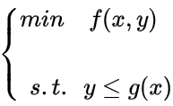
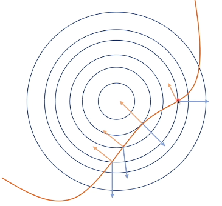
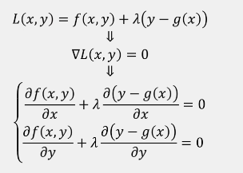
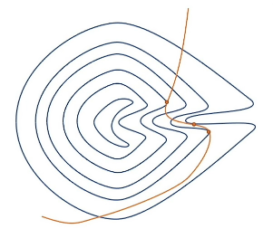
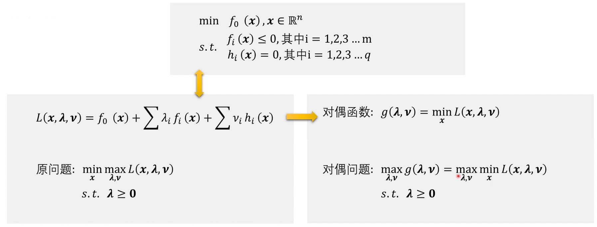
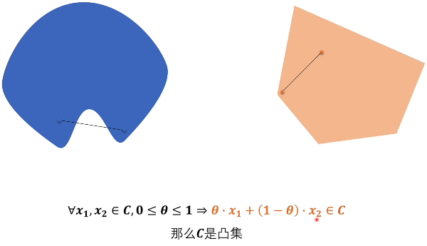
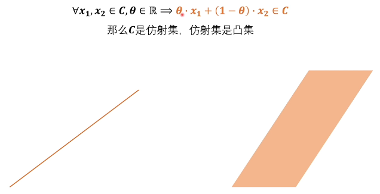
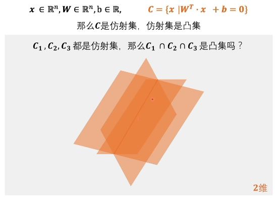
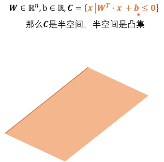

# `拉格朗日对偶问题：`

* `拉格朗日乘数法`
* `拉格朗日对偶问题`
* `凸集`
* `凸函数、凹函数`
* `凸优化`
* `弱对偶、强对偶`
* `KKT条件`
* `Slater条件`

## `拉格朗日乘数法：`

* 在数学中的最优化问题中，`拉格朗日乘数法`（以数学家Joseph-Louis Lagrange命名）是一种  `寻找多元函数在其变量受到一个或多个条件的约束时的极值` 的方法。

* 假设现在有如下函数和约束：

    

 * 这里画出 $f(x,y)$ 的等高线， 黄线标出的是 $0 = y-g(x)$ 的等高线。

    

    蓝线是 $f(x,y)$ 的等高线。假设现在蓝色的等高线越往内值越小，如果没有约束的话，那么 $f(x,y)$ 的极小值就是蓝色等高线的圆心。但是现在加上了约束，那么此时最小值我们很容易就能看出来是和黄色等高线相切的地方为极小值。因为如果只是相交意味着肯定还存在其它的等高线在该条等高线的内部或者外部，使得新的等高线与目标函数的交点的值更大或者更小，只有到等高线与目标函数的曲线相切的时候，可能取得最优值。
    此时隐含着：

    $$ \bigtriangledown f(x) + \lambda \bigtriangledown(y-g(x)) = 0 \ \ $$

    `为什么黄线的梯度向上，可以做一条垂直于x轴的线，往上 y 变大 g(x) 不变，z 变大，所以梯度向上`。

    对应 `拉格朗日乘子公式` ：

    

    从上图我们可以直观的理解拉格朗日函数的意义。

    但是拉格朗日乘数法好是好，但是同样存在着一些问题，和求导方法类似，拉格朗日乘数法找到的值可能并不是最值，它有可能是极值，也有可能是鞍点，比如下图，所以说`拉格朗日乘数法只能求得可能解，极值还需要额外进行判断`。

    

    那么我们就希望如果我们能遇到一种情况，让我们求出来的极值就是我们的最优值，那就好了，如果我们遇到的问题是一个 `凸问题` ，那么我们求得的最值就非常有可能是极值。

* 简单讲一下凸问题，如果目标函数为凸函数，那么你求解的问题很可能就是凸问题。`但是凸问题可遇不可求，如果我们遇到的问题是非凸的问题，那么怎么办，我们通常看他的拉格朗日函数的对偶问题`。

*  当我们有如下 `约束函数` 时：

    
(图片1)

    我们通常会使用 `拉格朗日乘子法` 将其转化成 `无约束问题` （需要注意的是 `只有不等式约束限制了前面的系数大于等于0` __$\rightarrow \lambda_i\ge0$）__：

    
    (图片2)
$\underset{x}{min} \ \ \underset{\lambda,v}{max}\ \ L(x,\lambda,v)$ 看成是 `原问题`，因为他们等价。
    
    * 为什么等价呢，我们来看一下，首先我们将原来的约束问题转成了图片2中的无约束问题，这个时候图片2中的x其实就是无约束的了，可以取全空间，那么我们现在开始分情况讨论，分别假设 `x` 在 `图片1原问题的可行域` 和 `不在图片1原问题的可行域` 时，有如下情况：（为什么要讨论这两种情况？因为在转为拉格朗日函数之后x的可行域变为全域，我们需要保证在全域的情况下和原来的带约束问题是一致的。）

        

    * `1、当 x 不在可行域中`，先看 $f_0(x)$ 后的第一项 $\sum \lambda_if_i(x)$，因为不在可行域所以 $f_i(x)$ 要大于0，而 $\lambda$ 又是大于等于0，那么两个都可以大于0，那么我们求它的最大值，那么一定是可以到无穷大的，$\sum v_ih_i(x)$ 也是同理，同样可以取到无穷大，那么最后得到的结果就是无穷大

    * `2、当 x 在可行域中`，$h_i(x) =0$ ，$f_i(x) \le0$ ，所以第一项和第二项的 max 值都为 0，最后x在可行域中得到极大值为 $f_0(x)$ 
        

    * 最后再对max的两个集合求最小值，那么其实最后的结果就是  $f_0(x)$，所以说我们把 $\underset{x}{min} \ \ \underset{\lambda,v}{max}\ \ L(x,\lambda,v)$ 看成是 `原问题`。

## `对偶函数和对偶问题：`

* 接下来我们看原函数的对偶函数和对偶问题：

    

    `对偶函数：`原先将原函数转化成拉格朗日函数的时候先极大化的是 $\lambda$ 和 $v$ ，那么转成对偶函数就是先最小化 x。

    `对偶问题：`然后再前面加上极大化 $\lambda$ 和 $v$，就变成了原问题的对偶问题。

    `为什么这里要讲对偶问题呢，因为不论原问题的凸问题还是非凸问题，当转成对偶问题时都是凸问题。`

###  `凸集和非凸集：`

* 凸集的定义就是图形内两点之间的连线仍在图形中，可以看出第一个图像就不是凸集，第二个图像是凸集，这个是凸集的定义。

    

    常见的凸集有如下：

    

    可以看到在仿射集中两点的连线仍在集合中。多个仿射集相交得到的集合仍然也是凸集。

    

    另外一种常见的凸集就是半空间：

    

###  `凸函数和凹函数：`

* 下面是凸函数和凹函数的定义：
    
    

    

### `为什么对偶问题是凸问题：`

* 接下来我们来看一下为什么对偶问题是凸问题：

    

    先看对偶函数，假设现在我们求得了最优的参数 $x^*$，那么此时对偶函数中的 $f_0(x^*)$为常数，$f_i(x^*)$为常数，$h_i(x^*)$为常数，此时对偶问题就可以看成是一条直线，而直线恰好就是 `凹凸函数` ，因为我们后面构造对偶问题需要对对偶函数再求 `max` ，而 `max` 通常是对 `凹函数` 求得，所以我们可以把 `对偶函数` 看成是 `凹函数` ，对其求最大值就是 `凸问题` 。

    虽然对偶函数中存在着一些限制，比如限制了 $\lambda_i \ge 0$ 和 $v_i \ge 0$ ，但是它仍让是半空间，半空间是凸集，所以对偶问题对应的问题一定是优化问题。

* `那么是不是所有的带约束的问题都可以将其转成对偶问题，然后再进行求解呢，不一定，因为原问题的最优解不一定和对偶问题的最优解相等。`

    * `如何保持相等呢？`需要要求原问题和对偶问题是强对偶的。

    * `那么是不是所有的凸优化问题都是强对偶的呢？`不一定，但大部分都是强对偶的，不过严格上说要满足强对偶还需要满足 slater 条件。

### `slater 条件：`

* 简单来说就是左边的可行域中至少存在一个x点：

    

    `也就是 slater 条件是强对偶关系的充分条件：满足slater 的一定是强对偶，但是强对偶不一定满足slater 条件`。

### `KKT：`

* `强对偶的必要条件是KKT条件：强对偶一定满足KKT 条件，但是满足 KKT 条件的不一定满足强对偶`。

* `Karush-Kuhn-Tucker (KKT) ` 条件是 `非线性规划(nonlinear programming)` 最佳解的必要条件。`KKT` 条件将 `Lagrange乘数法(Lagrange multipliers)` 所处理涉及等式的约束优化问题推广至 `不等式` 。

    

    这五个条件称为不等式约束问题的KKT条件，KKT 条件是拉格朗日乘数法在不等式约束优化问题上的泛化，当原问题是凸优化问题时，满足 KKT 条件的解也是原问题和对偶问题的最优解。

<!-- ## `svm的前置数学知识` -->

<!--  -->

## `补充说明：`

* 首先我们应该明白拉格朗日函数、极小极大拉格朗日函数、对偶函数、对偶问题之间的一个关系和区别，这个关键词虽然有些相近但是他们表示的意义是不一样的。

* `对于等式约束，有的时候我们会说他等价于拉格朗日函数,不需要再进行极大化`，为什么这样说呢，因为拉格朗日函数：

    $$L(x,\lambda)=f(x)+\lambda g(x) $$ 

    对 x 和 $\lambda$ 分别求导可以得到:

    $$ \left\{\begin{matrix}
        \bigtriangledown f(x^*)+\lambda \bigtriangledown g(x^*)=0  \\
        g(x^*)=0
        \end{matrix}\right.$$

    直接令所有的偏导数为0，直接求出解析解。不需要考虑原始问题中的 max ，新构造的拉氏函数完全等价于原来等式约束下的优化。

    不等式约束不能简单的使用上面的求偏导相加结果为0求解极值，还需要加上KKT约束。

## `参考资料：`

* `拉格朗日函数和KKT：`https://www.cnblogs.com/mo-wang/p/4775548.html

* [拉格朗日乘数法理解](https://zhuanlan.zhihu.com/p/39354973)

* [Karush-Kuhn-Tucker (KKT)条件](https://zhuanlan.zhihu.com/p/38163970)

* [浅谈最优化问题的KKT条件](https://zhuanlan.zhihu.com/p/26514613)

* [机器学习-白板推导系列(六)-支持向量机SVM（Support Vector Machine）- Video](https://www.bilibili.com/video/BV1Hs411w7ci?p=2)

* [支持向量机(SVM)手动推导全过程 校园宽带小王子 - Video](https://www.bilibili.com/video/BV1A4411y7qK?p=2)

* [最优化理论与方法 - ideo](https://space.bilibili.com/507629580/video)

* `“拉格朗日对偶问题”如何直观理解？“KKT条件” “Slater条件” “凸优化”打包理解：` https://www.bilibili.com/video/BV1HP4y1Y79e?spm_id_from=333.999.0.0