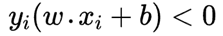
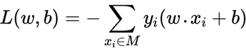

# `感知机`

## `一、感知机模型：`

感知机是 `二类` 分类的 `线性分类模型`，其输入为实例的特征向量，输出为实例的类别，取 +1 和 -1 两个值。感知机对应输入空间（特征空间）中将实例划分为正负两例的分离超平面，属于判别模型。

感知机学习旨在求出将训练数据进行线性划分的分离超平面，感知机函数如下：

## `二、感知机损失函数：`

为了便于定义损失函数，我们将满足 `wx + b > 0` 的样本类别输出值取为 `+1` ，满足 `wx + b < 0 ` 的样本类别输出值取为 `-1`，这样取 `y` 的值有一个好处，就是方便定义损失函数。

损失函数的一个自然选择是误分类点的总数，但是这样的损失函数不是w和b的连续可导函数，不易优化。损失函数的另一个选择是误分类点到超平面S的总距离，这是感知机采用的。

* `点到超平面的距离公式：`

    

* `对于误分类的样本来说，有如下式子：`

    

    当 `yi = +1` 时，因为误分类，`wx + b < 0 ` 必然小于 0 ，所以满足上式。

* `损失函数中的损失是基于误分样本的，对于误分样本，到超平面S的距离为：`

    

* `假设现在的误分的样本集合为 M ，则有：`

    

* `感知机损失：当舍弃1/||w||时，就得到了感知机损失：`

    

* `****************************************************** 关于：1/||w|| 的舍去  ******************************************************`

    第一种理解方式 “几何间隔” 

    * 直接将 `1/w` 去掉，隐含了令 `w=1`，此时 `1/w=1`, 这样才可以消掉

    * 主要原因是我们并不关心损失函数的极值具体为多少，而只是关心损失函数取极值的时候对应的模型参数是多少。而固定分母或者分子，求另一部分的极值，这样当然会使我们损失函数的极值出现变化，但是取这个极值的时候对应的模型参数不会改变。

        举个通俗的例子，我们要求 `10x (1 ≤ x ≤ 3)` 取最大值时候的 `x` 值。那么这个问题和下面的问题等价：求 `2x (1 ≤ x ≤ 3)` 取最大值时候的 `x` 值。

    第二种理解方式：“函数间隔”

    * 感知机使用的是`函数间隔`，而不是`几何间隔` (`1/||w||`不舍去)

        `之所以舍去的原因是为了简化计算，为什么舍去不会对结果造成影响？`

        这是因为感知机的前提是训练集线性可分。这意味着必须存在一个正确的超平面。那么，不管几何距离还是函数距离，损失函数最后都要等于0。损失函数最终肯定为0，那么`1/||W||` 舍去也无影响了。舍去还能简化计算过程。

## `三、感知机学习策略`

感知机的优化方法不能使用批量梯度下降，因为感知机中的损失是根据误分点得到的，所以只能使用 `SGD` 和 `Mini - BGD` 。

* `随机梯度下降：`

    假设误分类 `样本集合 M` 是固定的，那么`损失函数 L( w , b ) `的`梯度`：

    

    随机选取到一个误分类点，对 `w，b` 进行更新，其中 `η` 为 `步长` ：

    

* `算法的执行步骤如下： `

    

