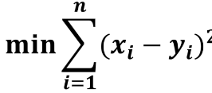

# 损失函数：

## `介绍：`

* `损失函数` 是一个非负实数函数，用来衡量 `模型预测` 和 `真实标签` 之间的差异

## `常用的损失函数：`

* 都说`损失函数` 是用来衡量 `模型预测` 和 `真实标签` 之间的差异，那么最简单的方法就是最小化每一个样本的真实值和预测值的差的和：

    

    那为什么不直接使用这个函数作为损失函数呢，因为这个函数加了绝对值，我们知道 `绝对值在定义域上并不是连续可导` 的，所以不适合作为损失函数，所以通常会把绝对值改成平方，也就是最小二乘法。

* `最小二乘法：`
  
    

* `交叉熵：`

    交叉熵作为损失函数计算出来的值其实就是模型的概率模型和理想(真实)的概率模型之间的差距定量的表达有多少。

