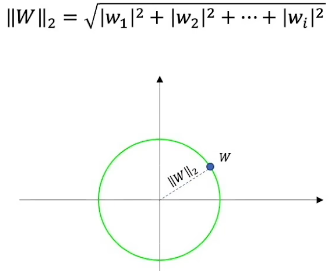
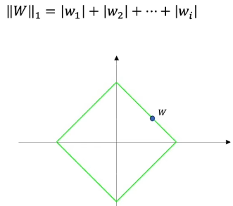
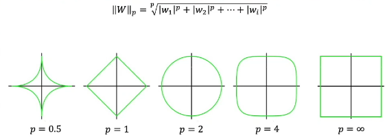
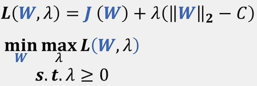
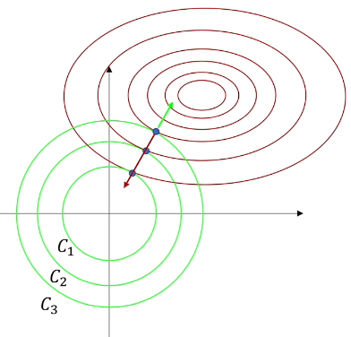

# `正则化`

## `正则化介绍：`

* 正则化的定义：凡是可以解决过拟合的方法都可以成为是正则化的方法。

* 正则化的种类很多，不仅仅只有 `L1` 和 `L2` 正则化，还有比如 `Dropout` 正则化等。

## `L1 和 L2 范数：`

* `L1` 和 `L2` 正则化本身上就是使用 `L1` 和 `L2` 范数来规范模型参数的一种方法。

    `L1` 和 `L2` 正则化主要是对参数 w 进行优化处理，对 b 实际上没有处理，因为b是偏置，偏置只影响位置，并不影响曲线的形状。

* 范数可以理解为把空间汇总的两点距离这个概念进行了扩充，比如权重w可以理解为一个高维向量，也可以理解为高位空间中的一个点，这个点到原点的距离，如果是欧氏距离那么：

  `L2范数：`将所有的 `L2` 的点画出来那么图像就是一个圆
  
    

  `L1范数：`

    

  `Lp范数：` 只有在P≥1时，构成的范数集合才是一个凸集，如果是P在0到1之间，那么就是非凸集，当定义域为凸集，问题又是凸函数，那么对应的问题就是凸问题，通过利用凸集特性可以方便问题解决。

    

* `场景：`我们知道, 过拟合就是所谓的模型对可见的数据过度自信, 非常完美的拟合上了这些数据, 如果具备过拟合的能力, 那么这个方程就可能是一个比较复杂的非线性方程 , 正是因为这里的 $x^3$ 和 $x^2$ 使得这条虚线能够被弯来弯去, 所以整个模型就会特别努力地去学习作用在 $x^3$ 和 $x^2$ 上的 c d 参数。

    $y=2+3x+x^2+x^3$

    $y=2+3x+0.000001x^2+0.000001x^3$

    

    但是我们期望模型要学到的却是 这条蓝色的曲线，因为它能更有效地概括数据。而且只需要一个 $y=a+bx$ 就能表达出数据的规律. `或者是说, 蓝色的线最开始时, 和红色线同样也有 c d 两个参数, 可是最终学出来时, c 和 d 都学成了0，或者称为成为一个非常接近0的数, 那么拟合出来的曲线就是蓝色的曲线或者接近于蓝色曲线。`

    从这里我们可以看出：防止过拟合的方法其实可以通过限制参数 w 的大小达到。

## `拉格朗日乘数法角度：`

* 我们希望最小化J，但是我们又不希望出现过拟合，那么我们可以通过限制 W 参数的大小来达到相应的效果，作为为L1正则化，右图为L2正则化，里面加了一个约束：
  
  $$||w||_2或者||w||_2要小于等于C$$
  
  相当于限制 W 参数的长度，用拉格朗日乘数法表示如下：（原函数凸问题，约束问题也是凸问题，那么这个优化问题就是凸问题的优化 ）

    

    那么最优值就是图中的蓝点。

* 但是此时的表达式和我们经常看到的加了正则化的表达式不太一样，我们还需要进行如下转换：

    

    
    

    这里的想当指的是：红色L 和 绿色L 求出来的 W 参数是一致的，因为对 W 求导 $\lambda$ 就没了：

    

* 通常越大的 $\lambda$ 可以让代价函数在参数为 0 时取到最小值。因为正则化系数越大，正则化的函数图形（上文图中的方形或圆形）会向坐标轴原点收缩得越厉害，这个现象称为 shrinkage ，为什么会这样呢？

    

    绿色的 L1 中的 C 其实表示了绿色圆的半径，不同的 C 相当于构成不同的 $c_1 c_2 c_3$ 那么此时表示的圆的约束也不一样，为什么上面我们可以将其舍去呢，我们可以把它理解成 C 被融入到了 $\lambda$ 中，通过 $\lambda$ 我们可以调整半径了。

    在拉格朗日问题中我们知道其中的 $\lambda$ 是梯度方向的系数，在极值点的时候两个图像相切，此时梯度方向相反，为了使其梯度相加为 0，那么就加了系数 $\lambda$ ，那么调整 $\lambda$ 的大小，相当于你将约束条件从 $c_3$ 限制到了 $c_1$ ，这造成了$\lambda$ 越大，正则化的效果越明显。所以说它是惩罚系数。

* 从图中可以看出，L1约束和原函数相切时，更容易在坐标轴上，这也是为什么 L1 正则化能带来稀疏性的原因：
  
    

* 小结：拉格朗日乘数法其实就是通过控制权重到原点的距离，通过这也的方法来约束权重的取值。

## `权重衰减角度：`

* 公式中的 $\frac{\alpha}{2}=\lambda$ 这里为了好化简，替代了 $\lambda$。
    

    

    可以看到，和原先的权重更新相比，每一次更新 W ，W都会先减少一点点，然后再进行更新，这就是权重衰减。

## `贝叶斯角度解释正则化：`

## `模型复杂度角度理解正则化：`

