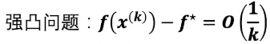
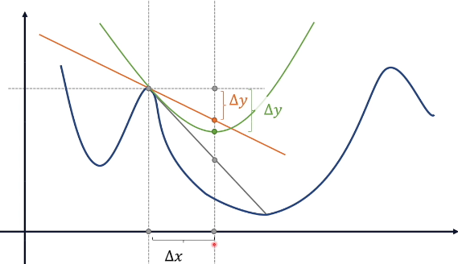
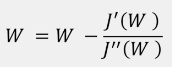
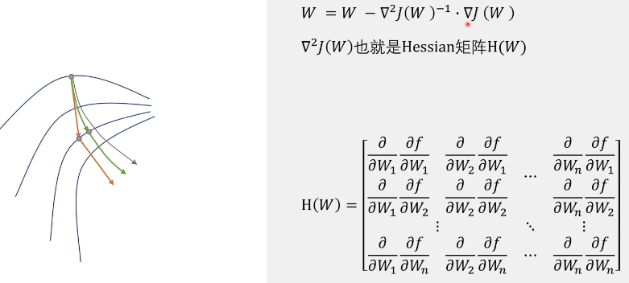
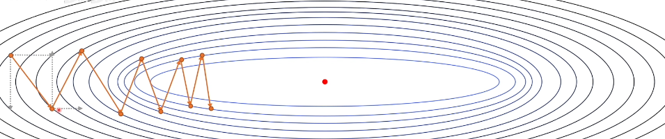
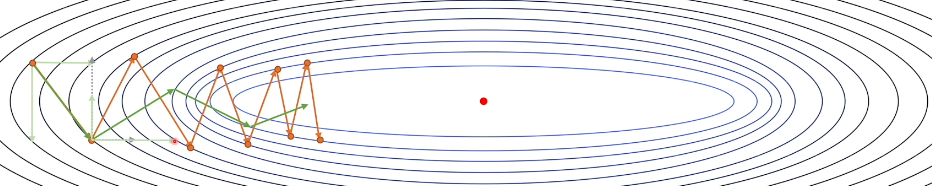
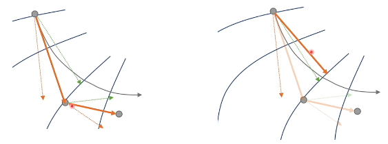

# `优化方法：`

本文只要是想通过梯度下降法引申出其他的不同优化方法，优化方向其实可以分为两个方面：

* `1、优化下降路径：`

    我们知道梯度是下降最快的方向，但是梯度下降计算出来的梯度是当前所在点所在的梯度，如果想要把整个下降最优的路线描述出来，就需要指定一个无限小的步长，但是无限小计算机是无法计算的，所以只能指定一个确定的步长，当步长固定，那么此时的下降路径就可能不是最优的：

    

    可以看到A点当时的梯度是黄线，朝这个方向进行优化确实是最优的，但是当我们指定了一个固定的步长，优化之后可能就到了 A' 的位置，那么这一个优化路径其实就不是最优的优化路径了，因为 B 点的梯方向和 A 不一致。

* `2、优化速度：`

## `随机梯度下降法：`

* 标准梯度下降法更新一次参数需要遍历所有的样本，随机梯度下降一次使用一个样本更新参数。经过证明，在凸问题的情况下有如下结果：

    

    意为经过K次训练后，最后随机梯度下降法最后达到的误差是 $\frac{1}{\sqrt{k} }$ 这个量级的。

* 如果是强凸问题：

    

    在我们看来，当模型能够接受无限的训练量的情况下，标准梯度下降法应该可以通过比随机梯度下降法更少的迭代次数达到极致点，但是经过证明标准梯度下降法不论下降的多快，速度都无法超过  $\frac{1}{k}$，可以看出随机梯度下降法的相比于标准梯度下降法更具性价比。

* 现在的梯度下降法和 mini batch 是一个东西。 

## `牛顿法`

### 一维情况：

* 梯度下降法是向梯度方向移动一定的步长来进行优化的方法： 

    

 
    在上述一维的情况下，可以看到梯度下降法使用一次的切线来进行逼近的，那么我们是不是可以使用二次的抛物线来进行二次的逼近呢？
    
* 这就是牛顿法：

    

    此时图中的灰色的曲线应该是到达极值点最优的路线，橙色的曲线离最优的曲线是有偏差的，而且距离越远离极值点的偏差越大，绿色的曲线可以看到在一定的范围内的效果是优于橙色的曲线的，可以看到当绿色曲线取到极值点的时候优化的效果是最好的，也就是当 x 取 $\bigtriangleup x$ 的时候他的学习效果最好，而且优于橙线，它的表达式：

    

* 那么它是怎么来的呢，利用二次泰勒展开得到：

    

    绿色的曲线对应公式中的 $f(x)$ 当取到极值的时候，优化效果是最好的，对二阶泰勒展开求极值为0，可以得到关于 x 的表达式，也就是刚刚的 $\bigtriangleup x$

    

    可以看到在牛顿法中没有步长的概念了。

### 多维情况：

* 多维情况如下：

    

* 左图：
  
    灰线：最优的优化路径

    橙线：是梯度下降的优化路径

    绿线：牛顿法的优化路径

* 右图：  

    是牛顿法在高维情况下的更新，可以看出牛顿法虽然很不错但是涉及到的计算量还是太大了，所以还是难以接受。

  
* `牛顿法` 本质上是将下降路径的 `所有维度` 都 `放到一起` 统一考虑（`上述的每一个对 $w_1 ... w_n$ 进行求导都是一个维度`），从而看能不能找到一个更好的路径，梯度下降法也是一样，结合所有维度：$\bigtriangledown J(w)=(\frac{\partial J}{\partial w_1},\frac{\partial J}{\partial w_2}..., \frac{\partial J}{\partial w_i})$
  
* 现在看来这个思路有点行不通，那么如果将下降的维度拆开进行考虑能不能行呢？

## `动量法`

* 现在有如下梯度下降法的更新过程：

    

    可以看到上图的情况是经过不断的震荡趋向于极值点的。这是我们想要避免的情况，因为它的优化路径不太优秀。
    
    
    如果从整体上看我们可能不太好找到具体的优化方法。现在我们通过分析梯度在不同维度上的分量来看一下：

    

    当我们画出纵轴和横轴两个分量的时候，我们可以看到造成这种震荡的优化路径的原因主要是纵轴的分量导致的，那么我们想，能不能在优化的时候减少纵轴分量的影响，让震荡的幅度减小，而且能不能增加横轴分量的影响，使其朝最优值优化的速度的更快呢？

* 那么最后出来的效果可能就是这样的：

    

    可以看到此时的震荡减小，像极值的移动速度加快，对应的分量就是纵轴减小，横轴增强，那么如何才能达到这个效果呢？

* 这就是我们要讲的动量法，我们可以基于历史数据来修正这个梯度：在第一次的时候绿线和橙线重合，第二次的时候开始考虑历史的分量，历史中第一次纵向的分量向下，第二次纵向的分量向上，分量方向相反，那么在第二次更新的时候就减小纵轴分量的影响，横轴也一样，第一次横轴分量向右，第二次也向右，那么就加强这个分量的影响。对应公式：

    

 
    $\bigtriangleup w_{(t)i}$ 是 `t` 步第 `i` 个 `分量` 的梯度。

    

    $V_{(t)}$ 相当于第t步的动量，t=2时，我们可以看到 $V_2$ 等于前两个分量的和，纵轴上看一个方向向下，一个方向向上，方向相反，所以会抵消掉一部分分量，横轴同理，现在看来是没什么的问题的。
    

    但是当我们经过了很长时间的迭代，当前的梯度可能和之前的梯度很不一样了，所以很久之前的历史数据没有参考价值了，那么我们还可以进行如下的优化： 对历史数据进行加权求和，使越近的历史数据权重更大，越远的历史数据权重越小（指数加权平均法）：

    

    

## `Nesterov 方法`

* 上述的优化方法是基于历史数据进行改变的优化方法，Nesterov 不仅可以结合历史数据还可以对未来数据进行预测进行优化，如何进行的呢？

    

    左图：橙色的虚线是梯度方向，绿色的虚线是动量方向，那么此时的优化路径可能就是橙色的实线，第二次重新计算梯度和动量进行优化。

    右图：可以看到此时的优化路径还是有点绕，那么如果我们可以直接得右图的橙线的优化路径就好了，那么如何考虑到未来的数据呢？

* `Nesterov 法` ：

    

    可以看到此时 $\bigtriangleup w_{(t)i}$ 的分量计算发生了变化，多乘上了红框里面的t-1次的动量，此时计算出来的梯度方向就不是原来的点的偏导方向了，而是红色虚线方向。

    将求得的偏导方向重新计算动量，相当于将红色虚线平移到原来的点的位置，此时他们之和是新的动量方向：

    

    通过超前的修正的到一个新的下降路径，可以看到这个路径比原来的路径更优。

## `AdaGrad 方法`

## `RMSprop 方法`

## `Adam 方法`

