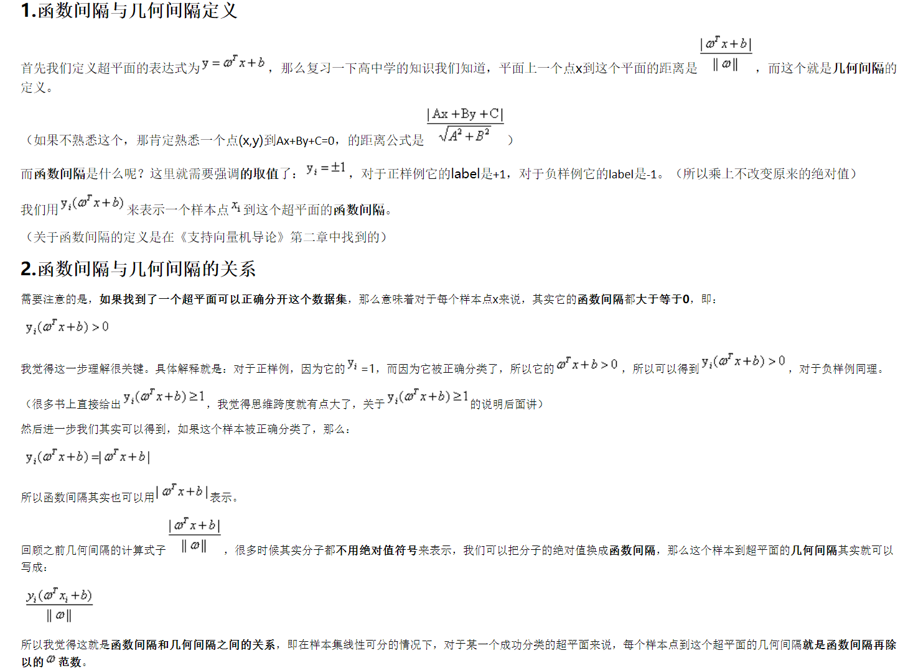
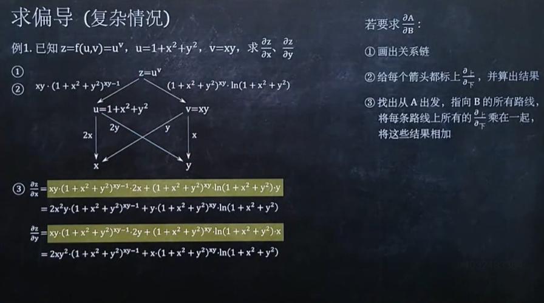

# `机器学习数学基础`

## `一、微积分：`

### `1.1、泰勒公式推导：`

* 通过极限推导泰勒公式：https://zhuanlan.zhihu.com/p/89717331

* 泰勒公式和 hessian 矩阵：https://www.zhongxiaoping.cn/2019/02/26/%E6%B3%B0%E5%8B%92%E5%85%AC%E5%BC%8F%E4%B8%8EHessian%E7%9F%A9%E9%98%B5/

### `1.2、梯度：`

* `1.2.1、梯度和梯度的推导：`https://www.zhihu.com/question/36301367/answer/688053762

* `1.2.2、形象理解“梯度”与“法向量”的关系：`https://zhuanlan.zhihu.com/p/62718992

    

    在大地平面上有一个小山包z=f(x, y)，你站在山包的山脚处，往上山最陡的方向走。
    你走的这一瞬间的方向向量，是相切于这座山包的，这个向量在地平面上的投影是梯度向量(z偏x, z偏y)；同时，这个投影向量是垂直于山包与地平面相交的二维山脚线的，也就是该二维曲线f(x, y)=0的法向量。

* `1.2.3、梯度和法向量：`https://blog.csdn.net/Queen0911/article/details/100611797

#### `1.2.4、导数、偏导数、方向导数、梯度：`

* 如何直观形象地理解方向导数与梯度以及它们之间的关系？：https://www.zhihu.com/question/36301367/answer/142096153

#### `凸集和凸函数`：

* 机器学习概念篇：一文详解凸函数和凸优化，干货满满：https://cloud.tencent.com/developer/news/335461

### `1.3、函数间隔和几何间隔`

* 函数间隔和几何间隔：

    

* 关于SVM数学细节逻辑的个人理解（一） ：得到最大间隔分类器的基本形式：https://www.cnblogs.com/xxrxxr/p/7535587.html

### `1.4、矩阵求导：`

* https://www.cnblogs.com/pinard/p/10773942.html

* https://fei-wang.github.io/matrix.html

* `标量对向量求导`：https://www.cnblogs.com/yanghh/p/13756471.html

#### `复合函数标量对向量求导：`

* 1、`复合函数求导`过程（`标量对向量求导`）过程中包含`向量`对`向量`求导，此时需要加转置符号：

    

* 2、`复合函数求导`过程（`标量对向量求导`）过程中`未包含向量对向量等其他矩阵求导`，那么不需要加转置：

    

### `1.5、求偏导：`

* 求偏导

    

    

    

    

## `二、统计：`

### `概率分布和概率密度函数：`

* `如何简单理解概率分布函数和概率密度函数？：`https://blog.csdn.net/anshuai_aw1/article/details/82626468

* `概率密度函数：`https://zh.wikipedia.org/wiki/%E6%A9%9F%E7%8E%87%E5%AF%86%E5%BA%A6%E5%87%BD%E6%95%B8

### `期望：`

#### `期望和积分：`

* 概率统计中期望就是积分，拿 EM算法 举例，表示方式可以：

    

    

    `积分` 转换 `期望` 的时候，需要将其中的 `某个乘子` 作为概率分布，因此用了这种巧妙转换把 `q(Φ)` 拿出来，然后转换为他的 `期望` 。

### `平均值和期望：`

* 如果我们能进行无穷次随机实验并计算出其样本的平均数的话，那么这个平均数其实就是期望。当然实际上根本不可能进行无穷次实验，但是实验样本的平均数会随着实验样本的增多越来越接近期望，就像频率随着实验样本的增多会越来越接近概率一样。

    如果说 `概率` 是 `频率` 随样本趋于`无穷`的`极限`

    那么 `期望` 就是 `平均数` 随样本趋于`无穷`的`极限`

### `经验风险、期望风险、结构风险`

* `经验风险、期望风险、结构风险：`https://www.jianshu.com/p/903e35e1c95a

## `三、线性代数：`

### `3.0、矩阵变换`

* 一个矩阵（方阵A）乘以一个向量（X）的结果仍然是一个同维数的向量。因此矩阵乘法（AX）对应一个表换（旋转、平移、缩放），即将一个向量变成同维数的另一个向量。

### `3.1、基础知识：`

* 编程学习线性代数：https://zihengcat.github.io/2018/03/27/%E7%BC%96%E7%A8%8B%E5%AD%A6%E4%B9%A0%E7%BA%BF%E6%80%A7%E4%BB%A3%E6%95%B003-%E5%90%91%E9%87%8F%E9%95%BF%E5%BA%A6%E4%B8%8E%E5%8D%95%E4%BD%8D%E5%90%91%E9%87%8F/

* 编程学习线性代数：https://zihengcat.github.io/2018/03/28/%E7%BC%96%E7%A8%8B%E5%AD%A6%E4%B9%A0%E7%BA%BF%E6%80%A7%E4%BB%A3%E6%95%B004-%E5%90%91%E9%87%8F%E6%95%B0%E9%87%8F%E7%A7%AF%E4%B8%8E%E5%A4%B9%E8%A7%92/

### [`3.2、特征值和特征向量：`](https://www.cnblogs.com/litaotao-doctor/p/5320521.html)

* `线性代数中对特征值和特征向量的定义：`设A是n阶方阵，如果存在 λ 和 n 维非零向量 x，使 $Ax=λx$ ，则 λ 称为方阵 A 的一个特征值，x 为方阵A对应于或属于特征值 λ 的一个特征向量。从定义可以看出，对特征向量 x 进行 A 变换的实质是将特征向量进行缩放，缩放因子为特征值λ。因此，`特征向量的代数上含义是：将矩阵乘法转换为数乘操作；特征向量的几何含义是：特征向量通过方阵A变换只进行伸缩，而保持特征向量的方向不变。特征值表示的是这个特征到底有多重要`，类似于权重，而特征向量在几何上就是一个点，从原点到该点的方向表示向量的方向。

    一个变换方阵的所有特征向量组成了这个变换矩阵的一组基。所谓基，可以理解为坐标系的轴。我们平常用到的大多是直角坐标系，在线性代数中可以把这个坐标系扭曲、拉伸、旋转，称为基变换。我们可以按需求去设定基，但是基的轴之间必须是线性无关的，也就是保证坐标系的不同轴不要指向同一个方向或可以被别的轴组合而成，否则的话原来的空间就“撑”不起来了。`从线性空间的角度看，在一个定义了内积的线性空间里，对一个N阶对称方阵进行特征分解，就是产生了该空间的N个标准正交基，然后把矩阵投影到这N个基上。N个特征向量就是N个标准正交基，而特征值的模则代表矩阵在每个基上的投影长度。特征值越大，说明矩阵在对应的特征向量上的方差越大，功率越大，信息量越多`。总结一下，`特征值分解可以得到特征值与特征向量，特征值表示的是这个特征到底有多重要`，而特征向量表示这个特征是什么，可以将每一个特征向量理解为一个线性的子空间，我们可以利用这些线性的子空间干很多的事情。`不过，特征值分解也有很多的局限，比如说变换的矩阵必须是方阵`。

    在机器学习特征提取中，意思就是最大特征值对应的特征向量方向上包含最多的信息量，如果某几个特征值很小，说明这几个方向信息量很小，可以用来降维，也就是删除小特征值对应方向的数据，只保留大特征值方向对应的数据，这样做以后数据量减小，但有用信息量变化不大，PCA降维就是基于这种思路。

    `注意：`矩阵的特征值要求矩阵是非奇异矩阵（即方阵且行列式的值不为零）

### `3.3、超平面公式推导`

* 超平面公式推导：https://www.cnblogs.com/yanghh/p/13617129.html

### `3.4、格拉姆矩阵（Gram matrix）详细解读`

* 格拉姆矩阵（Gram matrix）详细解读：https://www.cnblogs.com/yifanrensheng/p/12862174.html