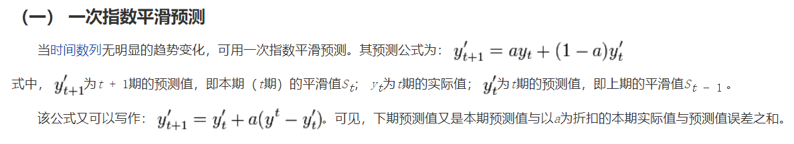

# `指数平滑法`

在做时序预测时，一个显然的思路是：认为离着预测点越近的点，作用越大。比如我这个月体重 `100` 斤，去年某个月 `120` 斤，显然对于预测下个月体重而言，这个月的数据影响力更大些。假设随着时间变化权重以指数方式下降——最近为 `0.8` ，然后 `0.8**2` ，`0.8**3…` ，最终年代久远的数据权重将接近于 `0`。

`将权重按照指数级进行衰减，这就是指数平滑法的基本思想。`

### `一次指数平滑法：`

其中：

* `si` 为 `i+1` 时刻的预测值，即本期(`i期`)的平滑值 `si`，`xt` 为 `t` 时刻的真实值，`si-i` 为 `i` 时刻的预测值，即 `i-1` 期的平滑值 `si-1`

### `二次指数平滑法：`

### `三次指数平滑法：`

## `参考：`

`时间序列分析之指数平滑法（holt-winters及代码）：`https://zhuanlan.zhihu.com/p/43353740

`指数平滑法：`https://wiki.mbalib.com/wiki/%E6%8C%87%E6%95%B0%E5%B9%B3%E6%BB%91%E6%B3%95