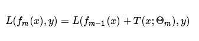

# 提升树 和 GBDT（梯度提升树）

## 简述

当损失函数是平方损失和指数函数时，每一步优化很简单，但对于一般损失函数而言，往往每一步优化都要不那么容易。所以出现了梯度提升树，梯度提升树利用最速下降法的近似方法，其关键是利用损失函数的负梯度在当前模型的值作为回归问题提升树算法中的残差的近似值，拟合一个回归树。

提升树和梯度提升树主要是在拟合损失上存在区别，一个是拟合残差（提升树）一个是使用负梯度（梯度提升树）作为损失，当GBDT使用最小二乘法作为损失函数时，GBDT 也变成拟合残差了。但是一般GBDT 不使用最小二乘法作为损失函数。
 

## `一、提升树`

### `1.1、提升树引出：`

* 1、提升树通过前向分布算法：

    

* 2、可以看出我们的目标其实是优化损失函数

    

* 3、给定当前模型fm-1,需要求解：

    

    得到最优参数 θ，即 m 棵树的参数。

* 4、采用平方误差损失函数时：

    

* 5、r 就是当前模型拟合数据的残差：

    

### `1.2、提升树 - 回归树案例：`

`流程：`

* 1、设定分割点，按这个案例来说，会考虑如下分割点：

        1.5 2.5 3.5 4.5 5.5 6.5 7.5 8.5 9.5 

* 2、然后对数据进行分割，计算最小损失：

    `如当分割点为 1.5 时：`

        c1 = 5.56
        c2 = 7.50

        左节点损失：(5.56 - 5.56)² = 0

        右节点损失：(5.7 - 7.50)² + (5.91 - 7.50)² + ...... + (9.05 - 7.50)² = 15.72

        总损失 = 左节点损失 + 右节点损失 = 0 + 15.72 = 15.72

    `当分割点为 2.5 时: `

        按照如上方法计算，得到最后的总损失

        ......

    经过计算后发现以6.5为分割点得到的损失最小，那么 `回归树 T1` 为：

    

* 3、接下来再进行学习的时候拟合的不再是原数据了，而是拟合残差：

    

* 4、按照优化问题重新计算损失，选择最小的损失节点作为分割点,得到 `回归树T2` ：

    

* 5、以此类推求得 T3、T4、T5、T6 .... 直到最后这些树足够拟合数据，残差达到你的满意值后停止训练。

* 6、如第六次停止训练后f6(x)为：

    

## `二、GBDT回归树`

`和提升树差不多，只不过拟合的不是残差，而是负梯度。`

* 残差只是负梯度的特例，最终的目的是使得损失函数减少的最快，沿哪个方向减少最快呢？负梯度方向。拟合负梯度，相当于损失函数沿着负梯度方向减少。当损失函数为平方损失时，拟合残差就相当于平方损失沿着负梯度方向减小。但是当损失函数不是平方损失时，再拟合残差就不是损失函数沿着负梯度减小了，所以此时当然不能再拟合残差。

`GBDT 的损失函数`

我们GBDT里的每一颗决策树拟合的输出y就是我们的“损失的拟合”，而我们的y是从我们GBDT损失函数的负梯度拟合得到的。

用前面的通俗例子来说就是：

* “假如有个人30岁，我们首先用20岁去拟合，发现损失有10岁，这时我们用6岁去拟合剩下的损失，发现差距还有4岁，第三轮我们用3岁拟合剩下的差距，差距就只有一岁了。如果我们的迭代轮数还没有完，可以继续迭代下面，每一轮迭代，拟合的岁数误差都会减小。”

* 我们GBDT第一棵决策树的y就是20，第二棵决策树的y就是6， 第三棵y是3.。。。而20,6,3都是通过损失函数负梯度求解得到的。

### `GBDT 拟合负梯度：`

`公式介绍：`

* I(x∈Rtj) 的意思是如果 x∈Rtj ,则I的取值为 1 ， 否则取值为 0.

* 至于c，其实就是 GBDT 中每颗决策树拟合叶子节点最好的的输出值。在回归 GBDT 初始化的时候，c 一般取值为所有 y 的平均值。

* Rtj 指的就是我上面说的负梯度误差，如果此时损失函数是均方误差，那么此时的负梯度误差就是残差。如果损失函数不是均方误差，那么此时的负梯度误差不是残差。

### `GBDT 选择划分点 和 拟合`

`划分：`

GBDT中使用的是CART回归树，所以划分点的选择参考CART回归树即可，和提升树划分一样：

`拟合：`

GBDT使用的就是CART算法，所以GBDT建树的过程和CART一致。 只是最终叶子节点的值 `c_tj` 的计算方法和普通的CART回归树稍有区别，不再使用残差进行拟合，而是使用负梯度进行拟合。

这里的拟合是指:训练样本的特征不变，但是输出值y不使用真实输出，而是对应负梯度值。这样重新得到m个训练样本，训练出一颗普通的决策树。

回归树没有区别，`但是分类树的计算时用的近似计算方式，而不是投票法。`

## `三、GBDT 分类树`

这里我们再看看GBDT分类算法，GBDT的分类算法从思想上和GBDT的回归算法没有区别，但是由于样本输出不是连续的值，而是离散的类别，导致我们无法直接从输出类别去拟合类别输出的误差。

为了解决这个问题，主要有两个方法，`一个是用指数损失函数，此时GBDT退化为Adaboost算法`。另一种方法是用类似于逻辑回归的对数似然损失函数的方法。也就是说，我们用的是类别的预测概率值和真实概率值的差来拟合损失。本文仅讨论用对数似然损失函数的GBDT分类。而对于对数似然损失函数，我们又有二元分类和多元分类的区别。

### `GBDT 需不需要归一化：`

我们知道树模型是概率模型，不需要做归一化，确实，单独的CART决策树的确不用标准化。作为GBDT里面的CART决策树，单次迭代建立决策树的确也不需要标准化。但是注意到GBDT每一步需要利用负梯度进行拟合，如果不标准化则可能前后每次迭代的拟合负梯度值的参数很不稳定（方差大），导致最后boost在一起后的结果不好，因此一般GBDT还是要标准化的。
## 参考链接

* 梯度提升树(GBDT)原理小结： https://www.cnblogs.com/pinard/p/6140514.html

## commit

问：

    您好，
    请问如果不使用用 均方误差作为损失函数，那么每一轮拟合的就不再是残差。
    若果拟合的不是残差，那么每一轮结果相加的含义是什么呢？
    比如真实值为30，第一轮预测为20，第二轮用残差10去拟合，预测得到8，这样的两轮结果相加20+8很好理解
    如果使用负梯度去拟合，该如何理解呢？

答：

    你好，残差拟合是负梯度拟合的特殊情况。而负梯度你可以理解为下山，即某一位置判断得到的下山最近的方向，这样负梯度相加你可以理解为上一步判断得到的下山最近的方向，走一步，然后再判断得到的下山最近的方向，再走一步，这样循环的一个过程。

    当然，解释性就没有残差那么直接了。

问：

    1.GBDT用一阶泰勒展开来近似残差，而XGBOOST用二阶泰勒展开，那么为什么二阶导就更优呢？
    2.xgboost算法的参数中有一个subsample，GBDT也有，通过样本子采样来随机化，那么是如何用子采样的样本来训练xgboost或GBDT？比如设置subsample=0.8，然后随机选取80%的样本从第一棵树建到最后一棵树？还是中间某棵树还会随机选择样本？

答：

    1. 这个要从泰勒展开式来看，一阶泰勒展开式丢弃了二阶以后所有的导数部分，而一阶泰勒展开式丢弃了三阶以后所有的导数部分。可以看出一阶和二阶虽然都是近似，但是二阶的近似准确度会高一些。因为它多保留了展开式的二阶部分。当然，代价是导数计算量变大了。

    2. 这里的子采样和随机森林不同，都是不放回采样，这样每颗GBDT,xgBoost树使用的训练样本会有些不同。如果不子采样，则每颗决策树使用的都是全部的训练样本特征。使用了子采样，则每颗决策树使用的都是使用部分(比如80%)的训练样本特征, 虽然都是80%，但每颗树的80%的样本会有些差异。
    第一棵树时用全样本的80%样本，第二颗树也是用全样本的80%样本，只是这第二颗树的80%可能与第一颗树的80%样本不完全相同。当然，大部分应该还是相同的。

    “是如果每棵树的样本都不一样，那么每个样本的损失怎么连贯呢”， 的确此时损失不连贯，但是这样做虽然训练集的损失可能不够精确，但是模型的泛化能力会变得高一些。专业点的说法就是虽然模型的偏差bias变大了，但是方差variance变小了。

问：

    关于 xgboost 每棵树的训练集，GBDT 中每棵树的训练集的 y 值是通过负梯度求得的，那 xgboost 的每轮建树的过程用的是负的二阶导吗还是说也还是负梯度，二阶导只是用在了损失函数里？

答：

    你可以理解为GBDT只用了一阶泰勒展开式的系数，即负梯度来拟合，而Xgboost使用了二阶泰勒展开式，即同时使用了负梯度(一阶导数)和二阶导数一起来拟合损失。在建立决策树的时候来通过分裂不停的最小化损失。
