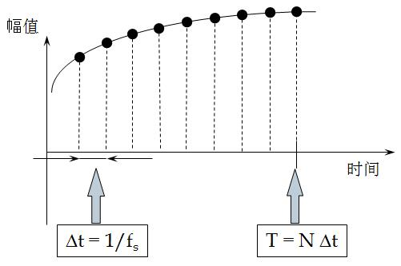
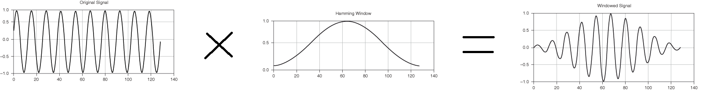

# `语言特征提取：`

在讲具体模型之前，先介绍一些需要了解的基本概念。对语音进行处理，一般会先进行分帧和特征提取，例如MFCC、FBank，然后把这些特征转化为发音最基本单位的序列，一般是音素序列，音素转换为字后就变为了文字序列。音素是比字更小一级的单位，在汉语中简单理解音素就是声母和韵母集合，但由于某些韵母是其他基本韵母的组合，实际上音素只需要这些基本发音单元就够了。如何把语音特征转换为合理的音素或者文字序列，就是模型要干的事。

## `一、语音基础知识`

### `1、模拟音频信号：`

`模拟音频信号有两个重要参数`：`频率` 和 `幅度` 。声音的频率体现音调的高低，声波幅度的大小体现声音的强弱。那么给出一段语音信号，如何度量频率和振幅呢？

* `频率：`
  
  一个声源每秒钟可产生成百上千个波，我们把每秒钟波峰所发生的数目称之为信号的频率，用单位赫兹(Hz)或千赫兹(kHz)表示。

  频率是指信号中重复出现的周期性变化的速度，是每秒钟内重复发生的次数，单位是赫兹（Hz）。在音频信号中，频率决定了声音的音高，即人耳所感受到的声音高低。不同频率的声音具有不同的音色和谐波结构，因此频率信息可以用于区分不同的声音。

* `幅度：`
  
  信号的幅度表示信号的基线到当前波峰的距离。幅度决定了信号音量的强弱程度。幅度越大，声音越强。对音频信号，声音的强度用分贝(dB)表示，分贝的幅度就是音量。

### `2、声音的A/D转换：`

`A/D转换就是把模拟信号转换为数字信号的过程`，模拟电信号变为了由"0","1"组成的bit信号。`A/D转换关键步骤是声音的采样和量化和编码。`

* `采样：`
  
  为实现A/D转换，需要把模拟音频信号波形进行分割，这种方法称为采样(Sampling)。 采样的过程是每隔一个时间间隔在模拟声音的波形上取一个幅度值，把时间上的连续信号变成时间上的离散信号。 该时间间隔称为采样周期， 其倒数为采样频率，表示计算机每秒中采集多少声音样本。

* `重采样：`

    语音信号重采样是语音信号处理中常用的方法，许多语音信号处理算法只支持一两种采样频率，当使用其他采样频率的语音数据送过来时，就可以使用重采样的方法使得其符合语音算法的采样频率。

* `采样率：`
  
  采样必须按一定的速率进行，那么采样频率就是用来表示采样的速率，用Hz表示。本质上，我更愿意叫采样频率为采样率，因为它表征的是采样的快慢，采样率高，则采样快。采样率是表示每秒钟采集多少个样本点（或数据点），用sample/s或样本点数/秒表示，如采样（频）率为1000Hz，则表示每秒钟采集1000个样本点，采两个样本点的时间间隔为1ms，这个时间间隔称为时间分辨率。`时间分辨率为采样频率的倒数，时间分辨率越小，则采样频率越高，采集到的数字信号越接近真实信号。`

    

    `Δt = 1ms = 1/1000HZ`

    与时间分辨率相对应的是频率分辨率，频率分辨率的倒数为做一次FFT所截取的时域数据长度T。这个时间长度T所对应的数据称为1个数据块（time block）或1帧。因此，在数据采集时，可以用时间表示总的采样长度，也可以用数据块或帧数表示总的采样长度。1个数据块包含N个数据点，因此，1个数据块的时间长度 `T=N*∆t`。

* `采样率带来的误差：`

    `奈奎斯特(Nyquist)理论:`采样频率与声音频率之间有着一定的关系，根据奈奎斯特理论，只有采样频率高于声音信号最高频率的两倍时，才能把数字信号表示的声音还原为原来的声音。

    $$f_s >= 2f$$

    `假设说关心的最高频率为500Hz，则采样频率至少为1000Hz。`采样定理只是保证信号的频率不失真，但并没有保证信号的幅值不失真，如果按采样定理来设置采样频率，那么，高频信号的幅值肯定会失真，低频信号的幅值可能会也失真。

    `采样频率越高，1秒钟内采集的样本点（或数据点）越多，信号幅值越接近真实幅值。`理论上讲，采样率越高越好，由采样率带来的幅值误差会越小，但这并不现实。因为，采样率受采集设备最高采样频率限制；另一方面，采样率越高，会导致采样的数据容量大增，出现大的数据文件。

    不同的采样率下，信号的幅值是不同的，采样率越高，信号幅值失真越小。`因此，一般来说，如果是关心时域信号的幅值，那么，采样频率应大于10倍的信号频率才不会引起明显的幅值失真。`

* `量化：`
  
  采样只解决了音频波形信号在时间坐标上(横轴) 把一个波形切成若干个等分的数字化问题，但是还需要用某种数字化的方法来反映某一瞬间声波幅度的电压值大小，该值的大小影响音量的高低。 `我们把对声波波形幅度的数字化表示称之为"量化"。`

    量化的过程是将`采样后的信号`按照整个声波的幅度划分为有限个区段的集合，把落入某个区段内的样值归为一类，并赋予相同的量化值。

* `采样和量化小结：`
  
  所以可以简单理解：采样是横轴对时间分段，量化是纵轴对振幅分段。`量化只是对纵轴进行数值表示，具体对幅度产生影响的还是采样，不同的采样率幅度的失真程度不一样。`

* `编码：`

    模拟信号量经过采样和量化后，形成一系列的离散信号——脉冲数字信号。`这些脉冲数字信号可以以一定的方式进行编码，形成计算机内部运行的数据。`

    `编码就是按照一定的格式把经过采样和量化得到的离散数据记录下来，并在有用的数据中加入一些用于纠错、同步和控制的数据。` 在数据回放时，可以根据所记录的纠错数据判别读出的声音数据是否有错，如在一定范围内有错，可以加以纠正。

    编码的形式有很多，`常用的编码方式是脉冲编码调制(PCM).在wav中也有采用ADPCM的编码方式。`

### `3、语音基础知识小结：`

* `信号的模数转换有三个步骤：抽样、量化和编码。`模拟信号是连续信号，而数字信号是非连续即断续的信号，在做模数转换时，先要把模拟信号根据抽样频率的要求，等间隔的将模拟信号的各个时间点的值选出来，这就是抽样，量化是把抽样出来的模拟信号振幅值，根据值的范围确定他是用对应的值来表示，比如8进制，有+8到-8的取值范围，那模拟信号抽样出来的值，应该是落到这个区间的哪里，因为数字信号是没有中间量的只能去整数，所以不能出来6.5啊，或者3.2这样的值，对应的就是7和3，这样就完成了量化；那么量化之后就是把7或3用二进制编码的方式表示出来，比如 `0=000、1=001、2=010、3=011、4=100。。。`这就是编码器完成的工作。
  
    解码器是按照编码器的规则反向工作，上面说的 `0=000，1=001。。。`这是最基本的编码规则，还有其他好多种编码方式，所以在发信和收信端要对称的使用统一的编解码规则。
  
    多媒体传递的都是数字信号，也就是都是由 `0、1` 组成的二进制码字，但这些码字可能是成组的，比如3位一组，4位一组等等，那就可以表示不同的进制了。

## `二、特征提取`

* `0、MFCC 特征提取流程：`
  
    

* `1、分帧：`

  语音信号处理常常要达到的一个目标，就是弄清楚语音中各个频率成分的分布。做这件事情的数学工具是傅里叶变换。傅里叶变换要求输入信号是平稳的，当然不平稳的信号你想硬做也可以，但得到的结果就没有什么意义了。而语音在宏观上来看是不平稳的——你的嘴巴一动，信号的特征就变了。但是从微观上来看，在比较短的时间内，嘴巴动得是没有那么快的，语音信号就可以看成平稳的，就可以截取出来做傅里叶变换了。这就是为什么语音信号要分帧处理，截取出来的一小段信号就叫一「帧」。

  [参考：语音信号处理中怎么理解分帧？](https://www.zhihu.com/question/52093104)

* `2、预加重：`

    由于声音信号从人的声门发出后，存在12dB/倍频程的衰减，在通过口唇辐射后，还存在6dB/倍频程的衰减，因而在进行快速傅里叶变换之后，高频信号部分中的成分较少。所以，对语音信号进行预加重操作，其主要目的是加强语音信号的每一帧中，那些高频部分的信号，以提高其高频信号的分辨率。

    [语音声学特征提取：MFCC和LogFBank算法的原理](https://blog.ailemon.net/2021/03/01/speech-acoustic-feature-extraction-the-principle-of-mfcc-and-logfbank-algorithm/)

* `3、加窗：`

    取出来的一帧信号，在做傅里叶变换之前，要先进行「加窗」的操作，即与一个「窗函数」相乘，如下图所示：

    

    加窗的目的是让一帧信号的幅度在两端渐变到 0。渐变对傅里叶变换有好处，可以让频谱上的各个峰更细，不容易糊在一起（术语叫做`减轻频谱泄漏(加窗的意义)` ）。

    `原因：`由于信号的`非周期截断`，导致频谱在整个频带内发生了拖尾现象。这是非常严重的误差，称为泄漏，是数字信号处理所遭遇的最严重误差。

    [参考：什么是泄漏？](https://mp.weixin.qq.com/s/aLSmlrgQF7FBxh_YXXfq6w)

  加窗的代价是一帧信号两端的部分被削弱了，没有像中央的部分那样得到重视。`弥补的办法是，帧不要背靠背地截取，而是相互重叠一部分。` 相邻两帧的起始位置的时间差叫做帧移，常见的取法是取为帧长的一半，或者固定取为 10 毫秒。` (分帧时一般采用重叠取帧的原因)。` 

* `4、快速傅里叶变换：`
  
    在经过上述的一系列的处理过程之后，我们得到的仍然是时域的信号，而时域中可直接获取的语音信息量较少。在进行进一步的语音信号特征提取时，还需要将每一帧的时域信号对应转换到其频域信号。对于存储在计算机上的语音信号，我们需要使用离散的傅里叶变换，由于普通的离散傅里叶变换的计算复杂度较高，通常使用快速傅里叶变换来实现。由于MFCC算法经过分帧之后，每一帧都是短时间内的时域信号，所以这一步也成为`短时快速傅里叶变换。`

    `相位：`相位信息可以反映出不同频率分量之间的相对时间差或相对相位差，即不同频率分量的波形在相同时间点上的相对偏移量。在音频信号中，相位信息可以用于声音的空间定位和声音的空间感知。例如，在立体声音响系统中，左右声道之间的时间差和相位差可以产生立体声的效果。

* `4.1、短时傅里叶变换：`
  
    将信号做傅里叶变换后得到的结果，并不能给予关于信号频率随时间改变的任何信息。因此一种傅里叶变换的一种变形——短时傅里叶变换被提出（Short-time Fourier transform, STFT），用于决定随时间变化的信号局部部分的频率和相位。实际上，计算STFT的过程是将长时间信号分成数个较短的等长信号，然后再分别计算每个较短段的傅里叶变换。`STFT通常拿来描绘频域与时域上的变化，是时频分析中一个重要的工具。`

    * 经过 `傅里叶变换` 后得到的图像，横轴为频率，纵轴为振幅。

    * 经过 `短时傅里叶变换` 之后的到的图像，横轴为时间(s)，纵轴为频率(Hz)

* `5、计算幅度谱(语/频谱图)：`

    把短时傅里叶变换的结果`对复数频域信号求模`，并取对数转换成分贝（dB），然后用热力图的形式展示出来，这样就能得到的频谱图。`频谱图的横坐标为时间，纵坐标为频率，并且热力图中的颜色代表每个频点在当前时刻的能量大小。`这样我们就可以通过频谱图来观察每个时刻的语音能量分布了。

    

* `6、Mel滤波：`

    Mel滤波的过程是MFCC和fBank特征的关键之一。Mel滤波器是由20个三角形带通滤波器组成的，将线性频率转换为非线性分布的Mel频率。

    $$E_m=\ln ( \sum_{k=0}^{N-1} {P(k) \times H_m(k)} ) $$

    经过 `Mel滤波` 之后，$E_m$ 即为得到的 `fBank特征`。

* `7、取对数：`
  
  在得到上一步的fBank特征之后，由于人耳对声音的感受是成对数值增长的，所以需要将数值再进行一次对数运算，以模拟人耳的感受。我们需要对纵轴通过取对数进行缩放，可以放大低能量处的能量差异。

* `9、离散余弦变换：`

    离散余弦变换经常用于信号处理和图像处理，用来对信号和图像进行有损数据压缩，这是由于离散余弦变换具有很强的"能量集中"特性：大多数的自然信号（包括声音和图像）的能量都集中在离散余弦变换后的低频部分，实际就是对每帧数据在进行一次降维。

    离散余弦变换是MFCC相对于fBank所特有的一步特征提取运算。在上一步取了对数之后，我们还需要对得到的N维特征向量值，再进行一次离散余弦变换(DCT)。做DCT的根本原因是，不同阶数信号值之间具有一定的相关性，而我们需要去掉这种相关性，将信号再映射到低维的空间中。由于最有效的特征聚集在前12个特征里，所以在实际中，一般仅保留前12-20个结果值，通常取13个，这样一来，就进一步压缩了数据。 离散余弦变换公式如下：

    $$C_i=\sqrt{ \frac{2}{N} } \sum_{j=1}^{N} E_j \times \cos ( \frac{\pi \cdot i}{N} \cdot (j-0.5) ), \forall i \in [1,M] $$

* `10、计算动态特征：`

    上述MFCC算法仅仅体现了MFCC的静态特征，而其动态特征还需要使用静态特征的差分来表示。通过将得到的动态的特征，和前一步得到的静态特征相结合，可以有效地提高这种语音识别系统的识别性能。 差分参数的计算公式：

    $$d_t= \begin{cases} C_{t+1}-C_t & t<K \\ \frac{ \sum_{k=1}^{K} k(C_{t+k}-C_{t-k}) }{ \sqrt{2 \sum_{k=1}^K k^2} } & other \\ C_t-C_{t-1} & t \ge Q-K \end{cases} $$

    式中,dt是第t个一阶差分值，Ct是第t个倒谱系数值，Q是倒谱系数的最大阶数，K是一阶差分的时间差，一般可取1或取2。二阶差分则将上式的结果再代入进行计算即可。

    最后，再将静态特征和动态特征的一阶、二阶差分值合并起来，当静态特征是13维的特征向量时，合并动态特征后，总共有39维特征。

* `logfBank 特征：`

   logfBank特征提取算法类似于MFCC算法，都是基于fBank特征提取结果的基础上，再进行一些处理的。不过logfBank跟MFCC算法的主要区别在于，是否再进行离散余弦变换。logfBank特征提取算法在跟上述步骤一样得到fBank特征之后，直接做对数变换作为最终的结果，计算量相对MFCC较小，且特征的相关性较高，所以传统的语音识别技术常常使用MFCC算法。

    随着DNN和CNN的出现，尤其是深度学习的发展，由于fBank以及logfBank特征之间的相关性可以更好地被神经网络利用，以提高最终语音识别的准确率，降低WER，因此，可以省略掉离散余弦变换这一步骤。

## `参考：`

* [[NLP-ASR] 语音识别项目整理(一) 音频预处理](https://www.cnblogs.com/shiyublog/p/11245791.html)

* [采样频率到底多高才不会使信号幅值明显失真？](https://zhuanlan.zhihu.com/p/22461380)

* [语音信号的采样和量化](https://blog.csdn.net/godloveyuxu/article/details/77477806)

* [语音声学特征提取：MFCC和LogFBank算法的原理](https://blog.ailemon.net/2021/03/01/speech-acoustic-feature-extraction-the-principle-of-mfcc-and-logfbank-algorithm/)

* [参考：语音信号处理中怎么理解分帧？](https://www.zhihu.com/question/52093104)
  
* [参考：什么是泄漏？](https://mp.weixin.qq.com/s/aLSmlrgQF7FBxh_YXXfq6w)
