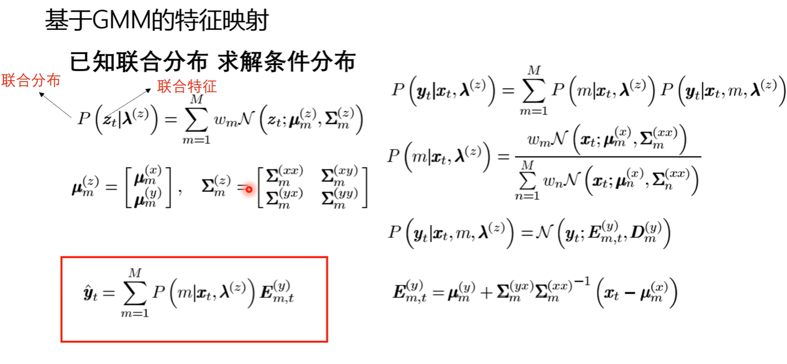

# `GMM voice conversion`

## `GMM 和 voice conversion`

* 高斯混合模型是一种常用的概率模型，适用于对复杂数据进行建模和分类。在语音转换中，我们可以将语音信号视为一个向量序列，每个向量表示语音信号的一个时间片段。
使用高斯混合模型来对语音信号进行建模，可以将每个时间片段表示为多个高斯分布的混合，每个分布代表一种不同的声学特征。这些特征可以包括音高、音调、语速等，这些特征可以被用来描述说话人的声音特征。

* 通过训练高斯混合模型，我们可以学习到每个说话人的声学特征，从而实现语音转换。具体来说，我们可以通过将源说话人的声学特征映射到目标说话人的声学空间中，来实现语音转换。这样，我们就可以将源说话人的语音信号转换为目标说话人的语音信号。

* 总之，高斯混合模型在语音转换中的应用，可以帮助我们对复杂的语音信号进行建模和分类，从而实现说话人之间的语音转换。

## `原理：`

* 在做训练之前，需要先将训练数据和目标数据进行对齐：

    

* 假设原始语音x，目标语音y都是高斯的，所以联合起来也是高斯的。利用若干个高斯如m个，来拟合信号的分布。训练一个GMM模型，就能得到联合分布的均值，方差，就可以求条件分布。

    

    图中的x和y分别表示原语音和目标语音，z表示联合特征。$\lambda^{(z)}$表示的是GMM 的 parameter。

    GMM 其实就是一种已知联合概率分布来求解条件分布的一种模型，在刚开始我们已经对源数据和目标数据进行了对齐，所以此时我们已经知道了联合概率分布。

* 简单来说就是通过GMM来建立输入x和输出y的映射。因为是高斯混合模型，所以参数存在闭式解，那么如果我们已经计算得到了相关的参数，我们就可以来进行转换了，只要把x输入到模型中，模型根据之前得到的参数来生产 $\hat{y}$,就是途中红色框框的部分。

## `使用GMM来做voice conversion的缺点:`

* 缺点就是 GMM 只能处理平行语料，而且对特征对齐的要求较高，数据收集不方便。

## `GMM的数学公式如下：`

* 假设有$n$个样本点$\{x_1,x_2,...,x_n\}$，每个样本点$x_i$有$d$个特征，即$x_i=(x_{i1},x_{i2},...,x_{id})$。GMM假设每个样本点都是由$K$个高斯分布混合而成的，每个高斯分布对应一个簇。每个簇的均值、协方差矩阵和权重系数分别为$\mu_k$、$\Sigma_k$和$\pi_k$，其中$k\in\{1,2,...,K\}$。
每个簇$k$的概率密度函数为：
    $$
    p(x|\mu_k,\Sigma_k)=\frac{1}{(2\pi)^{\frac{d}{2}}|\Sigma_k|^{\frac{1}{2}}}\exp\left(-\frac{1}{2}(x-\mu_k)^T\Sigma_k^{-1}(x-\mu_k)\right)
    $$
    整个GMM的概率密度函数为：
    $$
    p(x)=\sum_{k=1}^K \pi_k p(x|\mu_k,\Sigma_k)
    $$
    对于每个样本点$x_i$，它属于第$k$个簇的概率为：
    $$
    p(z_i=k|x_i)=\frac{\pi_k p(x_i|\mu_k,\Sigma_k)}{\sum_{j=1}^K \pi_j p(x_i|\mu_j,\Sigma_j)}
    $$
    其中$z_i$表示样本点$x_i$所属的簇，即$z_i\in\{1,2,...,K\}$。
    通过最大化样本点的似然函数，可以求解出每个簇的均值、协方差矩阵和权重系数：
    $$
    \begin{aligned}
    &\pi_k=\frac{1}{n}\sum_{i=1}^n p(z_i=k|x_i)\\
    &\mu_k=\frac{\sum_{i=1}^n p(z_i=k|x_i)x_i}{\sum_{i=1}^n p(z_i=k|x_i)}\\
    &\Sigma_k=\frac{\sum_{i=1}^n p(z_i=k|x_i)(x_i-\mu_k)(x_i-\mu_k)^T}{\sum_{i=1}^n p(z_i=k|x_i)}
    \end{aligned}
    $$
    然后，对于新的样本点$x$，可以通过贝叶斯公式来求解它属于每个簇的概率，即条件概率分布：
    $$
    p(z=k|x)=\frac{\pi_k p(x|\mu_k,\Sigma_k)}{\sum_{j=1}^K \pi_j p(x|\mu_j,\Sigma_j)}
    $$
    其中$z$表示$x$所属的簇，即$z\in\{1,2,...,K\}$。