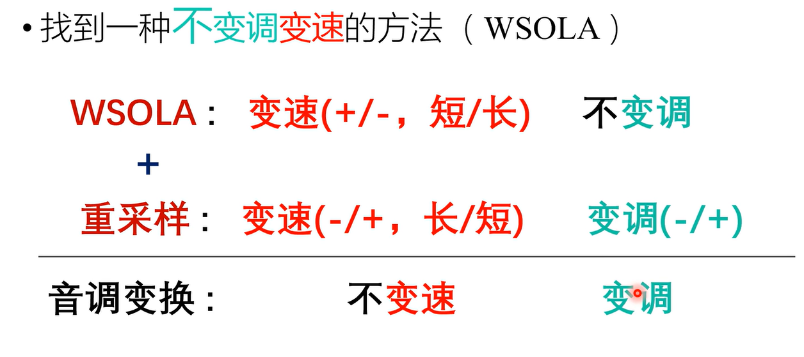
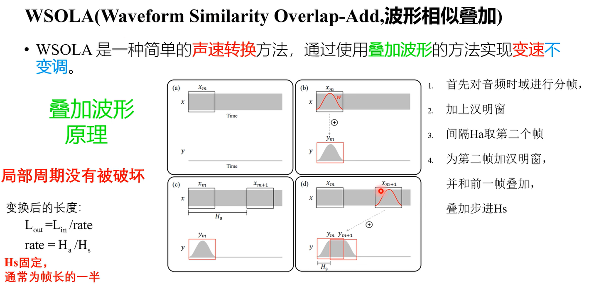
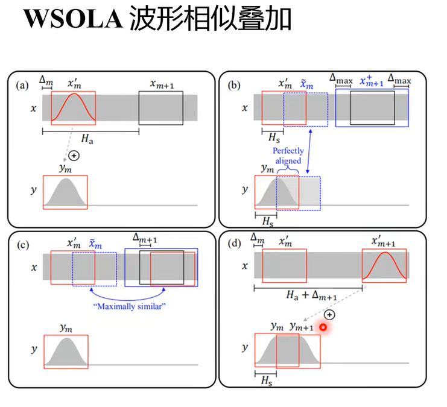

# `简单的音调变换`

* `改变音调但语速不变`

    声音频率的高低叫做音调(Pitch),是声音的三个主要的主观属性,即音量(响度)、音调、音色(也称音品) 之一

## `基频(F0)`

* 语音信号的局部周期-基频 (FO)，音调和基频是相关的。

    

    当截取波形中的一小段范围作为一个小帧，那么我们就可以计算其中每一段帧的周期，那么这每一小段的局部的周期就成为基频。那么如果我们想过改变一个声音的音调，那么我们只需要改变基频的大小，`基频的大小是可以通过修改局部的周期来进行调整的`。

    `上图男生截取出来的局部波形的周期为200，女生为100，男生的基频大概在150，女生的基频大概在200。`

    最简单的音调的变换就是对原始的语音进行重采样：

    

    虽然重采样的方式可以用于改变音调，但是不论是插值还是抽取的操作都会导致，重采样后的音频市场发生了变换，如果我们不想要时常发生改变，我们可以采取一些变换的方式。

## `WSOLA 变换：`

* 我们现在希望，基频发生变化，但是语音的时长不变(变调不变速)。

    

    WSOLA算法可以提供变速不变调的手法，通过先进行WSOLA再进行重采样，那么我们就可以将最后的结果编程变调不变速。

* 要实现变速不变调的方式有很多，其中最简单的就是波形叠加：
  
    

    图中的 x 和 y ，分别表示输入和输出，首先我们需要对数据进行分帧，然后再帧上加上汉明窗，去掉一些噪声，将通过加上汉明窗得到的波作为 y，然后再间隔 Ha 来提取下一帧，提取到的新的帧，放到 y 中间隔 Hs 的位置。可以看出，当 Ha 大于 Hs 的时候，此时相当于缩小时长，反之增加。

    波形叠加的原理很简单，但他的缺点也很明显，就是时隔一段Ha来进行提取下一帧，那么很可能造成第一帧和第二帧之间的衔接很差，可能出现断点等情况。所以WSOLA相当于再叠加波形的基础上进行了一次优化：

    

    也就是他在找下一帧的时候，会进行一次匹配，在距离Ha区域之后一段范围内中(实心蓝色框)找一段和前面蓝色虚线区域相似的帧来作为y的提取帧。(蓝色虚线的框不能直接拿下来作为y，因为我们还需要变长，如果直接拿，那y和x的时长就一样了)

* `最后结合resample 就可以实现变调不变速的效果，但是最后实现的效果和女生的声音还是差距很大。`

    

