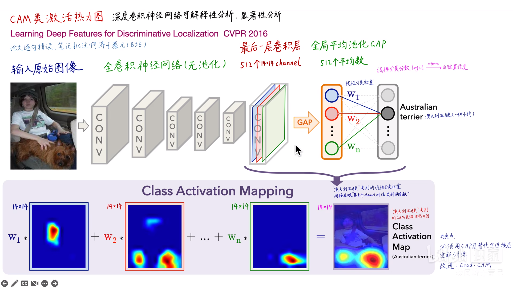

# `CAM 类别激活映射 和 grad CAM`

## `一、CAM`

类别激活方法是一种常见的图片分类归因方法，该方法可以高亮输入图片与预测结果最相关的区域，方便人们进行预测结果归因。

 

### `CAM 的工作流程：`

卷积神经网络中的卷积操作本质上可以保持位置信息的，但是后面加上了全连接层，那么位置信息就丢失了。

* 工作原理其实很简单，就是通过一个全卷机神经网络，然后去掉全连接层，把全连接层用 `GAP` 层来进行替换， `GAP` 主要做了这样一个操作，将最后一层的卷积层的输出 `channel` 进行 `average` 的处理，每一个 `channel` 对应一个 `average` 也就是把原先的 `channel` 矩阵转成是一个标量，这个标量就是矩阵中所有元素的均值。然后将得到的标量在接入一个 `softmax` 网络中，所有的标量和对应的线性分类权重求加权和，最后得到的结果就是 `score` ，分数最高的就是输出的类别。其中对应的标量包含了位置信息，因为后面接的不是全连接，所以，如果最后的标量所对应的线性分类权重越大，则表示这个标量也就是这个 `channel` 的重要性越高，那么那个地方就应该高亮表示，因为最后的 `channle` 是 `14*14` 的，所以要在原图中高亮表示要通过线性插值的算法将其还原为原图，通过这样的方法将原先的图像进行一个高亮表示。

* 可以看到在 `CAM` 中的卷积神经网络是没有池化层的，原因就是池化层进行了下采样，虽然引入了平移不变性，但是也意味着丢失了长宽方向的位置信息，因为某个像素位置发生变化，池化后得到的结果却是一致的。因此在 `CAM` 中不加入池化层。

* 在使用 `CAM` 算法的过程中，必须要将全连接层替换成GAP层，否则无法算每个 `channel` 的权重，如果网络中没有 `GAP` 层，需要把全连接层替换成 `GAP` 层，再重新训练。

### `CAM 算法的缺点`

* `1、`必须要有 `GAP` 层，否则得修改模型的结构后重新进行训练。

* `2、`只能分析最后一层卷积层输出，无法分析中间层。

## `二、Gard CAM`

`Grad - CAM` 利用反向传播，跨越图片标语生成和图片问答模型中后部的 `LSTM` 等模型，然后将反向传播到图片网络的卷积层的信号作为权重，来线性叠加图片特征卷积层，从而生成高亮图。

* `CAM` 存在的缺陷在 `Gard - CAM` 得到了解决，`Grad CAM` 不再要求最后的网络层是 `GAP` 层，现在可以是全连接层，原理就是在接入 `softmax` 之后，通过分数反向对各个 `channel` 求导，得到导数最大的那个 `channel` 就意味着通过他可以改变更多的分数，那么他的重要程度就高，具体的流程就是，得到对应 `channel` 的梯度后，对所有的元素求 `GAP` 得到最后的值，也就是图中 `GAP` 单词上面的那一行向量，每一个向量表示一个 `channel` 的重要程度，然后通过和 `CAM` 同一样的方法，还原到原图中，将重要程度高的部分进行高亮显示。

# `参考：`

* `GradCAM深度学习可解释性分析：`https://www.bilibili.com/video/BV1PD4y1B77q/?spm_id_from=333.788&vd_source=caf90f9466fd52eb07bb4be5ca57fb1f

