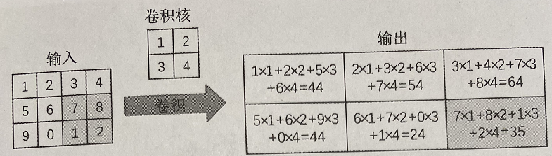

# `CNN 卷积神经网络模型结构`

* `卷积的三层含义：`

    * `1、`一个系统有不稳定的输入，有稳定的输出，那么就可以通过卷积来计算这个系统的存量。

    * `2、`图像处理：一个卷积核其实就是规定了周围像素点对当前像素点会产生什么样的影响

    * `3、`过滤器：一个过滤器的卷积核就是规定了一个像素点会如何试探周围的像素点，如何筛选图像的特征。

    每一层的应用在数学上没有差别，但是应用在不同场景那么意义就是发生了改变。

## `一、什么是卷积：`

* `卷积的重要的物理意义是：`一个函数（如：单位响应）在另一个函数（如：输入信号）上的加权叠加。

    

    `注意`：这里的 `*` 表示`卷积`。

* `卷积：`

    

    

* `卷积和互相关：`

    __进行卷积计算时，卷积核需要翻转180°，而进行互相关计算时，不需要翻转卷积核，对应元素相乘即可，所以互相关又称为不翻转的卷积。__

    __在神经网络中使用卷积只是为了进行特征提取，卷积核是否进行翻转和其特征抽取的能力无关，特别是当卷积核是科学系参数时，卷积和互相关的能力是等价的，所以，为了计算简便，我们常用互相关来代替卷积。__

    __特别的：在卷积神经网络中的卷积就是互相关！__

## `二、卷积层：`

### `1、卷积神经网络的两大特性：`

* 如图是一个二维图像使用 `2x2` 卷积核，步长为 `1` 的运算过程

    

    
    可以发现，卷积操作将周围几个像素取值经过，计算得到一个像素值。（滤波器）。

* 卷积运算常用在图像识别、图像分割、图像重建等应用，使用卷积的原因是：
  
    * `1、卷积的稀疏连接`
    
    * `2、参数共享。`

* __1、卷积的稀疏连接：__在卷积神经网络中，通过输入卷积核来进行卷积操作,卷积核尺度远小于输入维度，这样每个输出神经元只与前一层特定局部区域的神经元存在连接权重（即产生交互），我们称这种特征为稀疏交互，这样能减少需要训练的参数数量，加快网络的计算速度。

    稀疏交互的物理意义是，通常图像、文本、语音等现实世界中的数据都具有局部的特征结构，我们可以先学习局部的特征，再将局部的特征组合起来形成更复杂和抽象的特征。

*   __2、卷积的参数共享：__卷积模型中同一组参数可以被多个函数或操作共同使用。在卷积网络中，针对不同的输入会利用相同的卷积核来获得相应的输出。所谓的权值(参数)共享，就是说，给一张输入图片，用一个 filter 去扫这张图，filter 里面的数就叫权重，这张图每个位置是被同样的 filter 扫的，所以权重是一样的，也就是共享。
  
    这种参数共享的特点是只需要训练一个参数集，而不需要对每一个位置学习一个参数，由于卷积核尺寸可以远远小于输入尺寸，即减小需要学习的参数的数量，并针对每一个卷积层可以使用多个卷积核获取输入的特征映射，对数据（尤其是图像）既有很强的特征提取和表示能力，并且在卷积计算之后，使得卷积神经网络结构对输入图像具有平移不变的性质。

    `参数共享(Parameter Sharing)解释：`参数共享是指在同一个模型的不同模块中使用相同的参数。全连接神经网络在计算每层的输出时，权值参数矩阵中的每个元素只作用于某个输入元素一次；而卷积神经网络的卷积核中的每一个元素将作用于每一次局部输入的特定位置上，根据参数共享的思想，我们只需要学习一组参数集合，而不需要针对每个位置的每个参数都进行优化，大大降低了模型的存储需求。`参数共享的物理意义是使得卷积层具有平移不变性。`假如图像中有一只猫，那么无论它出现在图像中任何位置，都应该将它识别为猫。也就是神经网络的输出对于平移变换来说应当是等变的。

    `参数数量：`假设输入数据体尺寸为 `[32x32x3]`（比如CIFAR-10的RGB图像），如果感受野（或滤波器尺寸）是 `5x5` ，那么卷积层中的每个神经元会有输入数据体中 `[5x5x3]` 区域的权重，共 `5x5x3=75` 个权重（还要加一个偏差参数）。注意这个连接在深度维度上的大小必须为`3`，和输入数据体的深度一致。其中还有一点需要注意，对应一个感受野有75个权重，这`75`个权重是通过学习进行更新的，所以很大程度上这些权值之间是不相等（也就对于同一个卷积核，它对于与它连接的输入的每一层的权重都是独特的，不是同样的权重重复输入层层数那么多次就可以的）。在这里相当于前面的每一个层对应一个传统意义上的卷积模板，每一层与自己卷积模板做完卷积之后，再将各个层的结果加起来，再加上偏置，注意是一个偏置，无论输入输入数据是多少层，`一个卷积核就对应一个偏置`。

* `平移不变性：`在欧几里得几何中，平移是一种几何变换，表示把一幅图像或一个空间中的每一个点在相同方向移动相同距离。比如对图像分类任务来说，图像中的目标不管被移动到图片的哪个位置，得到的结果（标签）应该是相同的，这就是卷积神经网络中的平移不变性。 `平移不变性意味着系统产生完全相同的响应（输出），不管它的输入是如何平移的 。`

    因为：卷积具有局部连接和参数共享的特性，当移动输入图像中的目标时，由于局部连接和参数共享的特点，对于移动后的目标，经过卷积操作后，也能得到同样的特征输出。

### `2、卷积计算：`

* `卷积层` 是使用一系列 `卷积核` 与 `多通道输入数据做卷积的线性计算层`，`卷积层` 的提出是 `为了利用输入数据（如图像）中特征的局域性和位置无关性来降低整个模型的参数量。`

    卷积运算过程与 图像处理算法中常用的空间滤波是类似的。比如求图像边缘的滤波器，求各个角度的滤波器，比如求90度180度这些角度的滤波器，其实和我们的卷积核有异曲同工之妙的，区别就是传统的图像中的一些经典的滤波器我们已经知道如何去设置我们的滤波器，但是在卷积神经网络里面，它得滤波器的参数可能是不确定的，需要我们不断的去训练，才能得到一个准确的卷积核，因此，卷积常常被通俗地理解为一种“滤波”过程， 卷积核与输入数据作用之后得到了“滤波”后的图像(滤波后的图像通常称之为`feature`)，从而提取出了图像的特征(`feature`)。

    `值得注意的是，由于卷积核是从数据中学习到的，因此无论这些层执行严格的卷积运算还是互相关运算，卷积层的输出都不会受到影响。`

    

    通过我们左角的图，我们可以看到我们每一次取都会取出一个 `feature` ，做后这些图像组合后的图像我们称为 `feature map` ，`feature map` 也就是我们下一个网络层的输入，我们可以看到的是在我们图像的左角最左边的图是我们的原图，原图通过我们中间的卷积核运算之后，我们就得到了这个图像的 `feature`，这些 `feature` 共同组成了右边这张图片(也就是 `feature map`)

    
    如果有 `偏置项 (b)` 还需要加 `上偏置项 (b)`：

    

    上图是斯坦福大学的cs231n的课程上，的一个动态的例子，[链接在这](https://cs231n.github.io/assets/conv-demo/index.html)。

    输入是 `7x7x3` 的张量，卷积核是两个 `3x3x3` 的张量。卷积步幅为 `2`，最后得到了输出是 `3x3x2` 的张量。如果把上面的卷积过程用数学公式表达出来就是：

    

    `对于卷积后的输出，一般会通过ReLU激活函数，将输出的张量中的小于0的位置对应的元素值都变为0。`

* __卷积最后的输出形状：__
  
* 假设输入形状为 $n_h×n_w$ ，卷积核形状为 $k_h×k_w$ ，那么输出形状将是 $(n_h−k_{h}+1)×(n_w−k_{w}+1)$ 。 因此，卷积的输出形状取决于输入形状和卷积核的形状。

    并且 `填充（padding）` 和 `步幅（stride）` 会影响卷积最后的输出形状，公式：

    

## `三、池化层：`

* `汇聚（pooling）层`，它具有双重目的：降低卷积层对位置的敏感性，同时降低对空间降采样表示的敏感性。

* `池化层是用于缩小数据规模的一种非线性计算层。`为了降低特征维度，我们需要对输入数据进行采样，具体做法是在一个或者多个卷积层后增加一个池化层。`池化层由三个参数决定：`

    * `（1）` `池化类型`，一般有 `最大池化MAX` 和 `平均池化Average` 两种；

    * `（2）池化核的大小k​`；

    * `（3）池化核的滑动间隔​s`。

    下面这个例子采用取 `最大值的池化方法`。同时采用的是 `2x2` 的池化。步幅为 `2`：

    

    最终，我们的输入 `4x4` 的矩阵在`池化后`变成了 `2x2` 的矩阵。进行了`压缩`。

* __池化层后的数据形状，公式和卷积层一样。__

## `问题：`

* `CNN 具有不变性，数据增强对它有效吗？`

    有，因为虽然裁剪、缩放、移动的数据增强操作，本质上数据的特性基本没有变，但是你数据的特征还是发生了变化，对于神经网络来说，就是不同的训练集。

* `【卷积核的大小一般为奇数*奇数】 1*1，3*3，5*5，7*7都是最常见的。这是为什么呢？为什么没有偶数*偶数？`

    `（1）更容易padding`

    在卷积时，我们有时候需要卷积前后的尺寸不变。这时候我们就需要用到 `padding` 。假设图像的大小，也就是被卷积对象的大小为 `n*n` ，卷积核大小为 `k*k` ， `padding` 的幅度设为` (k-1)/2` 时，卷积后的输出就为 `(n-k+2*((k-1)/2))/1+1=n` ，即卷积输出为 `n*n`，保证了卷积前后尺寸不变。但是如果 `k` 是偶数的话，`(k-1)/2` 就不是整数了。

    `（2）更容易找到卷积锚点`

    在 `CNN` 中，进行卷积操作时一般会以卷积核模块的一个位置为基准进行滑动，这个基准通常就是卷积核模块的中心。若卷积核为奇数，卷积锚点很好找，自然就是卷积模块中心，但如果卷积核是偶数，这时候就没有办法确定了，让谁是锚点似乎都不怎么好。

* 卷积数据的裁剪：

## `参考：`

* `如何通俗易懂地解释卷积：`https://www.zhihu.com/question/22298352

* `卷积的本质及物理意义（全面理解卷积）：`https://www.zdaiot.com/MachineLearning/%E5%8D%B7%E7%A7%AF%E7%A5%9E%E7%BB%8F%E7%BD%91%E7%BB%9C/%E5%8D%B7%E7%A7%AF%E7%9A%84%E6%9C%AC%E8%B4%A8%E5%8F%8A%E7%89%A9%E7%90%86%E6%84%8F%E4%B9%89%EF%BC%88%E5%85%A8%E9%9D%A2%E7%90%86%E8%A7%A3%E5%8D%B7%E7%A7%AF%EF%BC%89/

* `卷积神经网络(CNN)模型结构：`https://www.cnblogs.com/pinard/p/6483207.html

* `卷积神经网络 – CNN：`https://easyai.tech/ai-definition/cnn/

* `CNN 与 平移不变性：`https://zhuanlan.zhihu.com/p/42747793

* `卷积的参数共享：`https://www.plob.org/article/18105.html

* `CNN基础知识——卷积（Convolution）、填充（Padding）、步长(Stride)：`https://zhuanlan.zhihu.com/p/77471866

* `Deep Learning CNN：`http://zh.d2l.ai/chapter_convolutional-neural-networks/padding-and-strides.html