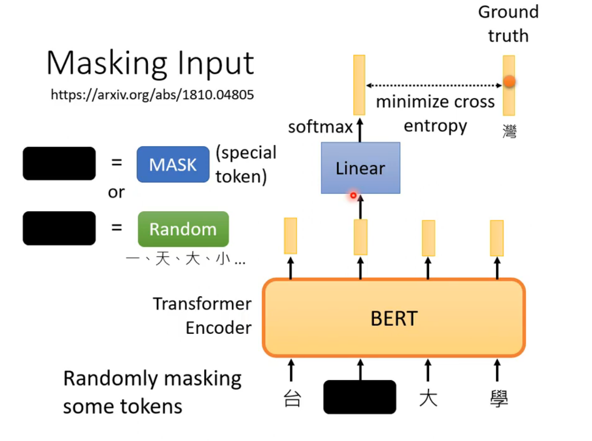

# `Bert模型` 

## `Bert 介绍：`

它的主要模型结构是 trasnformer 的 encoder 堆叠而成，它其实是一个2阶段的框架，分别是 pretraining ，以及在各个具体任务上进行 finetuning 。  pretaining 阶段需要大量的数据，以及大量的计算机资源，所以 google 开源了多国的语言预训练模型，我们可以直接在这个基础上进行 finetune 。

## `self-supervised：`

self-supervised 的工作和supervised不太一样，它类似于一种无监督学习的方法，大体上的工作就是，我们有一个文本，那么对于这个文本我们可以产生两个x，分别是x'和x''，那么我们希望，通过这个x'输入到模型中得到一个y，这个y和x''之间的差距越小越好:

### `bert 模型：`

bert模型就是一个 transformer 的 encoder，它主要的工作就是根据我们输入的一排向量到模型中，模型可以给我们吐出另外的一排向量:

* `mask input：`
  
    那么在bert的训练过程中，会进行mask input的操作，对于mask input 我们一般会采用两种方式，一种是mask另外一种是random，就是你可以把你要输入的文字给盖住或者替换为随机值，那么这两种替换的方式也是bert随机进行选择的，你可以只用mask或者只用random，也可以两个都用。

    那么当我们输入一排向量到模型之后，模型会给我们突出另外的向量，那么被盖住的那个向量最终我们会给他乘上一个liner transform（乘上一个矩阵），然后做softmax，我们希望最终得到的结果和我们原先盖住的那个文字之间的差距越小越好。那么这个就是bert的训练，它是一种 `self-supervised` 的。

    

* `next sentence prediction：`
  
    除了做mask input 之外，bert 还会做 next sentence prediction：

    也就是你在网路上可以找到很多的句子，然后我们可以把句子进行截断，分为Sentence1和Sentence2，bert中会通过引入分隔符来将两句话进行分割，那么bert在训练的时候会做 next sentence prediction，也就是你给bert两个句子，bert会给你返回一个yes或者no，判断这两个句子是不是属于同一句话。

    

    但是通常这样的预测，对bert模型的提升效果是比较小的，可能是因为一个句子被拆分成两端话，第二段和第一段之间的关联性比较大，那么后续提出了另外的一种预测手段，就是输入模型中的两个句子可能上下的顺序是颠倒的，这个对于模型来说可能会更难一点，学到的知识也就更多。

### `Fine tune：`

* bert 虽然做的是填空题，但是你把它拿过来做 fine tune 之后，却可以用在很多的下游的任务中，如：

    * `input：sentence output：class ：`情感分类

    * `input：sentence output：same as input ：`pos tagging
        
        POS（Part-of-Speech，词性）标注是另一种任务，旨在确定给定文本中每个单词的词性。这些词性可能包括名词、动词、形容词等。POS标注是自然语言处理中的一个基本步骤，它可以用于许多任务，如命名实体识别、句法分析等。

    * `input：two sentence output：class ：`NLI 

        NLI（Natural Language Inference，自然语言推理）是一种任务，旨在判断给定两个句子之间的关系，包括是否是蕴含、矛盾或中立关系。NLI任务通常用于评估自然语言处理模型的理解能力。

    * `Extraction-based Question Answering ：`QA

* `Fine tune：`比如现在我们想要做一个：input：sentence output：class 的一个情感分析任务，只要我们喂给 bert 相应的数据就可以微调成我们想要的功能。

## `semi-supervised：`

* bert在做上游的填空训练的时候是self-supervised，但是用在下游任务的时候，比如情感分类，那么他又是supervised，所以当经过fine tune 的bert 你可以把他理解成是一个 semi-supervised 的模型。
 

