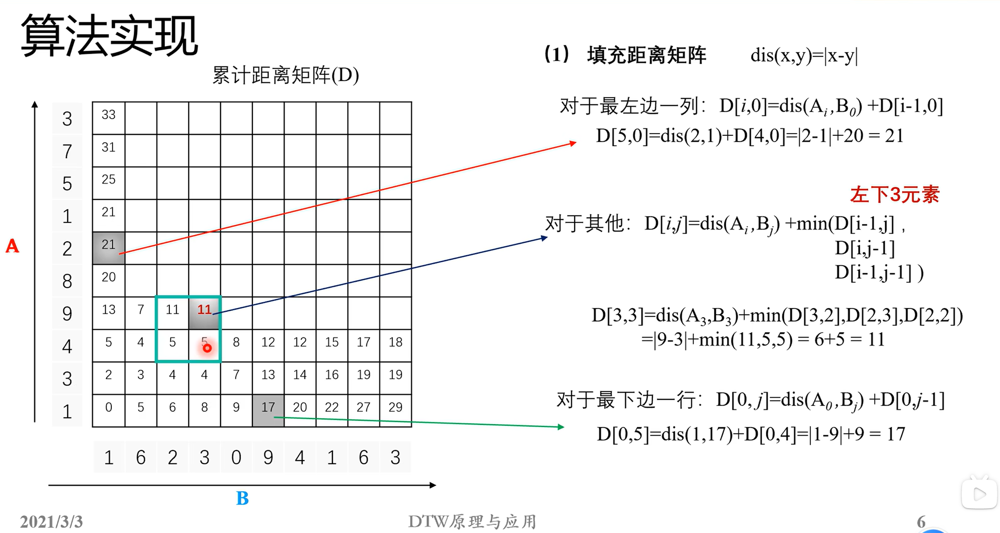
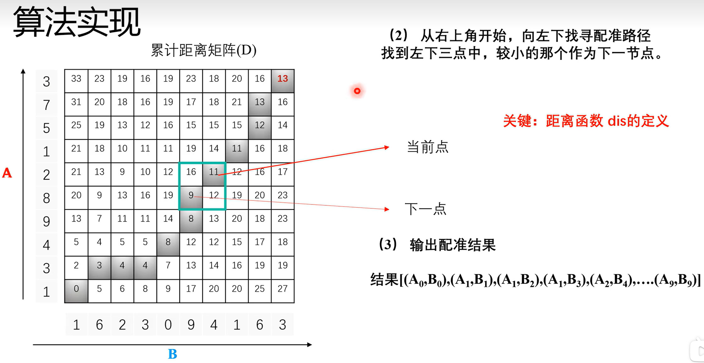

# `DTW 算法的工作原理：`

## `DTW 介绍：`

* 按照距离最近的原则，构建两个序列元素之间的对应的关系，评估两个序列的相似性：

* `要求：
`
  * (1)单向对应，不能回头

  * (2)一、一对应 不能有空

  * (3)对应之后，距离最近

## `DTW 算法图示：`

## `算法的实现原理：`

## refer:

* DTW（动态时间规整）算法原理与应用

