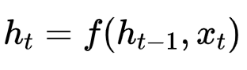
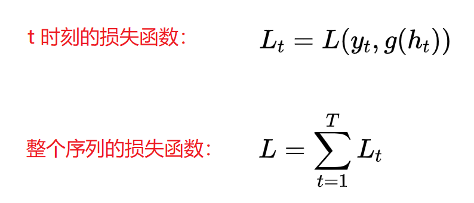

# `RNN 循环神经网络`

普通的神经网络，它们都只能单独的取处理一个个的输入，前一个输入和后一个输入是完全没有关系的。但是，某些任务需要能够更好的处理序列的信息，即前面的输入和后面的输入是有关系的，我们可以通过 RNN 来帮助解决。

## `循环神经网络`

循环神经网络通过使用自反馈的神经元，能够处理任意长度的时序数据。

`给定一串输入数据：`

`RNN` 通过下面公式更新带反馈变的隐藏层的 `活性值 h(t)`

`RNN` 模型有比较多的变种，这里介绍最主流的RNN模型结构如下：

## `RNN 前向传播`
   
对于一个简单 RNN 网络在 t 时刻的更新公式为：

`其中：`

* `xt` 为 `t时刻网络的输入`

* `ht` 为 `t时刻隐藏层的活性值`，此时ht不仅和当前时刻的输入xt 有关，也和上一个时刻的隐藏状态值ht-1 相关。

* `zt` 为 `t时刻隐藏层的净输入`

* `U` 为 `状态权重矩阵`

* `W` 为 `状态输入矩阵`

* `b` 为 `偏置项`

* `f(·)` 为 `非线性激活函数` ，通常为 `Tanh`或者 `sigmoid`

## `反向传播：`

`定义损失函数 L` ，其中的 `g(ht)` 为 `t时刻` 的 `输出` 。

`整个序列的损失函数关于 U 求导：`

`对 U 进行求导：`

`补充：`

* `[hk-1]j` 意为第 `k-1时刻` 隐状态的 `j` 维，`i[]` 为除了第 `i` 行值为 `x` 外，其余都为 `0` 的 `行向量`。其实就是一个第 `i` 行的 `行向量`，其中第 `j` 列为` hk-1` 其他列为 `0`.

`最后：`

## `RNN 小结：`

`RNN` 虽然理论上可以很漂亮的解决序列数据的训练，但是它也像 `DNN` 一样有 `梯度消失` 时的问题，当序列很长的时候问题尤其严重。因此，上面的 `RNN` 模型一般不能直接用于应用领域。在语音识别，手写书别以及机器翻译等NLP领域实际应用比较广泛的是基于 `RNN` 模型的一个特例 `LSTM` 。
 

## `词嵌入 embedding：`

### `1、词嵌入介绍：`

* `词嵌入（Word embedding）`是 `自然语言处理（NLP）`中语言模型与表征学习技术的统称。概念上而言，`它是指把一个维数为所有词的数量的高维空间嵌入到一个维数低得多的连续向量空间中，每个单词或词组被映射为实数域上的向量`。

* 计算机无法直接处理文字，所以 `NLP` 第一步就是将文字转为数字表示，最常用的转换方式就是 `onehot` 向量，比如一共有五类，那么属于第二类的话，它的编码就是 `(0, 1, 0, 0, 0)` ，对于分类问题，这样当然特别简明。

    但是在自然语言处理中，因为单词的数目过多，这样做就行不通了，比如有 `10000` 个不同的词，那么使用 `one-hot` 这样的方式来定义，矩阵就非常稀疏，每个单词都是 `10000` 维的向量，其中只有一位是 `1` ，其余都是 `0` ，这会导致无法充分学习到数据中的信息。除此之外，也不能体现单词的词性，因为每一个单词都是 `one-hot` ，虽然有些单词在语义上会更加接近，但是 `one-hot` 没办法体现这个特点，每个特征正交，所以必须使用另外一种方式定义每一个单词，这就引出了词嵌入。

* 通过 `embedding` 可以解决：
  
   * `维度灾难（降维）`。
   
   * `无法保留词序信息（滑动窗口设置较大时，可以保留多个词，此时包含词序信息）`。
   
   * `存在语义鸿沟（词的相关性）` 。
   
   三大问题。  

### `2、词嵌入的过程称为查表的原因`

* 如下：

    

    为了有效地进行计算，这种稀疏状态下不会进行矩阵乘法计算，可以看到矩阵的计算的结果实际上是矩阵对应的向量中值为1的索引，上面的例子中，左边向量中取值为1的对应维度为3（下标从0开始），那么计算结果就是矩阵的第3行（下标从0开始）—— [10, 12, 19]，这样模型中的隐层权重矩阵便成了一个”查找表“（lookup table），进行矩阵计算时，直接去查输入向量中取值为1的维度下对应的那些权重值。隐层的输出就是每个输入单词的“嵌入词向量”。

## `参考：`

* `自然语言处理-Natural language processing | NLP：`https://easyai.tech/ai-definition/nlp/

* `循环神经网络(RNN)模型与前向反向传播算法: `https://www.cnblogs.com/pinard/p/6509630.html

* `理解 Word2Vec 之 Skip-Gram 模型：`https://www.zhihu.com/people/gu-ao-78-6