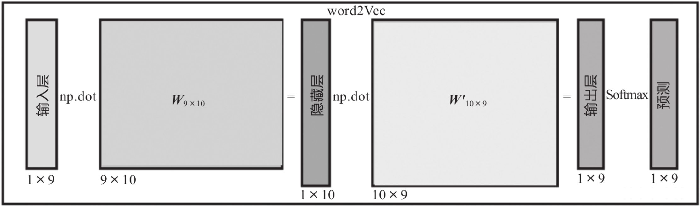
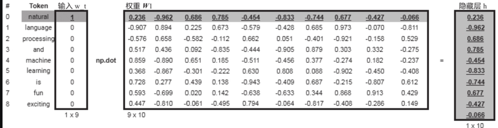
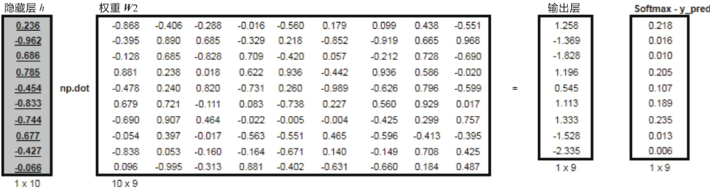
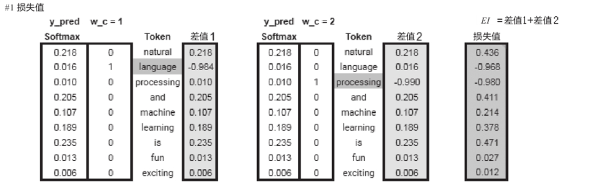

# `word2vec`

## `Skip-gram 和 CBOW 模型`

* `CBOW：`输入是窗口大小，比如 `8` 个，输出 `V` 个，最终选择 `V` 个中 `softmax` 最大的那个值，`拿一个词语的上下文作为输入，来预测这个词语本身`。

* `Skip-Gram:` 输入是中心词 `1` 个，输出 `V` 个，最终选择 `V` 个中 `softmax` 最大的那个值，`用一个词语作为输入，来预测它周围的上下文`。

### `可视化Skip-Gram模型实现过程（传统神经网络）`

* `Skip-Gram模型架构图：`
  
    

* `Skip-Gram模型的矩阵表示：`

    

## `Skip-Gram 正向传播 `

* `1、根据语料库及window-size，生成中心词与预测上下文的数据集:`

    

    图中共有10对数据，$X_k$对应的词为中心词，其左边或右边的词为上下文。

* `2、为便于训练word2vec模型，首先需要把各单词数值化。这里把每个单词转换为独热编码。`

    

* `3、输入层到隐藏层:`
    

* `4、隐藏层到输出层:`

    

* `5、计算损失值:`

    

### `Skip-Gram 反向传播`

* 然后通过反向传播更新参数。

## `参考：`

* `理解 Word2Vec 之 Skip-Gram 模型：`https://zhuanlan.zhihu.com/p/27234078

* `白话Word2Vec：`https://www.jianshu.com/p/f58c08ae44a6

* `word2vec原理(一) CBOW与Skip-Gram模型基础：`https://www.cnblogs.com/pinard/p/7160330.html

* `Skip-Gram 正反向传播：(传统的的神经网络做法，现在不太使用)`https://weread.qq.com/web/reader/b5f322e0724d0474b5f8e47k8f132430178f14e45fce0f7