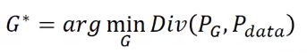

# `Generative Adversarial Network`

## `简述：`

### `generator：`

* `GAN` 是对抗生成网络，其中包含两个基本的模型，一个是生成器，一个是鉴别器，其中，我们希望我们生成的数据和真实的数据之间的差距越小越好。我们想要找一个 `G*` 使得如下：

    

    其中 `div` 是 `divergence` ，其是用来衡量两个分布之间的差异，但是问题是我们现在无法描述出 $P_G$ 和 $P_{data}$ 的分布到底是什么样的，所以无法直接使用 `div` 进行计算两个分布之间的差异。
    
    `而 GAN 告诉我们就是,你不需要知道 PG 跟 Pdata它们实际上的 Formulation 长什麼样子，只要能从 PG 和 Pdata这两个 distributions Sample 东西出来,就有办法算 Divergence。`

    

### `discriminator：`

* 接下来, `GAN` 这一整个系列的 `Work` ,就是要告诉你说,怎麼在只有做 `Sample` 的前提之下,我根本不知道 `PG` 跟 `Pdata`,实际上完整的 `Formulation` 长什麼样子,居然就估测出了 `Divergence` 那这个就是要靠 `Discriminator` 的力量

    神奇的是，通过计算最优的鉴别器，其最后得到的结果就是 `JS - Divergence`  的表达式。
 
    也就是计算 `D*` 其实就是在计算 `JS - Divergence` ，那么通过 `D*` ，我们现在又可以计算这两个分布之间的距离了，所以我们又可以把 `G*` 式子写成如下的表达式：

    

    也就是最大化 V 得到，不同的 `JS - divergence` 值，然后在找能使 `JS - divergence` 最小的 `G*`，也就是对应这图中的 `G3` ,他就是我们要求解的 `solution`。

### `extend:`

* **但是 `JS - divergence` 存在缺陷，后面又引进了 `Wasserstein - divergence` 。**

## `生成对抗网络精读：`

## `reference：`

* `令人拍案叫绝的Wasserstein GAN：`https://zhuanlan.zhihu.com/p/25071913

* `(强推)李宏毅2021/2022春机器学习课程：`https://www.bilibili.com/video/BV1Wv411h7kN?p=62&spm_id_from=333.1007.top_right_bar_window_history.content.click&vd_source=caf90f9466fd52eb07bb4be5ca57fb1f

