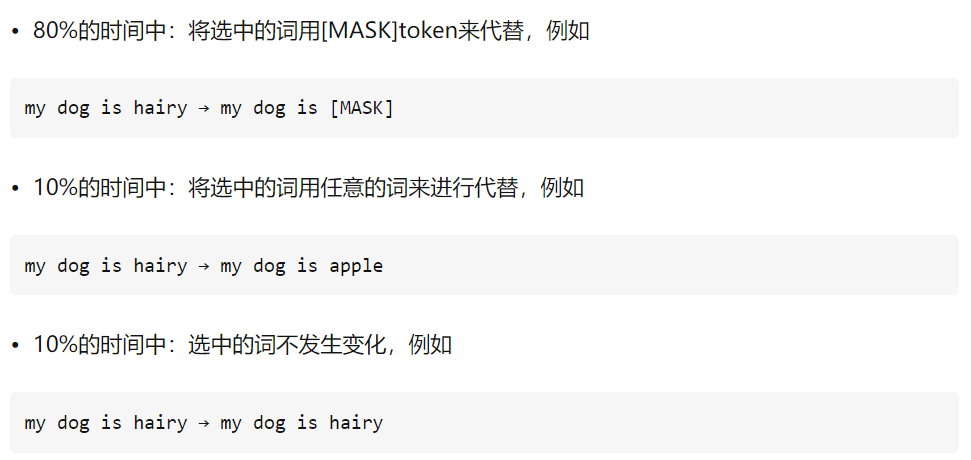

# `Attention 和 Transformer`

## `1、Encoder 到 Decoder` 

* `Encoder-Decoder` 是一个模型构架，是一类算法统称，并不是特指某一个具体的算法，在这个框架下可以使用不同的算法来解决不同的任务。首先，编码（encode）由一个编码器将输入序列转化成一个固定维度的稠密向量，解码（decode）阶段将这个激活状态生成目标译文。

* `Encoder-Decoder综述理解(推荐): `https://blog.csdn.net/u010626937/article/details/104819570
  

* `Transformer相关——（1）Encoder-Decoder框架：`https://ifwind.github.io/2021/08/15/Transformer%E7%9B%B8%E5%85%B3%E2%80%94%E2%80%94%EF%BC%881%EF%BC%89Encoder-Decoder%E6%A1%86%E6%9E%B6/#encoder-decoder%E6%A1%86%E6%9E%B6

## `2、Seq2Seq `

* `简介：`在 `Seq2Seq` 框架提出之前，深度神经网络在图像分类等问题上取得了非常好的效果。在其擅长解决的问题中，输入和输出通常都可以表示为固定长度的向量，如果长度稍有变化，会使用补零等操作。然而许多重要的问题，例如机器翻译、语音识别、自动对话等，表示成序列后，其长度事先并不知道。因此如何突破先前深度神经网络的局限，使其可以适应这些场景，成为了13年以来的研究热点， `Seq2Seq` 框架应运而生。

* `Seq2Seq` 使用的具体方法基本都属于 `Encoder-Decoder` 模型（强调方法）的范畴， `Seq2Seq`（强调目的）不特指具体方法，满足”输入序列、输出序列“的目的，都可以统称为 `Seq2Seq` 模型。

* `Sequence-to-sequence (seq2seq) `模型，其输入是一个序列，输出也是一个序列。**其最重要的地方在于输入序列和输出序列的长度是可变的。** 最基础的 `Seq2Seq` 模型包含了三个部分，即 `Encoder、Decoder` 以及连接两者的中间状态向量，`Encoder` 通过学习输入，将其编码成一个固定大小的状态向量 `C (context vector c`) ，继而将 `C` 传给 `Decoder，Decoder` 再通过对状态向量 `C` 的学习来进行输出。

    

* `Seq2Seq` 模型缺点包括了 `RNN` 模块存在的缺点，和基础 `Encoder-Decoder` 框架存在的问题：

  * 中间语义向量 `C` ​​无法完全表达整个输入序列的信息；
  
  * 中间语义向量 `C` ​对 $y_1​,y_2​...y_{n−1}$​​​所产生的贡献都是一样的；
  * 
  * 随着输入信息长度的增加，先前编码好的信息会被后来的信息覆盖，丢失很多信息。

## `3、Attention 注意力机制：`

* **Seq2Seq 到 Attention ：**基础的 `Encoder-Decoder` 是存在很多弊端的，最大的问题就是`信息丢失`。 `Encoder` 将输入编码为固定大小的向量的过程实际上是一个“信息有损的压缩过程”，如果信息量越大，那么这个转化向量的过程对信息的损失就越大，同时，随着序列长度（`sequence length`）的增加，意味着时间维度上的序列很长， `RNN` 模型就会出现梯度弥散的问题。

* `Attention` 模型的特点是 `Encoder` 不再将整个输入序列编码为固定长度的中间向量，而是编码成 **一个**【向量序列】。这样，在产生每一个输出的时候，都能够做到充分利用输入序列携带的信息。而且这种方法在翻译任务中取得了非常不错的成果。如下图所示：（从 `seq2seq` 的`一个` `c` 变成了`多个`）

    

* **Attention 的意义：**`The attention model` 用来帮助解决机器翻译在句子过长时效果不佳的问题。
  

### `3.1、Attention 的计算：`

* 在 `Attention model` 中，`Encoder` 和 `Seq2seq` 概念一样，一样是从输入句 $<X_1，X_2，X_3…X_m>$ 产生 $<h_1，h_2，h_3,…,h_m>$ 的 `hidden state`，再计算目标句 $<y_1…y_n>$。

    换言之，就是将输入句作为 `input` 而目标句作为 `output`，所以差别就在于 **context vector $c_{i}$** 是怎么计算？

    **context vector $c_{i}$**  是透过 `attention score α` 乘上 `input` 的序列加权求和。`Attention/Alignment score` 是 `attention model` 中提出一个很重要的概念，`可以用来衡量输入句中的每个文字对目标句中的每个文字所带来重要性的程度。`

* **Attention 注意力值的计算：(α表示)**：其中 $a_n$ 称为注意力分布，其可以解释为，在给定任务相关的查询q时，第n个输入向量收到的关注程度。

    

### `3.2、Attention model 存在的问题：`

* 虽然解决了输入句仅有一个 `context vector` 的缺点，但依旧存在不少问题:

    * `1、context vector` 计算的是输入句、目标句间的关联，却忽略了输入句中文字间的关联，和目标句中文字间的关联性.

    * `2、`不管是 `Seq2seq` 或是 `Attention model` ，其中使用的都是 `RNN` ，`RNN` 的缺点就是`无法平行化处理`，导致模型训练的时间很长.

## `4、Self attention`

* `Self attention` 是 `Google` 在 `"Attention is all you need"` 论文中提出的 `"The transformer"` 模型中主要的概念之一。

## `5、多头注意力：`

* `克服模型在对当前位置的信息进行编码时，会过度的将注意力集中于自身的位置的问题`

 

## `6、Transformer`

* 自注意力机制就是通过某种运算来直接计算得到句子在编码过程中每个位置上的注意力权重；然后再以权重和的形式来计算得到整个句子的隐含向量表示。最终，`Transformer` 架构就是基于这种的自注意力机制而构建的  `Encoder-Decoder` 模型。

    

## `7、Transformer 编码：`

* `Token Embedding：`就是常用的 embedding 。

* `Positional Embedding：` Transformer 无法保留时序信息，所以需要引入一个位置编码，来保证位置信息的捕捉。https://mp.weixin.qq.com/s/mZBHjuHJG9Ffd0nSoJ2ISQ

## `7、transformer 编码 mask 汇总：`

* `Transformer相关——（7）Mask机制: `https://ifwind.github.io/2021/08/17/Transformer%E7%9B%B8%E5%85%B3%E2%80%94%E2%80%94%EF%BC%887%EF%BC%89Mask%E6%9C%BA%E5%88%B6/#mask%E6%9C%BA%E5%88%B6

* `人生如戏，全靠演技；Bert 善变，全靠 MASK: `https://zhuanlan.zhihu.com/p/250263618

## `bert 中的mask`

* `bert` 为了能同时利用好前面词和后面词的概率，提出了 `Masked Language Model`，也就是随机去掉句子中的部分 `token` ，然后模型来预测被去掉的 `token` 是什么。

    虽然 `MLM` 的这种做法能够得到一个很好的预训练模型，但是仍旧存在不足之处。由于在 `fine-tuning` 时，由于输入序列中并不存在 `“[MASK]”` 这样的 `Token` ，因此这将导致 `pre-training` 和 `fine-tuning` 之间存在不匹配不一致的 问题（GAP）。

    为了解决这一问题，作者在原始 MLM 的基础了做了部分改动，即先选定 15% 的 Token，然后将其中的 80% 替换为“[MASK]”、10% 随机替换为其它 Token、剩下的 10% 不变。最后取这 15% 的 Token 对应的输出做分类来预测其真实值。

    

* `问：`
  
  为什么不能 100% 用 <MASK> 代替，而要用 10% 的 random token 和 10% 的原 token：

* `答：`
  
  不全用 [MASK] 是因为在 finetune 到下游任务的时候（例如 POS Tagging）所有词都是已知的，如果模型只在带 [MASK] 的句子上预训练过，那么模型就只知道根据其他词的信息来预测当前词，而不会直接利用这个词本身的信息，会凭空损失一部分信息，对下游任务不利。

    还有 10% random token 是因为如果都用原 token，模型在预训练时可能会偷懒，不去建模单词间的依赖关系，直接照抄当前词。

    [MASK] 是以一种显式的方式告诉模型『这个词我不告诉你，你自己从上下文里猜』，从而防止信息泄露。如果 [MASK] 以外的部分全部都用原 token，模型会学到『如果当前词是 [MASK]，就根据其他词的信息推断这个词；如果当前词是一个正常的单词，就直接抄输入』。这样一来，在 finetune 阶段，所有词都是正常单词，模型就照抄所有词，不提取单词间的依赖关系了。

    以一定的概率填入 random token，就是让模型时刻堤防着，在任意 token 的位置都需要把当前 token 的信息和上下文推断出的信息相结合。这样一来，在 finetune 阶段的正常句子上，模型也会同时提取这两方面的信息，因为它不知道它所看到的『正常单词』到底有没有被动过手脚的。

* `答2：`

    对于 mask 掉词占句子的比例，BERT 使用了 15%，然而实际的做法并不是 15% 的词都被随机地使用 MASK 符号代替，这就引出了 BERT 存在的一个问题：MASK 只是为了预训练而不得已使用的一个虚拟符号，我们要完成的下游任务并不存在这个符号，这就意味着我们预训练的模型和微调的模型所针对的数据在 MASK 这个符号上分布完全不一样，不过还好，我们并不是拿到预训练模型就直接使用而是在任务数据上进行微调，这就意味着还有调整的余地。但是如果能把这个问题的影响降到最低不是更好吗？所以 BERT 中采取了一定的措施缓解这个问题：对15%被选中的词，其中 80% 被真正地使用 MASK 符号代替，剩余的 10% 被随机词代替，最后剩下的 10% 保持不变。这其中的 80% 用于维持 MLM 任务，20% 用于缓解预训练-微调两阶段不一致的问题，那为什么还要 10% 被随机替换呢？如果剩下 20% 保持不变，对于模型来说预测一个输入中已经存在的答案可能就过于简单了，所以这里加入 10% 的噪音，模型就无法简单地从输入中获取答案了，而不得不去对上下文建模。

* `论文解读:BERT模型及fine-tuning：`https://zhuanlan.zhihu.com/p/46833276

* `你有 MASK 吗：`https://www.jianshu.com/p/cd6fb551e89b

-----

## `参考：`

* `seq2seq - 参考资料：`

    * `Encoder-Decoder 和 Seq2Seq 文章目录: `https://easyai.tech/ai-definition/encoder-decoder-seq2seq/

* `Attention 注意力机制 - 参考资料：`

  * `Transformer相关——（3）Attention机制: `https://ifwind.github.io/2021/08/16/Transformer%E7%9B%B8%E5%85%B3%E2%80%94%E2%80%94%EF%BC%883%EF%BC%89Attention%E6%9C%BA%E5%88%B6/#self-attention-vs-cnn

  * `从Seq2seq到Attention模型到Self Attention（一）: `https://www.jianshu.com/p/8beafdf30f70

  * `从Encoder-Decoder(Seq2Seq)理解Attention的本质: `https://www.cnblogs.com/huangyc/p/10409626.html

  * `深度学习之注意力机制（Attention Mechanism）和Seq2Seq: ` https://www.cnblogs.com/Luv-GEM/p/10712256.html

* `Self - Attention 、multi - Head 、transformer ` 

  * `This post is all you need（上卷）——层层剥开Transformer: `https://zhuanlan.zhihu.com/p/420820453
  * 
  * `Self-Attention和Transformer：`https://luweikxy.gitbook.io/machine-learning-notes/self-attention-and-transformer#transformer-wei-he-you-yu-rnn

* `transformer 编码 mask 汇总:`

  

    * `Transformer相关——（7）Mask机制: `https://ifwind.github.io/2021/08/17/Transformer%E7%9B%B8%E5%85%B3%E2%80%94%E2%80%94%EF%BC%887%EF%BC%89Mask%E6%9C%BA%E5%88%B6/#mask%E6%9C%BA%E5%88%B6

