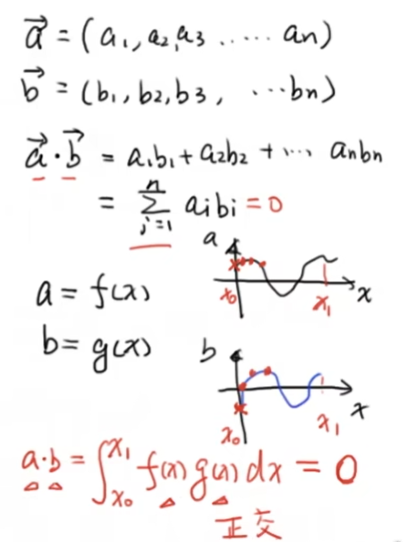
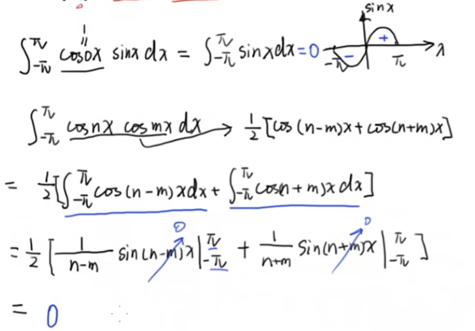
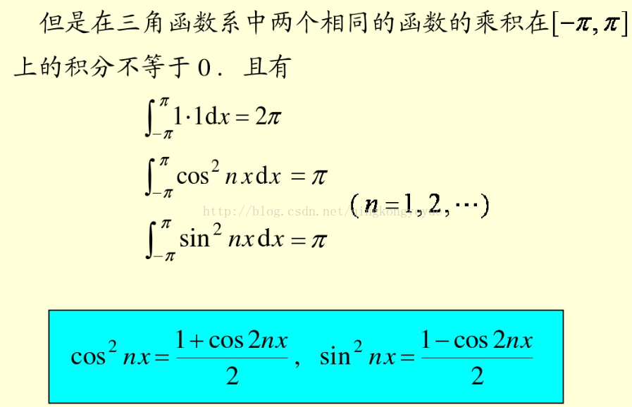
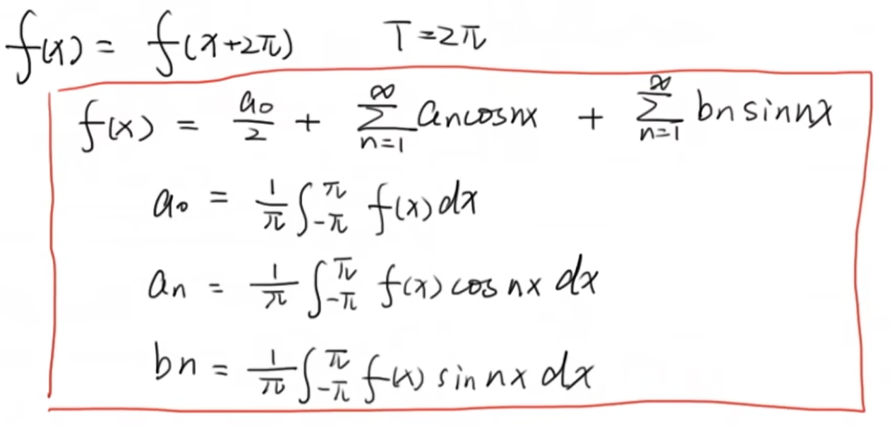
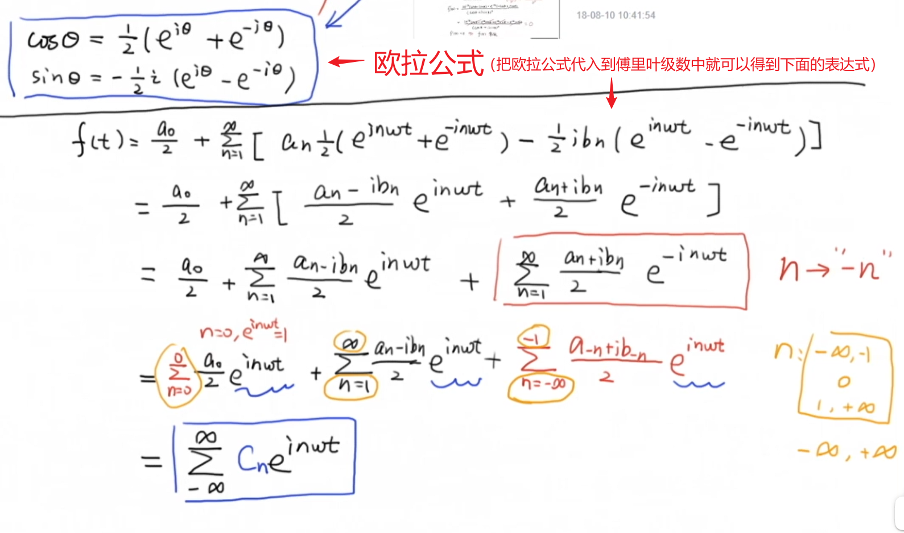
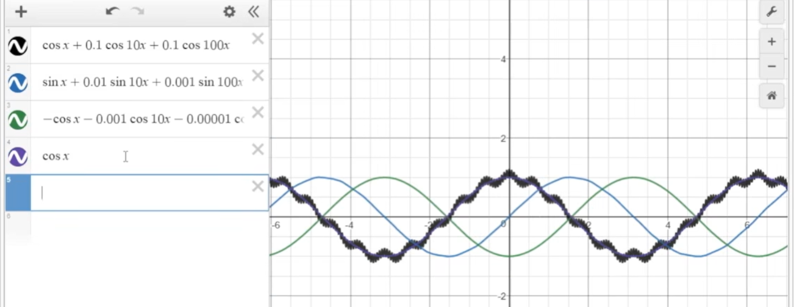

# `傅里叶级数和傅里叶变换：`

### `一、三角函数的正交性：`

* `三角函数系可以看成是一个集合：`

    

* `正交性其实可以写成一个积分的形式，他其实相当于在空间中的内积的表示形式：`

    

* `随便举一些例子进行验证：`

    

* `补充：`
  
  * `同一个三角函数系数不同：`在积分中存在相同的三角函数相乘时需要注意，比如 $sin2x*sin3x$ 的积分，因为系数不同，所以可以看成是两个不同的三角函数相乘，根据三角函数的正交性，那么它的积分结果就是0.

  * `同一个三角函数系数相同：`那么它的积分是不为0的，可以参考图中2步，其中经过计算得到的 $cos2mx$ 又可以看成是 $cos0x*cons2mx$ 所以它的积分结果为0。`(当m=n=0时，积分值应该为2π；当m=n且不等于0时，积分值才为π)`

    

* `定理：`组成三角级数的函数系 $\{0,1,sinx,cosx,sin2x,cons2x,...,sinnx,cosnx\}$ 在 $[-π,π]$ 之间正交，即其中任意两个不同的函数之积在 $[-π,π]$ 上的积分等于 0 。
  
    

    

    

* [彻底理解为什么三角函数系具有正交性](https://zhuanlan.zhihu.com/p/341796771)

* [三角函数和三角函数的正交性](https://blog.csdn.net/qingkongyeyue/article/details/58062131)

* [纯干货数学推导_傅里叶级数与傅里叶变换_Part1_三角函数的正交性](https://www.bilibili.com/video/BV1Et411R78v/?spm_id_from=333.337.search-card.all.click&vd_source=caf90f9466fd52eb07bb4be5ca57fb1f)
  
### `二、傅里叶级数展开 - 周期为2Pi的函数展开:`

* `首先尝试对周期为 2π 的函数进行傅里叶展开：`
  
    

    展开的写法有很多，可以写成蓝色的写法，也可以写成黄色底的公式，黄色底的公式其实可以通过蓝色框中的公式经过变换得到的，将n=0单独提出来就可以写成绿色框中的式子，只不过此时公式中的 $a_0$ 还缺少了一个二分之一的系数。
    
    为什么要添加这个系数，其实就是通过对 $f(x)$ 进行积分，解得 $a_0$ 的表达式中积分前面的系数为 $\frac{1}{2π}$ 所以在傅里叶转换公式中对 $a_0$ 加上系数之后，就可以让最后得到的 $a_0$ 表达式更简洁，让它少一个二分之一的系数。

* `同理我们可以通过积分来算得` $a_n$ `的表达式：`

    

* `最后得到总的表达式：`

    

### `三、傅里叶级数展开 - 周期为2L的函数展开:`

* 对于周期为 `2L` 的周期函数，其实可以通过换元的方式进行转换：

    

    通过换元的方式，当 `t=2L` 的时候对应的 `x=2π`，此时将 `f(t)` 用 `g(x)` 进行表示，`g(x)` 就是周期为 `2π` 的函数。

* `此时对应的` $a_0$、$a_n$、$b_n$ `表达式对应也发生了变换：`

    

* `在工程上通常会使用如下的表达式进行傅里叶表示：周期为T的函数进行傅里叶级数展开`
  
    

* 当 `周期 T 趋向于无穷大的时候` ，此时的函数 `f(x)` 就不再是周期函数，此时就不能使用这样的方式进行展开了，而需要用到`傅里叶变换:`

### `四、傅里叶级数的复数形式：`

* 将欧拉公式代入到之前的得到的傅里叶展开中，即可得到傅里叶级数的复数形式：

    

* 然后求解其中参数 $c_n$ 的表达式(根据上式，我们可以对 $c_n$ 进行分情况讨论，分别对应 $n=0 ,n <0 , n>0$ )：

    

* 通过推导发现，不论n是为0还是正还是负，最后得到的表达式是一致的，为：
  
    

### `五、傅里叶变换：非周期函数`

* 接下来看非周期的函数是如何进行傅里叶变换的，(首先写出1式和2式，1式为 $f_T(t)$ 二式为 $C_n$ )
  
    

    图中的 `real Cn` 为`实数部`，`Im(Cn)` 为`虚数部`，此时画出来的图我们又把它称为是`频域图`。

* 非周期的函数可以看成是周期为无穷的周期函数，此时：`(就像红框里面说的，当T趋向于无穷的时候，omiga(w) 趋向于0，因为 w 它表示的是基频率，当它趋向于0 的时候，此时相当于所有的时域上的曲线在频域上的视角进行查看的时候，看到的就是一个连续的曲线，此时离散的 w 变为连续的 w )`

    

    $nw_0$ 趋向于 `w` ，其实可以从频域图中看出来，此时的 `w` 表示的是一个连续的变量，因为当 `T` 趋向于无穷，`Δw` 主键趋向于 `0`，此时各个频率之间不存在间隔，函数从 `离散` 变为 `连续` 。

* 其中我们可以将里面的部分式子用 $F(x)$ 来进行表示，此时这个表达式又称为是 `傅里叶变换`，整个式子称为 `傅里叶变换的逆变换`。(`可以看到此时计算的到的表达式中下标不再有T，原因就是此时的函数不再是一个周期函数了`)

    

### `六、应用：`

* 傅里叶变换最常用的是滤波，对于高频滤波来说，最简单的方式就是积分，因为通过积分可以将正余弦波，前面的系数稀释：

    

## `参考：`

* [纯干货数学推导_傅里叶级数与傅里叶变换_Part1_三角函数的正交性](https://www.bilibili.com/video/BV1Et411R78v/?spm_id_from=333.337.search-card.all.click&vd_source=caf90f9466fd52eb07bb4be5ca57fb1f)

* [纯干货数学推导_傅里叶级数与傅里叶变换_Part2_周期为2Pi的函数展开](https://www.bilibili.com/video/BV17t411d7hm/?spm_id_from=333.788.recommend_more_video.-1&vd_source=caf90f9466fd52eb07bb4be5ca57fb1f)

* [纯干货数学推导_傅里叶级数与傅里叶变换_Part3_周期为2L的函数展开](https://www.bilibili.com/video/BV1wb411K7Kp/)

* [纯干货数学推导_傅里叶级数与傅里叶变换_Part4_傅里叶级数的复数形式](https://www.bilibili.com/video/BV13b411P7mU/)

* [纯干货数学推导_傅里叶级数与傅里叶变换_Part5_从傅里叶级数推导傅里叶变换](https://www.bilibili.com/video/BV1jt411U7Bp/?spm_id_from=333.788.recommend_more_video.-1&vd_source=caf90f9466fd52eb07bb4be5ca57fb1f)

* [总结篇纯干货数学推导_傅里叶级数与傅里叶变换_Part6_总结与闲话（完）]()

