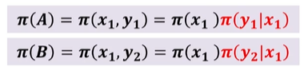
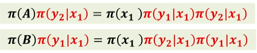
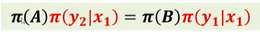
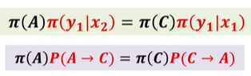
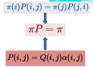
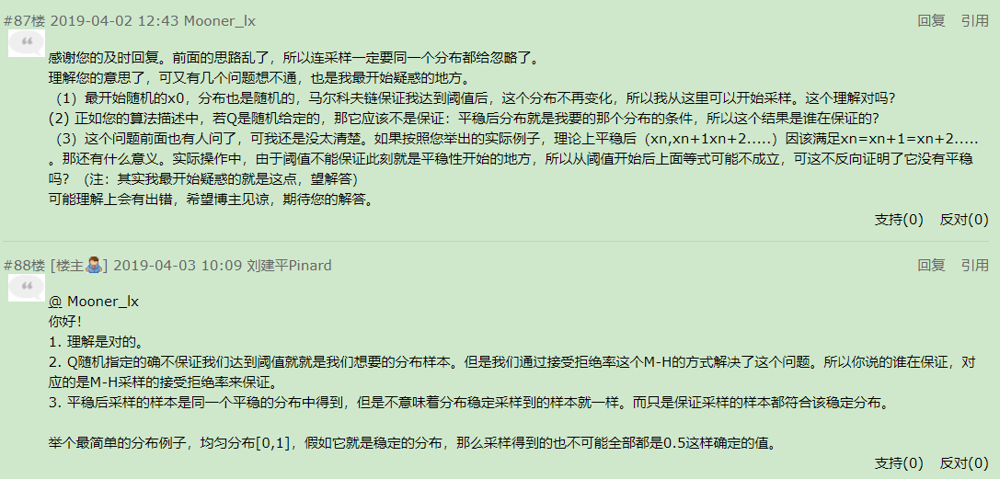

# `MCMC 马尔科夫链蒙特卡罗方法`

## `MC`

* 蒙特卡罗方法又称统计模拟法、随机抽样技术，是一种随机模拟方法，以概率和统计理论方法为基础的一种计算方法，是使用随机数（或更常见的伪随机数）来解决很多计算问题的方法。将所求解的问题同一定的概率模型相联系，用电子计算机实现统计模拟或，以获得问题的近似解。为象征性地表明这一方法的概率统计特征，故借用赌城蒙特卡罗命名。

* MCMC的目的是这样：事先知道要采样的真实分布是什么（即平稳分布），但很难在现实中对该分布进行采样，所以利用马尔可夫链的性质，通过 M_H 采样获得满足平稳分布的样本点。然后这些采样点本身就就刻画出了了真实的概率分布是怎么样的。

* MCMC只是为了解决分布已知，但是难采样的问题。如果分布不知，那么MCMC是无能为力的。

## `接受 - 拒绝采样过程：`

* 当 `cdf(累积分布函数)` 很难求解的时候，我们就不能通过求 `cdf(累积分布函数)` 的 `反函数` 来求得样本 `xi`。那么此时我们可以通过构造一个近似 `f(x)` 的分布 `q(x)` 来对 `f(x)` 进行近似，达到接近 `f(x)` 的目的，这个 `q(x)` 必须满足 `m * q(x) > f(x) `这个条件。

    

* 如何对样本 `x` 进行 `接受` 和 `拒绝`：

    

    * 因为 U 是随机取的，那我们采到的样本即使满足这个条件 f(Y) / C*g(Y) >= U 也可能不在 f(Y) 分布中的，这里就是一种采样的近似模拟，不是100%的等价于采样原分布。但是这个近似的分布很多时候也可以满足我们的需求。

### `接受拒绝 - 采样存在的问题：`

* 1）对于一些二维分布 `p(x,y)`，有时候我们只能得到条件分布 `p(x|y)` 和 `p(y|x)` 和,却很难得到二维分布 `p(x,y)` 一般形式，这时我们无法用 `接受-拒绝采样` 得到其样本集。

* 2）对于一些高维的复杂非常见分布 `p(x1,x2,...,xn)` ，我们要找到一个合适的 `q(x)` 和 `k` 非常困难。

### 补充：`为什么当 p(x) 概率分布很复杂的时候，很难进行采样，而需要使用比如：接受拒绝-采样、重参数采样等方法？`

* `蒙特卡洛采样中（重要采样），为什么从Px中采样困难？：`https://www.zhihu.com/question/313194059

    

## `马尔可夫链`

* 在蒙特卡罗方法中，我们采集大量的样本，构造一个合适的概率模型，对这个模型进行大量的采样和统计实验，使它的某些统计参量正好是待求问题的解。但是，我们需要大量采样，虽然我们有拒绝-接受采样和重采样技术，但是依旧面临采样困难的问题。

* 马尔科夫链就是帮助找到这些复杂概率分布的对应的采样样本集的白衣骑士。

* 为什么可以通过 `马尔科夫链` 来进行采样，因为初始任意简单概率分布比如 `高斯分布π0(x)` 采样得到 `状态值x0` ，基于 `条件概率分布P(x|x0)` 采样 `状态值x1` ，一直进行下去，当状态转移进行到一定的次数时，比如到 `n次` 时，我们认为此时的 `采样集(xn,xn+1,xn+2,...)` 即是符合我们的`平稳分布` 的 `对应样本集` ，可以用来做蒙特卡罗模拟求和了。
* `M-H的确没有选择的函数比目标分布要大的要求，因为他的采样方式是通过马尔科夫链转移，而不是直接的拒绝采样。`关于选择转移矩阵技巧，如果是离散的转移矩阵，其实随机选择一个也行，关于条件概率，则一般喜欢使用正态分布，因为对于的算法库API功能丰富，方便采样。

* 马尔科夫链更多内容：https://github.com/OneStepAndTwoSteps/Data_Analysis_notes/blob/master/2%E3%80%81%E6%95%B0%E6%8D%AE%E5%88%86%E6%9E%90%E3%80%81%E6%9C%BA%E5%99%A8%E5%AD%A6%E4%B9%A0/%E6%95%B0%E6%8D%AE%E5%88%86%E6%9E%90%E7%AE%97%E6%B3%95/%E9%9A%90%E9%A9%AC%E5%B0%94%E7%A7%91%E5%A4%AB%E6%A8%A1%E5%9E%8B/readme.md

## `HM采样`

首先跟拒绝算法类似，MH也是通过熟悉的分布去采样一个复杂的分布，但区别在于两点:

* （1）MH中自定义的分布与原分布不一定相似

* （2）接受率的定义不同，MH中的接受率是（某一状态）与（这一状态通过自定义分布的条件概率产生的下一个状态）在原分布中概率的大小的比值；而拒绝采样的接受率是在（自定义分布）中根据均匀分布产生一个点，然后看他落在（自定义分布）还是（原分布）的概率中。

需要确定的一点：

* （1）原分布与自定义分布的定义域需要一致，这样才能用自定义分布采样出符合原分布定义域的样本

有可能导致的问题：

* （1）如果自定义分布与原分布相差很多，则在某一区间内，可能自定义分布产生大量样本，但是原分布中只存在少量。此时只能用接受率，拒绝大量的样本。反之亦然。这就是效率低下的原因。

### `MH 采样过程：`

* 步骤：

    

* `1`、给定任意 `转移矩阵Q` 和 `平稳分布 π(x)`

* `2`、在 `t = 0` ，随机产生一个 `初始状态 x0`。

* `3~`、`t=0` 的时候，基于 `初始分布[0.3,0.4,0.3]` 采样，假设我们采样到了最高概率的第二个离散值，也就是 `x0=熊市` 。然后我们在马尔科夫转移矩阵中找到熊市对应的条件概率分布，也就是 `[0.15,0.8,0.05]` ， 此时我们基于这个概率分布来进行 `采样x1` ，最有可能采样到的还是熊市。 假设我们这次运气好采样到了横盘，即 `x1= 横盘` ，然后就找横盘对应的条件概率分布，也就是 `[0.25,0.25,0.5]` ，基于这个概率分布 `采样x2`，以此类推。

### `案例:`

* 以股市为例的马尔科夫模型举例：

    

* `1、第一次循环：`

    *   比如随机获取到 `初始状态 x0 = 熊市` ，熊市为第二个状态，对应的 `状态转移矩阵为[0.15,0.8,0.05]` ,然后基于这个概率分布采样，有80%的概率采到自己，比如比较幸运，采到了 `x1 = 横盘` 这个样本，那么接下来计算 ` α` 。

        `(熊市概率) π(j) = 目标分布 P(熊市)  ，Q(j,i) = 0.05`

        `(横盘概率) π(i) = 目标分布 P(横盘) ,   Q(i,j) = 0.25 `

        那么 `α  = P(熊市) * 0.05 /(P(横盘)*0.25) ≈ p`，那么这个 `p` 就是 `α` 的值。

        然后在 `均匀分布` 中随机取一个 `u` 。

        比较 `u < α` ，如果满足则接受 `横盘` 这个采样，`x1 = 横盘` 。

* `2、第二次循环`,同理，如果采到了 `牛市` 但是不接受样本，则仍然保留之前的样本为新的样本即 `x2 = 横盘`。

* `最终：`这样就能将样本的分布律收敛到平稳分布一样了，但是其中关于接受拒绝采样的措施感觉还是太随机了，这样也有可能造成即使符合目标分布也被拒绝，和不符合目标分布也被接受 的情况，不过基于大数定理，最后采样的结果还是很接近目标分布的，所以无伤大雅。

## `吉布斯采样`

比如，现在对概率分布 π(x,y) 进行采样：

* 假设现在在概率分布 π(x,y) 中随意取两点 A(x1,y1) 和 B(x1,y2)，则有公式：

    

* 如果在 π(A) 左右两边分别乘以 π(y2|x1),则有：

    

* 则形成了一个 `细致平衡条件 π(i)P(i,j) = π(j)P(j,i)`

    

* `既然满足细致平衡条件，那么就可以使用马尔科夫链进行采样`

* 接下来我们就可以将 `π(y2|x1) 称为状态转移概率 P(A -> B)`,则有：

    

推广：

* 同样，如果有一个点 C(x2,y1) ,我们同样可以使用刚刚的方法，则有：

    

* 意味着：

    

和 MH 不一样的地方在于：

* MH 的公式为：

    

    在 MH 中并不是所有的样本都会被接受，他是会根据 α 来做一定概率上的拒绝的。

* Gibbs 采样：

    吉布斯采样不一样，他的 `P(A -> B) = π(y2|x1)`，其中这个 `π(y2|x1)` 是已知的，这意味着这他不拒绝，会接受全部样本。

但是 `Gibbs 采样` 还是存在缺陷，`只允许在平行坐标轴方向进行采样`(要么平行 X 轴采样，要么平行 Y 轴采样)：

* 比如现在有一点 D ，已知 A B 的情况下不能对它采样，因为对于 A 和 B 来说 D 的 x坐标 或者 y坐标 和它们没有一个一样。

    

    

### `Gibbs 采样的基本步骤：`

## 参考：

* `你一定从未看过如此通俗易懂的马尔科夫链蒙特卡罗方法(MCMC)解读(上)：`https://zhuanlan.zhihu.com/p/250146007

* `你一定从未看过如此通俗易懂的马尔科夫链蒙特卡罗方法(MCMC)解读(下): `https://zhuanlan.zhihu.com/p/253784711

* `MCMC(一)蒙特卡罗方法：`https://www.cnblogs.com/pinard/p/6625739.html

* `MCMC(三)MCMC采样和M-H采样: `https://www.cnblogs.com/pinard/p/6638955.html#!comments

* `MCMC(四)Gibbs采样:` https://www.cnblogs.com/pinard/p/6645766.html

* `Video - 蒙特卡洛（Monte Carlo, MCMC）方法的原理和应用: `https://www.bilibili.com/video/BV17D4y1o7J2

* `Video - Gibbs采样:` https://www.bilibili.com/video/BV1ey4y1t7Jb

## 相关疑问：

问：

    for t=0 to n1+n2−1:
    a) 从条件概率分布Q(x|xt)中采样得到样本x∗
    b) 从均匀分布采样u∼uniform[0,1]
    c) 如果u<α(xt,x∗)=π(x∗)Q(x∗,xt), 则接受转移xt→x∗，即xt+1=x∗
    d) 否则不接受转移，t=max(t−1,0)

    u是[0,1]上的随机数，是否意味着c)步中拒绝和接受也是随机的？因为u<α由u的随机性决定。

答：

    是的，接受和拒绝满足随机性，类似之前讲到的接受-拒绝采样。

