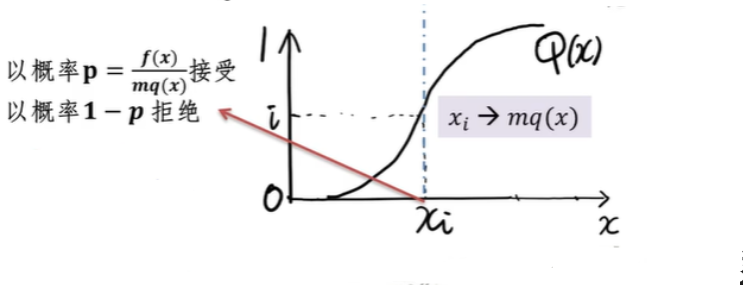

# `MCMC 马尔科夫链蒙特卡罗方法`

MCMC 其实就是随机抽样。

## `接受 - 拒绝采样过程：`

* 当 `cdf(累积分布函数)` 很难求解的时候，我们就不能通过求 `cdf(累积分布函数)` 的 `反函数` 来求得样本 `xi`。那么此时我们可以通过构造一个近似 `f(x)` 的分布 `q(x)` 来对 `f(x)` 进行近似，达到接近 `f(x)` 的目的，这个 `q(x)` 必须满足 `m * q(x) > f(x) `这个条件。

    

* 如何对样本 `x` 进行 `接受` 和 `拒绝`：

    

### `接受拒绝 - 采样存在的问题：`

* 1）对于一些二维分布 `p(x,y)`，有时候我们只能得到条件分布 `p(x|y)` 和 `p(y|x)` 和,却很难得到二维分布 `p(x,y)` 一般形式，这时我们无法用 `接受-拒绝采样` 得到其样本集。

* 2）对于一些高维的复杂非常见分布 `p(x1,x2,...,xn)` ，我们要找到一个合适的 `q(x)` 和 `k` 非常困难。

### 补充：`为什么当 p(x) 概率分布很复杂的时候，很难进行采样，而需要使用比如：接受拒绝-采样、重参数采样等方法？`

* `蒙特卡洛采样中（重要采样），为什么从Px中采样困难？：`https://www.zhihu.com/question/313194059

    

## `马尔可夫链`

* 在蒙特卡罗方法中，我们采集大量的样本，构造一个合适的概率模型，对这个模型进行大量的采样和统计实验，使它的某些统计参量正好是待求问题的解。但是，我们需要大量采样，虽然我们有拒绝-接受采样和重采样技术，但是依旧面临采样困难的问题。

* 马尔科夫链就是帮助找到这些复杂概率分布的对应的采样样本集的白衣骑士。

## 参考：

* `你一定从未看过如此通俗易懂的马尔科夫链蒙特卡罗方法(MCMC)解读(上)：`https://zhuanlan.zhihu.com/p/250146007

* `你一定从未看过如此通俗易懂的马尔科夫链蒙特卡罗方法(MCMC)解读(下): `https://zhuanlan.zhihu.com/p/253784711

* `MCMC(一)蒙特卡罗方法：`https://www.cnblogs.com/pinard/p/6625739.html

* `蒙特卡洛（Monte Carlo, MCMC）方法的原理和应用: `https://www.bilibili.com/video/BV17D4y1o7J2
