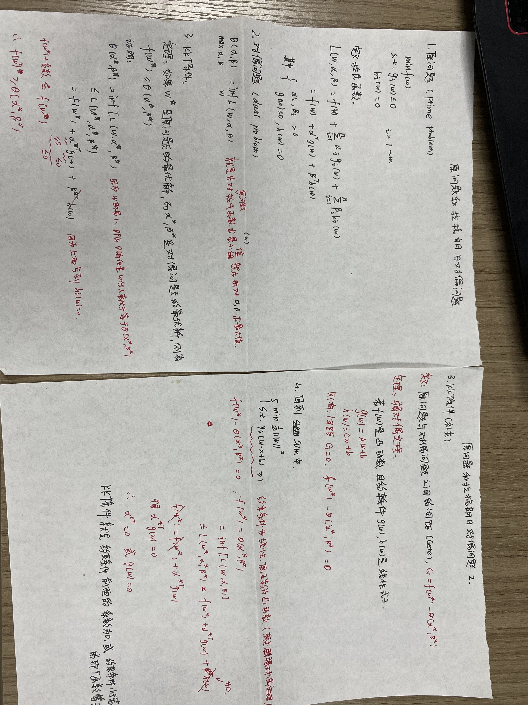

# 拉格朗日乘数法（Lagrange multiplier）和 KKT

## `拉格朗日乘数法`

在数学中的最优化问题中，`拉格朗日乘数法`（以数学家Joseph-Louis Lagrange命名）是一种  `寻找多元函数在其变量受到一个或多个条件的约束时的极值` 的方法。

## `KKT `

`Karush-Kuhn-Tucker (KKT) ` 条件是 `非线性规划(nonlinear programming)` 最佳解的必要条件。`KKT` 条件将 `Lagrange乘数法(Lagrange multipliers)` 所处理涉及等式的约束优化问题推广至 `不等式` 。

## `svm的前置数学知识`

## 参考资料：

* `拉格朗日函数和KKT：`https://www.cnblogs.com/mo-wang/p/4775548.html

* [拉格朗日乘数法理解](https://zhuanlan.zhihu.com/p/39354973)

* [Karush-Kuhn-Tucker (KKT)条件](https://zhuanlan.zhihu.com/p/38163970)

* [浅谈最优化问题的KKT条件](https://zhuanlan.zhihu.com/p/26514613)

* [机器学习-白板推导系列(六)-支持向量机SVM（Support Vector Machine）- Video](https://www.bilibili.com/video/BV1Hs411w7ci?p=2)

* [支持向量机(SVM)手动推导全过程 校园宽带小王子 - Video](https://www.bilibili.com/video/BV1A4411y7qK?p=2)

* [最优化理论与方法 - ideo](https://space.bilibili.com/507629580/video)

