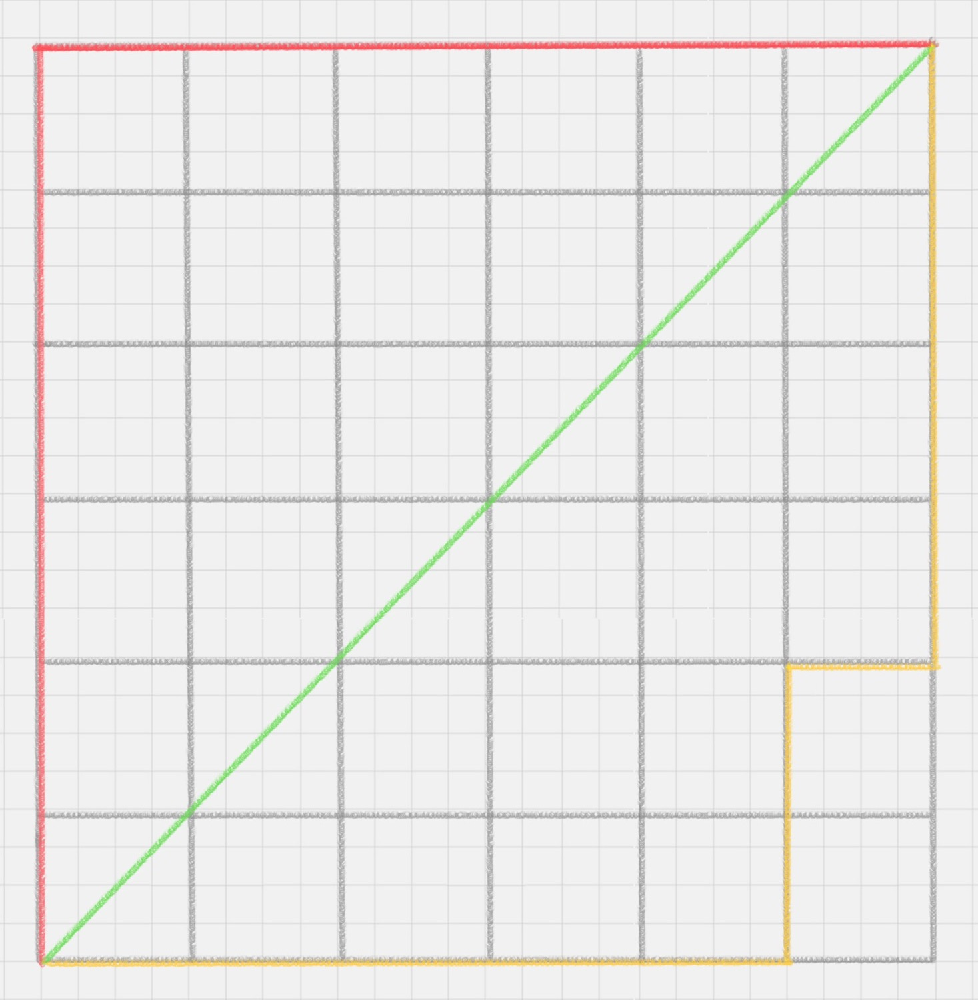
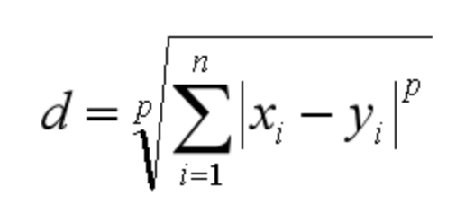
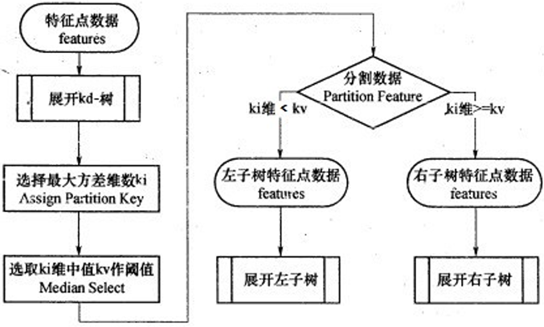

# `----------------------------- KNN ----------------------------- `

## `一、KNN的工作原理`

“近朱者赤，近墨者黑”可以说是 KNN 的工作原理。整个计算过程分为三步：
  
* 一、计算待分类物体与其他物体之间的距离；
    
* 二、统计距离最近的 K 个邻居；
    
* 三、对于 K 个最近的邻居，它们属于哪个分类最多，待分类物体就属于哪一类。

## `二、KNN 的三个基本要素：`

### `2.1、K值的选择：`

* `关于KNN为什么K值变大会造成欠拟合，K值过小会造成过拟合：`

* 首先明确题目，K值是过大，或者过小的，第二KNN的思想是用目标点邻点的类别投票判断目标点的类别。

    如果K过大，即和它距离较远的不同类别的点就变成了邻点，偏差变大，准确率就低了。如果K过小，比如就选最近的一个点，容易被噪声和错误的样本干扰，就容易过拟合。

    如果 K 值比较小，就相当于未分类物体与它的邻居非常接近才行。这样产生的一个问题就是，如果邻居点是个噪声点，那么未分类物体的分类也会产生误差，这样 KNN 分类就会产生过拟合。
                   

                 
    所以 K 值是个实践出来的结果，并不是我们事先而定的。在工程上， `我们一般采用交叉验证的方式选取 K 值。`
            
    交叉验证的思路就是，把样本集中的大部分样本作为训练集，剩余的小部分样本用于预测，来验证分类模型的准确性。`所以在 KNN 算法中，我们一般会把 K 值选取在较小的范围内，同时在验证集上准确率最高的那一个最终确定作为 K 值。`

### `2.2、距离度量`

* 在 KNN 算法中，还有一个重要的计算就是关于距离的度量。 `两个样本点之间的距离代表了这两个样本之间的相似度。距离越大，差异性越大；距离越小，相似度越大。`

* `关于距离的计算方式有下面五种方式：`
  
    * 一、欧氏距离；
    * 二、曼哈顿距离；
    * 三、闵可夫斯基距离；
    * 四、切比雪夫距离；

    * 五、余弦距离。

* `欧氏距离`:
            
    是我们最常用的距离公式，也叫做欧几里得距离。在二维空间中，两点的欧式距离就是：

    

    `注意：` 因为我们以后可能涉及到N维的空间，所以为了方便我们将这里的两个点定义为(x1,x2,x3……,xn)和(y1,y2,y3……,yn) 所以这样我们两个点之间的距离就是按照上面这个式子来计算了。

    `同理，我们也可以求得两点在 n 维空间中的距离：`

    

* `曼哈顿距离` 
         
    在几何空间中用的比较多。以下图为例，绿色的直线代表两点之间的欧式距离，而红色和黄色的线为两点的曼哈顿距离。所以曼哈顿距离等于两个点在坐标系上绝对轴距总和。用公式表示就是：

    

    

* `闵可夫斯基距离`:
          
    闵可夫斯基距离不是一个距离，而是一组距离的定义。对于 n 维空间中的两个点 x(x1,x2,…,xn) 和 y(y1,y2,…,yn) ， x 和 y 两点之间的闵可夫斯基距离为：   

    

    `其中 p 代表空间的维数，当 p=1 时，就是曼哈顿距离；当 p=2 时，就是欧氏距离；当 p→∞时，就是切比雪夫距离。`

* `余弦距离`:
     
    余弦距离实际上计算的是两个向量的夹角，是在方向上计算两者之间的差异，对绝对数值不敏感。在兴趣相关性比较上，角度关系比距离的绝对值更重要，因此余弦距离可以用于衡量用户对内容兴趣的区分度。比如我们用搜索引擎搜索某个关键词，它还会给你推荐其他的相关搜索，这些推荐的关键词就是采用余弦距离计算得出的。 

### `2.3、KNN 的分类决策：`

* KNN 算法中的分类决策规则往往是 `多数表决` ，即输入实例的K个近邻的训练实例中的多数类决定输入实例的类。

## `三、KD 树`

`KNN 的计算过程是大量计算样本点之间的距离。` 为了减少计算距离次数，提升 KNN 的搜索效率，人们提出了 KD 树（K-Dimensional 的缩写）。KD 树是对数据点在 K 维空间中划分的一种数据结构。在 KD 树的构造中，每个节点都是 k 维数值点的二叉树。既然是二叉树，就可以采用二叉树的增删改查操作，这样就大大提升了搜索效率。

### `3.1、KD树建树：`

假设现在有6个样本：`{(2,3)，(5,4)，(9,6)，(4,7)，(8,1)，(7,2)}` 开始建立KD树：

* `1、选择划分的特征维度：`通过计算每个维度的方差，选取方差最大的维度特征作为划分的特征维度，现在有
x ，y 两个特征，分别 x 维度的方差为 6.97 ， y 维度的方差为 5.37 ，所以 x 轴上方差更大，选取 x 轴做为划分维度。

* `2、进行二叉划分：`以 x 轴为维度，比较6个特征，选取其中的中位数做为划分点，6个样本中 (7,2) 为中位数，使用他进行划分，划分的线为 垂直于x轴的: x = 7  这条线。

* `3、划分子空间：`将 x > 7 的样本划分到右子空间，将 x < 7 的样本划分到左子空间。

* `4、迭代：`按照上面的划分方法对左子空间和右子空间继续划分。

* `小结：流程图如下：`

    

* `案例：`

    

### `3.2、KD树搜索最近邻：`

我们用3.1建立的KD树，来看对点(2,4.5)找最近邻的过程。

先进行二叉查找，先从（7,2）查找到（5,4）节点，在进行查找时是由y = 4为分割超平面的，由于查找点为y值为4.5，因此进入右子空间查找到（4,7），形成搜索路径<(7,2)，(5,4)，(4,7)>，但 （4,7）与目标查找点的距离为3.202，而（5,4）与查找点之间的距离为3.041，所以（5,4）为查询点的最近点； 以（2，4.5）为圆心，以3.041为半径作圆，如下图所示。可见该圆和y = 4超平面交割，所以需要进入（5,4）左子空间进行查找，也就是将（2,3）节点加入搜索路径中得<(7,2)，(2,3)>；于是接着搜索至（2,3）叶子节点，（2,3）距离（2,4.5）比（5,4）要近，所以最近邻点更新为（2，3），最近距离更新为1.5；回溯查找至（5,4），直到最后回溯到根结点（7,2）的时候，以（2,4.5）为圆心1.5为半径作圆，并不和x = 7分割超平面交割，如下图所示。至此，搜索路径回溯完，返回最近邻点（2,3），最近距离1.5。

### `3.3、KD树搜索最近邻：`

有了KD树搜索最近邻的办法，KD树的预测就很简单了，在KD树搜索最近邻的基础上，我们选择到了第一个最近邻样本，就把它置为已选。在第二轮中，我们忽略置为已选的样本，重新选择最近邻，这样跑k次，就得到了目标的K个最近邻，然后根据多数表决法，如果是KNN分类，预测为K个最近邻里面有最多类别数的类别。如果是KNN回归，用K个最近邻样本输出的平均值作为回归预测值。

## `四、KNN算法的不足`
    
* 1、当样本不平衡时，如一个类的样本容量很大，而其他类样本容量很小时，有可能导致当输入一个新样本时， 该样本的 k 个邻居中大容量类的样本占多数。因此可以采用权值的方法（和该样本距离小的邻居权值大）来 改进。 

* 2、另一个不足之处是计算量巨大，因为对每一个待分类的文本都要计算它到全体已知样本的距离，才能求得它的 k 个最近邻点。

* 一个常用的解决办法是，事先对已知样本点进行剪辑，事先去除对分类作用不大的样本。该算法比较适用于样本容量比较大的类域的自动分类，而那些样本容量较小的类域采用这种算法比较容易产生误分。 

## `五、注意事项：`

可以看出 `KNN` 它其实不需要训练，直接通过目标点的k个近邻进行多数表决即可，`sklearn` 中的 `knn` 模型其实 `fit` 的只是 `KD` 树。

## `参考链接：`

* `K近邻法(KNN)原理小结：`https://www.cnblogs.com/pinard/p/6061661.html

# `------------------------ Sklearn 中的 KNN 方法：------------------------ `

## `KNN 可以用来做回归也可以用来做分类`

`一、使用sklearn做分类器：`

    from sklearn.neighbors import KNeighborsClassifier

`二、使用sklearn做回归：`

    from sklearn.neighbors import KNeighborsRegressor

### `KNN分类器：`

KNeighborsClassifier方法中有几个重要的参数：
  
    KNeighborsClassifier(n_neighbors=5, weights=‘uniform’, algorithm=‘auto’, leaf_size=30)

1.n_neighbors：即 KNN 中的 K 值，代表的是邻居的数量。K 值如果比较小，会造成过拟合。如果 K 值比较大，无法将未知物体分类出来。一般我们使用默认值 5。
           
2.weights：是用来确定邻居的权重，有三种方式：
        
     一、weights=uniform，代表所有邻居的权重相同；

     二、weights=distance，代表权重是距离的倒数，即与距离成反比；

     三、自定义函数，你可以自定义不同距离所对应的权重。大部分情况下不需要自己定义函数。

3.algorithm：用来规定计算邻居的方法，它有四种方式：
  
    一、algorithm=auto，根据数据的情况自动选择适合的算法，默认情况选择 auto；
    
    二、algorithm=kd_tree，也叫作 KD 树，是多维空间的数据结构，方便对关键数据进行检索，不过 KD 树适用于维度少的情况，一般维数不超过 20，如果维数大于 20 之后，效率反而会下降；
    
    三、algorithm=ball_tree，也叫作球树，它和 KD 树一样都是多维空间的数据结果，不同于 KD 树，球树更适用于维度大的情况；
    
    四、algorithm=brute，也叫作暴力搜索，它和 KD 树不同的地方是在于采用的是线性扫描，而不是通过构造树结构进行快速检索。当训练集大的时候，效率很低。

4.leaf_size：代表构造 KD 树或球树时的叶子数，默认是 30，调整 leaf_size 会影响到树的构造和搜索速度。

