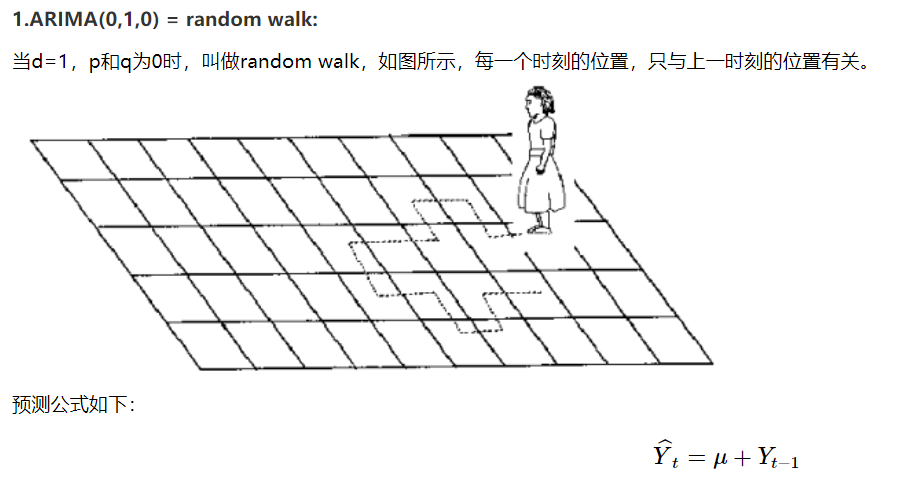
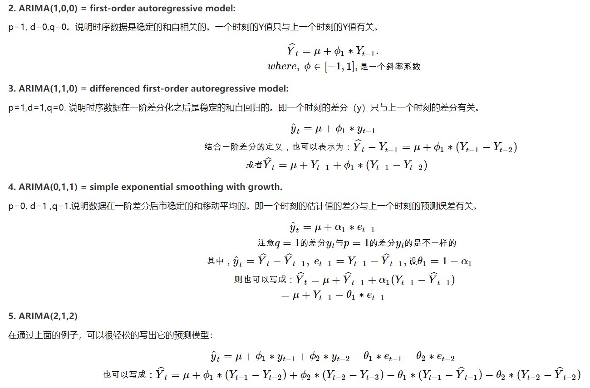
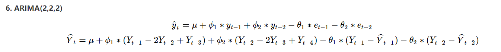
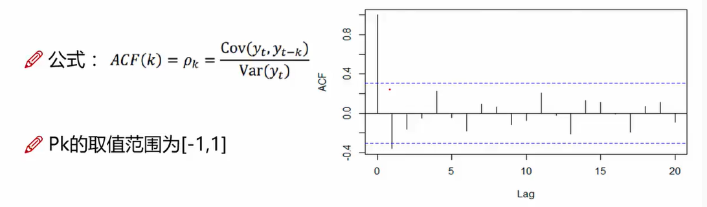

# `时间序列模型：`

`时间序列处理流程相关介绍：`https://github.com/OneStepAndTwoSteps/Data_Analysis_notes/tree/master/2%E3%80%81%E6%95%B0%E6%8D%AE%E5%88%86%E6%9E%90%E3%80%81%E6%9C%BA%E5%99%A8%E5%AD%A6%E4%B9%A0/%E6%95%B0%E6%8D%AE%E5%88%86%E6%9E%90%E7%AE%97%E6%B3%95/%E6%9C%BA%E5%99%A8%E5%AD%A6%E4%B9%A0%E7%AE%97%E6%B3%95/%E6%97%B6%E9%97%B4%E5%BA%8F%E5%88%97%E5%88%86%E6%9E%90%E7%AE%97%E6%B3%95/%E6%97%B6%E9%97%B4%E5%BA%8F%E5%88%97%E5%88%86%E6%9E%90%E6%AD%A5%E9%AA%A4

## `一、AR、MA、ARMA、ARIMA模型介绍`

### `时间序列预测模型`
时间序列分析模型建立了 __观察结果__ 与 __时间变化__ 的关系，能帮我们预测未来一段时间内的结果变化情况。

### `时间序列和逻辑回归的区别`
首先，在选择模型前，我们需要确定结果与变量之间的关系。 __回归分析训练得到的是目标变量 y 与自变量 x（一个或多个）的相关性，然后通过新的自变量 x 来预测目标变量 y。而时间序列分析得到的是目标变量 y 与时间的相关性。__

另外， __回归分析擅长的是多变量与目标结果之间的分析__ ，即便是单一变量，也往往与时间无关。而 __时间序列分析建立在时间变化的基础上__ ，它会 __分析目标变量的趋势、周期、时期和不稳定因素等__ 。这些趋势和周期都是在时间维度的基础上，我们要观察的重要特征。

### `AR 模型`

`AR` 的英文全称叫做 `Auto Regressive`，中文叫 __自回归模型__ 。这个算法的思想比较简单，它认为过去若干时刻的点通过线性组合，再加上白噪声就可以预测未来某个时刻的点。在我们日常生活环境中就存在白噪声，在数据挖掘的过程中，你可以把它理解为一个期望为 `0`，方差为`常数`的纯随机过程。`AR` 模型还存在一个阶数，称为 `AR（p）`模型，也叫作 `p` 阶自回归模型。它指的是通过这个时刻点的前 `p` 个点，通过线性组合再加上`白噪声`来预测当前时刻点的值。

白噪声模型服从均值为 `0`，方差为 `[σ]^2` 的正态分布,白噪声序列是最简单的时间序列，简单来说它是一列独立分布的正态序列。具体来说，它由于以下几个特征: 无序列相关性，无趋势性，是随机的。白噪声的每一个时序点都是服从正态分布的。

#### `p阶的含义`

* 1阶表示，今天和昨天之间的关系

* 2阶表示，今天和前天之间的关系

* 3阶表示，今天和大前天之间的关系

* ...... 

#### `自回归模型的限制`

* 1、自回归模型是用自身的数据来进行预测的

* 2、必须具有平稳性

* 3、必须具有自相关性，如果自相关系数小于0.5，则不宜采用

* 4、自回归只适用于预测与自身前期相关的现象

### `MA 模型`

MA 的英文全称叫做 Moving Average，中文叫做 __滑动平均模型__ 。它与 AR 模型大同小异，AR 模型是历史时序值的线性组合，MA 是通过历史白噪声进行线性组合来影响当前时刻点。AR 模型中的历史白噪声是通过影响历史时序值，从而间接影响到当前时刻点的预测值。同样 MA 模型也存在一个阶数，称为 MA(q) 模型，也叫作 q 阶移动平均模型。我们能看到 AR 和 MA 模型都存在阶数，在 AR 模型中，我们用 p 表示，在 MA 模型中我们用 q 表示，这两个模型大同小异，与 AR 模型不同的是 MA 模型是历史白噪声的线性组合。

#### `MA 小结`

* 移动平均法关注的是自回归模型中的误差项的累加

* 移动平均法能有效消除预测中的随机波动，让误差越平均越好。

### `ARMA 模型`
ARMA 的英文全称是 Auto Regressive Moving Average，中文叫做 __自回归滑动平均模型__ ，也就是 ` AR 模型和 MA 模型的混合` 。相比 AR 模型和 MA 模型，它有更准确的估计。同样 ARMA 模型存在 p 和 q 两个阶数，称为 ARMA(p,q) 模型。

对于上式 `p` 和 `q` 是我们要去指定的，`yi` 和 `θi` 是我们要求解的。

### `ARIMA 模型(p,d,q)`

`ARIMA` 的英文全称是 `Auto Regressive Integrated Moving Average` 模型，中文叫 __差分自回归滑动平均模型__ ，也叫求合自回归滑动平均模型。相比于 `ARMA`，`ARIMA` 多了一个 `差分` 的过程，作用是对不平稳数据进行差分平稳，在差分平稳后再进行建模。`ARIMA` 的原理和 `ARMA` 模型一样。相比于 `ARMA(p,q)` 的两个阶数，`ARIMA` 是一个三元组的阶数 `(p,d,q)`，称为 `ARIMA(p,d,q)` 模型。其中 `d` 是差分阶数。

* `AR` 是自回归，`p` 为自回归项，`MA` 为移动平均，`q` 为移动平均项数，`d` 为时间序列称为平稳时间序列所作的差分次数。

* `yt` 是当前值，`u` 是常数项，`P` 是阶数，`γi` 是自相关系数，`et` 是误差，即 `白噪声`。

* `原理：`将非平稳的时间序列转化成平稳的时间序列，然后将因变量仅对它的滞后值(阶数，p=2，表示滞后2阶)以及随机误差项的现值和滞后值(阶数)进行回归所建立的模型。

#### __`参数和数学形式：`__

* `自回归 (p)`：模型中自回归阶数的值。自回归阶数指定序列中的哪些先前值用于预测当前值。例如，自回归阶数 2 指定序列中过去两个周期的值将用于预测当前值。

* `差分 (d)`：指定估计模型之前应用于序列的差分阶数。在存在趋势的情况下，差分是必需的（存在趋势的序列通常不稳定，并且 ARIMA 建模假定平稳性），且用于消除趋势的影响。差分阶数对应于序列趋势的程度 - 第一阶差分考虑线性趋势，第二阶差分考虑二次趋势，依此类推。

* `移动平均值 (q)`：模型中移动平均值阶数的值。移动平均值阶数指定如何使用与先前值的序列均值的偏差来预测当前值。例如，移动平均值阶数 1 和 2 指定在预测序列的当前值时，需要考虑过去两个周期中与每个周期的序列均值的偏差。

#### `ARIMA模型的几个特例: `

#### __`基本思想：`__

* 将预测对象随着时间的推移而形成的 __非平稳时间序列__ 转化为 __平稳时间序列__,然后对 __因变量的滞后值__ 以及 __随机误差项的现值和滞后值__ 进行回归，这个模型一旦被识别之后就可以从时间序列的过去值及现在值来预测未来值

#### `差分(d): `

#### __`差分序列：`__

    差分序列就是原始序列的后项减去前项的值 如

        原始序列 11，12，13，14，15
        差分序列 1，1，1，1
    
    我们可以看出来，原先的原始序列是不平稳的 因为他处于一个增长的趋势 ，但是经过差分处理之后，我们看到差分序列是平稳的 都是1.

*   __`优点：`__

    模型只需要借助内在的变量就可以进行预测，而不需要外在的变量，比较简单，同时arima考虑到了数据在时间序列上的依存性，又考虑到了随机波动的干扰性，__对于短期的预测的准确度较高。__

*   __`缺点：`__

    __要求数据是稳定的，或者通过差分之后是稳定的，__ 如果经过差分之后还是不稳定的，那是无法捕捉到规律的。比如股票无法使用 `ARIMA` 进行预测的原因是，股票常会被国家政策影响。

## `二、选择合适的 q 和 p :`

### `自相关系数(ACF)`

* 有序的随机变量序列与其自身相比较，自相关系数函数反映了同一序列在不同时序的取值之间的相关性。

* `简单来说，它描述了该序列的当前值与其过去的值之间的相关程度。`时间序列可以包含趋势，季节性，周期性和残差等成分。ACF在寻找相关性时会考虑所有这些成分。

* 公式：

  

   从公式中可以看出，`ACF` 表示的是某一个时间下 `样本t` 与 `样本(t-k)` 之间的相关性。并且区间为 [-1,1]，蓝色的线表示 `置信区间`,横轴表示 `阶数`。

### `偏自相关系数(PACF)`

* `PACF` 是部分自相关函数或者偏自相关函数。基本上，它不是找到像ACF这样的滞后与当前的相关性，而是找到`残差`（在去除了之前的滞后已经解释的影响之后仍然存在）`与下一个滞后值的相关性`。

  

### `ACF 和 PACF 之间的差别`

* 如上图所示：ACF还包含了其他变量的影响，而PCAF是严格两个变量之间的相关性。

### `ARIMA(p，d，q)阶数确定`

  

可以通过绘制出的 `ACF` 和 `PACF` 图来对 `p` 和 `q` 进行选择：

  

`截尾：`落在置信区间内（95%的点都符合该规则）

* 表示多少阶之后落到了置信区间上，比如 PACF i为1的点落在了置信区间内，那么P可以取1.

`对于该图，p 和 q 可以这样取值：`

* p: 可以看到，当 p =1 时，进行了脱尾，并且 ACF 之后的阶数的相关性趋近于0，所以 p 值可以取1。

* q：可以看到，当 q = 8时，进行了截尾，并且之后 PCAF 的相关性趋近于0，所以 q 值可以取8.

#### `截尾和拖尾：`

* `截尾` 比 `拖尾` 趋近于 0 更加迅速

* `截尾` 在后期不会再有明显的增加。

* `截尾和拖尾：`https://blog.csdn.net/Caiqiudan/article/details/118059325

### `衡量模型拟合的好坏的一个标准AIC`

* `arma.aic: AIC 准则` ，也叫作赤池消息准则，它是衡量统计模型拟合好坏的一个标准，数值越小代表模型拟合得越好。

### `关于 ARIMA 参考链接：`

* https://www.cnblogs.com/bradleon/p/6827109.html

* https://www.cnblogs.com/bradleon/p/6832867.html

* https://www.cnblogs.com/ljhdo/p/13691572.html

* `时间序列和回归分析有什么本质区别？`https://www.zhihu.com/question/337447961/answer/784606565

* `实战案例为比特币走势预测：`https://github.com/OneStepAndTwoSteps/data_mining_analysis/tree/master/%E6%95%B0%E6%8D%AE%E5%88%86%E6%9E%90%E6%A1%88%E4%BE%8B/%E9%A2%84%E6%B5%8B%E6%AF%94%E7%89%B9%E5%B8%81%E8%B5%B0%E5%8A%BF

## `Prophet 模型介绍`

从官网的介绍来看，`Facebook` 所提供的 `prophet` 算法不仅可以处理时间序列存在一些异常值的情况，也可以处理部分缺失值的情形，还能够几乎全自动地预测时间序列未来的走势。从论文上的描述来看，这个 `prophet` 算法是基于时间序列分解和机器学习的拟合来做的，其中在拟合模型的时候使用了 `pyStan` 这个开源工具，因此能够在较快的时间内得到需要预测的结果。除此之外，为了方便统计学家，机器学习从业者等人群的使用，`prophet` 同时提供了 `R` 语言和 `Python` 语言的接口。

`Prophet` 程序的核心是一个 `加性回归模型`，包含四个主要组成部分：

* 分段线性或逻辑增长曲线趋势。Prophet通过从数据中选择变化点来自动检测趋势的变化。

* 使用傅立叶级数模拟的年度季节性分量。

* 使用虚拟变量的每周季节性成分。

* 用户提供的重要假日列表。

### `Prophet 相关参考链接`：

* `Prophet 模型使用介绍：`https://zhuanlan.zhihu.com/p/52330017

* `Prophet 模型使用介绍：`https://blog.csdn.net/anshuai_aw1/article/details/83412058

* `Kaggle 中使用：`https://www.kaggle.com/kk0105/predictive-analysis-with-different-approaches

