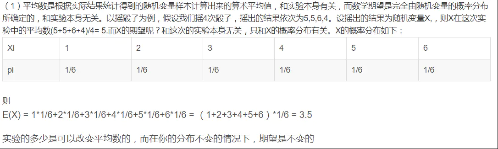

# `机器学习数学基础`

## `泰勒公式推导：`

* 通过极限推导泰勒公式：https://zhuanlan.zhihu.com/p/89717331

* 泰勒公式和 hessian 矩阵：https://www.zhongxiaoping.cn/2019/02/26/%E6%B3%B0%E5%8B%92%E5%85%AC%E5%BC%8F%E4%B8%8EHessian%E7%9F%A9%E9%98%B5/

## `期望：`

### `期望和积分：`

* 概率统计中期望就是积分，拿 EM算法 举例，表示方式可以：

    

    

`积分` 转换 `期望` 的时候，需要将其中的 `某个乘子` 作为概率分布，因此用了这种巧妙转换把 `q(Φ)` 拿出来，然后转换为他的 `期望` 。

### `平均值和期望：`

* 如果我们能进行无穷次随机实验并计算出其样本的平均数的话，那么这个平均数其实就是期望。当然实际上根本不可能进行无穷次实验，但是实验样本的平均数会随着实验样本的增多越来越接近期望，就像频率随着实验样本的增多会越来越接近概率一样。

    如果说 `概率` 是 `频率` 随样本趋于`无穷`的`极限`

    那么 `期望` 就是 `平均数` 随样本趋于`无穷`的`极限`

### `经验风险、期望风险、结构风险`

* `经验风险、期望风险、结构风险：`https://www.jianshu.com/p/903e35e1c95a

## `函数间隔和几何间隔`

* 函数间隔和几何间隔：

    

* 关于SVM数学细节逻辑的个人理解（一） ：得到最大间隔分类器的基本形式：https://www.cnblogs.com/xxrxxr/p/7535587.html

## `概率分布和概率密度函数：`

* `如何简单理解概率分布函数和概率密度函数？：`https://blog.csdn.net/anshuai_aw1/article/details/82626468

* `概率密度函数：`https://zh.wikipedia.org/wiki/%E6%A9%9F%E7%8E%87%E5%AF%86%E5%BA%A6%E5%87%BD%E6%95%B8

## `矩阵求导：`

* https://www.cnblogs.com/pinard/p/10773942.html

* https://fei-wang.github.io/matrix.html

