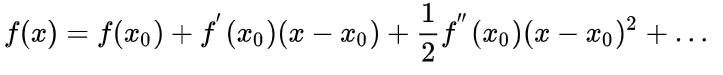

# 牛顿法

## `一、原理：`

* 牛顿法的原理是使用函数 $f(x_0)$ 的泰勒级数的前面几项来寻找方程 $f(x_0)=0$ 的根

## `二、牛顿法求根值公式：`

* 相当于一阶泰勒公式展开，用 $f(x_0)+f'(x_0)(x-x_0)=0$ 的解近似 $f(x_0)=0的解$：

    

  取泰勒公式一阶级数：
    
    

    取线性部分求导为0：

    $$f(x_0)+f'(x_0)(x-x_0)=0$$

    进一步得到：

    $$f(x_0)+f'(x_0)x-f'(x_0)x_0=0$$

    $$x=x_0-\frac{f(x_0)}{f'(x_0)}$$

## `三、牛顿法求最优化：`

* 最优化对泰勒公式进行 `二阶展开` ：
  
    `3.1、一维情况：`

    

    `3.2、多维情况：`

    

## `使用 牛顿法 求 根值`

### `简单来说：`

使用 `牛顿法` 求 `根值` 时：

* `1、`牛顿法通过选取函数中的一点作切线。

* `2、`切线与x轴的交点为切根(切线的根)，然后在交点处再做垂线，交于函数

* `3、`再与函数的交点再做切线。

* `4、`切线与x轴的交点为切根(切线的根)，然后在交点处再做垂线，交于函数

* ......

* 不断的往复最终得到的切线和x轴的交点会是否逼近 `根值` 。

### `极大似然函数的极值问题：`

比如当我们使用 `极大似然估计` 来求解 `逻辑回归` 的 `损失函数` 时，其实就是求解 `极大似然函数` 的 `导数` 为 `0` 的情况，此时能得到 `极值`，那么我们就可以通过 `牛顿迭代法` 来解得 `导函数` 的 `零点` 来得到 `最优参数` 。

### `参考：`

* [维基百科：牛顿法](https://zh.wikipedia.org/wiki/%E7%89%9B%E9%A1%BF%E6%B3%95)

* [维基百科：应用于最优化的牛顿法](https://zh.wikipedia.org/wiki/%E6%87%89%E7%94%A8%E6%96%BC%E6%9C%80%E5%84%AA%E5%8C%96%E7%9A%84%E7%89%9B%E9%A0%93%E6%B3%95)

* [牛顿法和拟牛顿法](https://zhuanlan.zhihu.com/p/46536960)

## `牛顿法和梯度下降法的对比`

* [牛顿法（Newton's method）VS梯度下降法（Gradient Descent）](https://www.cnblogs.com/webRobot/p/12237459.html)

## `参考链接：`

* [如何通俗易懂地讲解牛顿迭代法求开方？数值分析？](https://www.zhihu.com/question/20690553/answer/146104283)

* [一个Sqrt函数引发的血案](https://www.cnblogs.com/pkuoliver/archive/2010/10/06/sotry-about-sqrt.html)

* [最优化问题中，牛顿法为什么比梯度下降法求解需要的迭代次数更少？](https://www.zhihu.com/question/19723347/answer/113542871)

