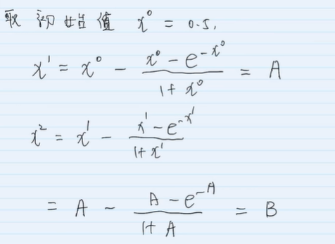
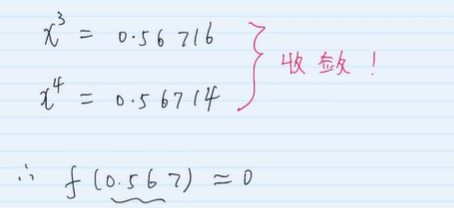

# 牛顿法：

`牛顿法` ，大致的思想是用 `泰勒公式` 的 `前几项` 来代替 `原来的函数` ，然后对函数进行求解和优化,，推导：

* `1、`函数 `f(x_k+1)` 在 `x = x_k` 处进行 `一阶泰勒` 展开：

    

    

    `最终得到 -- 牛顿法的迭代公式:`

    

* `2、`函数 `f(x_k+1)` 在 `x = x_k` 处进行 `二阶泰勒` 展开：

    同理可得，函数 `f(x)'` 为 `0` 的解:

    

### `收敛的充分条件：`

    若 f 二阶可导，那么在待求的零点 x 周围存在一个区域，只要起始点 x0 位于这个邻近区域内，那么牛顿-拉弗森方法必定收敛。

## `使用 牛顿法 求 根值`

### `简单来说：`

使用 `牛顿法` 求 `根值` 时：

* `1、`牛顿法通过选取函数中的一点作切线。

* `2、`切线与x轴的交点为切根(切线的根)，然后在交点处再做垂线，交于函数

* `3、`再与函数的交点再做切线。

* `4、`切线与x轴的交点为切根(切线的根)，然后在交点处再做垂线，交于函数

* ......

* 不断的往复最终得到的切线和x轴的交点会是否逼近 `根值` 。

## `牛顿迭代法`

### `1、一维场景：`

牛顿迭代法的基本公式：

`第一种情况：`

收敛条件 ：(图中的θ就是x)

`xn+1 == xn` 的时候收敛，此时找到根解。

`第二种情况：` 导函数的零点

`第三种情况：` 导函数的零点

### `牛顿法迭代法的求根案例：`

### `2、多维场景：`

`多维场景` 中的 `牛顿迭代法公式`：

## `使用 牛顿法 求 最优化 问题`

### `极大似然函数的极值问题：`

比如当我们使用 `极大似然估计` 来求解 `逻辑回归` 的 `损失函数` 时，其实就是求解 `极大似然函数` 的 `导数` 为 `0` 的情况，此时能得到 `极值`，那么我们就可以通过 `牛顿迭代法` 来解得 `导函数` 的 `零点` 来得到 `最优参数` 。

### `参考：`

* [牛顿法和拟牛顿法](https://zhuanlan.zhihu.com/p/46536960)

## `牛顿法和梯度下降法的对比`

* [牛顿法（Newton's method）VS梯度下降法（Gradient Descent）](https://www.cnblogs.com/webRobot/p/12237459.html)

## `参考链接：`

* [如何通俗易懂地讲解牛顿迭代法求开方？数值分析？](https://www.zhihu.com/question/20690553/answer/146104283)

* [一个Sqrt函数引发的血案](https://www.cnblogs.com/pkuoliver/archive/2010/10/06/sotry-about-sqrt.html)

* [最优化问题中，牛顿法为什么比梯度下降法求解需要的迭代次数更少？](https://www.zhihu.com/question/19723347/answer/113542871)

* [机器学习世界之逻辑回归03牛顿法 - Video](https://www.bilibili.com/video/BV1wx411d7CY)

