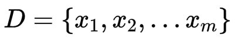
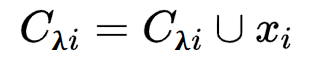
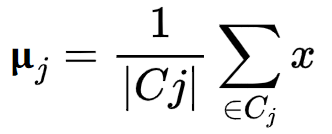

# `K-Means的工作原理和介绍`

## `一、介绍`

K-Means是一种无监督学习，解决的是聚类的问题。K表示的是K类，Means表示的是中心。

### `在介绍K-Means之前我们先聊一聊监督学习和无监督学习还有什么是聚类:`
在一个典型的 `监督学习` 中，我们有一个 `有标签` 的训练集，我们的目标是找到能够区分正样本和负样本的决策边界，在这里的监督学习中，我们有一系列标签，我们需要据此拟合一个假设函数。与此不同的是，在 `非监督学习` 中，我们的数据 `没有附带任何标签` ，我们拿到的数据就是这样的： 
 
 

在这里我们有一系列点，却没有标签。因此，我们的训练集可以写成只有𝑥(1),𝑥(2)…..一直到𝑥(𝑚)。我们没有任何标签𝑦。因此，图上画的这些点没有标签信息。也就是说，在非监督学习中，我们需要将一系列无标签的训练数据，输入到一个算法中，然后我们告诉这个算法，快去为我们找找这个数据的内在结构给定数据。我们可能需要某种算法帮助我们寻找一种结构。图上的数据看起来可以分成两个分开的点集（称为簇）， `一个能够找到我圈出的这些点集的算法，就被称为聚类算法。` 

##  `二、K-均值算法简述：`

* K-均值是最普及的聚类算法，算法接受一个未标记的数据集，然后将数据聚类成不同的组。

`K-均值是一个迭代算法，假设我们想要将数据聚类成 n 个组，其方法为: `
    
* `1、`首先选择𝐾个随机的点，称为聚类中心（cluster centroids）； 

* `2、`对于数据集中的每一个数据，按照距离𝐾个中心点的距离，将其与距离最近的中心点关联起来，与同一个中心点关联的所有点聚成一类。 
    
* `3、`计算每一个组的平均值，将该组所关联的中心点移动到平均值的位置。 

    重复步骤 `1-3` 直至中心点不再变化。 

`下面是一个聚类的示例：`

第一次迭代
                                                        

第二次迭代
                                                        

第三次迭代
                                                        

* `用𝜇1,𝜇2,...,𝜇𝑘 来表示聚类中心，用𝑐(1),𝑐(2),...,𝑐(𝑚)来存储与第𝑖个实例数据x^i最近的聚类中心的索引 c(1)=5 表示x^1属于第五簇`  。
          
    `ps:` c(i)表示的是当前x^i所属的那个簇的索引或者序号   这里的x^i的i是x的索引不是次方。
              
    这里再补充一个符号 `𝜇c(i)表示的是x^i所属的那个簇的聚类中心`，假设x^i被划分为第五个簇，意思是c(i)=5，c(i)=5意为这x^i被划分到了第五个簇，此时𝜇c(i)=𝜇5, c(i)=5，表示我们的x^i属于第5簇.

* `K-均值算法的伪代码如下：`

        Repeat { 
        for i = 1 to m 
        c(i) := index (form 1 to K) of cluster centroid closest to x(i) 
        for k = 1 to K 
        μk := average (mean) of points assigned to cluster k 
        } 

## `三、K-means 算法的流程：`

* `输入数据：`

    

    
* `划分k个簇,最大迭代次数N：
`
    

`步骤1：第一个 for 循环` 簇分配，我们要把每一个点划分给各自所属的聚类中心：

* 计算每个样本 `xi(i=,1,2,...m)` 到聚类中心 `μj(j=1,2,...k)` 的距离：

    

    将xi标记最小的为 `dij` 所对应的类别 `λi` 。此时将样本划分进簇: 

    

    通俗的将就是我们将每个点分配给他们最靠近的聚类中心，这样就可以使得这些点到对应的聚类中心距离的平方最小。
       
`步骤2：第二个 for 循环` 是聚类中心的移动。

* 即：对于每一个类𝐾，重新计算该类的质心(通过移动 `μ1，μ2……μk` 来最小化代价函数J)：

    

    如果所有的 `k` 个质心向量都没有发生变化，则转到 `步骤3`

`步骤3：`得到最后的划分结果。

## `四、算法优化K-means ++`

* `步骤1：`随机选取一个样本作为第一个聚类中心；

* `步骤2-1：`
计算每个样本与当前已有类聚中心最短距离（即与最近一个聚类中心的距离）这个值越大，表示被选取作为聚类中心的概率较大；

    `步骤2-2：`用轮盘法选出下一个聚类中心；

* `步骤3：`重复步骤2，直到选出 k 个聚类中心。

    简单的来说，就是 `K-means++` 就是选择离已选中心点最远的点。这也比较符合常理，聚类中心当然是互相离得越远越好。

    但是这个算法的缺点在于，难以并行化。

## `五、K-Means的目标`

* `K-Means` 要做的是找到 `c(i)` 和 `𝜇i` 最小化我们的代价函数 `J` 的 `c` 和 `μ`

*   `算法优点：`
 
    算法快速、简单
    
    对于大数据集有较高的效率，并且是可伸缩性的
    
    时间复杂度接近于线性，而且适合挖掘大规模的数据集
    
    主要需要调参的参数仅仅是簇数k。

*   `算法缺点：`
    
    在K-Means算法中K是事先指定的，这个K 值d额选定是非常难以估计的
    
    初始聚类中心的选择对聚类结果有较大影响，一旦初始值的选择不好，可能无法得到有效的聚类结果
    
    只适用于连续数值输入变量

    如果各隐含类别的数据不平衡，比如各隐含类别的数据量严重失衡，或者各隐含类别的方差不同，则聚类效果不佳。

    采用迭代方法，得到的结果只是局部最优。

    对噪音和异常点比较的敏感。

*   `算法停止条件：`

    是否满足收敛标准或者迭代次数

## `参考：`

* `K-Means聚类算法原理：`https://www.cnblogs.com/pinard/p/6164214.html   

* `【机器学习】K-means（非常详细）：`https://zhuanlan.zhihu.com/p/78798251