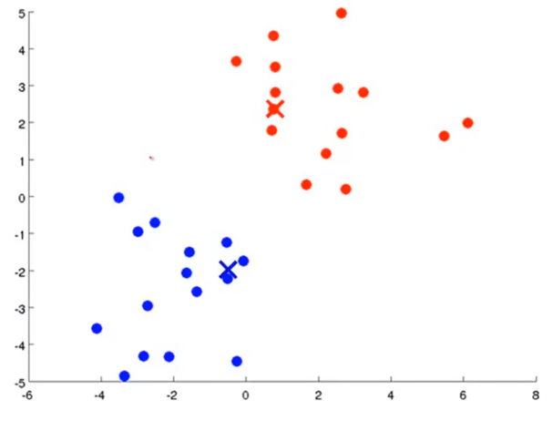

## K-Means的工作原理和介绍

### 介绍

K-Means是一种无监督学习，解决的是聚类的问题。K表示的是K类，Means表示的是中心。

### 在介绍K-Means之前我们先聊一聊监督学习和无监督学习还有什么是聚类:
在一个典型的 __监督学习__ 中，我们有一个 __有标签__ 的训练集，我们的目标是找到能够区分正样本和负样本的决策边界，在这里的监督学习中，我们有一系列标签，我们需要据此拟合一个假设函数。与此不同的是，在 __非监督学习__ 中，我们的数据 __没有附带任何标签__ ，我们拿到的数据就是这样的： 
 
 

在这里我们有一系列点，却没有标签。因此，我们的训练集可以写成只有𝑥(1),𝑥(2)…..一直到𝑥(𝑚)。我们没有任何标签𝑦。因此，图上画的这些点没有标签信息。也就是说，在非监督学习中，我们需要将一系列无标签的训练数据，输入到一个算法中，然后我们告诉这个算法，快去为我们找找这个数据的内在结构给定数据。我们可能需要某种算法帮助我们寻找一种结构。图上的数据看起来可以分成两个分开的点集（称为簇）， __一个能够找到我圈出的这些点集的算法，就被称为聚类算法。__ 

###  K-均值算法 
__K-均值是最普及的聚类算法，算法接受一个未标记的数据集，然后将数据聚类成不同的组。__

    一、K-均值是一个迭代算法，假设我们想要将数据聚类成 n 个组，其方法为: 
    
    二、首先选择𝐾个随机的点，称为聚类中心（cluster centroids）； 
    
    三、对于数据集中的每一个数据，按照距离𝐾个中心点的距离，将其与距离最近的中心点关联起来，与同一个中心点关联的所有点聚成一类。 
    
    四、计算每一个组的平均值，将该组所关联的中心点移动到平均值的位置。 

重复步骤 2-4 直至中心点不再变化。 

下面是一个聚类的示例：

第一次迭代
                                                        

第二次迭代
                                                        

第三次迭代
                                                        

__用𝜇1,𝜇2,...,𝜇𝑘 来表示聚类中心，用𝑐(1),𝑐(2),...,𝑐(𝑚)来存储与第𝑖个实例数据x^i最近的聚类中心的索引 c(1)=5 表示x^1属于第五簇__  。
          
__ps:__ c(i)表示的是当前x^i所属的那个簇的索引或者序号   这里的x^i的i是x的索引不是次方。
              
这里再补充一个符号 __𝜇c(i)表示的是x^i所属的那个簇的聚类中心__，假设x^i被划分为第五个簇，意思是c(i)=5，c(i)=5意为这x^i被划分到了第五个簇，此时𝜇c(i)=𝜇5, c(i)=5，表示我们的x^i属于第5簇.

__K-均值算法的伪代码如下：__

    Repeat { 
      for i = 1 to m 
      c(i) := index (form 1 to K) of cluster centroid closest to x(i) 
      for k = 1 to K 
      μk := average (mean) of points assigned to cluster k 
      } 

__算法分为两个步骤：__
       
__第一个 for 循环__ 簇分配，我们要把每一个点划分给各自所属的聚类中心，即：对于每一个样例𝑖，计算其应该属于的类，这其实也是在最小化代价函数(第一次for循环，保持我们的𝜇1,𝜇2,...,𝜇𝑘的位置不变，就是我们的聚类中心不变，然后再寻找𝑐(1),𝑐(2),...,𝑐(𝑚)使得我们的代价函数最小)。通俗的将就是我们将每个点分配给他们最靠近的聚类中心，这样就可以使得这些点到对应的聚类中心距离的平方最小
       
__第二个 for 循环__ 是聚类中心的移动，即：对于每一个类𝐾，重新计算该类的质心(通过移动μ1，μ2……μk来最小化代价函数J)。 

__K-均值算法做的实际就是把这两个系列的变量，把他们分成两半，第一组是变量c，第二组是变量μ，首先他会最小化J关于c变量，接着最小化J关于变量μ，然后保持迭代。__

__算法优化__

K-均值最小化问题，是要最小化所有的数据点与其所关联的聚类中心点之间的距离之和，因此 K-均值的代价函数（又称失真函数 Distortion function）为：

__公式表示为：1/m (每个样本的x^i到x^i所属的聚类中心的距离的平方)的累加__

假设我们现在只有两个变量x1和x2，根据我们上面的范数平方画出图的话就是下图：
    

假如x^i属于第5簇，该图表示x^i到第五簇距离的平方
                                                        

其中𝜇𝑐(𝑖)代表与𝑥(𝑖)最近的聚类中心点。 我们的的优化目标便是找出使得代价函数最小的 𝑐(1),𝑐(2),...,𝑐(𝑚)和𝜇1,𝜇2,...,𝜇𝑘： 

### K-Means的目标
K-Means要做的是找到c(i)和𝜇i最小化我们的代价函数J的c和μ

*   __算法优点：__
 
    算法快速、简单
    
    对于大数据集有较高的效率，并且是可伸缩性的
    
    时间复杂度接近于线性，而且适合挖掘大规模的数据集
    
*   __算法缺点：__
    
    在K-Means算法中K是事先指定的，这个K 值d额选定是非常难以估计的
    
    初始聚类中心的选择对聚类结果有较大影响，一旦初始值的选择不好，可能无法得到有效的聚类结果
    
    只适用于连续数值输入变量

*   __算法停止条件：__

    是否满足收敛标准或者迭代次数
