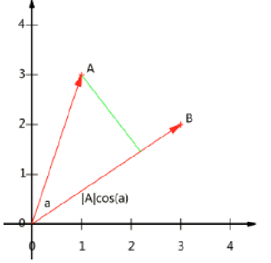
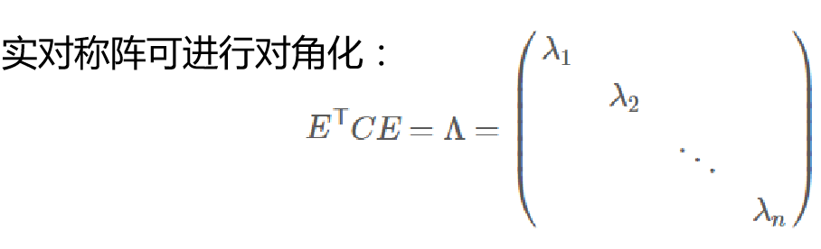
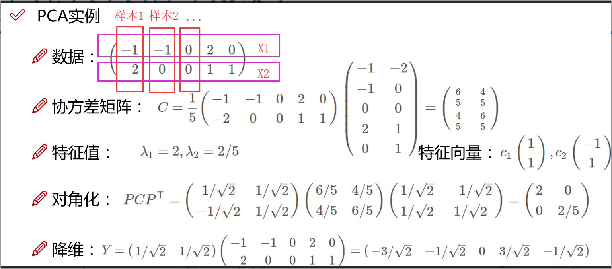

## `降维算法PCA`

PCA算法用于无监督学习中进行特征的降维(利用方差)，在原始数据中，我们的特征数据的分布可能比较密集，PCA就是想将我们这些分布密集的这些点扩散到其他的地方去，使得我们分布不要那么拥挤，这就需要我们去找最大的方差的方向，选择大的方差可以使得我们在降维后数据的分的更开，这就可以让我们更好的进行分类任务。这个时候我们的目标就是基于方差提取我们有价值的信息。

### `PCA降维后的现象`

使用pca进行降维之后我们的数据会变得无含义，假如原先的特征含义中有年龄、工资等等，我们将特征从100维降到10维，那我们能知道这10维的特征到底是什么含义吗？当然不知道了。所以降维之后他就不具备降维之前这个含义了，只能用于我们进行特征的计算。不影响我们得到最终的结果。但是当我们的数据需要保密时，我们可以使用降维算法进行降维，这样我们就不能知道这些特征到底是什么含义，就像之前做的信用卡诈骗的案例，我们拿到的数据是经过降维之后的数据，我们根本不知道其中一些指标的含义。

### `向量和基的变换`

基是当前数据的衡量标准，举个例子，假如我们的一个样本在一个2维平面中坐标为(5,6)，我们如何能知道我们的坐标是(5,6)呢，如果我们将坐标轴进行旋转30度，那我们之前的样本所在的坐标还是(5,6)吗，当然不是，所以我们在进行判断时需要以基为衡量标准。

`内积：`

向量之间的内积为向量之间同位置相乘然后相加 (a1,a2,a3,a4......an)^T  *  (b1,b2,b3,b4......bn)^T =a1b1 +a2b2+...anbn  这里的转置为将shape为(1,n) 转换为(n,1)
    
在几何上 A 和 B 的内积就是 A * B=|A| * |B| * cos(a)    设计向量B模为1，则A和B的内积等于A向B所在直线投影的矢量长度，如下图：

`基：` 在我们的二维坐标系中，我们样本所在位置为(3,2)，那么实际上表示的线性组合就是 x(1,0)^T + y(0,1)^T ,我们将(1,0)和(0,1)又称为二维空间中的一组基，基有两个重要的特性 1、一组基之间线性无关(比如二维空间中的垂直关系,内积为0) 2.可以生成整个空间(1,0)和(0,1)延伸之后可以生成整个二维空间。

`基变换:`

`变换` ：数据与一个基做内积运算，结果作为第一个新的坐标分量， 然后与第二个基做内积运算，结果作为第二个新坐标的分量,举个例子，我们原先的基为(1,0)和(0,1)样本做在坐标为(3，2),现在基发生了变化(我们的坐标轴发生了旋转)，现在我们将原先的样本(3,1)映射到新的基中的坐标： `如下图`

`两个矩阵相乘的意义是将右边矩阵中的每一列列向量变换到 左边矩阵中每一行行向量为基所表示的空间中去`

`PCA的思想：将我们的数据映射到一组新的基上，得到新的一种特征表达`

### 如何找基-协方差矩阵

`方向：` 选择一个方向（或者说基）使得尽量保留最多的原始信息，让我们的数据维度下降，主成分保留，同时希望投影后的投影值尽可能分散。

`方差:` 公式如图：

`目标：` 寻找一个一维基，使得所有数据变换为这个基上的坐标表示后，方差值越大越好

`协方差(假设均值为0，以0为均值去中心化我们就不用再减去均值了)：` 下面公式中ai和bi分别表示一种特征，此协方差公式表示，ai和bi之间的特征关系。举个例子，现在我们有两条曲线A( ~ )和曲线B( ~ )曲线A和曲线B相差不大，我们的协方差会比较大，如果我们的曲线相差较大，我们的协方差较小，协方差取值在[-1,1]之间，越趋近于1表示特征之间区别越大。

如果单纯只选择方差最大的方向，后续方向应该会和方差最大的方向接近重合。(假设我们现在方差最大的轴是x轴，那么次方差最大的轴呢？那肯定是离x轴最近的轴，但是如果这样那么会导致特征之间线性相关(我们的特征之间差异很小))`(我们可以通过协方差的公式求两个特征之间的相关性)` 这可以证明我们轴之间越接近相关性越大。

`解决思路：` 我们希望让两个字段尽可能表示更多的原始信息，所以我们是不希望它们之间存在（线性）相关性的。`其实从基的定义中我们就知道要线性无关`

`解决方案：` 当协方差为0时，表示两个字段完全独立。为了让协方差为0，选择第二个基时 只能在与第一个基正交的方向上选择 `(选择方差最大的正交方向)`。因此最终选择的两个方向一定是正交的(垂直)。

`例子：` 假如将一组N维向量降为K维（K大于0，小于N），目标是选择K个单位正交基，使原始数据变换到这组基上后，各字段两两间协方差为0，字段的方差则尽可能大那我们该怎么做呢？

`协方差矩阵(均值为0时)：` 如下图 X是我们的数据。 

协方差矩阵中对角线上的两个元素分别是两个字段的方差，非对角线上的元素是a和b的协方差(相等)(对称矩阵)，此时我们发现构造好了协方差矩阵我们就有了方差和协方差。

`协方差矩阵对角化：` 即除对角线外的其它元素化为0 (让协方差为0，使得特征非线性相关)，并且在对角线上 将元素按大小从上到下排列(将方差大的排在 "入1" "入2"...)

`那么如何将非对角线上的元素置0呢？` 可以通过线性代数中的实对称矩阵。

实对称矩阵：一个n行n列的实对称矩阵一定可以找到n个单位正交特征向量。 `图中P为基，C为协方差矩阵`

我们对我们的协方差矩阵(对称矩阵)进行矩阵分解，我们就可以得到正交向量，此时就可以进行对角化。

根据特征值的从大到小，将特征向量从上到下排列，则用前K行组成的矩阵 乘以原始数据矩阵X，就得到了我们需要的降维后的数据矩阵Y，比如有N个特征向量对应N个特征值，我们在N个特征值中找到K个最大的特征向量，有了这10个特征向量就可以进行降维操作

### 举例说明-流程回顾

`如上图我们进行分析：`

数据：我们现在有两个特征和5个样本

协方差矩阵：我们通过公式可以求出协方差矩阵 1/m * XX^T

`得到协方差矩阵之后，我们对其进行特征值和特征向量的求解 可以使用numpy工具：eig_val, eig_vec = np.linalg.eig(cov)，求解之后就是图上面的值`

`因为这里我们要将2维特征降维为1维特征，所以我们只能选择大的方差(因为我们降维到了只有一个特征，假如是从10维降到6维那我们选择前6大的方差)，即 "入=2" ，改特征值对应的特征向量是c1，c1即我们的基，这里我们还需要将我们的基进行归一化所以 1/(1+1)^1/2 就是 "庚号2分之一" 就是降维式子中的第一项`

此时我们就可以进行降维，降维后的值就是最后得出的值。

同时我们可以将我们归一化之后的基(特征向量)进行对角化验证，`注意这里用到了我们所有的特征向量c1,c2`,第一行为c1，第二行为c2进行对角化运算，运算之后，我们发现我们 `最后得到的结果却是是方差为2和2/5同时我们的协方差为0(非线性相关)`

### 总结

`PCA降维我们就是想找出方差最大，协方差为0的一组基用于我们映射，使得降维之后尽量保留最多的原始信息，让我们的数据维度下降，主成分保留，同时希望投影后的投影值尽可能分散。`
而协方差矩阵中的对角线方向刚好可以帮我们找到方差，非对角线方向刚好是我们的协方差，所以我们只要得出协方差矩阵，我们就可以进行下一步的求解了。

