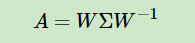
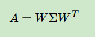
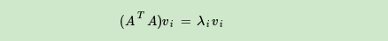

# `SVD 奇异值分解`

使用 `特征值` 和 `特征向量` 进行 `特征分解` 时，要求被分解的矩阵要是 `方阵`,所以存在着局限性，`SVD` 奇异值分解恰好能解决这样的问题。

## `一、特征值和特征向量：`

* `1.1、`如果说一个向量 `v` 是方阵 `A` 的特征向量，将一定可以表示成下面的形式：

  

  其中 `A` 是一个 `n×n` 的实对称矩阵（是一个方阵），`V` 是一个 `n` 维向量，则我们说 `λ` 是矩阵 `A` 的一个 `特征值(标量)` ，而 `V` 是矩阵 `A` 的特征值 `λ` 所对应的 `特征向量`。

  这种形式在数学上的含义：描述的是矩阵 A 对向量 v 的变换效果只有拉伸，没有旋转。(因为 $\lambda$ 这个值是一个数值)

* 也可以看成矩阵 $A$ ，向量 $V$ ，系数 $\lambda$ 这三者建立了一种联系，但显然我们无法直接通过上式 $Ax=\lambda x$ 来用 $v$ 和 $\lambda$ 表示 $A$ ，因为这个式子不是完备的，对于一个秩为 $m$ 的矩阵 $A$ ，应该存在 $m$ 个这样的式子，完备式子应该是：

  

    现在有表达式：

    $$AV = V\Sigma $$

* `1.2、`根据上面定义，如果求出了 `特征值` 和 `特征向量` ，那么对于 A 我们可以通过特征值和特征向量进行表示，则有 `特征分解：`

    $$AW = W\Sigma \rightarrow A=W\Sigma W^{-1}$$  

     
$其中，W 为特征向量，\Sigma为特征值$

    `得到：`
  

    通常我们会将 `W` 进行标准化，因为 `A` 是实对称矩阵，那么他们得到的特征向量是正交向量，进行标准化之后变成标准正交基，`W` 是由标准正交基组成的矩阵，有这一特性： $W^T = W^{-1}$ ,我们也将满足此式子的矩阵称为 `酉矩阵`。

* `从而有：`

  

## `二、SVD 的定义`

`SVD` 也是对矩阵进行分解，但是和特征分解不同，`SVD` 并不要求要分解的矩阵为方阵。假设我们的矩阵A是一个 `m×n` 的矩阵，那么我们定义矩阵 `A` 的 `SVD` 为：

其中 `U` 为一个 `m×m` 的方阵，`V` 为一个 `n×n` 的方阵， `U` 和 `V` 都是 [酉矩阵](#酉矩阵) （ `U` 和 `V` 特征向量为 `标准正交基`，满足  $U^T = U^{-1}$）

`U` 又被称为 `左奇异矩阵`，`V` 又被称为 `右奇异矩阵`。

### `1、如何求解得到 V ?`

*   其实通过下式可以求得 `V：` 

*   我们可以发现 关于 $A^TA$ 的所有特征向量所张成的矩阵是 `n×n` 矩阵 `V` 。

*  `为什么呢？可以通过下面公式：`

    

    

    $$ A^TA = V\Sigma ^2V^T  \longrightarrow (A^TA)V = V\Sigma^2 V^TV \longrightarrow  (A^TA)V = V\Sigma^2 $$

    可以看到 $V$ 就是 $A^TA$的特征向量。

    __注意：__上式的 $\Sigma$ 是一个 $m*n$ 的对角矩阵，严格意义上说是不能直接写成平方形式的，不过假设 $m>n$，最后的 $m−n$ 行的值全部都是0，那么忽略这些捣乱的0，那么 $Σ$ 就是一个方阵,就可以写成平方。

* 根据第一节 `特征值` 和 `特征向量` 的式子：

  

*   可以发现：`V` 就是 `特征向量组成的矩阵` ，`∑` 就是 `特征值组成的矩阵` (对角阵，对角线为特征值)。

### `2、如何求解得到 U ?`

*   其实通过：

*   我们可以求得 关于 `AAT` 的所有特征向量所张成的 `m×m` 矩阵 U 。

*   根据 `V` 中所示的公式，我们可以发现 关于 `AAT` 的所有特征向量所张成的矩阵是 `m×m` 矩阵 `U` 。

### `3、所以通过求解 AAT 和 ATA 的特征向量和特征值，我们可以得到 矩阵 U 和 V`

*   `对于 ATA 酉矩阵 V 右奇异矩阵：`
    

*   `对于 AAT 酉矩阵 U 左奇异矩阵：`
    

*   `特征值` 和 `特征向量` 求解的一种步骤：

    *   根据 `ATA` 或者 `AAT` 所成方阵行列式不为零来先求解出相关的特征值

    *   通过回代 `奇异值` 与 `特征向量` 乘积为 0 求得 `特征向量`
    
    *   如下所示:

        

        <!-- 

 -->

### `4、求解出 特征向量 后根据公式可以求解得到 Σ 中的特征值`

`第一种方式：`

*   根据先前公式：

    

*   通过公式我们能发现 `ATA` 的特征值为 `Σ` 的平方，那么 `Σ` 就是 `ATA` 的特征值开方后的结果，如下所示：

    

`第二种方式：`

* `U` 和 `V` 我们可以通过 `AAT ATA` 求特征向量得到，现在就剩下 `奇异值矩阵Σ` 没有求出了。由于 `Σ` 除了对角线上是奇异值其他位置都是 `0`，那我们只需要求出每个 `奇异值σ` 就可以了。

  

此时我们就能求得 `Σ` 了。

## `三、SVD 计算案例：`

## `四、SVD 数据压缩`

现在我们 已经求解出了 `U V Σ`：

这里要先介绍一个特性,对于 `奇异值分解` 或者 `特征分解` 来说有如下性质：

*   在 `奇异值矩阵` 中 `奇异值` 也是按照 `从大到小` 排列，而且 `奇异值` 的 `减少` 特别的 `快` 。

*   并且：`在很多情况下，前10%甚至1%的奇异值的和就占了全部的奇异值之和的99%以上的比例`。

那么 `SVD` 如何进行数据压缩呢？其实和 `PCA` 类似，通过保留 `奇异值`（特征值）较大的值来压缩数据,也就是通过设置 `Σ` 中对角线的 `σ` 来进行数据压缩，也就是通过保留前 `k` 位具有较大值的 `σ` 来实现数据的压缩：

### `1、特别的：`对于奇异矩阵来说它还支持对数据的行或者列单独进行压缩： 

*   左奇异矩阵 `U` 与 `Σ` 相乘：可以用于 `行` 数的压缩。

*   `Σ` 与 右奇异矩阵 `V` 相乘：可以用于 `列` 数即特征维度的压缩，也就是我们的 `PCA降维`。

### `2、当然：`其中也还是通过指定前 `k` 位较大的 `特征值` 来进行 `数据压缩` 的。

## `五、SVD 和 PCA：`

* 在 `PCA` 进行降维时，我们需要计算 `XTX` 当数据维度很大时，计算协方差矩阵的计算量是很大的。

  注意到我们的 `SVD` 也可以得到 `协方差矩阵 XTX` 最大的 `d` 个特征向量张成的矩阵，但是 `SVD` 有个好处，有一些 `SVD` 的实现算法可以不求先求出协方差矩阵 `XTX` ，也能求出我们的 `右奇异矩阵V` 。也就是说，我们的 `PCA` 算法可以不用做 `特征分解` ，而是做 `SVD` 来完成。这个方法在样本量很大的时候很有效。实际上，`scikit-learn` 的 `PCA` 算法的背后真正的实现就是用的 `SVD` ，而不是我们我们认为的暴力特征分解。

* 另一方面，注意到 `PCA` 仅仅使用了我们 `SVD` 的右奇异矩阵，没有使用左奇异矩阵，那么左奇异矩阵有什么用呢？

  假设我们的样本是 `m×n` 的矩阵 `X` ，如果我们通过 `SVD` 找到了矩阵 `XXT` 最大的 `d` 个特征向量张成的 `m×d` 维矩阵 `U` ，则我们如果进行如下处理：

  

* 可以得到一个 `d×n` 的矩阵 `X'`,这个矩阵和我们原来的 `m×n` 维样本矩阵 `X` 相比，行数从 `m` 减到了 `d` ，可见对 `行数` 进行了 `压缩` 。也就是说，左奇异矩阵可以用于 `行数` 的压缩。

* 相对的，`右奇异矩阵` 可以用于列数即 `特征维度` 的压缩，也就是我们的 `PCA降维` 。

## `补充：`

### `酉矩阵`

实对称矩阵的不同特征值对应的特征向量是正交的，从实对称矩阵中得到两个特征向量 `(1,1) (-1,1) `他们彼此正交，他们组成的特征矩阵进行标准化之后就称为标准正交基，可以看到：

## 参考：

`奇异值分解(SVD)原理与在降维中的应用：`https://www.cnblogs.com/pinard/p/6251584.html#!comments

