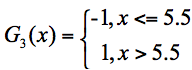

## Adaboost算法：

`AdaBoost 算法` 在数据挖掘中，分类算法可以说是核心算法，其与随机森林算法一样都属于 `分类算法中的集成算法。`

### 什么是集成？
集成用我们通俗的话来说就是“三个臭皮匠，顶个诸葛亮”。通过构建并结合多个机器学习器来完成学习任务，并且达到一个更好的结果。

### 为什么要集成？
因为臭皮匠好训练，诸葛亮却不好求。因此要打造一个诸葛亮，最好的方式就是训练多个臭皮匠，然后让这些臭皮匠组合起来，这样往往可以得到很好的效果。 `这就是 Boosting 算法的原理。`

### 集成算法的两种方式：
集成算法通常有两种方式， `分别是投票选举（bagging）和再学习（boosting）。`

`投票选举` 的场景类似把专家召集到一个会议桌前，当做一个决定的时候，让 K 个专家（K 个模型）分别进行分类，然后选择出现次数最多的那个类作为最终的分类结果。

`再学习` 相当于把 K 个专家（K 个分类器）进行加权融合，形成一个新的超级专家（强分类器），让这个超级专家做判断。

`投票选举和再学习的区别` 。

*   `Boosting` 的含义是提升，它的作用是每一次训练的时候都对上一次的训练进行改进提升，在训练的过程中这 K 个“专家”之间是有依赖性的，当引入第 K 个“专家”（第 K 个分类器）的时候，实际上是对前 K-1 个专家的优化。 `实际上每一次迭代(优化)都会引入一个新的弱分类器（这个分类器是每一次迭代中计算出来的，是新的分类器，不是事先准备好的）。` 

*   `bagging` 在做投票选举的时候可以并行计算，也就是 K 个“专家”在做判断的时候是相互独立的，不存在依赖性。

### Adaboost的工作原理：

举个例子 我们将弱分类器G1(x),弱分类器G2(x)，......弱分类器Gn(x)，通过不同的权重α1,α2,α3进行一个组合，集成为我们的诸葛亮(强分类器)。

假设弱分类器为Gi(x)，他在强分类器中的权重为αi，那么我们可以得到这个强分类器的公式：

<!-- 

 -->

也就是将我们的弱分类器进行一个组合，变成强分类器。

这里我们引入一个概念， `最优弱分类器` ，我们在进行弱分类器的组合的时候，我们需要选出最优弱分类器，为它赋予更高的 `权重` ，分类器的效果不好我们就降低它的权重。那么我们 `在进行迭代训练过程中如何知道哪个分类器是最优弱分类器` ，还有如何计算每个分类器对应的权重呢？

我们通常采用 `弱分类器对样本分类的错误率进行一个权重的分配` ，用公式表示就是：

<!-- 

 -->

其中 `ei表示的是第 i 个分类器的分类错误率。`

`同时我们会选择每次迭代训练过程中错误率最低的弱分类器作为最优弱分类器。`

 通常我们使用 `Dk+1 代表第 k+1 轮训练中，样本的权重集合` ，其中 Wk+1,1 代表第 k+1 轮中第 N 个样本的权重，因此用公式表示为：
 
<!-- 

 -->

`第 k+1 轮中的样本权重求解` ，是根据该样本在第 k 轮的权重以及第 k 个分类器的准确率而定，具体的公式为：
<!-- 

 -->

`补充：` 这里的Zk是归一化因子

### AdaBoost 算法示例

<!-- 

 -->

首先在第一轮训练中，我们得到 10 个样本的权重为 1/10，即初始的 10 个样本权重一致，D1=(0.1, 0.1, 0.1, 0.1, 0.1, 0.1, 0.1, 0.1, 0.1, 0.1)。

假设我有 3 个基础分类器：

<!-- 

 -->

我们可以知道分类器 f1 的错误率为 0.3，根据上面我们的训练样本中我们可以发现x大于2.5时我们的预测值是-1，但是6、7、8、这三个样本的真实值是1，所以，也就是 x 取值 6、7、8 时分类错误；分类器 f2 同理错误率为 0.4，即 x 取值 0、1、2、9 时分类错误；分类器 f3 同理错误率为 0.3，即 x 取值为 3、4、5 时分类错误。

这 3 个分类器中，我们发现f1、f3 分类器的错误率最低，因此我们选择 f1 或 f3 作为最优分类器，假设我们选 f1 分类器作为最优分类器，即第一轮训练得到：

<!-- 

 -->

根据分类器权重公式得到：

<!-- 

 -->

然后我们对下一轮的样本更新求权重值，代入 Wk+1,i 和Dk+1 的公式，可以得到新的权重矩阵：D2=(0.0715, 0.0715, 0.0715, 0.0715, 0.0715, 0.0715, 0.1666, 0.1666, 0.1666, 0.0715)。 `D2表示第二轮的训练中第0到9个样本的权重值。`

在第二轮训练中，我们继续统计三个分类器的准确率，可以得到分类器 f1 当 x 取值为 6、7、8 时分类错误，其错误率为 0.1666 * 3 (6、7、8分别对应的样本权重为0.1666)。分类器 f2 当 x 取值为 0、1、2、9 时分类错误，错误率为 0.0715 * 4。分类器 f3 当x 取值 3、4、5 时分类错误，错误率为 0.0715 * 3。

在这 3 个分类器中，f3 分类器的错误率最低，因此我们选择 f3 作为第二轮训练的最优分类器，即：

<!-- 

 -->

根据分类器权重公式得到：

<!-- 

 -->

然后我们对下一轮的样本更新求权重值，代入 Wk+1,i 和Dk+1  的公式，可以得到 D3=(0.0455,0.0455,0.0455,0.1667, 0.1667,0.01667,0.1060, 0.1060, 0.1060, 0.0455)。 `D3表示第三轮的训练中第0到9个样本的权重值。`

在第三轮训练中，我们继续统计三个分类器的准确率，可以得到分类器 f1 当 x 取值为 6、7、8 时分类错误，其错误率为 0.1060 * 3 (6、7、8分别对应的样本权重为0.1666)。分类器 f2 当 x 取值为 0、1、2、9 时分类错误，错误率为 0.0455 * 4。分类器 f3 当x 取值 3、4、5 时分类错误，错误率为 0.1667 * 3。

在这 3 个分类器中，f2 分类器的错误率最低，因此我们选择 f2 作为第三轮训练的最优分类器，即：

<!-- 

 -->

根据分类器权重公式得到：

<!-- 

 -->

`假设我们只进行 3 轮的训练，选择 3 个弱分类器，组合成一个强分类器，那么最终的强分类器 G(x) = 0.4236G1(x) + 0.6496G2(x)+0.7514G3(x)。`

实际上 AdaBoost 算法是一个框架，我们可以指定任意的分类器，通常我们可以采用 CART 分类器作为弱分类器。

## `案例：`

### 一、

### 二、

## 总结：

### Adaboost训练流程：

    1.获取基础权重。
    2.获取基础分类器。
    3.计算错误率，选择错误率最低的为最优分类器。
    4.通过计算分类器权重公式，得到下一轮样本更新的权重值，达到减少正确样本数据分布，增加错误样本数据分布。
    5.将下一轮样本更新的权重值代入W k+1,i和D k+1 的公式，得到新的权重矩阵，也就是本次训练各个样本的权重。
    6.在新的权重矩阵上，计算错误率，选择错误最低的为最优分类器。
    剩下的就是迭代，重复直到迭代完成或者达到足够低的错误率，获得强分类器。

实际上，AdaBoost 算法是通过改变样本的数据分布来实现的。 `AdaBoost 会判断每次训练的样本是否正确分类，对于正确分类的样本，降低它的权重，对于被错误分类的样本，增加它的权重。目的是为了让之前错误分类的样本得到更多概率的重复训练机会。` 再基于上一次得到的分类准确率，来确定这次训练样本中每个样本的权重。然后将修改过权重的新数据集传递给下一层的分类器进行训练。 `这样做的好处就是，通过每一轮训练样本的动态权重，可以让训练的焦点集中到难分类的样本上，最终得到的弱分类器的组合更容易得到更高的分类准确率。`

AdaBoost 算法是一种集成算法，它通过训练不同的弱分类器，将这些弱分类器集成起来形成一个强分类器。在每一轮的训练中都会加入一个新的弱分类器， `直到达到足够低的错误率或者达到指定的最大迭代次数为止。实际上每一次迭代都会引入一个新的弱分类器（这个分类器是每一次迭代中计算出来的，是新的分类器，不是事先准备好的）。`

在弱分类器的集合中，我们不必担心弱分类器太弱。实际上弱分类器只需要比随机猜测的效果略好一些即可。如果随机猜测的准确率是 50% 的话，那么每个弱分类器的准确率只要大于 50% 就可用。 `AdaBoost 的强大在于迭代训练的机制` ，这样通过 K 个“臭皮匠”的组合也可以得到一个“诸葛亮”（强分类器）。

每一轮的训练中，我们都需要从众多“臭皮匠”中选择一个拔尖的，也就是这一轮训练评比中的最优“臭皮匠”，对应的就是错误率最低的分类器。 `当然每一轮的样本的权重都会发生变化，这样做的目的是为了让之前错误分类的样本得到更多概率的重复训练机会,就像是错题本一样，多练习我们就可以做对题目了`

