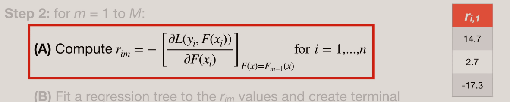
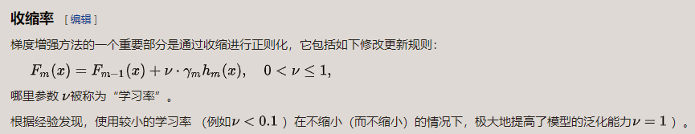
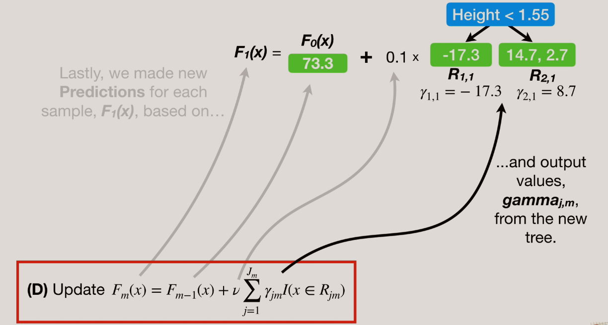

# `GBDT Regression`

`在下面算法中我们先使用 均方误差 作为 损失函数 对算法进行举例说明`

## `Input：`

* `input：training: ` set 中的 x 是特征，y 是真实值，n 是样本个数

* `loss function：`要是一个可微的损失函数，迭代次数为 M （每次迭代加一个树）
    
`假设现在的数据为：`

## `Algorithm：`
 

`1、Initialize model with a constant value:`

*   ` F0(x)：` 第一个树模型，`yi` 为观测值，`γ` 为预测值，我们想要真实值和预测值之间的差距极小化，初始化时，`γ` 为 所有观测值取的平均数。

`2、For m = 1 to M:`

*   `Step (A)：`

    

    `A、`计算负梯度中因为损失函数是均方误差，所以 rim 为残差，[为什么是残差请点击这里](#补充说明)。

*   `Step (B)：`

    

    `B、`对 `rmi` 拟合一颗回归树，得到第 m 棵树的叶节点区域 `Rjm`，`j = 1, 2, 3, ... , j`, 该例子和李航书上写的相反，李航书上写的 `Rmj` ，这里是 `Rjm` ，其实无所谓，这里只是提示一下。
    
    * `m：`为索引，表示地几棵树

    * `j：`为每片叶子的索引

        对于第一棵树进行二分类，则有 `Rjm` 如图：
    
        

*   `Step (C)：`

    

    `C:` `γjm` 为损失值，我们的目标就是极小化 `γjm` ，其实和初始化 F0 类似，只不过多了一个 `F(m-1)` 也就是还需要依赖上一个模型的结果。

    做法其实很简单，因为我们的 `损失函数` 是 `均方损失` ，那么接下来我们优化 `γ`，这里以优化 `γ2,1` 为例：

    `第一步`，得到损失函数的表达式：

    

    `第二步`，将 `观测值` 和 `预测值` 代入到表达式中，因为是 `m=1`，我们现在是第一棵树，那么 `预测值` 其中就是 `F0` ，初始化的 `γ` 为所有 `观测值` 的 `均值`,也就是：`(88 + 76 + 56)/3 = 73.3` 

    

    `简化之后`，因为要极小化损失，通过计算导数为 `0`，得到极小值，如下所示：

    

    `最后`，得到 γ 的值。

    

    其实对于 `均方损失` 来说，`γ` 就是节点中值的 `均值` 。

*   `Step (D)：`

    

    需要注意的是，如果你直接使用 `γ` 更新模型，如当 `m=1` 时, `F1(x) = F0(x) + γjm  `，则有: 
        
        第一个样本：73.4 + 8.7 = 82.1

        第二个样本：73.4 + 8.7 = 82.1

        第三个样本：73.3 + -17.3 = 56

    可以看到第三个样本已经就是真实值了，但是这样真的好吗？`不，这很容易就过拟合。`
    
    所以，可以看到公式中有一个 `v(nu)` 它表示 `学习率` ，这样有利于提高准确率，如下图所示： 

* `boosting 集成学习的正则化我们通常把他称为 步长 ，v(nu) 就是用于防止 GBDT 过拟合的` 。

    `ν` 的取值范围为 `0 < ν ≤1 `。对于同样的训练集学习效果，较小的 ν 意味着我们需要更多的弱学习器的迭代次数。通常我们用步长和迭代最大次数一起来决定算法的拟合效果。

    

    `更新模型：`

    

    `得到：`

        第一个样本：73.4 + 0.1 * 8.7 = 74.2

        第二个样本：73.4 + 0.1 * 8.7 = 74.2

        第三个样本：73.3 + 0.1 * -17.3 = 71.6

`3、接下来以此类推：`

* 1、`计算负梯度`，因为是均方损失，所以负梯度为残差：`r2i = yi - f1(xi)`

        r1,2 = 88 - 74.2 =  13.8
        
        r2,2 = 76 - 74.2 = 1.8

        r3,2 = 56 - 71.6 =  -15.6

* 2、对树节点打标签，得到 `Rjm`

* 3、计算得到 `min γ` ：
        
* 4、`更新模型`：`F2(x) = F1(x) + vγI `

`得到：`

`最后得到回归树：`也就是所有树相加之后得到。

`预测`，当有一组新的数据让我去预测时，如下图所示：

## `简述过程:`

* 1、计算负梯度，得到 rim 的值

* 2、对树叶结点打标签得到 Rjm，其中 j 为为每片叶子的索引，m 表示第几棵树

* 3、最小化 γ，也就是将上次一模型的预测结果代入到损失函数中，计算得到让损失最小的 γ

* 4、对模型进行更新，通过定义学习率进行学习。

可以看到，`GBDT` 其实就是用 `损失函数` 的 `负梯度` 来拟合本轮损失的近似值，进而拟合一个 CART 回归树。

 
 
 

## `补充说明:`

`一、为什么说 GDBT 是一阶泰勒展开，但不能按XGBoost 那样直接使用泰勒公式计算：`

* 虽然 `GBDT` 是一阶展开，但是不能按 `XGBOOST` 二阶展开的方式直接去推导。主要原因是一阶展开你只有一个位置有 $w_{tj}$，如果直接求导的话，那么 $w_{tj}$就没有了，你无法得到 $w_{tj}$的最优表达式。

  这里要这样理解： `L = 第一部分常数 + 第二部分一阶泰勒展开部分`。 而我们 `GBDT` 要拟合的就是第二部分一阶泰勒展开部分，此时要拟合的值，其实就是（L - 第一部分常数）这个差值，那么我们当前的二叉树只需要慢慢逼近，拟合残差（负梯度），慢慢逼近这个值即可

  本来是可以一步到位，直接拟合这个差值的，只是GBDT为了泛化能力，是通过拟合负梯度，通过多颗CART树慢慢达到这个目的的。

`二、为什么均方误差的负梯度是残差：`

* 因为是对 predicted 进行求导，根据链式法则，求导之后算式为：(observed - predicted)(-1)，即 (predicted - observed)，`因为是负梯度，所以最终式子为：(observed - predicted)，即残差。`

* `rim` 中：i 为第几个样本，m 为迭代的次数，那么每次迭代就是计算这n个样本的残差。

## `参考：`

* Gradient Boost Part 2 (of 4): Regression Details：https://www.youtube.com/watch?v=2xudPOBz-vs&t=737s

* 梯度提升技术: https://zh.wikipedia.org/wiki/梯度提升技术