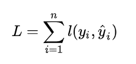
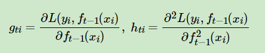

# `Xgboost`

`XGB` 是 `GBDT` 的高效实现，在 `GBDT` 的基础上做了改进，和 `GBDT` 的区别：

* `1、`GBDT 对损失函数做一阶泰勒展开(求负梯度)，XGB 对损失函数做了二阶泰勒展开，并且 XGB 引入了正则化。

* `2、`虽然同为boosting，但是 XGB 对每个弱学习器，比如决策树建立的过程做并行选择，找到合适的子树分裂特征和特征值。在并行选择之前，先对所有的特征的值进行排序分组，方便前面说的并行选择。对分组的特征，选择合适的分组大小，使用CPU缓存进行读取加速。将各个分组保存到多个硬盘以提高IO速度。

* `3、`支持缺失值的处理

## `XBG 损失函数`

* `损失函数通用式：`
    
    为了最终预测效果能够足够好，我们需要优化损失函数，使得 `y_hat(预测值)` 和 `y(真实值)` 之间的差距越小越好： 

    

    算式中的 `n` 为样本数量。

* `XGB 正则项：`

    

    这里的 J 是叶子节点的个数，而 wtj 是第j个叶子节点的最优值。

* `XBG 损失函数：`

    `注意：`初始弱学习器 $f_0(x)$ 的取值为一个常数c，这个c是可以使总体损失最小的常数。

    因为 `XGB` 是 `boosting` ，所以 `f(t)` 的模型是由 `f(t-1) + h(t) 新的模型` 得到，则有：

    

* `对损失函数进行二阶泰勒展开：`

    

    其中：
    

    
    得到损失函数：

    

* `简化：`

    其中因为 `L(y,f(t-1))` 是上一个模型得到的固定值，所以对优化没有影响，所以舍去。

    

    其中第一步到第二步：`wtj` 表示的是第`j`个叶子节点的取值，`ht(xi)`代表第`i`个样本在第`t`颗决策树的取值。假设它落在第`j`个叶子节点区域，则对于的值是确定的`wtj`。所以`m`个样本被划分到`J`个叶子节点区域，一共有`J`个不同的取值。那么我们可以按每个叶子区域的样本分别求和，由于一个叶子结点有多个样本存在，因此才有了`Σg(ti)` 和 `Σh(ti)`这两项 ，最后求`J`个叶子区域的样本函数值。

* `最终的损失函数：`

    

* `每个叶子节点区域` 的最优解 `wtj` 令上式导数为 0 可得：

    

## `XGB 叶子节点的分裂: `

* 计算特征分裂点的收益：

    

    `GL` 为左子树，`GR` 为右子树。

* 1）`枚举所有不同树结构的贪心法`

    我们试下贪心法，从树深度0开始，每一节点都遍历所有的特征，比如年龄、性别等等，然后对于某个特征，先按照该特征里的值进行排序，然后线性扫描该特征进而确定最好的分割点，最后对所有特征进行分割后，我们选择所谓的增益Gain最高的那个特征，而Gain如何计算呢？

* 目标函数中的 `G/(H+λ)` 部分，表示着每一个叶子节点对当前模型损失的贡献程度，融合一下，得到 `Gain的计算表达式`，如下所示：

    

* `第一个值得注意的地方` 是 `“对于某个特征，先按照该特征里的值进行排序”` ，这里举个例子。

    比如设置一个值 `a` ，然后枚举所有 `x < a`、`a  < x` 这样的条件（x代表某个特征比如年龄age，把age从小到大排序：假定从左至右依次增大，则比a小的放在左边，比a大的放在右边），对于某个特定的分割a，我们要计算a左边和右边的导数和。

    比如总共五个人，按年龄排好序后，一开始我们总共有如下4种划分方法：

    * 把第一个人和后面四个人划分开

    * 把前两个人和后面三个人划分开

    * 把前三个人和后面两个人划分开

    * 把前面四个人和后面一个人划分开

    `接下来，把上面4种划分方法全都各自计算一下 `Gain` ，看哪种划分方法得到的 `Gain` 值最大则选取哪种划分方法`，经过计算，发现把第2种划分方法“前面两个人和后面三个人划分开”得到的Gain值最大，意味着在一分为二这个第一层层面上这种划分方法是最合适的,那么我们就选择这个特征作为分裂的节点。

    换句话说，对于所有的特征x，我们只要做一遍从左到右的扫描就可以枚举出所有分割的梯度和 `GL` 和 `GR` 。然后用计算 `Gain` 的公式计算每个分割方案的分数就可以了。

    然后后续则依然按照这种划分方法继续第二层、第三层、第四层、第N层的分裂。

* `第二个值得注意的地方` 是引入分割不一定会使得情况变好，所以我们有一个引入新叶子的惩罚项。优化这个目标对应了树的剪枝， 当引入的分割带来的增益小于一个阀值γ 的时候，则忽略这个分割。

    换句话说，当引入某项分割，结果分割之后得到的分数 -(减去) 不分割得到的分数得到的值太小（比如小于我们的最低期望阀值γ），但却因此得到的复杂度过高，则相当于得不偿失，不如不分割。即做某个动作带来的好处比因此带来的坏处大不了太多，则为避免复杂 多一事不如少一事的态度，不如不做。

    相当于在我们发现“分”还不如“不分”的情况下后（得到的增益太小，小到小于阈值γ），会有2个叶子节点存在同一棵子树上的情况，就像下图这样。

    

## `XGB 缺失值处理：`

* 这里有2个阶段。第一个阶段是选择子树分裂 特征 A 的最优分裂阈值。在这个场景里，如果 特征A 有缺失值，那么计算特征A 的分裂增益的时候，是不考虑缺失特征A的样本的。假设我们最后确定了A的划分阈值。

* 接着就进入第二阶段，处理缺失特征A的样本。我们需要看看缺失值放左边好还是右边好。此时并不会考虑子树分裂的阈值，这个在第一阶段以已经确定了，目的是：

        a) 各个特征竞争寻找最优score. 

        b)预测的时候，缺失特征A的预测样本是走左子树好还是右子树好。

## `参考：`

`XGBoost算法原理小结:` https://www.cnblogs.com/pinard/p/10979808.html#!comments

`【机器学习】决策树（下）——XGBoost、LightGBM（非常详细）：`https://zhuanlan.zhihu.com/p/87885678