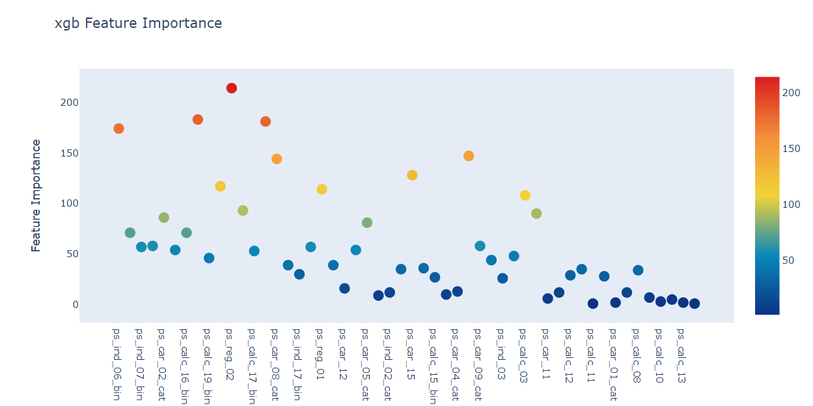

# xgb

    import xgboost as xgb
    import lightgbm as lgb

## `XGB 参考文章`

* [XgBoost使用指南-中文](http://www.huaxiaozhuan.com/%E5%B7%A5%E5%85%B7/xgboost/chapters/xgboost_usage.html)

* [Python机器学习笔记：XgBoost算法](https://www.cnblogs.com/wj-1314/p/9402324.html)

* [xgb python api 和参数说明](https://xgboost.readthedocs.io/en/latest/python/python_api.html)

## `gini系数`

* [Gini Coefficient - An Intuitive Explanation](https://www.kaggle.com/batzner/gini-coefficient-an-intuitive-explanation)

### `方案1：`

    from numba import jit    

[`1、定义基尼系数：`](https://www.kaggle.com/cpmpml/extremely-fast-gini-computation)

    @jit
    def eval_gini(y_true, y_prob):
        y_true = np.asarray(y_true)
        y_true = y_true[np.argsort(y_prob)]
        ntrue = 0
        gini = 0
        delta = 0
        n = len(y_true)
        for i in range(n-1, -1, -1):
            y_i = y_true[i]
            ntrue += y_i
            gini += y_i * delta
            delta += 1 - y_i
        gini = 1 - 2 * gini / (ntrue * (n - ntrue))
        return gini

[`2、定义 xgb gini 系数：`](https://www.kaggle.com/ogrellier/xgb-classifier-upsampling-lb-0-283)

    def gini_xgb(preds, dtrain):
        labels = dtrain.get_label()
        gini_score = -eval_gini(labels, preds)
        return [('gini', gini_score)]

`3、调用：`

    xgb_model = xgb.train(params, d_train, nrounds, watchlist, early_stopping_rounds=100, 

### `方案2：`

`1、定义基尼系数：`

    def gini(y, pred):
        g = np.asarray(np.c_[y, pred, np.arange(len(y)) ], dtype=np.float)
        g = g[np.lexsort((g[:,2], -1*g[:,1]))]
        gs = g[:,0].cumsum().sum() / g[:,0].sum()
        gs -= (len(y) + 1) / 2.
        return gs / len(y)

`2、定义 xgb gini 系数：`

    # 返回一个 normalized 后的 gini 分数
    def gini_xgb(pred, y):
        y = y.get_label()
        return 'gini', gini(y, pred) / gini(y, y)

`3、调用：`

    # xgb.train 中的 feval 参数可以用于指定评估方法，这里我们使用自定义的 gini_xgb 使用gini系数来进行评估
    xgb_model = xgb.train(params, d_train, nrounds, watchlist, early_stopping_rounds=100, 
                            feval=gini_xgb, maximize=True, verbose_eval=100)

### `对于基尼系数的分数`

根据 ROC 曲线来评估分类器

分类质量可以使用 ROC 曲线下面的面积大小来计算衡量，这个曲线下的面积就是 AUC 系数。

AUC 系数越高越好。AUC = 1 意味着这是一个完美的分类器，我们把所有的东西都分类准确了。对于纯随机数的分类，我们的 AUC = 0.5。如果 AUC < 0.5，那么意味着这个分类器的性能比随机数还要差。

这里再说一个概念：基尼系数（Gini Coefficient），GC = 2 * AUC - 1。基尼系数越高，代表模型的效果越好。如果 GC = 1，那么这就是一个完美的模型了。如果 GC = 0，那么代表这只是一个随机数模型。

### `注意：`

我们需要区分开 `基尼系数` 和 `基尼不纯度` 之间的区别:

* [Gini指数、Gini系数、Gini不纯是一回事吗？](http://sofasofa.io/forum_main_post.php?postid=1001461)

### XGB + LGB 集成

案例：

`1、定义gini评估方法`

    def gini(y, pred):
        g = np.asarray(np.c_[y, pred, np.arange(len(y)) ], dtype=np.float)
        g = g[np.lexsort((g[:,2], -1*g[:,1]))]
        gs = g[:,0].cumsum().sum() / g[:,0].sum()
        gs -= (len(y) + 1) / 2.
        return gs / len(y)

    def gini_xgb(pred, y):
        y = y.get_label()
        return 'gini', gini(y, pred) / gini(y, y)

    def gini_lgb(preds, dtrain):
        y = list(dtrain.get_label())
        score = gini(y, preds) / gini(y, y)
        return 'gini', score, True

`2、使用 xgb 和 lgb 训练和预测：`

`版本一：使用 ndarrary 数据进行训练：`

    import xgboost as xgb
    import lightgbm as lgb

    # xgb
    params = {'eta': 0.02, 'max_depth': 4, 'subsample': 0.9, 'colsample_bytree': 0.9, 
            'objective': 'binary:logistic', 'eval_metric': 'auc', 'silent': True}

    X = train.drop(['id', 'target'], axis=1)
    features = X.columns
    X = X.values                                <---- nd arrary 数据
    y = train['target'].values
    sub=test['id'].to_frame()
    sub['target']=0

    nrounds=200  # need to change to 2000
    kfold = 2  # need to change to 5
    skf = StratifiedKFold(n_splits=kfold, random_state=0)
    for i, (train_index, test_index) in enumerate(skf.split(X, y)):
        print(' xgb kfold: {}  of  {} : '.format(i+1, kfold))
        X_train, X_valid = X[train_index], X[test_index]
        y_train, y_valid = y[train_index], y[test_index]
        d_train = xgb.DMatrix(X_train, y_train) 
        d_valid = xgb.DMatrix(X_valid, y_valid) 
        watchlist = [(d_train, 'train'), (d_valid, 'valid')]
        xgb_model = xgb.train(params, d_train, nrounds, watchlist, early_stopping_rounds=100, 
                            feval=gini_xgb, maximize=True, verbose_eval=100)

        # 结尾 除以 (2*kfold)，是因为要将 xgb 和 lgb 去平均然后将结果相加合并
        sub['target'] += xgb_model.predict(xgb.DMatrix(test[features].values), 
                            ntree_limit=xgb_model.best_ntree_limit+50) / (2*kfold)
    gc.collect()
    sub.head(2)

    # lgb
    params = {'metric': 'auc', 'learning_rate' : 0.01, 'max_depth':10, 'max_bin':10,  'objective': 'binary', 
            'feature_fraction': 0.8,'bagging_fraction':0.9,'bagging_freq':10,  'min_data': 500}

    skf = StratifiedKFold(n_splits=kfold, random_state=1)
    for i, (train_index, test_index) in enumerate(skf.split(X, y)):
        print(' lgb kfold: {}  of  {} : '.format(i+1, kfold))
        X_train, X_eval = X[train_index], X[test_index]
        y_train, y_eval = y[train_index], y[test_index]
        lgb_model = lgb.train(params, lgb.Dataset(X_train, label=y_train), nrounds, 
                    lgb.Dataset(X_eval, label=y_eval), verbose_eval=100, 
                    feval=gini_lgb, early_stopping_rounds=100)

        # 结尾 除以 (2*kfold)，是因为要将 xgb 和 lgb 去平均然后将结果相加合并
        sub['target'] += lgb_model.predict(test[features].values, 
                            num_iteration=lgb_model.best_iteration) / (2*kfold)
        
    sub.to_csv('sub10.csv', index=False, float_format='%.5f') 
    gc.collect()
    sub.head(2)

`版本2：使用 dataframe 数据进行训练：`

    # xgb
    params = {'eta': 0.02, 'max_depth': 4, 'subsample': 0.9, 'colsample_bytree': 0.9, 
            'objective': 'binary:logistic', 'eval_metric': 'auc', 'silent': True}

    X = train.drop(['id', 'target'], axis=1)
    features = X.columns
    y = train['target']
    sub=test['id'].to_frame()
    sub['target']=0

    nrounds=200  # need to change to 2000
    kfold = 2  # need to change to 5
    skf = StratifiedKFold(n_splits=kfold, random_state=0)
    for i, (train_index, test_index) in enumerate(skf.split(X, y)):
        print(' xgb kfold: {}  of  {} : '.format(i+1, kfold))
        X_train, X_valid = X.loc[train_index], X.loc[test_index]
        y_train, y_valid = y.loc[train_index], y.loc[test_index]
        d_train = xgb.DMatrix(X_train, y_train) 
        d_valid = xgb.DMatrix(X_valid, y_valid) 
        watchlist = [(d_train, 'train'), (d_valid, 'valid')]
        xgb_model = xgb.train(params, d_train, nrounds, watchlist, early_stopping_rounds=100, 
                            feval=gini_xgb, maximize=True, verbose_eval=100)

        # 结尾 除以 (2*kfold)，是因为要将 xgb 和 lgb 去平均然后将结果相加合并
        sub['target'] += xgb_model.predict(xgb.DMatrix(test[features]), 
                            ntree_limit=xgb_model.best_ntree_limit+50) / (2*kfold)
    gc.collect()
    sub.head(2)

    # lgb
    params = {'metric': 'auc', 'learning_rate' : 0.01, 'max_depth':10, 'max_bin':10,  'objective': 'binary', 
            'feature_fraction': 0.8,'bagging_fraction':0.9,'bagging_freq':10,  'min_data': 500}

    skf = StratifiedKFold(n_splits=kfold, random_state=1)
    for i, (train_index, test_index) in enumerate(skf.split(X, y)):
        print(' lgb kfold: {}  of  {} : '.format(i+1, kfold))
        X_train, X_eval = X.loc[train_index], X.loc[test_index]
        y_train, y_eval = y.loc[train_index], y.loc[test_index]
        lgb_model = lgb.train(params, lgb.Dataset(X_train, label=y_train), nrounds, 
                    lgb.Dataset(X_eval, label=y_eval), verbose_eval=100, 
                    feval=gini_lgb, early_stopping_rounds=100)

        # 结尾 除以 (2*kfold)，是因为要将 xgb 和 lgb 去平均然后将结果相加合并
        sub['target'] += lgb_model.predict(test[features], 
                            num_iteration=lgb_model.best_iteration) / (2*kfold)
        
    sub.to_csv('sub10.csv', index=False, float_format='%.5f') 
    gc.collect()
    sub.head(2)

`3、运行结果：`

    xgb kfold: 1  of  2 : 
    [0]	train-auc:0.601121	valid-auc:0.598673	train-gini:0.201639	valid-gini:0.19759
    Multiple eval metrics have been passed: 'valid-gini' will be used for early stopping.

    Will train until valid-gini hasn't improved in 100 rounds.
    [100]	train-auc:0.62676	valid-auc:0.619545	train-gini:0.253519	valid-gini:0.239091
    [199]	train-auc:0.641313	valid-auc:0.629075	train-gini:0.282627	valid-gini:0.25815
    xgb kfold: 2  of  2 : 
    [0]	train-auc:0.602562	valid-auc:0.593907	train-gini:0.205442	valid-gini:0.187655
    Multiple eval metrics have been passed: 'valid-gini' will be used for early stopping.

    Will train until valid-gini hasn't improved in 100 rounds.
    [100]	train-auc:0.628673	valid-auc:0.618482	train-gini:0.257344	valid-gini:0.236967
    [199]	train-auc:0.643521	valid-auc:0.627597	train-gini:0.287043	valid-gini:0.255193
    lgb kfold: 1  of  2 : 
    Training until validation scores don't improve for 100 rounds.
    [100]	valid_0's auc: 0.625366	valid_0's gini: 0.250732
    [200]	valid_0's auc: 0.627438	valid_0's gini: 0.254876
    lgb kfold: 2  of  2 : 
    Training until validation scores don't improve for 100 rounds.
    [100]	valid_0's auc: 0.623138	valid_0's gini: 0.246276
    [200]	valid_0's auc: 0.625488	valid_0's gini: 0.250977

        id	target
    0	0	0.060758
    1	1	0.065624

## 使用 HyperOpt 对xgb进行调优

`案例：`

`1、构造函数`

    from hyperopt import fmin, hp, tpe, Trials, space_eval, STATUS_OK, STATUS_RUNNING
    from sklearn.model_selection import KFold,TimeSeriesSplit
    from sklearn.metrics import roc_auc_score
    from xgboost import plot_importance
    from sklearn.metrics import make_scorer

    import time

    def objective(params):
        time1 = time.time()
        params = {
            'max_depth': int(params['max_depth']),
            'gamma': "{:.3f}".format(params['gamma']),
            'subsample': "{:.2f}".format(params['subsample']),
            'reg_alpha': "{:.3f}".format(params['reg_alpha']),
            'reg_lambda': "{:.3f}".format(params['reg_lambda']),
            'learning_rate': "{:.3f}".format(params['learning_rate']),
            'num_leaves': '{:.3f}'.format(params['num_leaves']),
            'colsample_bytree': '{:.3f}'.format(params['colsample_bytree']),
            'min_child_samples': '{:.3f}'.format(params['min_child_samples']),
            'feature_fraction': '{:.3f}'.format(params['feature_fraction']),
            'bagging_fraction': '{:.3f}'.format(params['bagging_fraction'])
        }

        print("\n############## New Run ################")
        print(f"params = {params}")
        FOLDS = 7
        count=1
        skf = StratifiedKFold(n_splits=FOLDS, shuffle=True, random_state=42)

        tss = TimeSeriesSplit(n_splits=FOLDS)
        score_mean = 0
        for tr_idx, val_idx in tss.split(X_train, y_train):
            
            # verbose：一个布尔值。如果为True，则打印验证集的评估结果。
            # tree_method：指定了构建树的算法，gpu_hist为基于GPU 的histogram 算法分裂节点
            clf = xgb.XGBClassifier(
                n_estimators=600, random_state=4, verbose=True,  
                tree_method='gpu_hist', 
                **params
            )

            X_tr, X_vl = X_train.iloc[tr_idx, :], X_train.iloc[val_idx, :]
            y_tr, y_vl = y_train.iloc[tr_idx], y_train.iloc[val_idx]
            
            clf.fit(X_tr, y_tr)
            # y_pred_train = clf.predict_proba(X_vl)[:,1]
            # print(y_pred_train)
            score = make_scorer(roc_auc_score, needs_proba=True)(clf, X_vl, y_vl)
            # plt.show()
            score_mean += score
            print(f'{count} CV - score: {round(score, 4)}')
            count += 1
        time2 = time.time() - time1
        print(f"Total Time Run: {round(time2 / 60,2)}")
        gc.collect()
        print(f'Mean ROC_AUC: {score_mean / FOLDS}')
        del X_tr, X_vl, y_tr, y_vl, clf, score
        return -(score_mean / FOLDS)

    space = {
        # The maximum depth of a tree, same as GBM.
        # Used to control over-fitting as higher depth will allow model 
        # to learn relations very specific to a particular sample.
        # Should be tuned using CV.
        # Typical values: 3-10
        'max_depth': hp.quniform('max_depth', 7, 23, 1),
        
        # reg_alpha: L1 regularization term. L1 regularization encourages sparsity 
        # (meaning pulling weights to 0). It can be more useful when the objective
        # is logistic regression since you might need help with feature selection.
        'reg_alpha':  hp.uniform('reg_alpha', 0.01, 0.4),
        
        # reg_lambda: L2 regularization term. L2 encourages smaller weights, this
        # approach can be more useful in tree-models where zeroing 
        # features might not make much sense.
        'reg_lambda': hp.uniform('reg_lambda', 0.01, .4),
        
        # eta: Analogous to learning rate in GBM
        # Makes the model more robust by shrinking the weights on each step
        # Typical final values to be used: 0.01-0.2
        'learning_rate': hp.uniform('learning_rate', 0.01, 0.2),
        
        # colsample_bytree: Similar to max_features in GBM. Denotes the 
        # fraction of columns to be randomly samples for each tree.
        # Typical values: 0.5-1
        'colsample_bytree': hp.uniform('colsample_bytree', 0.3, .9),
        
        # A node is split only when the resulting split gives a positive
        # reduction in the loss function. Gamma specifies the 
        # minimum loss reduction required to make a split.
        # Makes the algorithm conservative. The values can vary depending on the loss function and should be tuned.
        'gamma': hp.uniform('gamma', 0.01, .7),
        
        # more increases accuracy, but may lead to overfitting.
        # num_leaves: the number of leaf nodes to use. Having a large number 
        # of leaves will improve accuracy, but will also lead to overfitting.
        'num_leaves': hp.choice('num_leaves', list(range(20, 250, 10))),
        
        # specifies the minimum samples per leaf node.
        # the minimum number of samples (data) to group into a leaf. 
        # The parameter can greatly assist with overfitting: larger sample
        # sizes per leaf will reduce overfitting (but may lead to under-fitting).
        'min_child_samples': hp.choice('min_child_samples', list(range(100, 250, 10))),
        
        # subsample: represents a fraction of the rows (observations) to be 
        # considered when building each subtree. Tianqi Chen and Carlos Guestrin
        # in their paper A Scalable Tree Boosting System recommend 
        'subsample': hp.choice('subsample', [0.2, 0.4, 0.5, 0.6, 0.7, .8, .9]),
        
        # randomly select a fraction of the features.
        # feature_fraction: controls the subsampling of features used
        # for training (as opposed to subsampling the actual training data in 
        # the case of bagging). Smaller fractions reduce overfitting.
        'feature_fraction': hp.uniform('feature_fraction', 0.4, .8),
        
        # randomly bag or subsample training data.
        'bagging_fraction': hp.uniform('bagging_fraction', 0.4, .9)
        
        # bagging_fraction and bagging_freq: enables bagging (subsampling) 
        # of the training data. Both values need to be set for bagging to be used.
        # The frequency controls how often (iteration) bagging is used. Smaller
        # fractions and frequencies reduce overfitting.
    }

`2、Running the optimizer(调用)：`

    # Set algoritm parameters
    best = fmin(fn=objective,       
                space=space,        # space：搜索空间，指定输入参数的范围
                algo=tpe.suggest,   # algo：指定搜索算法
                max_evals=27)       # max_evals：最大评估次数，相当于调优的轮数

    # Print best parameters
    best_params = space_eval(space, best) # space_eval 获取最优参数

`输出结果：`

    ############## New Run ################
    params = {'max_depth': 20, 'gamma': '0.079', 'subsample': '0.20', 'reg_alpha': '0.034', 'reg_lambda': '0.308', 'learning_rate': '0.041', 'num_leaves': '110.000', 'colsample_bytree': '0.431', 'min_child_samples': '190.000', 'feature_fraction': '0.415', 'bagging_fraction': '0.801'}
    1 CV - score: 0.8837
    2 CV - score: 0.8874
    3 CV - score: 0.9099
    4 CV - score: 0.8845
    5 CV - score: 0.9182
    6 CV - score: 0.9083
    7 CV - score: 0.9109
    Total Time Run: 5.08
    Mean ROC_AUC: 0.9004109131777308
                                                                                    
    ############## New Run ################
    params = {'max_depth': 9, 'gamma': '0.176', 'subsample': '0.20', 'reg_alpha': '0.065', 'reg_lambda': '0.052', 'learning_rate': '0.033', 'num_leaves': '160.000', 'colsample_bytree': '0.326', 'min_child_samples': '210.000', 'feature_fraction': '0.711', 'bagging_fraction': '0.518'}
    1 CV - score: 0.8867
    2 CV - score: 0.8979
    3 CV - score: 0.9157
    4 CV - score: 0.8913
    5 CV - score: 0.9222
    6 CV - score: 0.9154
    7 CV - score: 0.9085
    Total Time Run: 1.98
    Mean ROC_AUC: 0.9053951669032434
                                                                                    
    ############## New Run ################
    params = {'max_depth': 13, 'gamma': '0.192', 'subsample': '0.40', 'reg_alpha': '0.196', 'reg_lambda': '0.336', 'learning_rate': '0.084', 'num_leaves': '80.000', 'colsample_bytree': '0.620', 'min_child_samples': '200.000', 'feature_fraction': '0.523', 'bagging_fraction': '0.850'}
    1 CV - score: 0.8916
    2 CV - score: 0.8861
    3 CV - score: 0.9121
    4 CV - score: 0.8845
    5 CV - score: 0.9169
    6 CV - score: 0.91
    7 CV - score: 0.9129
    Total Time Run: 3.32
    Mean ROC_AUC: 0.9020184883488974
                                                                                    
    ############## New Run ################
    params = {'max_depth': 19, 'gamma': '0.115', 'subsample': '0.90', 'reg_alpha': '0.301', 'reg_lambda': '0.170', 'learning_rate': '0.192', 'num_leaves': '140.000', 'colsample_bytree': '0.382', 'min_child_samples': '220.000', 'feature_fraction': '0.457', 'bagging_fraction': '0.767'}
    1 CV - score: 0.8957
    2 CV - score: 0.9003
    3 CV - score: 0.9185
    4 CV - score: 0.8869
    5 CV - score: 0.9233
    6 CV - score: 0.9186
    7 CV - score: 0.9147
    Total Time Run: 3.74
    Mean ROC_AUC: 0.9082840282682104
   
    .............................................................................
                                                                                    
    ############## New Run ################
    params = {'max_depth': 12, 'gamma': '0.478', 'subsample': '0.70', 'reg_alpha': '0.155', 'reg_lambda': '0.209', 'learning_rate': '0.102', 'num_leaves': '20.000', 'colsample_bytree': '0.807', 'min_child_samples': '130.000', 'feature_fraction': '0.669', 'bagging_fraction': '0.732'}
    1 CV - score: 0.8947
    2 CV - score: 0.8924
    3 CV - score: 0.9168
    4 CV - score: 0.89
    5 CV - score: 0.9239
    6 CV - score: 0.9194
    7 CV - score: 0.9126
    Total Time Run: 2.95
    Mean ROC_AUC: 0.9071141806134698
    100%|██████████| 27/27 [2:16:43<00:00, 476.29s/it, best loss: -0.918343461093427]

`3、获取最优参数：`

    print("BEST PARAMS: ", best_params)

    best_params['max_depth'] = int(best_params['max_depth'])

`4、预测数据：`

    clf = xgb.XGBClassifier(
        n_estimators=300,
        **best_params,
        tree_method='gpu_hist'
    )

    clf.fit(X_train, y_train)

    y_preds = clf.predict_proba(X_test)[:,1] 

## 绘制 xgb 的 feature importance

`1、绘制点状图：` 

    def model_feature_importances(model):
        trace = go.Scatter(
            y = np.array(list(model.get_fscore().values())), # xgb 模型使用 .get_fscore() 方法获取特征重要性
            x = np.array(list(model.get_fscore().keys())),
            mode='markers',
            marker=dict(
                sizemode = 'diameter',
                sizeref = 1,
                size = 13,
                #size= model.feature_importances_,
                #color = np.random.randn(500), #set color equal to a variable
                color =  np.array(list(model.get_fscore().values())),
                colorscale='Portland',
                showscale=True
            ),
            text = np.array(list(model.get_fscore().keys()))
        )
        data = [trace]

        layout= go.Layout(
            autosize= True,
            title= 'xgb Feature Importance',
            hovermode= 'closest',
            xaxis= dict(
                ticklen= 5,
                showgrid=False,
                zeroline=False,
                showline=False
            ),
            yaxis=dict(
                title= 'Feature Importance',
                showgrid=False,
                zeroline=False,
                ticklen= 5,
                gridwidth= 2
            ),
            showlegend= False
        )
        fig = go.Figure(data=data, layout=layout)
        fig.show()

    # 调用方法
    model_feature_importances(xgb_model2)

`展示图：`

`2、绘制柱状图：`

    xgb_importance = np.array(list(xgb_model2.get_fscore().values()))
    xgb_features = np.array(list(xgb_model2.get_fscore().keys()))

    x, y = (list(x) for x in zip(*sorted(zip(xgb_importance,xgb_features), reverse = False)))
    trace2 = go.Bar(
        x=x ,
        y=y,
        marker=dict(
            color=x,
            colorscale = 'Viridis',
            reversescale = True
        ),
        name='Random Forest Feature importance',
        orientation='h',
    )

    layout = dict(
        title='Barplot of Feature importances',
        width = 900, height = 2000,
        yaxis=dict(
            showgrid=False,
            showline=False,
            showticklabels=True,
    #         domain=[0, 0.85],
        ))

    fig1 = go.Figure(data=[trace2])
    fig1['layout'].update(layout)
    py.iplot(fig1, filename='plots')

`展示图：`

### 额外参考

[Gini coefficient直观的解释与实现](https://blog.csdn.net/u010665216/article/details/78528261)

