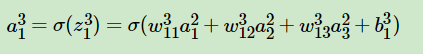
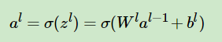

# `BP算法`

前向传播用于构建模型，计算从输入值到输出值这个过程，而反向传播是求解模型参数的，从后往前推导，通过链式法则，一步步迭代更新模型的参数，获取最终模型。

对每个训练实例，BP 算法先做一次预测（前向传播），然后计算误差，然后反向通过每一层以测量误差贡献量（反向传播），最后调整所有连接权重以降低误差（梯度下降）。

## `前向传播`

所谓的 `DNN(深度神经网络)` 的前向传播算法也就是利用我们的若干个 `权重系数矩阵W` ,`偏倚向量b` 来和 `输入值向量x` 进行一系列 `线性运算` 和 `激活运算` ，从输入层开始，一层层的向后计算，一直到运算到输出层，得到输出结果为值。

其中 `Layer L1` 为`输入层`，`Layer L2` 为`隐藏层`，`Layer L3` 为`输出层`：

假设现在激活函数为 `sigmoid` 函数：

* 输入层输入 x 后, `Layer L1 --> Layer L2` :

    

* 以 `w^2_11` 为例: `上标 2` 表示线性系数 `w` 所在的层数，而下标对应的是 `输出的第一层索引1` 和 `输入的第二层索引1 `。

* 隐藏层到输出层 , `Layer L2 --> Layer L3` :

    

* 则有：

    

* 通过向量表示：

    

## `反向传播`

反向传播算法为了减小误差，可以算出每个连接权重和每个偏置项的调整量。当得到梯度之后，就做一次常规的梯度下降，不断重复这个过程，直到网络得到收敛解。

反向传播使用的是反向模式自微分。这种方法快而准，当函数有多个变量（连接权重）和多个输出（损失函数）要微分时也能应对。

    

`刘老师文章笔记(关于矩阵求导部分)：`[深度神经网络（DNN）反向传播算法(BP)](https://www.cnblogs.com/pinard/p/6422831.html) 

* `第一部分：`

    

    可以根据线性关系的链式求导结论：

    

    得到：

    * `da/dz * aT` 其中的 `da/dz` 就是哈达玛乘积中的两项

    根据 chain rule ,C 为损失函数：

    

* `第二部分：`

    

    

    可以根据线性关系的链式求导结论直接得到：

    

    `公式：`

    

    `根据公式可以表示成：`

    *    `da/dz * aT`  , 其中：`da/dz = δl `

    
    `则有：`

    

* `第三部分：`

    

    假设 `zl` 是 n 维向量，那么是一个 n 维向量对 n 维向量的求导。根据求导定义，`σ(zl)` 向量的每个维度都要对 `zl` 的每个维度分别求导，最后按分子布局排列成一个矩阵, 详细解释如下：

    比如 `m` 维列向量 `y` 对 `n` 维列向量 `x` 求导，`向量` 对 `向量` 求导，最终的结果 `通常` 是一个符合 `分子分布` 的 `雅克比矩阵`:

    

    如果符合 `分子分布`，那么最终得到的矩阵大小为 `m * n` 。

    可以看到对每个分量求导，除了对角线以外的其他分量导数为0 ，仅仅只有 yj = xi 的时候，导数有值。

## `注意事项：`

随机初始化隐藏层的连接权重是很重要的。假如所有的权重和偏置都初始化为 0，则在给定一层的所有神经元都是一样的，BP 算法对这些神经元的调整也会是一样的。换句话，就算每层有几百个神经元，模型的整体表现就像每层只有一个神经元一样，模型会显得笨笨的。如果权重是随机初始化的，就可以打破对称性，训练出不同的神经元。

## `参考`

`深度神经网络（DNN）模型与前向传播算法:` https://www.cnblogs.com/pinard/p/6418668.html

`深度神经网络（DNN）反向传播算法(BP):` https://www.cnblogs.com/pinard/p/6422831.html#!comments

`Back Propagation（梯度反向传播）实例讲解：`https://zhuanlan.zhihu.com/p/40378224

`详解反向传播算法(下):` https://zhuanlan.zhihu.com/p/25416673
