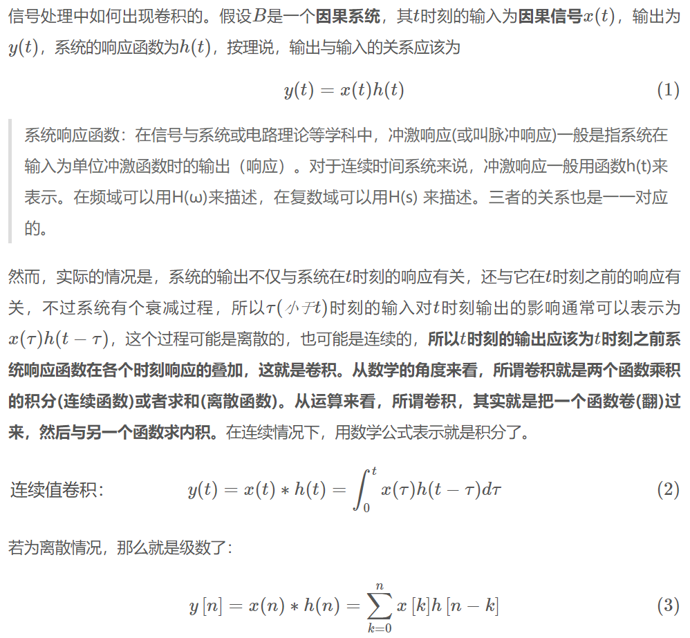
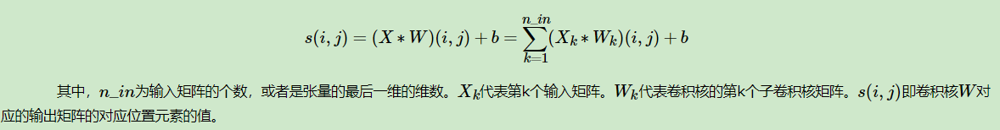
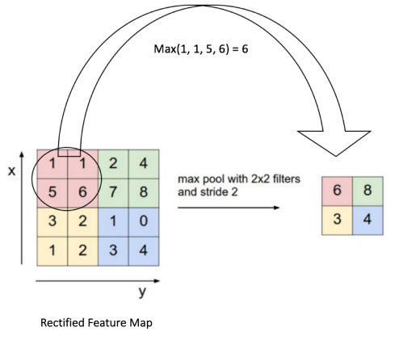

# `CNN 卷积神经网络`

## `一、什么是卷积：`

* `卷积的重要的物理意义是：`一个函数（如：单位响应）在另一个函数（如：输入信号）上的加权叠加。

    

    `注意`：这里的 `*` 表示`卷积`。

    

## `二、卷积层：`

* 首先 `卷积层` 是使用一系列 `卷积核` 与 `多通道输入数据做卷积的线性计算层`，`卷积层` 的提出是 `为了利用输入数据（如图像）中特征的局域性和位置无关性来降低整个模型的参数量。`

    卷积运算过程与 图像处理算法中常用的空间滤波是类似的。比如求图像边缘的滤波器，求各个角度的滤波器，比如求90度180度这些角度的滤波器，其实和我们的卷积核有异曲同工之妙的，区别就是传统的图像中的一些经典的滤波器我们已经知道如何去设置我们的滤波器，但是在卷积神经网络里面，它得滤波器的参数可能是不确定的，需要我们不断的去训练，才能得到一个准确的卷积核，因此，卷积常常被通俗地理解为一种“滤波”过程， 卷积核与输入数据作用之后得到了“滤波”后的图像(滤波后的图像通常称之为`feature`)，从而提取出了图像的特征(`feature`)。

    

    通过我们左角的图，我们可以看到我们每一次取都会取出一个 `feature` ，做后这些图像组合后的图像我们称为 `feature map` ，`feature map` 也就是我们下一个网络层的输入，我们可以看到的是在我们图像的左角最左边的图是我们的原图，原图通过我们中间的卷积核运算之后，我们就得到了这个图像的 `feature`，这些 `feature` 共同组成了右边这张图片(也就是 `feature map`)

    
    如果有 `偏置项 (b)` 还需要加 `上偏置项 (b)`：

    

    上图是斯坦福大学的cs231n的课程上，的一个动态的例子，[链接在这](https://cs231n.github.io/assets/conv-demo/index.html)。

    输入是 `7x7x3` 的张量，卷积核是两个 `3x3x3` 的张量。卷积步幅为 `2`，最后得到了输出是 `3x3x2` 的张量。如果把上面的卷积过程用数学公式表达出来就是：

    

    `对于卷积后的输出，一般会通过ReLU激活函数，将输出的张量中的小于0的位置对应的元素值都变为0。`

## `三、池化层：`

* `池化层是用于缩小数据规模的一种非线性计算层。`为了降低特征维度，我们需要对输入数据进行采样，具体做法是在一个或者多个卷积层后增加一个池化层。`池化层由三个参数决定：`

    * `（1）` `池化类型`，一般有 `最大池化MAX` 和 `平均池化Average` 两种；

    * `（2）池化核的大小k​`；

    * `（3）池化核的滑动间隔​s`。

    下面这个例子采用取 `最大值的池化方法`。同时采用的是 `2x2` 的池化。步幅为 `2`：

    

    最终，我们的输入 `4x4` 的矩阵在`池化后`变成了 `2x2` 的矩阵。进行了`压缩`。

## `参考：`

`卷积的本质及物理意义（全面理解卷积）：`https://www.zdaiot.com/MachineLearning/%E5%8D%B7%E7%A7%AF%E7%A5%9E%E7%BB%8F%E7%BD%91%E7%BB%9C/%E5%8D%B7%E7%A7%AF%E7%9A%84%E6%9C%AC%E8%B4%A8%E5%8F%8A%E7%89%A9%E7%90%86%E6%84%8F%E4%B9%89%EF%BC%88%E5%85%A8%E9%9D%A2%E7%90%86%E8%A7%A3%E5%8D%B7%E7%A7%AF%EF%BC%89/

`卷积神经网络(CNN)模型结构：`https://www.cnblogs.com/pinard/p/6483207.html