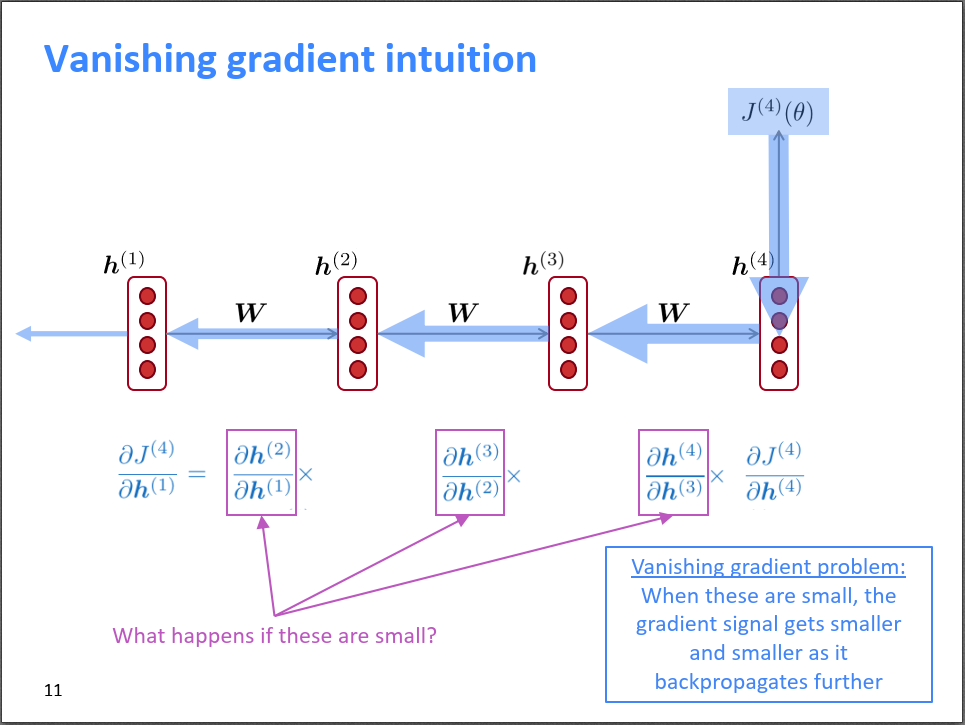

# `LSTM 长短期记忆`

## `RNN -> LSTM：` 

* `RNN` 容易产生梯度消失或梯度爆炸，核心问题就是 `RNN` 在不同时间步使用共享参数 $W$，导致 $t+n$ 时刻的损失对时刻的参数的偏导数存在$W$的指数形式，一旦$W$很小或很大就会导致梯度消失或梯度爆炸的问题。下图形象的显示了梯度消失的问题，即梯度不断反传，梯度不断变小（箭头不断变小）。

    

    在 `RNN` 中，由于梯度消失问题，长距离以前的状态对当前时刻的影响很小，所以导致无法建模长距离依赖关系，所以出现了 `LSTM` 。

## `LSTM：`

## `参考：`

`RNN vs LSTM vs GRU -- 该选哪个？：`https://www.zhihu.com/search?q=gru%20lstm&utm_content=search_suggestion&type=content

`LSTM模型与前向反向传播算法：`https://www.cnblogs.com/pinard/p/6519110.html

`CS224N（1.29）Vanishing Gradients, Fancy RNNs：`http://bitjoy.net/2019/08/01/cs224n%ef%bc%881-29%ef%bc%89vanishing-gradients-fancy-rnns/

